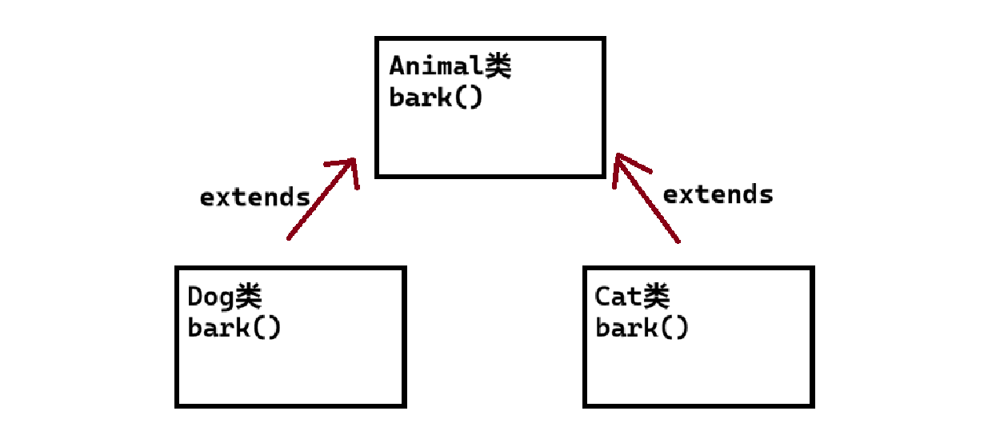
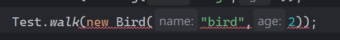
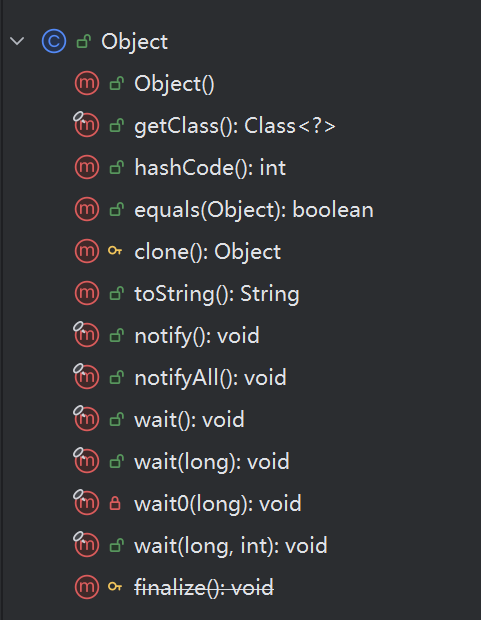

## 1.抽象类

### 1.1啥是抽象类？
在面向对象的概念中，所有的对象都是通过类来描绘的，但是反过来，并不是所有的类都是用来描绘对象的，如果一个类中没有足够的信息来描绘一个具体的对象，这样的类就是抽象类。



像这样的Animal类一般只为服务创建Dog类和Cat类的，我们就可以直接定义为抽象类`（abstract class）`，以及animal类的`bark()`方法我们通常不调用，所以我们同样可以写为抽象方法`（abstract function）`。

像这样子的抽象类和抽象方法就是为了让子类去重写再描述具体对象而产生的。

并且我们同样合理的利用编译器的语法规则去校验我们的代码，以防错误的创建和访问。

### 1.2抽象类的特性
> 注意：
>
> 1.抽象类不能直接实例化对象，但其他功能和普通类仍然一样
>
> 2.抽象类必须被继承
>
> 3.抽象方法不能是private的
>
> 4.抽象方法不能被final和static修饰，因为抽象方法要被子类重写
>
> 5.抽象类必须被继承，并且继承后子类要**重写父类中的抽象方法**，否则子类也是抽象类，必须使用`abstract`修饰
>
> 6.抽象类中不一定包含抽象方法，但是有抽象方法的类一定是抽象类
>
> 7.抽象类中可以有构造方法，供子类创建对象时，初始化父类的成员变量
>

### 1.3如何使用抽象类呢？
我们依旧拿Animal举例哈（问就是想象力匮乏...

```java
public abstract class Animal {
    public abstract void bark();
}

//是在不同文件哈
public class Dog extends Animal
    //记得要重写抽象方法哈
    public void bark(){
        System.out.println("在汪汪汪");
    }
}
```

### 1.4抽象类的作用
> 经过上面的学习，我们可以知道抽象类就是为了给定子类一个大的框架，保证后面的子类根据抽象类做更多定义。
>
> 记住哈，抽象类本身不能被实例化，要想使用，只能创建该抽象类的子类，然后让子类重写抽象类中的抽象方法。
>
> 另外呢，我想说，我们使用抽象类的意义就是为了多一重编译器的校验，尽管普通类就足够，但既然有这样的语法，我们就应该按照规范去完成啦😊
>

## 2.接口
### 2.1接口的声明
```java
public interface [接口名称]{
    public void method();
}
```

注意:

> 1.创建接口时，接口的命名一般以大写字母`I`开头
>
> 2.接口的命名一般使用“形容词”词性的单词
>
> 3.接口是隐式抽象的，当声明一个接口的时候，不必使用**abstract**关键字
>
> 4.接口中的方法都是共有的
>

### 2.2接口的使用
接口必须要通过一个“实现类”来实现该接口，并且要实现接口中的**所有方法**；否则，类必须声明为抽象的类。

eg:(这是两个文件

```java
public interface Iaction{
    void eat();
    void walk();
    void sleep();
    ...
}

public class Dog implements Iaction{
    @Override
    public void eat() {}
    @Override
    public void walk() {}
    @Override
    public void sleep() {}
}
```

> 1.子类与父类之间是extends继承关系，类与接口之间是implements实现关系
>
> 2.这两种关系可以同时作用
>
> 3.继承不能多继承，但一个类可以同时实现多个接口
>

### 2.3接口的特性
1.接口当中的成员变量，默认是`public static final`修饰的（只能是public，用private会编译报错）

2.接口当中的抽象方法，默认都是`public abstract`修饰的（只能是噢、public abstract，其他修饰符都会报错）

3.如果接口当中的方法被`default`修饰，那么可以有具体的实现

```java
default void test(){
System.out.println("default method");
```

4.如果接口当中的方法被`static`修饰，那么可以有具体的实现

```java
static void test(){
System.out.println("static method");
```

5.接口是不可以进行实例化的

6.类和接口之间可以使用关键字`implements`来实现接口

7.一个接口对应一个字节码文件

8.接口中不能有静态代码块和构造方法

9.如果类中没有实现接口中的所有方法，则类必须设置为抽象类

### 2.4实现多个接口
实现接口不像继承类一样，它可以多个实现，比如下面

```java
public class Animal implements Iwalk,Iswim,Ieat{}
```

注意：

通常我们用抽象类或父类实现接口的时候，所实现的接口一定要有共性，如walk，eat一些动物都会的...

另外，一个类实现多个接口时，每个接口中的抽象方法都要实现，否则类必须设置为抽象类。

> 提示，IDEA中使用 ctrl + i 可以快速实现接口
>

因此我们可以这样去理解，继承表达的含义是`is-a`语义，而接口表达的含义是`具有xxx`特性

> 猫是一种动物，具有会跑的特性
>
> 青蛙也是一种动物，既能跑，也能游泳
>

这样的话，我们可以不用父类实现所有接口，只需要每一个动物类去单独实现该有的特性，然后在运行类这样写，再在main方法中像这样去调用即可

```java
public class Test {
    public static void walk(IWalk iwalk){
        iwalk.walk();
    }
    public static void main(String[] args) {
        Dog dog = new Dog("PaPy Dog",3);
        Test.walk(dog);
        Test.walk(new Dog("dog",2));	//匿名对象同样也行
    }
}
```

但是如果该具体动物类没有实现对应接口，那么就会报错



### 2.5接口间的继承
```java
interface IA{
    public void ia();
}
interface IB{
    public void ib();
}
interface IC extends IA,IB{
    public void ic();
}
```

但我们去实现接口IC的时候，要重写IC所继承的所有方法，以及它本身的方法。

即 要重写ia，ib，ic三个方法

> 接口间的继承相当于把多个接口合并在一起
>

## 3.Object类
### 3.1初步了解Object类


首先，我们要知道Object类是Java默认提供的一个类，Java里除了Object类，所有的类都是存在继承关系的。默认继承Object父类。即所有类的对象都可以使用Object的引用进攻接收。

eg:我们用Object接受所有类的对象

```java
class Dog{}
class Cat{}

public class Test {
    public static void main(String[] args) {
        Object obj1 = new Dog("dog",2);
        Object obj2 = new Cat("cat",2);
    }
}
```

也就是说都可以向上转型

所以在开发中，Object类是参数的最高统一类型。但Object类也有定义好的一些方法。我们主要关注hashCode(),equal(),toString()这几个方法即可

### 3.2获取对象信息
打印对象信息，我们可以直接重写或直接调用Object类的`toString方法`

```java
// Object类中的toString()方法实现：
public String toString() {
    return getClass().getName() + "@" + Integer.toHexString(hashCode());
}

//重写的toString
@Override
    public String toString() {
        return "Dog{" +
                "name='" + name + '\'' +
                ", age=" + age +
                '}';
    }
    Object obj = new Dog("dog",2);
    System.out.println(obj.toString());  //这样调用即可
```
