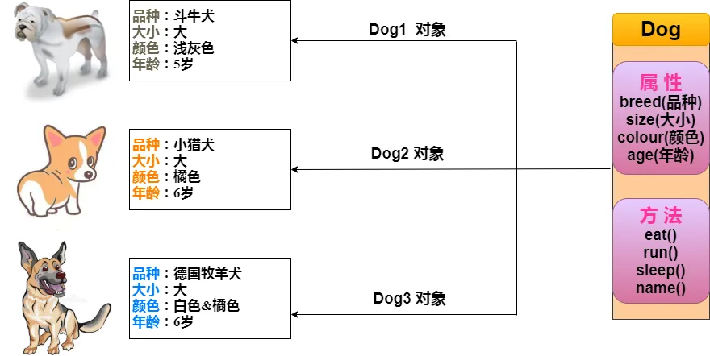
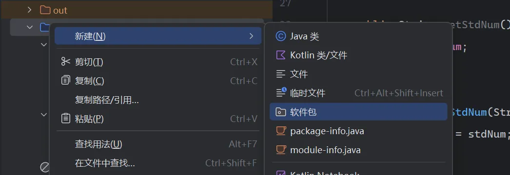
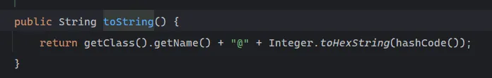

## 1.定义类



```java
public class Dog {
    String breed;
    int size;
    String colour;
    int age;
 
    void eat() {
    }
 
    void run() {
    }
 
    void sleep(){
    }
 
    void name(){
    }
}
```

+ **局部变量**：在方法、构造方法或者语句块中定义的变量被称为局部变量。变量声明和初始化都是在方法中，方法结束后，变量就会自动销毁。
+ **成员变量**：成员变量是定义在类中，方法体之外的变量。这种变量在创建对象的时候实例化。成员变量可以被类中方法、构造方法和特定类的语句块访问。
+ **类变量**：类变量也声明在类中，方法体之外，但必须声明为 static 类型。

注意：

1.一般一个文件当中只定义一个类

2.main方法所在的类一般要使用public修饰

3.public修饰的类必须要与文件名相同

4.不要随意修改public修饰的类的名字

## 2.创建对象（类的实例化）
对象是根据类创建的。在Java中，使用关键字 new 来创建一个新的对象。创建对象需要以下三步：

+ **声明**：声明一个对象，包括对象名称和对象类型。
+ **实例化**：使用关键字 new 来创建一个对象。
+ **初始化**：使用 new 创建对象时，会调用构造方法初始化对象。

下面是一个创建对象的例子：

```java
public class Puppy{
   public Puppy(String name){
      //这个构造器仅有一个参数：name
      System.out.println("小狗的名字是 : " + name ); 
   }
   public static void main(String[] args){
      // 下面的语句将创建一个Puppy对象
      Puppy myPuppy = new Puppy( "Sirens" );
   }
}
```

输出内容为以下：

`小狗的名字是：Sirens`

## 3.访问实例（成员）变量与方法
通过已创建的对象来访问成员方法：

```java
/* 实例化对象 */
Object referenceVariable = new Constructor();
/* 访问类中的变量 */
referenceVariable.variableName;
/* 访问类中的方法 */
referenceVariable.methodName();
```

实质上在main方法中通过`.`来访问对象中的变量以及方法


## 4.构造方法
每个类都有构造方法。如果没有显式地为类定义构造方法，Java 编译器将会为该类提供一个默认构造方法。

在创建一个对象的时候，至少要调用一个构造方法。**构造方法的名称必须与类同名**，一个类可以有多个构造方法。

下面是一个构造方法示例：

```java
public class Puppy{
    public Puppy(){
    }
 
    public Puppy(String name){
        // 这个构造器仅有一个参数：name
    }
}
```

<font style="color:rgb(51,51,51);">注意： </font>

**<font style="color:rgb(51,51,51);">this(...)必须是构造方法中第一条语句</font>**

## 5.综上范例
```java
public class Employee{
	private String name;
	private int age;
	private String designation;//称号
	private double salary;
	
	public Employee(String name,int age){
		this.name = name;
		this.age = age;
	}
	
	public void setAge(int age){
		this.age = age;
	}
	
	public int getAge(){
		return age;
	}
	
	public void setDesignation(String designation){
		this.designation = designation;
	}

	public String getDesignation(){
		return designation;
	}
	
	public void setSalary(double salary){
		this.salary = salary;
	}
		
	public double getSalary(){
			return salary;
		}

	// 打印信息
	public void printEmployee() {
		System.out.println(this);
	}

	// 重写 toString 方法
	@Override
	public String toString() {
		return "名字: " + name + "\n" +
				"年龄: " + age + "\n" +
				"职位: " + designation + "\n" +
				"薪水: " + salary;
	}
}
```

**<font style="color:rgb(51,51,51);">this引用指向当前对象(成员方法运行时调用该成员方法的对象)，在成员方法中所有成员变量的操作，都是通过该 </font>**

**<font style="color:rgb(51,51,51);">引用去访问</font>**<font style="color:rgb(51,51,51);">。只不过所有的操作对用户是透明的，即用户不需要来传递，编译器自动完成。</font>

+ 在类中访问类的变量时，尽量<font style="color:#DF2A3F;">养成使用</font>`this`<font style="color:#DF2A3F;">的习惯</font>，防止出现形参赋值给形参的情况

### 默认初始化
对象空间被申请好之后，对象中包含的成员已经设置好了初始值，比如

| 数据类型 | 默认值 |
| --- | --- |
| byte | 0 |
| char | '\u0000' |
| short | 0 |
| int | 0 |
| long | 0L |
| boolean | false |
| float | 0.0f |
| double | 0.0 |
| reference | null |


## 6.源文件声明规则
<font style="color:#262626;">当在一个源文件中定义多个类，并且还有 import 语句和 package 语句时，要特别注意这些规则。</font>

+ <font style="color:#262626;">一个源文件中只能有一个 public 类</font>
+ <font style="color:#262626;">一个源文件可以有多个非 public 类</font>
+ <font style="color:#262626;">源文件的名称应该和 public 类的类名保持一致。例如：源文件中 public 类的类名是 Employee，那么源文件应该命名为Employee.java。</font>
+ <font style="color:#262626;">如果一个类定义在某个包中，那么 package 语句应该在源文件的首行。</font>
+ <font style="color:#262626;">如果源文件包含 import 语句，那么应该放在 package 语句和类定义之间。如果没有 package 语句，那么 import 语句应该在源文件中最前面。</font>
+ <font style="color:#262626;">import 语句和 package 语句对源文件中定义的所有类都有效。在同一源文件中，不能给不同的类不同的包声明。</font>

## 7.封装
封装可以被认为是一个保护屏障，防止该类的代码和数据被外部类定义的代码随机访问。

要访问该类的代码和数据，必须通过严格的接口控制。

封装最主要的功能在于我们能修改自己的实现代码，而不用修改那些调用我们代码的程序片段。

适当的封装可以让程式码更容易理解与维护，也加强了程式码的安全性。

### 7.1访问限定符
| 范围 | private | default | protected | public |
| --- | --- | --- | --- | --- |
| 同一包中的同一类 | ✔ | ✔ | ✔ | ✔ |
| 同一包中的不同类 | | ✔ | ✔ | ✔ |
| 不同包中的子类 | | | ✔ | ✔ |
| 不同包中的非子类 | | | | ✔ |


<font style="color:rgb(51,51,51);">public：可以理解为一个人的外貌特征，谁都可以看得到 </font>

<font style="color:rgb(51,51,51);">default: </font><font style="color:rgb(51,51,51);">对于自己家族中</font><font style="color:rgb(51,51,51);">(</font><font style="color:rgb(51,51,51);">同一个包中</font><font style="color:rgb(51,51,51);">)</font><font style="color:rgb(51,51,51);">不是什么秘密，对于其他人来说就是隐私了 </font>

<font style="color:rgb(51,51,51);">private：只有自己知道，其他人都不知道</font>

<font style="color:rgb(51,51,51);">【</font>**<font style="color:rgb(51,51,51);">说明</font>**<font style="color:rgb(51,51,51);">】 </font>

<font style="color:rgb(51,51,51);">protected</font><font style="color:rgb(51,51,51);">主要是用在继承中，继承部分详细介绍 </font>

<font style="color:rgb(51,51,51);">default</font><font style="color:rgb(51,51,51);">权限指：什么都不写时的默认权限 </font>

<font style="color:rgb(51,51,51);">访问权限除了可以限定类中成员的可见性，也可以控制类的可见性</font>

### <font style="color:rgb(51,51,51);">7.2实现Java封装的步骤</font>
1.修改属性的可见性来限制对属性的访问（一般限制为private），例如：

```java
public class Person {
    private String name;
    private int age;
}
```

<font style="color:#262626;">这段代码中，将 </font>**<font style="color:#262626;">name</font>**<font style="color:#262626;"> 和 </font>**<font style="color:#262626;">age</font>**<font style="color:#262626;"> 属性设置为私有的，只能本类才能访问，其他类都访问不了，如此就对信息进行了隐藏。</font>

<font style="color:#262626;">2.对每个值属性提供对外的公共方法访问，也就是创建一对赋取值的方法，用于对私有属性的访问，例如：</font>

```java
public class Person{
    private String name;
    private int age;
​
    public int getAge(){
      return age;
    }
​
    public String getName(){
      return name;
    }
​
    public void setAge(int age){
      this.age = age;
    }
​
    public void setName(String name){
      this.name = name;
    }
}
```

<font style="color:#262626;">采用 </font>**<font style="color:#262626;">this</font>**<font style="color:#262626;"> 关键字是为了解决实例变量（private String name）和局部变量（setName(String name)中的name变量）之间发生的同名的冲突。</font>

<font style="color:#262626;">以上实例中public方法是外部类访问该类成员变量的入口。</font>

<font style="color:#262626;">通常情况下，这些方法被称为getter和setter方法。</font>

<font style="color:#262626;">因此，任何要访问类中私有成员变量的类都要通过这些**getter**和**setter**方法。</font>

## <font style="color:#262626;">8.Java包（Package）</font>
<font style="color:#262626;">为了更好地组织类，Java 提供了包机制，用于区别类名的命名空间</font>

**<font style="color:#262626;">包的作用</font>**

+ <font style="color:#262626;">1、把功能相似或相关的类或接口组织在同一个包中，方便类的查找和使用。</font>
+ <font style="color:#262626;">2、如同文件夹一样，包也采用了树形目录的存储方式。同一个包中的类名字是不同的，不同的包中的类的名字是可以相同的，当同时调用两个不同包中相同类名的类时，应该加上包名加以区别。因此，包可以避免名字冲突。</font>
+ <font style="color:#262626;">3、包也限定了访问权限，拥有包访问权限的类才能访问某个包中的类。</font>

<font style="color:#262626;">Java 使用包（package）这种机制是为了防止命名冲突，访问控制，提供搜索和定位类（class）、接口、枚举（enumerations）和注释（annotation）等。</font>

<font style="color:#262626;">包语句的语法格式为：</font>

```java
package pkg1[．pkg2[．pkg3…]];
```

### 8.1 创建包
**<font style="color:rgb(51,51,51);">基本规则 </font>**

<font style="color:rgb(51,51,51);">在文件的最上方加上一个</font><font style="color:rgb(51,51,51);"> package </font><font style="color:rgb(51,51,51);">语句指定该代码在哪个包中</font><font style="color:rgb(51,51,51);">. </font>

<font style="color:rgb(51,51,51);">包名需要尽量指定成唯一的名字, 通常会用公司的域名的颠倒形式(例如 io.github.sirens007 )</font>

<font style="color:rgb(51,51,51);">包名要和代码路径相匹配. 例如创建</font>`io.github.sirens007`<font style="color:rgb(51,51,51);">的包, 那么会存在一个对应的路径 </font>`io.github.sirens007`<font style="color:rgb(51,51,51);">来存储代码.</font>

<font style="color:rgb(51,51,51);">如果一个类没有 package 语句, 则该类被放到一个默认包中.</font>



即图中`软件包`，点击后输入` io.github.sirens007`<font style="color:rgb(51,51,51);">则会创建一个三级目录</font>

### 8.2 import 关键字
<font style="color:#262626;">为了能够使用某一个包的成员，我们需要在 Java 程序中明确导入该包。</font>

<font style="color:#262626;">在 Java 中，</font>**<font style="color:#262626;">import</font>**<font style="color:#262626;"> </font><font style="color:#262626;">关键字用于导入其他类或包中定义的类型，以便在当前源文件中使用这些类型。</font>

**<font style="color:#262626;">import</font>**<font style="color:#262626;"> </font><font style="color:#262626;">关键字用于引入其他包中的类、接口或静态成员，它允许你在代码中直接使用其他包中的类，而不需要完整地指定类的包名。</font>

<font style="color:#262626;">在 java 源文件中 import 语句必须位于 Java 源文件的头部，其语法格式为：</font>

```java
import package1[.package2…].(classname|*);
```

`import` 语句位于 `package` 语句之后：

```java
// 第一行非注释行是 package 语句
package com.example;
 
// import 语句引入其他包中的类
import java.util.ArrayList;
import java.util.List;
 
// 类的定义
public class MyClass {
    // 类的成员和方法
}
```

<font style="color:rgb(51, 51, 51);background-color:rgb(250, 252, 253);">如果在一个包中，一个类想要使用本包中的另一个类，那么该包名可以省略。</font>

<font style="color:rgb(51, 51, 51);background-color:rgb(250, 252, 253);">可以使用 import语句来引入一个特定的类：</font>

```java
import  io.github.sirens007;
```

<font style="color:#262626;">这样，你就可以在当前源文件中直接使用 sirens007 类的方法、变量或常量。</font>

<font style="color:#262626;">也可以使用通配符 </font>`*`<font style="color:#262626;"> 来引入整个包或包的子包：</font>

`import io.sirens007.mypackage.*;`

<font style="color:#262626;">这样，你可以导入 </font>**<font style="color:#262626;">io.sirens007.mypackage</font>**<font style="color:#262626;"> 包中的所有类，从而在当前源文件中使用该包中的任何类的方法、变量或常量。注意，使用通配符 </font>`*`<font style="color:#262626;"> 导入整个包时，只会导入包中的类，而</font><font style="color:#DF2A3F;">不会导入包中的</font>**<font style="color:#DF2A3F;">子包</font>**<font style="color:#262626;">。</font>

<font style="color:#262626;">在导入类或包时，你需要提供</font>**<font style="color:#DF2A3F;">类的完全限定名或包的完全限定名</font>**<font style="color:#262626;">。完全限定名包括包名和类名的组合，以点号 </font>**<font style="color:#262626;">.</font>** 分隔

```java
import java.util.ArrayList; // 引入 java.util 包中的 ArrayList 类
import java.util.*; // 引入 java.util 包中的所有类

import com.example.MyClass; // 引入 com.example 包中的 MyClass 类
import com.example.*; // 引入 com.example 包中的所有类
```

#### 8.2.1 常见的包
<font style="color:rgb(51,51,51);">1. java.lang:系统常用基础类(String、Object),此包从JDK1.1后自动导入。 </font>

<font style="color:rgb(51,51,51);">2. java.lang.reflect:java </font><font style="color:rgb(51,51,51);">反射编程包</font><font style="color:rgb(51,51,51);">; </font>

<font style="color:rgb(51,51,51);">3. java.net:</font><font style="color:rgb(51,51,51);">进行网络编程开发包。 </font>

<font style="color:rgb(51,51,51);">4. java.sql:</font><font style="color:rgb(51,51,51);">进行数据库开发的支持包。 </font>

<font style="color:rgb(51,51,51);">5. java.util:</font><font style="color:rgb(51,51,51);">是</font><font style="color:rgb(51,51,51);">java</font><font style="color:rgb(51,51,51);">提供的工具程序包。</font><font style="color:rgb(51,51,51);">(</font><font style="color:rgb(51,51,51);">集合类等</font><font style="color:rgb(51,51,51);">) </font>**<font style="color:rgb(51,51,51);">非常重要 </font>**

<font style="color:rgb(51,51,51);">6. java.io:I/O编程开发包。</font>

### <font style="color:rgb(51,51,51);">8.3 Package 的目录结构</font>
类放在包中会有两种主要的结果：

- 包名成为类名的一部分，正如我们前面讨论的一样。
- 包名必须与相应的字节码所在的目录结构相吻合。

下面是管理你自己 java 中文件的一种简单方式：

将类、接口等类型的源码放在一个文本中，这个文件的名字就是这个类型的名字，并以.java作为扩展名。例如：

```java
// 文件名 :  Car.java
package vehicle;
 
public class Car {
   // 类实现  
}
```

<font style="color:rgb(51, 51, 51);background-color:rgb(250, 252, 253);">接下来，把源文件放在一个目录中，这个目录要对应类所在包的名字。</font>

```java
....\vehicle\Car.java
```

现在，正确的类名和路径将会是如下样子：

+ 类名 -> vehicle.Car
+ 路径名 -> vehicle\Car.java (在 windows 系统中)


<font style="color:#262626;">通常，一个公司使用它互联网域名的颠倒形式来作为它的包名.例如：互联网域名是 runoob.com，所有的包名都以 com.runoob 开头。包名中的每一个部分对应一个子目录。</font>

<font style="color:#262626;">例如：有一个 </font>**<font style="color:#262626;">io.github.test</font>**<font style="color:#262626;"> 的包，这个包包含一个叫做 Hello.java 的源文件，那么相应的，应该有如下面的一连串子目录：</font>

```bash
....\io\github\test\Hello.java
```

<font style="color:#262626;">编译的时候，编译器为包中定义的每个类、接口等类型各创建一个不同的输出文件，输出文件的名字就是这个类型的名字，并加上 .class 作为扩展后缀。 例如：</font>

```java
// 文件名: Hello.java
 
package io.github.test;
public class Hello {
      
}
class Google {
      
}
```

<font style="color:#262626;">现在，我们用-d选项来编译这个文件，如下：</font>

<font style="color:#262626;">$javac -d . Hello.java</font>

<font style="color:#262626;">这样会像下面这样放置编译了的文件：</font>

```bash
.\io\github\test\Hello.class
.\io\github\test\Google.class
```

<font style="color:#262626;">你可以像下面这样来导入所有</font>**<font style="color:#262626;"> \io\github\test\ </font>**<font style="color:#262626;">中定义的类、接口等：</font>

<font style="color:#262626;">import io.github.test.*;</font>

<font style="color:#262626;">编译之后的 .class 文件应该和 .java 源文件一样，它们放置的目录应该跟包的名字对应起来。但是，并不要求 .class 文件的路径跟相应的 .java 的路径一样。你可以分开来安排源码和类的目录。</font>

```bash
<path-one>\sources\io\github\test\Hello.java
<path-two>\classes\io\github\test\Google.class
```

<font style="color:#262626;">这样，你可以将你的类目录分享给其他的编程人员，而不用透露自己的源码。用这种方法管理源码和类文件可以让编译器和java 虚拟机（JVM）可以找到你程序中使用的所有类型。</font>

## 9.static 成员
### 9.1static 修饰成员变量
**<font style="color:rgb(51,51,51);">static修饰的成员变量，称为静态成员变量</font>**<font style="color:rgb(51,51,51);">，静态成员变量最大的特性：</font>**<font style="color:rgb(51,51,51);">不属于某个具体的对象，是所有对象所共享的</font>**<font style="color:rgb(51,51,51);">。</font>

它与类相关而不是与实例相关，即无论创建多少个类实例，静态变量在内存中只有一份拷贝，被所有实例共享。

重点：类的静态成员变量特性

> 1.不属于某个具体的对象，是类的属性，所有对象共享的，不存储在某个对象的空间中
>
> 2.既可以通过对象访问，也可以通过类名访问，但一般更推荐使用类名访问
>
> 3.静态类变量存储在方法区中
>
> 4.<font style="color:rgb(51,51,51);">生命周期伴随类的一生(即：随类的加载而创建，随类的卸载而销毁)</font>
>

**类的加载和卸载**

**加载（Load）**：当你第一次使用这个类（比如 `new`、访问静态变量/方法）时，JVM 的类加载器会把它加载到 **方法区**。

**卸载（Unload）**：当一个类不再被任何地方使用时，JVM 才有可能把它卸载。

### 9.2static 修饰成员方法
<font style="color:rgb(51,51,51);">Java中，</font>**<font style="color:rgb(51,51,51);">被static修饰的成员方法称为静态成员方法，是类的方法，不是某个对象所特有的</font>**<font style="color:rgb(51,51,51);">。静态成员一般是通过静态方法来访问的。</font>

<font style="color:rgb(51,51,51);">重点：静态方法特性</font>

<font style="color:rgb(51,51,51);">1.不属于某个具体的对象，是类方法</font>

<font style="color:rgb(51,51,51);">2.可以通过对象调用，也可以通过 </font>`类名.静态方法名(...)`<font style="color:rgb(51,51,51);">方式调用，更推荐类名调用</font>

<font style="color:rgb(51,51,51);">3.不能在静态方法中访问任何非静态成员变量</font>

<font style="color:rgb(51,51,51);">4. 静态方法中不能调用任何非静态方法，因为非静态方法有this参数，在静态方法中调用时候无法传递this引用</font>

<font style="color:rgb(51,51,51);">5. 静态方法无法重写，不能用来实现多态(此处大家暂时不用管，后序多态位置详细讲解)。</font>

**<font style="color:rgb(51,51,51);">补充第三点：</font>**

+ **静态变量/方法（static）**<font style="color:rgb(51,51,51);">  
</font><font style="color:rgb(51,51,51);">属于 </font>**类本身**<font style="color:rgb(51,51,51);">，不依赖某个对象，类一加载就存在。  
</font><font style="color:rgb(51,51,51);">调用方式：</font>`类名.方法()`<font style="color:rgb(51,51,51);"> 或者 </font>`对象.方法()`<font style="color:rgb(51,51,51);">（其实推荐用类名）。</font>
+ **非静态变量/方法（实例成员）**<font style="color:rgb(51,51,51);">  
</font><font style="color:rgb(51,51,51);">属于 </font>**对象实例**<font style="color:rgb(51,51,51);">，必须通过 </font>`new`<font style="color:rgb(51,51,51);"> 出来的对象才会存在。  
</font><font style="color:rgb(51,51,51);">调用方式：</font>`对象.方法()`<font style="color:rgb(51,51,51);">。</font>

**Q1:为什么静态方法不能访问非静态变量呢 **

<font style="color:rgb(51,51,51);">因为静态方法执行的时候，对象可能还没有创建</font>

<font style="color:rgb(51,51,51);">eg:</font>

```java
class Demo {
    int age = 10;         // 非静态变量（实例变量）
    static int count = 0; // 静态变量

    static void printInfo() {
        System.out.println(age); // ❌ 报错！
    }
}
```

运行逻辑：

1. JVM 加载 `Demo` 类时，`count` 已经存在（方法区 / 元空间里）。
2. 但是 `age` 是实例变量，只有在执行 `new Demo()` 时，才会分配内存到堆里。
3. `static void printInfo()` 可能在没有任何对象的时候被调用，这时 JVM 不知道该取哪个对象的 `age`。

所以编译器直接禁止你在静态方法里访问 `age`。


**Q2:<font style="color:rgb(51,51,51);">. 静态方法中为什么不能调用任何非静态方法？</font>**

<font style="color:rgb(51,51,51);">我们先复习一下静态和非静态方法</font>

**静态方法**<font style="color:rgb(51,51,51);">  
</font><font style="color:rgb(51,51,51);">属于类本身，类加载时就存在，不依赖对象。调用时 JVM 直接用「类信息」执行，不需要 new 对象。  </font>

**非静态方法**<font style="color:rgb(51,51,51);">  
</font><font style="color:rgb(51,51,51);">属于对象实例，必须依赖对象才能调用。JVM 在调用时，默认会传入一个隐藏的 </font>`this`<font style="color:rgb(51,51,51);"> 指针，告诉方法「我是谁」，这样方法才能访问对象里的实例变量。  </font>

**<font style="color:rgb(51,51,51);">他们的关键区别在于是否有</font>**`this`

<font style="color:rgb(51,51,51);">调用非静态方法时，编译器会在字节码层面自动加上 </font>`this`<font style="color:rgb(51,51,51);">。  
</font><font style="color:rgb(51,51,51);">比如写：</font>

```java
obj.sayHello();
```

<font style="color:rgb(51,51,51);">编译后相当于：</font>

```java
Demo.sayHello(obj);
```

<font style="color:rgb(51,51,51);">调用静态方法时，不存在 </font>`this`<font style="color:rgb(51,51,51);">，因为它不依赖对象。</font>

```java
Demo.staticHello();
```

<font style="color:rgb(51,51,51);">编译后就是单纯的 </font>`Demo.staticHello()`<font style="color:rgb(51,51,51);">，没有对象上下文</font>

<font style="color:rgb(51,51,51);">因此静态方法里没有</font>`this`<font style="color:rgb(51,51,51);">，所以编译器根本不知道你想让哪个对象去执行这个非静态方法。</font>

解决办法：

方法一：在静态方法里创建对象

```java
static void test() {
    Demo d = new Demo();
    d.sayHello(); // ✅ 通过对象调用非静态方法
}
```

方法二：把目标方法也改成静态

```java
static void sayHello() {
    System.out.println("Hello from static method");
}

static void test() {
    sayHello(); // ✅ 直接调用
}
```

总结就是： **静态方法不能调用非静态方法，是因为静态方法没有 `this`，而非静态方法必须依赖 `this` 才能运行 **

### 9.3static 成员变量初始化
初始化方法有以下：

1.就地初始化

2.通过get、set方法初始化

3.构造方法初始化（相对较少）

4.代码块初始化

## 10.代码块
### 10.1 代码块分类
使用`{}`定义的一段代码称为代码块，根据代码块定义的位置以及关键字，又可分为以下四种：

+ 静态代码块（**一般用于初始化静态成员变量）**
+ 非静态代码块/实例代码块/构造代码块
+ 同步代码块...

### 代码块执行顺序
静态代码块 -> 实例代码块 -> 构造方法

**<font style="color:#DF2A3F;">注意：</font>** **静态代码块只会执行一次（涉及知识点：双亲委派模型**

补充：如果静态/实例代码块有平级，那么就和他们各自类型的先后顺序有关系

   构造方法主要看调用了的哪个构造

**<font style="color:rgb(51,51,51);">注意事项 </font>**

+ <font style="color:rgb(51,51,51);">静态代码块不管生成多少个对象，其只会执行一次 </font>
+ <font style="color:rgb(51,51,51);">静态成员变量是类的属性，因此是在</font><font style="color:rgb(51,51,51);">JVM</font><font style="color:rgb(51,51,51);">加载类时开辟空间并初始化的 </font>
+ <font style="color:rgb(51,51,51);">如果一个类中包含多个静态代码块，在编译代码时，编译器会按照定义的先后次序依次执行</font><font style="color:rgb(51,51,51);">(</font><font style="color:rgb(51,51,51);">合并</font><font style="color:rgb(51,51,51);">) </font>
+ <font style="color:rgb(51,51,51);">实例代码块只有在创建对象时才会执行</font>

```java
public class Main{
    String number = "123";
    {
        number = "125";
        System.out.println("eg coder");
    }

    Main(String number){
        this.number = number;
        System.out.println("struction func");
    }

    static{
        String number = "124";
        System.out.println("static coder");
    }
}


//输出结果：
//static coder
//eg coder
//struction func
```

## 对象的打印
平常我们直接打印对象时，会直接输出`对象名+ @ +一串字符` 这实际上是toString默认方法

如图下



但当我们自己写上了toString方法的时候，就会输出我们自己想要的内容了

快捷键：`Alt+Insert`选中toString即可（静态方法默认不输出，需要可自己补充）


