# Note 01 绪论

## 1.1 数据库系统概述
### <font style="color:#DF2A3F;">数据库的 4 个基本概念</font>

<font style="color:#2F4BDA;">数据</font><font style="color:#F38F39;">data</font>：数据是数据库中存储的基本对象。描述事物的符号记录称为数据。需经数字化处理。

<font style="color:#2F4BDA;">数据库</font><font style="color:#F38F39;">DataBase</font><font style="color:#F38F39;">，</font><font style="color:#F38F39;">DB</font>：数据库是**长期储存在计算机内、有组织的、可共享**的大量数据的集合。

库中的数据按一定的数据模型组织、描述和储存，具有较小的**冗余度**<font style="color:#F38F39;">redundancy</font>、 高的**数据独立性**<font style="color:#F38F39;">data</font><font style="color:#F38F39;"> </font><font style="color:#F38F39;">independency</font> 和**易扩展性**<font style="color:#F38F39;">scalability</font>，并可各种用户共享。

数据库数据具有**永久存储、有组织和可共享**三个基本特点。

<font style="color:#2F4BDA;">数据库管理系统 </font><font style="color:#F38F39;">DataBase Management System, DBMS</font>：位于用户与操作系统之间的一层数据管理软件（计算机基础软件）

主要功能包括：

1. 数据定义功能

数据库管理系统提供 **数据定义语言** <font style="color:#F38F39;">Data Definition Language</font><font style="color:#F38F39;">， </font><font style="color:#F38F39;">DDL</font>用户通过它可以方便地对数据库中的数据对象进行定义。

2. 数据组织、存储和管理

数据库管理系统要分类组织、存储和管理各种数据，包括数据字典、用户数据、数据的存取路径等。

3. 数据操纵功能

数据库管理系统还提供 **数据操纵语言** <font style="color:#F38F39;">Data Manipulation Language, DML</font>，用户可以使用它操纵数据，实现对数据库的基本操作，如查询、插入、删除和修改等。

4. 数据库的事务管理和运行管理
5. 数据库的建立和维护功能
6. 其他功能

<font style="color:#2F4BDA;">数据库系统</font> <font style="color:#F38F39;">DataBase System, DBS</font>：数据库系统是由数据库、数据库管理系统（及其应用开发工具）、应用程序和数据库管理员 <font style="color:#F38F39;">DataBase Administrator, DBA</font> 组成的存储、管理、处理和维护数据的系统。

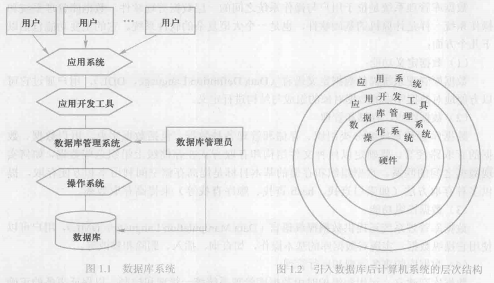
### <font style="color:#DF2A3F;">数据管理技术的产生和发展</font>
数据管理技术经历了⼈工管理、文件系统、数据库系统 3 个阶段。

#### <font style="color:#2F4BDA;">人工管理阶段</font>

<font style="color:#F1A2AB;">特点</font>：数据不保存：应用程序管理数据；数据不共享；数据不具有独立性。

<font style="color:#07787E;">缺点</font>：数据的逻辑结构或物理结构发生变化后， 必须对应用程序做相应的修改，这就加重了程序员的负担。

#### <font style="color:#2F4BDA;">文件系统阶段</font>
<font style="color:#F1A2AB;">特点</font>：数据可以长期保存；由文件系统管理数据。

<font style="color:#07787E;">缺点</font>：数据共享性差，冗余度大；数据独立性差。

#### <font style="color:#2F4BDA;">数据库系统阶段</font>
<font style="color:#F1A2AB;">特点</font>：数据结构化；数据的共享性高，冗余度低，易扩充；数据独立性高；数据由 DBMS 统一管理和控制。

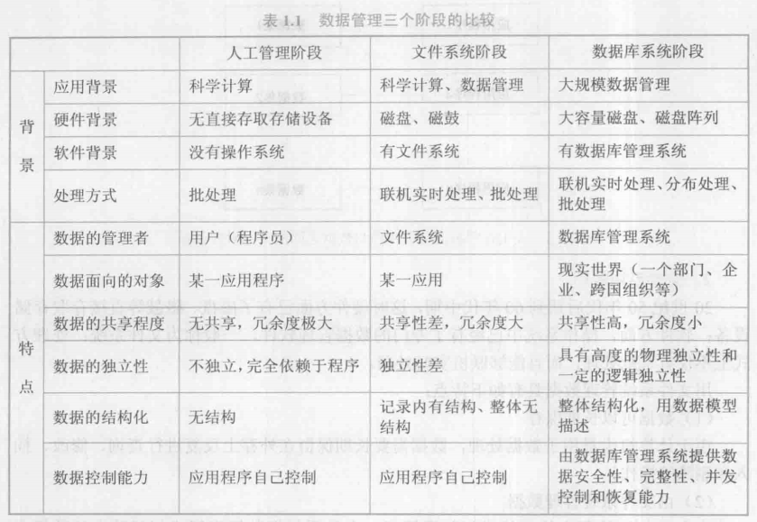

## 1.2 数据模型
**数据模型** <font style="color:#F38F39;">data model</font> 是一种模型，是对现实世界数据特征的抽象。是对现实世界的模拟。

用来描述数据、组织数据和对数据进行操作的。

### <font style="color:#DF2A3F;">两类数据模型</font>
数据模型应满足三方面要求：能比较真实地模拟现实世界；容易为人所理解；便于在计算机上实现。

根据模型应用的不同目的，可以将这些模型划分为两大类，它们分别属于两个不同的层次。

第一类是概念模型，第二类是逻辑模型和物理模型。

#### <font style="color:#2F4BDA;">概念模型 / 信息模型 </font><font style="color:#F38F39;">conceptual model</font>
按用户的观点来对数据和信息建模，主要用于数据库设计。

<font style="color:#2F4BDA;">逻辑模型 </font><font style="color:#F38F39;">logical model</font><font style="color:#2F4BDA;"> </font>

包括层次模型 <font style="color:#F38F39;">hierarchical model</font>、⽹状模型 <font style="color:#F38F39;">network model</font>、 关系模型 <font style="color:#F38F39;">relational model</font> 面向对象数据模型 <font style="color:#F38F39;">object oriented data model</font> 和对象关系数据模型 <font style="color:#F38F39;">object relational data model</font> 半结构化数据模型 <font style="color:#F38F39;">semistructured data model</font> 等。

它是按计算机系统的观点对数据建模，主要用于数据库管理系统的实现。

<font style="color:#2F4BDA;">物理模型 </font><font style="color:#F38F39;">logical model</font> 

对数据最底层的抽象，它描述数据在系统内部的表示方式和存取方法，或在磁盘或磁带上的存储方式和存取方法， 是面向计算机系统的。

### <font style="color:#DF2A3F;">概念模型</font>
**概念模型是现实世界到机器世界的一个中间层次**，表现为：

概念模型用于信息世界的建模；现实世界到信息世界的第一层抽象；

数据库设计⼈员进行数据库设计的有⼒工具；数据库设计⼈员和用户之间进行交流的语言。

**概念模型要求**：

具有较强的语义表达能⼒；能够方便、直接地表达应用中的各种语义知识；简单、清晰、易于用户理解。

#### <font style="color:#2F4BDA;">信息世界中的基本概念</font>
**实体** <font style="color:#F38F39;">entity</font>：客观存在并可相互区别的事物称为实体。

**属性** <font style="color:#F38F39;">attribute</font>：实体所具有的某一特性称为属性。一个实体可以由若干个属性来刻画。

**码** <font style="color:#F38F39;">key</font>：唯一标识实体的属性集称为码。

**域** <font style="color:#F38F39;">domain</font>：域是一组具有相同数据类型的值的集合。属性的取指范围来自某个域。

**实体型** <font style="color:#F38F39;">entity type</font>：用实体名及其属性名集合来抽象和刻画同类实体，称为实体型。

**实体集** <font style="color:#F38F39;">entity set</font>：同一类型实体的集合称为实体集。

**联系** <font style="color:#F38F39;">relationship</font>：实体之间的联系通常是指不同实体集之间的联系。

<font style="color:#2F4BDA;">实体型之间的联系：</font>实体之间的联系有一对一<font style="color:#F38F39;">1:1</font>、一对多<font style="color:#F38F39;">1:n</font> 和多对多<font style="color:#F38F39;">m:n</font> 等多种类型。

<font style="color:#2F4BDA;">概念模型的一种表示方法：实体-联系方法 / E-R 图</font> 

E-R图提供了表示实体型、属性和联系的方法。

实体型：用矩形表示，框内写明实体名。

属性：用椭圆形表示，并用无向边将其与相应的实体型连接起来。

联系：用菱形表示，框内写明联系名，并用无向边分别与有关实体型连接起来，同时在无向边旁标上联系的类型。

### <font style="color:#DF2A3F;">数据模型的组成要素</font>
**数据模型通常由数据结构、数据操作和完整性约束三部分组成。** 数据结构：描述数据库的组成对象以及对象之间的联系。

<font style="color:rgb(0,0,255);">数据结构</font>：描述数据库的组成对象以及对象之间的联系。

数据结构是所描述的对象类型的集合，是对系统静态特性的描述。

<font style="color:#2F4BDA;">数据操作：</font>数据操作是指对数据库中各种对象的实例允许执行的操作的集合，包括操作及有关的操作规则。

数据库主要有查询和更新（包括插入，删除、修改）两大类操作。是对系统动态特性的描述。

<font style="color:#2F4BDA;">数据的完整性约束条件：</font>数据的完整性约束条件是一组完整性规则。

### <font style="color:#DF2A3F;">常用的数据模型</font>
层次模型 <font style="color:#F38F39;">hierarchical model</font>、⽹状模型 <font style="color:#F38F39;">network model</font>、 关系模型 <font style="color:#F38F39;">relational model</font> 面向对象数据模型 <font style="color:#F38F39;">object oriented data model</font> 和对象关系数据模型 <font style="color:#F38F39;">object relational data model</font>

### <font style="color:#DF2A3F;">层次模型</font>
待补充

### <font style="color:#DF2A3F;">⽹状模型</font>
待补充

### <font style="color:#DF2A3F;">关系模型</font>
#### <font style="color:#2F4BDA;">关系模型的数据结构</font>
**关系** <font style="color:#F38F39;">relation</font>：一个关系对应通常说的一张表。

**元组** <font style="color:#F38F39;">tuple</font>：表中的一行即为一个元组。

**属性** <font style="color:#F38F39;">attribute</font>：表中的一列即为一个属性，给每一个属性起一个名称即属性名。

**码** <font style="color:#F38F39;">key</font>：也称为码键。表中的某个属性组，它可以唯一确定一个元组。

**域** <font style="color:#F38F39;">domain</font>：域是一组具有相同数据类型的值的集合。属性的取值范围来自某个域。

**分量**：元组中的一个属性值。

**关系模式**：对关系的描述，一般表示为 [ 关系名（属性 1，属性 2，⋯，属性）]

#### <font style="color:#2F4BDA;">关系模型的数据操纵与完整性约束</font>
关系模型的数据操纵主要包括查询、插入、删除和更新数据。这些操作必须满足关系的完整性约束条件。

关系的完整性约束条件包括三大类：**实体完整性、参照完整性和用户定义的完整性**。

#### <font style="color:#2F4BDA;">关系模型的优缺点</font>
<font style="color:#E4495B;">特点</font>：

1. 关系模型与格式化模型不同，它是建立在严格的数学概念的基础上的。
2. 关系模型的概念单一。
3. 存取路径对用户透明，具有更高数据独立性、更好安全保密性，简化程序员和数据库开发建立的工作。

<font style="color:#07787E;">缺点</font>：

1. 存取路径对用户是隐蔽的，查询效率往往不如格式化数据模型。
2. 为提高性能须对用户的查询请求进行优化，增加了开发数据库管理系统的难度。

## 1.3 数据库系统的结构
### <font style="color:#DF2A3F;">数据库系统模式的概念</font>
<font style="color:#2F4BDA;">模式 </font><font style="color:#F38F39;">schema</font>：数据库中全体数据的逻辑结构和特征的描述，它仅仅涉及型的描述， 不涉及具体的值。

模式的一个具体值称模式的一个 **实例** <font style="color:#F38F39;">instance</font>。同一个模式可以有很多实例。

模式是相对稳定的，而实例是相对变动的。

### <font style="color:#DF2A3F;">数据库系统的三级模式结构</font>
数据库系统的三级模式结构是指数据库系统是由 <font style="color:#2F4BDA;">外模式、模式和内模式</font> 三级构成。

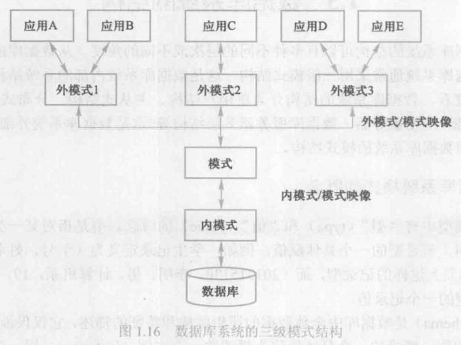

#### <font style="color:#2F4BDA;">模式 / 逻辑模式 </font><font style="color:#F38F39;">schema</font>
数据库中全体数据的逻辑结构和特征的描述，是所有用户的公共数据视图。

是数据库系统模式结构的中间层。

<font style="color:#2F4BDA;">外模式 / 子模式 / 用户模式 </font><font style="color:#F38F39;">external schema / subschema</font><font style="color:#2F4BDA;"> </font>是数据库用户（包括应用程序员和最终用户）能够看⻅和使用的局部数据的逻辑结构和特征的描述， 是数据库用户的数据视图， 是与某一应用有关的数据的逻辑表示。

<font style="color:#2F4BDA;">内模式 / 存储模式 / 物理模式 </font><font style="color:#F38F39;">internal schema / storage schema</font> 一个数据库只有一个内模式。它是数据物理结构和存储方式的描述，是数据在数据库内部的组织方式。

### <font style="color:#DF2A3F;">数据库的二级映像功能与数据独立性</font>
#### <font style="color:#2F4BDA;">外模式 / 模式 映像</font>
定义了该外模式与模式之间的对应关系。这些映像定义通常包含在各自外模式的描述中。

当模式改变时（例如增加新的关系、新的属性、改变属性的数据类型等），由数据库管理员对各个外模式 / 模式的 映像作相应改变，可以使外模式保持不变。应用程序是依据数据的外模式编写的，从而应用程序不必修改，保证了 数据与程序的逻辑独立性，简称数据的<font style="color:#2F4BDA;"> 逻辑独立性。</font>

#### <font style="color:#2F4BDA;">模式 / 内模式 映像</font>
定义了数据全局逻辑结构与存储结构之间的对应关系。

当数据库的存储结构改变时（例如选用了另一种存储结构），由数据库管理员对模式 / 内模式映像作相应改变，可 以使模式保持不变，从而应用程序也不必改变。保证了数据与程序的物理独立性，简称数据的<font style="color:#2F4BDA;"> 物理独立性。</font>

数据与程序之间的独立性使得数据的定义和描述可以从应用程序中分离出去。

由于数据的存取由数据库管理系统管理，从而简化了应用程序的编制，大大减少了应用程序的维护和修改。

## 1.4 数据库系统的组成
### <font style="color:#DF2A3F;">硬件平台及数据库</font>
**硬件资源要求**：

1. <font style="color:#2F4BDA;">足够大的内存，</font>用于存放操作系统、数据库管理系统的核心模块、数据缓冲区和应用程序。
2. <font style="color:#2F4BDA;">足够大的磁盘或磁盘阵列等设备</font>，用于存放数据库，有足够大的磁带（或光盘）作数据备份。
3. <font style="color:#2F4BDA;">系统有较高的通道能⼒</font>，以提高数据传送率。

### <font style="color:#DF2A3F;">软件</font>
**数据库系统的软件主要包括**：

1. 数据库管理系统。数据库管理系统是为数据库的建立、使用和维护配置的系统软件。
2. 支持数据库管理系统运行的操作系统。
3. 具有与数据库接口的高级语言及其编译系统，便于开发应用程序。
4. 以数据库管理系统为核心的应用开发工具。
5. 为特定应用环境开发的数据库应用系统。

### <font style="color:#DF2A3F;">⼈员</font>
开发、管理和使用数据库系统的⼈员主要包括：

数据库管理员 <font style="color:#F38F39;">DataBase Administrator, DBA</font>、系统分析员和数据库设计⼈员、应用程序员和最终用户。

不同的⼈员涉及不同的数据抽象级别，具有不同的数据视图。

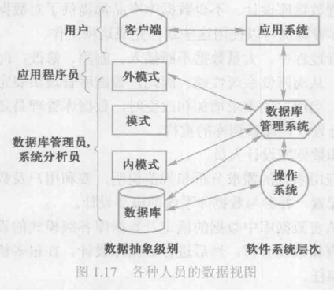

# Note 02 关系数据库
## 2.1 关系数据结构及形式化定义
### <font style="color:#DF2A3F;">关系</font>
单一的数据结构 <font style="color:#2F4BDA;">关系</font>：现实世界的实体以及实体间的各种联系均用关系来表示。

逻辑结构 <font style="color:#2F4BDA;">⼆维表</font>：从用户⻆度，关系模型中数据的逻辑结构是一张⼆维表。

关系模型是建立在集合代数的基础上。

<font style="color:#2F4BDA;">域 </font><font style="color:#F38F39;">domain</font>：域是一组具有相同数据类型的值的集合。

<font style="color:#2F4BDA;">笛卡⼉积</font> <font style="color:#F38F39;">cartesian product</font>：笛卡⼉积是域上的一种集合运算。

**给定一组域 D1, D2, ..., Dn，允许其中某些域是相同的，D1, D2, ..., Dn 的笛卡尔积为：**

**D1 × D2 × ... × Dn = {(d1, d2, ..., dn) | di ∈ Di, i = 1, 2, ..., n}**

<font style="color:#2F4BDA;">元组 / n 元组 </font><font style="color:#F38F39;">tuple / n-tuple</font>：笛卡尔积中的每一个元素**(d₁, d₂, ..., dₙ)**。

<font style="color:#2F4BDA;">分量 </font><font style="color:#F38F39;">component</font>：元素中的每一个值**dᵢ**。

<font style="color:#2F4BDA;">基数</font> <font style="color:#F38F39;">cardinal number</font>：一个域允许的不同取值个数。

<font style="color:#2F4BDA;">关系 </font><font style="color:#F38F39;">relation</font>： **D₁ × D₂ × ... × Dₙ 的子集叫做在域 D₁, D₂, ..., Dₙ 上的关系，表示为 R(D₁, D₂, ..., Dₙ)**。

R表示关系名， n表示关系的 <font style="color:#2F4BDA;">目或度</font> <font style="color:#F38F39;">Degree</font>。关系中的每个元素是关系中的元组，通常用t表示。

当n=1时，称该关系为 <font style="color:#2F4BDA;">单元关系 / 一元关系</font> <font style="color:#F38F39;">unary relation</font>， 

当n=2时，称该关系为 <font style="color:#213BC0;">⼆元关系 </font><font style="color:#F38F39;">binary relation</font>。

关系也是一个⼆维表，表的每行对应一个元组，表的每列对应一个域。

每列的名字称为<font style="color:#213BC0;"> 属性</font> <font style="color:#F38F39;">attribute</font>，n目关系必有n个属性。

<font style="color:#2F4BDA;">候选码</font> <font style="color:#F38F39;">candidate key</font>：关系中的某一属性组的值能唯一地标识一个元组，其子集不能，则该属性组为候选码。

<font style="color:#2F4BDA;">全码</font> <font style="color:#F38F39;">all key</font>：在最极端的情况下，关系模式的所有属性都是这个关系模式的候选码。

<font style="color:#2F4BDA;">主码</font> <font style="color:#F38F39;">primary key</font>：若一个关系有多个候选码，则选定其中一个为主码。

<font style="color:#2F4BDA;">主属性</font> <font style="color:#F38F39;">prime attribute</font>：候选码的诸属性称为主属性。

<font style="color:#2F4BDA;">非主属性 / 非码属性</font> <font style="color:#F38F39;">non-prime attribute / non-key attribute</font>：不包含在任何候选码中的属性。

<font style="color:#2F4BDA;">关系的三种类型</font>：

1. <font style="color:#F1A2AB;">基本关系 / 基本表 / 基表</font>：实际存在的表，是实际存储数据的逻辑表示。
2. <font style="color:#F1A2AB;">查询表</font>：查询结果对应的表。
3. <font style="color:#F1A2AB;">视图表</font>：由基本表或其他视图表导出的表，是虚表，不对应实际存储的数据。

<font style="color:#2F4BDA;">基本关系的性质：</font>

1. 列是同质的 <font style="color:rgb(233,105,0);">Homogeneous</font>：每一列中的分量是同一类型的数据，来自同一个域（如同 int）。
2. 不同的列可出自同一个域，称其中的每一列为一个属性，不同的属性要给予不同的属性名。
3. 列的顺序无所谓，即列的次序可以任意交换。
4. 任意两个元组的候选码不能取相同的值。
5. 行的顺序无所谓，即行的次序可以任意交换。
6. 分量必须取原子值，即每一个分量都必须是不可分的数据项。

### <font style="color:#DF2A3F;">关系模式</font>
<font style="color:#2F4BDA;">关系模式</font> <font style="color:rgb(233,105,0);">relation schema</font>：关系模式是对关系的描述，关系模式是型，关系是值。

1. 元组集合的结构：属性构成、属性来自的域属性与域之间的映象关系
2. 一个关系通常由赋予它的元组语义确定。
3. 现实的世界中还存在着完整性约束，

**关系模式可以形式化地表示为** _**R(U, D, DOM, F)**_**。**

**R：关系名，用于标识该关系的名称。**

**U：组成该关系的属性名集合，即关系中所有字段的名称列表。**

**D：属性组 U 中各个属性所来自的域，即每个属性取值的数据范围或类型集合。**

**DOM：属性向域的映射集合，描述每个属性具体对应哪一个域。**

**F：属性间的数据依赖关系集合，通常指函数依赖、多值依赖等约束条件，用于刻画属性之间的逻辑关联。**

#### 关系模式与关系
关系模式是静态的、稳定的。

关系是动态的、随时间不断变化的。

关系是关系模式在某一时刻的状态或内容。

### <font style="color:#DF2A3F;">关系数据库</font>
<font style="color:#2F4BDA;">关系数据库：</font>在一个给定的应用领域中，所有关系的集合构成一个关系数据库。

#### 关系数据库的型与值
1. 关系数据库的型：关系数据库模式，对关系数据库的描述。
2. 关系数据库模式：若干域的定义，在这些域上定义的若干关系模式。
3. 关系数据库的值：关系模式在某一时刻对应的关系的集合，简称为关系数据库。

### <font style="color:#DF2A3F;">关系模型的存储结构</font>
在关系数据库的物理组织中

有的 DBMS 中一个表对应一个操作系统⽂件，将物理数据组织交给操作系统完成；

有的 DBMS 从操作系统那⾥申请若干个大的文件，自己划分文件空间，组织表、索引等存储结构，并进行存储管理。

## 2.2 关系操作
### <font style="color:#DF2A3F;">基本的关系操作</font>
#### <font style="color:#2F4BDA;">基本的关系操作</font>
包括 <font style="color:#2F4BDA;">查询</font> 和 <font style="color:#2F4BDA;">数据更新</font> 两大部分 查询：可分为**选择**<font style="color:#F38F39;">select</font>、**投影**<font style="color:#F38F39;">project</font>、**连接**<font style="color:#F38F39;">join</font>、**除**<font style="color:#F38F39;">divide</font>、**并**<font style="color:#F38F39;">union</font>、**差**<font style="color:#F38F39;">except</font>、**交** <font style="color:#F38F39;">intersection</font>、 **笛卡⼉积**等。

其中，**选择、投影、并、差、笛卡尔积是** **5** **种基本操作。**

 <font style="color:#2F4BDA;">数据更新</font>：**插入**<font style="color:#F38F39;">insert</font>、**删除** <font style="color:#F38F39;">delete</font>、 **修改**<font style="color:#F38F39;">update</font>。

查询的表达能⼒是其中最主要的部分。

关系操作的特点是集合操作方式，即：操作的对象和结果都是集合。

这种操作方式也称为 **一次一集合**<font style="color:#F38F39;">set-at-a-time</font> 的方式。

相应地，非关系数据模型的数据操作方式则为 **一次一记录**<font style="color:#F38F39;">record-at-a-time</font> 的方式。

### <font style="color:#DF2A3F;">关系数据语言的分类</font>
<font style="color:#2F4BDA;">关系代数语言：</font>

用对关系的运算来表达查询要求。代表：ISBL。

<font style="color:#2F4BDA;">关系演算语言：</font>

用谓词来表达查询要求。

1. **元组关系演算语言**：谓词变元的基本对象是元组变量，代表：APLHA，QUEL。
2. **域关系演算语言**：谓词变元的基本对象是域变量，代表：QBE。

<font style="color:#2F4BDA;">具有关系代数和关系演算双重特点的语言：</font>

代表: SQL <font style="color:#F38F39;">Structured Query Language</font>

## 2.3 关系的完整性
<font style="color:#2F4BDA;">关系模型中有三类完整性约束：</font>

1. **实体完整性** <font style="color:#F38F39;">entity integrity</font>
2. **参照完整性** <font style="color:#F38F39;">referential integrity</font>
3. **用户定义的完整性**<font style="color:#F38F39;">user-defined integrity</font>

<font style="color:#2F4BDA;">关系的两个不变性：</font>实体完整性和参照完整性是关系模型必须满足的完整性约束条件。应该由关系系统自动支持。

用户定义的完整性是应用领域需要遵循的约束条件，体现了具体领域中的语义约束。

### <font style="color:#DF2A3F;">实体完整性</font>
<font style="color:#2F4BDA;">规则：</font>**若属性（指一个或一组属性）** **是基本关系** **的主属性，** **则** **不能取空值**<font style="color:#F38F39;">null value</font>**。**

1. 实体完整性规则是针对基本关系而言的。一个基本表通常对应现实世界的一个实体集。
2. 现实世界中的实体是可区分的，即它们具具有某种唯一性标识。
3. 关系模型中以主码作为唯一性标识。
4. 主码中的属性即主属性不能取空值。

### <font style="color:#DF2A3F;">参照完整性</font>
现实世界中的实体之间往往存在某种联系，在关系模型中实体及实体间的联系都是用关系来描述的，这样就自然存 在着关系与关系间的引用。

主码用下划线标识。

<font style="color:#F1A2AB;">外码</font>：设 是基本关系 的一个或一组属性，但不是关系 的码， 是基本关系 的主码。如果 与 相 对应，则称 是 的 **外码** <font style="color:#F38F39;">foreign key</font>。

并称基本关系 为 **参照关系** `referencing relation`，基本关系 为被 **参照关系** **/** **目标关系**<font style="color:#F38F39;">referenced</font><font style="color:#F38F39;"> </font><font style="color:#F38F39;">relation / target relation</font>。关系 R 和 S 不一定是不同的关系。

<font style="color:#2F4BDA;">规则</font>：**若属性（或属性组）** **是基本关系** **的外码，它与基本关系** **的主码** **相对应（基本关系** **和** **不一** **定是不同的关系），则对于** **中每个元组在** **上的值必须：**

1. **或者取空值（** F **的每个属性值均为空值）；**
2. **或者等于** S **中某个元组的主码值。**

### <font style="color:#DF2A3F;">用户定义的完整性</font>
<font style="color:#2F4BDA;">规则：</font>**针对某一具体关系数据库的约束条件，它反映某一具体应用所涉及的数据必须满足的语义要求。** 关系模型应提供定义和检验这类完整性的机制，以便用统一的系统的方法处理它们， 而不需由应用程序承担这一 功能。

## 2.4 关系代数

**关系代数是一种抽象的查询语言，用对关系的运算来表达查询。** 关系代数的运算对象是关系，运算结果也是关系。

关系代数按运算符的不同可分为 门<font style="color:#213BC0;">传统的集合运算 </font>和 <font style="color:#213BC0;">专⻔的关系运算</font> 两类。

集合运算是从关系的⽔平方向即行的⻆度进行，专门的关系运算不仅涉及行而且涉及列。

### <font style="color:#DF2A3F;">传统的集合运算</font>

**传统的集合运算是⼆目运算，包括并、差、交、笛卡⼉积** **4** **种运算。** 

**设关系 R 和关系 S 具有相同的目 n（即两个关系都有 n 个属性），且相应的属性取自同一个域，t 是元组变量，t ∈ R 表示 t 是 R 的一个元组。**

<font style="color:#213BC0;">并 </font><font style="color:#C75C00;">union</font>**：R ∪ S = { t | t ∈ R ∨ t ∈ S }  
其结果仍为 n 目关系，由属于 R 或属于 S 的元组组成。**

<font style="color:#213BC0;">差 </font><font style="color:#C75C00;">except</font>**：R - S = { t | t ∈ R ∧ t ∉ S }  
其结果关系仍为 n 目关系，由属于 R 而不属于 S 的所有元组组成。**

<font style="color:#213BC0;">交</font><font style="color:#C75C00;"> </font><font style="color:#C75C00;">intersection</font>**：R ∩ S = { t | t ∈ R ∧ t ∈ S } ， R ∩ S = R - (R - S)  
其结果关系仍为 n 目关系，由既属于 R 又属于 S 的所有元组组成。**

<font style="color:#213BC0;">笛卡尔积</font><font style="color:#C75C00;"> </font><font style="color:#C75C00;">cartesian product</font>**：R × S = { trts | tr ∈ R ∧ ts ∈ S }  
R：n 目关系，k1 个元组，S：m 目关系，k2 个元组。  
运算结果为：行为 k1 × k2 个元组，列为 (n + m) 列元组的集合。  
其中元组的前 n 列是关系 R 的一个元组，后 m 列是关系 S 的一个元组。**

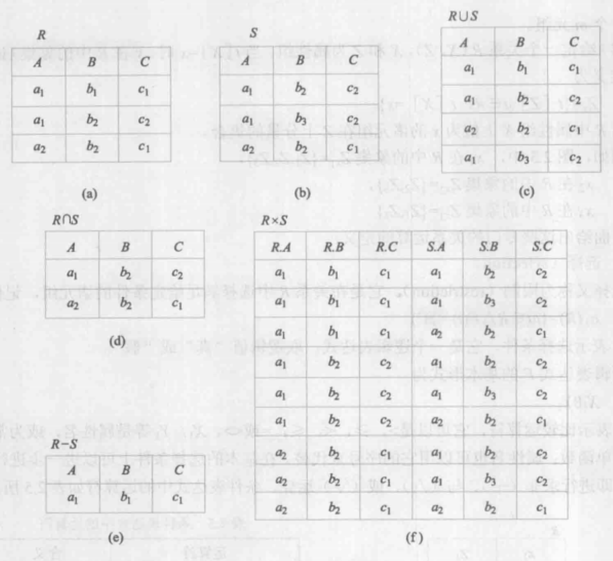

### <font style="color:#DF2A3F;">专门的关系运算</font>
**关系运算包括：选择、投影、连接、除运算。** 

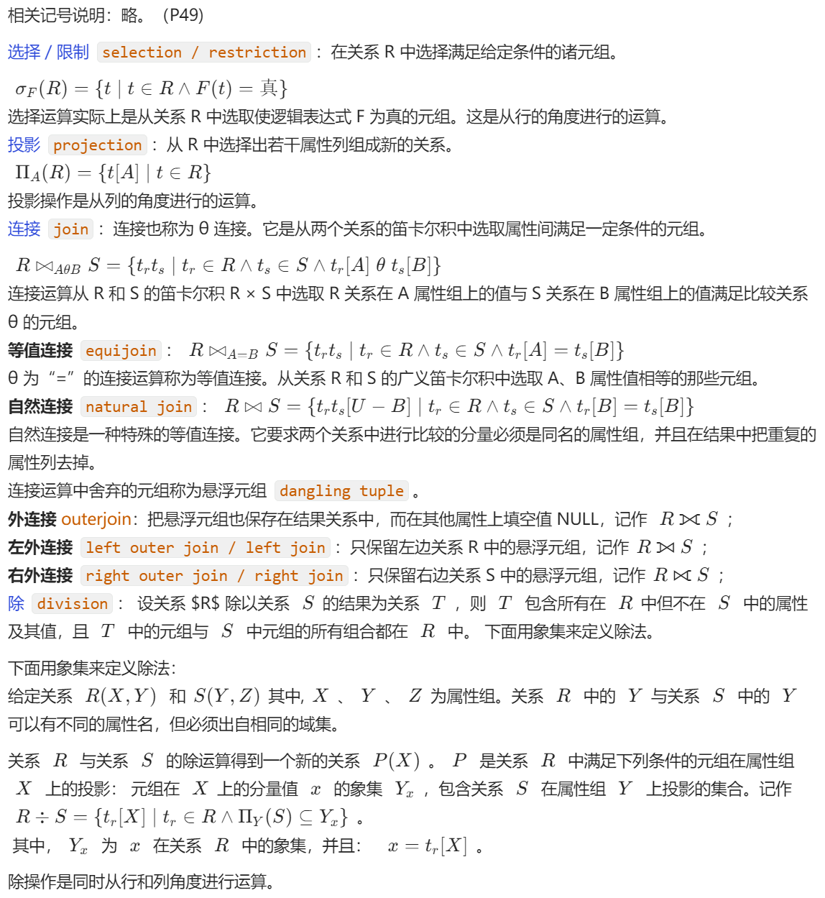

# Note 03 关系数据库标准语言 SQL
## 3.1 SQL 概述
**SQL** <font style="color:#C75C00;">Structured Query Language</font> **结构化查询语言**，是关系数据库的标准语言。

SQL 是一个通用的、功能极强的关系数据库语言。

### <font style="color:#DF2A3F;">SQL 的产生与发展</font>
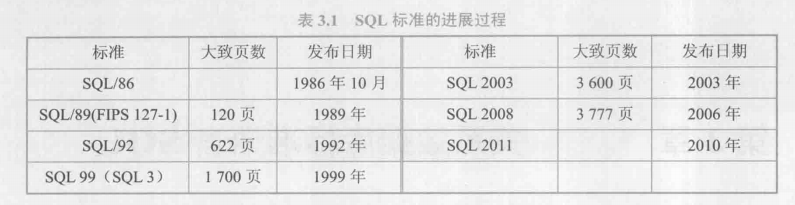

### <font style="color:#DF2A3F;">SQL 的特点</font>
#### <font style="color:#213BC0;">综合统一</font>
1. 集数据定义语言<font style="color:#C75C00;">DDL</font>，数据操纵语言<font style="color:#C75C00;">DML</font>，数据控制语言<font style="color:#C75C00;">DCL</font> 功能于一体。
2. 可以独立完成数据库生命周期中的全部活动：定义关系模式，插入数据，建立数据库；对数据库中数据进行

行查询和更新；数据库重构和维护；数据库安全性、完整性控制等。

3. 用户数据库投入运行后，可根据需要随时逐步修改模式，不影响数据的运行。
4. 数据操作符统一。

#### <font style="color:#213BC0;">高度非过程化</font>
用 SQL 进行数据操作时，只要提出 “做什么”，无须指明 “怎么做”，因此无须了解存取路径。

存取路径的选择以及 SQL 的操作过程由系统自动完成。

#### <font style="color:#213BC0;">面向集合的操作方式</font>
SQL 采用集合操作方式 不仅操作对象、查找结果可以是元组的集合；而且一次插入、删除、更新操作的对象也可以是元组的集合。

#### <font style="color:#213BC0;">以同一种语法结构提供多种使用方式</font>
SQL 是独立的语言：能够独立地用于联机交互的使用方式。

SQL ⼜是嵌入式语言：SQL 能够嵌入到高级语言（例如C，C++，Java）程序中，供程序员设计程序时使用。

**<font style="color:#213BC0;">语言简洁，易学易用</font>**

 SQL 功能极强，完成核心功能只用了 9 个动词。

| **SQL 功能** | **动词** |
| --- | --- |
| 数据查询 | SELECT |
| 数据定义 | CREATE, DROP, ALTER |
| 数据操纵 | INSERT, UPDATE, DELETE |
| 数据控制 | GRANT, REVOKE |


<font style="color:rgb(70,130,180);">缺点</font>：SQL 只包含定义和操作命令，不包含控制流命令，如 IF...THEN、DO...WHILE。

### <font style="color:#DF2A3F;">SQL 的基本概念</font>
SQL 支持关系数据库三级模式结构。

其中外模式包括若干 <font style="color:#213BC0;">视图</font> <font style="color:#C75C00;">view</font> 和部分 <font style="color:#213BC0;">基本表 </font><font style="color:#C75C00;">base table</font>，数据库模式包括若干基本表， 内模式包括若干 <font style="color:#213BC0;">存储文件</font> <font style="color:#C75C00;">stored file</font>。

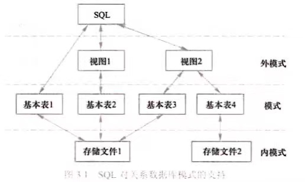

#### <font style="color:#213BC0;">基本表</font>
本身独立存在的表，关系数据库管理系统中一个关系就对应一个基本表。

一个或多个基本表对应一个存储文件，一个表可以带若干索引，索引也存放在存储文件中。

#### <font style="color:#213BC0;">存储文件</font>
逻辑结构组成了关系数据库的内模式。存储文件的物理结构对最终用户是隐蔽的。

#### <font style="color:#213BC0;">视图</font>
从一个或几个基本表导出的表。

本身不独立存储在数据库中，即数据库中只存放视图的定义而不存放视图对应的数据。

数据存放在导出视图的基本表中，因此视图是一个虚表。

视图在概念上与基本表等同，用户可以在视图上再定义视图。

## 3.2 学生-课程数据库
**学生**-**课程模式S-T ，学生**-**课程数据库中包括以下三个表：：** 

<font style="color:#213BC0;">学生表：Student(Sno,Sname,Ssex,Sage, Sdept)</font>

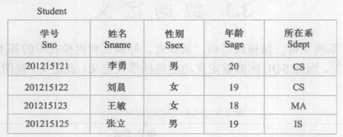

<font style="color:#213BC0;">课程表：Course(Cno, Cname, Cpno, Ccredit)</font>

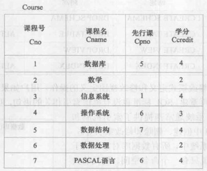

<font style="color:#213BC0;">学生选课表：SC(Sno.Cno,Grade)</font>

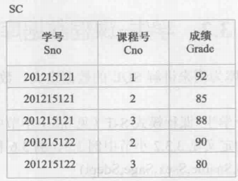

## 3.3 数据定义
**SQL** **的数据定义功能包括模式定义、表定义、视图和索引的定义。**

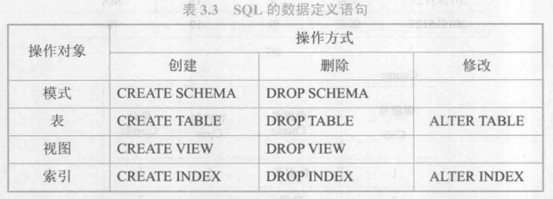

一个关系数据库管理系统的 **实例** <font style="color:#C75C00;">instance</font> 中可以建立多个数据库，一个数据库中可以建立多个模式，一个模式 下通常包括多个表、视图和索引等数据库对象。

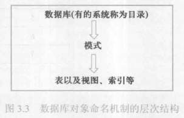

### <font style="color:#DF2A3F;">模式的定义与删除</font>
#### <font style="color:#213BC0;">定义模式</font>
<font style="color:#E746A4;">语句格式</font>：【CREATE SCHEMA < 模式名 > AUTHORIZATION < 用户名 > ;】

```sql
/*为用户 WANG 定义一个学生-课程模式 S-T*/
CREATE SCHEMA "S-T" AUTHORIZATION WANG;
```

若没有指定模式名，那么 < 模式名 > 隐含为 < 用户名 >。

```sql
/*为用户 WANG 定义一个模式，模式名隐含为 WANG*/
CREATE SCHEMA AUTHORIZATION WANG;
```

在 CREATE SCHEMA 中可以接受 CREATE TABLE， CREATE VIEW 和 GRANT 子句。也就是说用户可以在创建模式的同 时在这个模式定义中进一步创建基本表、视图， 定义授权。

<font style="color:#E746A4;">语句格式</font>：【CREATE SCHEMA < 模式名 > AUTHORIZATION < 用户名 >

​                                [ < 表定义子句> | < 视图定义子句> | <授权定义子句> ] ;】

```sql
/*为用户 ZHANG 创建一个模式 TEST，并且在其中定义一个表 TAB1*/
CREATE SCHEMA TEST AUTHORIZATION ZHANG 
CREATE TABLE TAB1(COL1 SMALLINT, //短整数（2字节）
                  COL2 INT, //长整数（4字节）
                  COL3 CHAR(20), //长度为20的定长字符串
                  COL4 NUMERIC(10,3), //定点数，由10位数字（不包括符号、⼩数点）组成，⼩数点后面有3位数
字
                  COL5 DECIMAL(5,2) //同 NUMERIC，定点数，由5位数字组成，⼩数点后面有2位数字
                  );
```

执行创建模式语句必须拥有 DBA 权限，或者 DBA 授予在 CREATE SCHEMA 的权限。

#### <font style="color:#213BC0;">删除模式</font>
<font style="color:#E746A4;">语句格式</font>：【DROP SCHEMA < 模式名 > < CASCADE | RESTRICT > ;】

```sql
/*删除了模式 ZHANG，同时删除模式为 CASCADE ，该模式中已经定义的表 TAB1 也删除*/
DROP SCHEMA ZHANG CASCADE;
```

<font style="color:#0C68CA;">说明</font>：**CASCADE** **和** **RESTRICT** **必须⼆选一。** 

**级联** <font style="color:#C75C00;">CASCADE</font>：删除模式的同时把该模式中所有的数据库对象全部删除。

**限制** <font style="color:#C75C00;">RESTRICT</font>：如果该模式中定义了下属的数据库对象（如表、视图等），则拒绝该删除语句的执行。当该模 式中没有任何下属的对象时才能执行。

### <font style="color:#DF2A3F;">基本表的定义、删除与修改</font>
#### <font style="color:#0C68CA;">定义基本表</font>
语句格式：【CREATE TABLE < 表名 > ( < 列名 >< 数据类型 >［ 列级完整性约束条件 ］                                                  					[, < 列名 > < 数据类型 > [ 列级完整性约束条件 ] ]

​                                        [, < 表级完整性约東条件 > ] ) ;】

```sql
/*建立一个“学生”表 Student*/
CREATE TABLE Student (Sno CHAR(9) PRIMARY KEY,  /*列级完整性约束条件，Sno 是主码*/
                      Sname CHAR(20) UNIQUE,    /* Sname 取唯一值*/
                      Ssex CHAR(2),
                      Sage SMALLINT,
                      Sdept CHAR(20)
```

```sql
/*建立一个“课程”表 Course*/
CREATE TABLE Course (Cno CHAR(4) PRIMARY KEY,   /*列级完整性约東条件，Cno 是主码*/
                     Cname CHAR(40) NOT NULL,   /*列级完整性约束条件，Cname 不能取空值*/
                     Cpno CHAR(4),              /* Cpno 的含义是先修课*/
                     Ccredit SMALLINT,
                     FOREIGN KEY (Cpno) REFERENCES Course(Cno)
                                   /*表级完整性约束条件，Cpno是外码，被参照表是 Course，被参照列是Cno*/
                    );                          /*参照表和被参照表可以是同一个表*/
/*建立学生选课表 SC*/
CREATE TABLE SC(Sno CHAR(9)，
                Cno CHAR(4)，
                Grade SMALLINT，
                PRIMARY KEY （Sno，Cno），/*主码由两个属性构成，必须作为表级完整性进行定义*/
                FOREIGN KEY (Sno) REFERENCES Student(Sno)，
                                         /*表级完整性约束条件，Sno 是外码，被参照表是 Student */
                FOREIGN KEY (Cno) REFERENCES Course(Cno)
                                         /*表级完整性约束条件，Cno 是外码，被参照表是 Course */
               )；
```

#### <font style="color:#0C68CA;">数据类型</font>

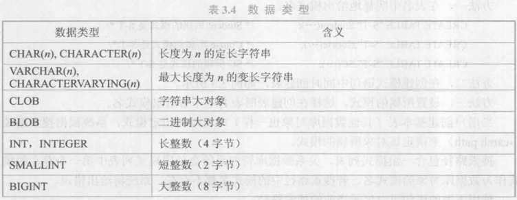

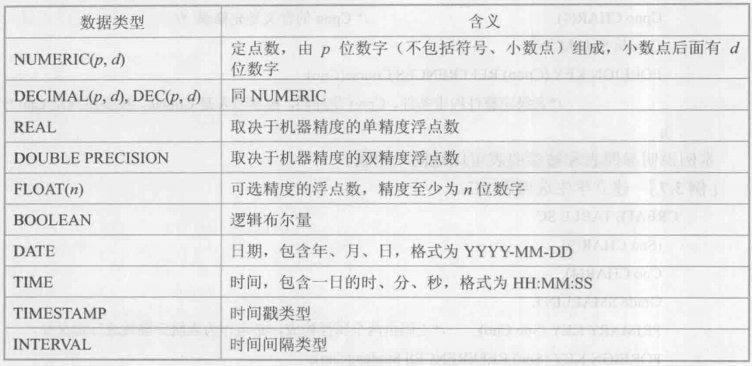

#### <font style="color:#0C68CA;">模式与表</font>
每一个基本表都属于某一个模式，一个模式包含多个基本表。

当定义基本表时一般可以有三种方法定义它所属的模式。

方法一，在表名中明显地给出模式名。

```sql
CREATE TABLE "S-T".Student (***);     /* Student 所属的模式是S-T*/
CREATE TABLE "S-T".Course(***);       /* Course 所属的模式是S-T*/
CREATE TABLE "S-T".SC(***);           /* SC 所属的模式是S-T*/
```

方法⼆，在创建模式语句中同时创建表。

方法三，设置所属的模式，这样在创建表时表名中不必给出模式名。

当用户创建基本表 / 数据库对象时若没有指定模式，系统根据 搜索路径 `search path` 来确定该对象所属的模式。

```sql
/*显示当前的搜索路径*/
SHOW search_path;

/*搜索路径的当前默认值*/
$ user, PUBLIC;

/*数据库管理员可以设置搜索路径*/
SET search_path TO "S-T", PUBLIC;

/*然后，定义基本表时 DBMS 发现搜索路径中【第一个】模式名作为基本表所属模式(上述 SET 中第一个是"S-T")*/
CREATE TABLE Student (***);
```

#### <font style="color:#0C68CA;">修改基本表</font>
随着应用环境和应用需求的变化，有时需要修改已建立好的基本表。SQL 语言用 AITER TABLE 语句修改基本表。

语句格式：【ALTER TABLE < 表名 > [ <font style="color:#601BDE;">ADD</font> [ <font style="color:#601BDE;">COLUMN </font>] < 新列名 > < 数据类型 > [ 完整性约束 ] ]

​								[ ADD < 表级完整性约束 > ]

​								[ DROP [ COLUMN ] < 列名 > [ CASCADE | RESTRICT ] ] 

​								[ DROP CONSTRAINT < 完整性约束名 > [ CASCADE | RESTRICT ] ]

​								[ ALTER COLUMN < 列名 > < 数据类型 > ] ;】

<font style="color:#0C68CA;">说明</font>：语句中 < 表名 > 是要修改的基本表。

<font style="color:#C99103;">ADD</font> 子句用于增加新列、新的列级完整性约束条件和新的表级完整性约束条件。

<font style="color:#ED740C;">DROP COLUMN</font> 子句用于删除表中的列。

<font style="color:#ED740C;">DROP CONSTRAINT</font> 子句用于删除指定的完整性约束条件。

<font style="color:#ED740C;">ALTER COLUMN</font> 子句用于修改原有的列定义，包括修改列名和数据类型。

两个 <font style="color:#C99103;">DROP</font> 语句中的删除模式不要求强制指定：在 MySQL 中，默认使用<font style="color:#C99103;">RESTRICT</font>。

```sql
/*向 Student 表增加“入学时间”列，其数据类型为日期型。*/
ALTER TABLE Student ADD S_entrance DATE;

/*将年龄的数据类型由字符型（假设原来的数据类型是字符型）改为整数。*/
ALTER TABLE Student ALTER COLUMN Sage INT;

/*增加课程名称必须取唯一值的约束条件。*/
ALTER TABLE Course ADD UNIQUE(Cname);
```

#### <font style="color:#213BC0;">删除基本表</font>
当某个基本表不再需要时，可以使用 DROP TABLE 语句删除它。

<font style="color:#F1A2AB;">语句格式</font>：【DROP TABLE < 表名 > [ RESTRICT | CASCADE ] ;】

<font style="color:#0C68CA;">说明</font>：默认使用<font style="color:#F38F39;">RESTRICT</font>。

```sql
/*删除 Student 表*/
DROP TABLE Student CASCADE;
```

### <font style="color:#DF2A3F;">索引的建立与删除</font>
**建立索引的目的**：加快查询速度。

**谁可以建立索引**：DBA 或表的属主（即建立表的⼈）。

DBMS 一般会自动建立以下列上的索引：<font style="color:#F38F39;">PRIMARY KEY</font><font style="color:#F38F39;">；</font><font style="color:#F38F39;">UNIQUE</font><font style="color:#F38F39;">；</font>

**谁维护索引**：DBMS 自动完成。

**使用索引**：DBMS 自动选择是否使用索引及使用哪些索引。

#### <font style="color:#213BC0;">建立索引</font>
在 SQL 语言中，建立索引使用 CREATE INDEX 语句。

<font style="color:#E4495B;">语句格式</font>：

【CREATE [ UNIQUE ] [ CLUSTER ] INDEX < 索引名 > ON < 表名 > ( < 列名 > [ 次序 ]
 						 [ < 列名 > [ 次序 ] ]
  						...) ;】


<font style="color:#0C68CA;">说明</font>：语句中 < 表名 > 是要建索引的基本表的名字。

索引可以建立在该表的一列或多列上，各列名之间用逗号分隔。

每个 < 列名 > 后面还可以用 < 次序 > 指定索引值的排列次序，可选 <font style="color:#C75C00;">ASC</font> **升序** 或 <font style="color:#C75C00;">DESC</font> **降序**，默认 <font style="color:#C75C00;">ASC</font>。

<font style="color:#C75C00;">UNIQUE</font> 表明此索引的每一个索引值只对应唯一的数据记录。

<font style="color:#C75C00;">CLUSTER</font> 表示要建立的索引是聚簇索引。聚簇索引是指索引顺序与表中记录的物理顺序一致的索引组织。

1. 在最经常查询的列上建立聚簇索引以提高查询效率；
2. 一个基本表上最多只能建立一个聚簇索引；
3. 经常更新的列不宜建立聚簇索引。

```sql
/*为 Student 表按学号升序建唯一索引*/
CREATE UNIQUE INDEX Stusno ON Student(Sno);

/*为 Course 表按课程号升序建唯一索引*/
CREATE UNIQUE INDEX Coucno ON Course(Cno);

/*为 SC 表按学号升序和课程号降序建唯一索引*/
CREATE UNIQUE INDEX SCno ON SC(Sno ASC,Cno DESC);

/*为 Student 表的 Sname 列建立一个聚簇索引*/
CREATE CLUSTER INDEX Stusname ON Student (Sname) ;
```

#### <font style="color:#213BC0;">修改索引</font>
对于已经建立的索引，如果需要对其重新命名，可以使用 ALTER INDEX 语句。

<font style="color:#E4495B;">语句格式</font>：【ALTER INDEX < 旧索引名 > RENAME TO < 新索引名 >；】

```sql
/*将 SC 表的 SCno 索引名改为 SCSno */
ALTER INDEX SCno RENAME TO SCSno;
```

#### <font style="color:#213BC0;">删除索引</font>
在 SQL 中，删除索引使用 DROP INDEX 语句。

<font style="color:#E4495B;">语句格式</font>：【DROP INDEX < 索引名 > ;】

<font style="color:#2F8EF4;">说明</font>：删除索引时，系统会同时从数据字典中删去有关该索引的描述。

```sql
/*删除 Student 表的 Stusname 索引*/
DROP INDEX Stusname;
```

### <font style="color:#DF2A3F;">数据字典</font>
数据字典是关系数据库管理系统内部的一组系统表。

数据字典记录了数据库中所有的定义信息，包括模式定义、 视图定义、索引定义、完整性约束定义、各类用户对 数据库的操作权限、统计信息等。

RDBMS 执行 SQL 数据定义时，实际就是更新数据字典。

## 3.4 数据查询
数据查询是数据库的核心操作。SQL 提供了 SELECT 语句进行数据查询。

<font style="color:#E4495B;">语句格式</font>：【 <font style="color:rgb(128,0,128);">SELECT</font> [ <font style="color:rgb(255,69,0);">ALL</font> | <font style="color:rgb(255,69,0);">DISTINCT</font> ] < 目标列表达式 > [ , < 目标列表达式 > ] ... 

​				<font style="color:rgb(128,0,128);">                FROM</font> < 表名或视图名 > [ , < 表名或视图名 > ] ... | ( < <font style="color:rgb(128,0,128);">SELECT </font>语句 > ) [ <font style="color:rgb(128,0,128);">AS</font> ] < 别名 > 

​				                [<font style="color:rgb(128,0,128);"> WHERE</font> < 条件表达式 > ] 

​				                [ <font style="color:rgb(128,0,128);">GROUP BY</font> < 列名1 > [ <font style="color:rgb(128,0,128);">HAVING</font> < 条件表达式 > ] ] 

​				                [ <font style="color:rgb(128,0,128);">ORDER BY</font> < 列名2 > [ <font style="color:rgb(255,69,0);">ASC</font> | <font style="color:rgb(255,69,0);">DESC</font> ] ] ; 】


说明：根根据 <font style="color:rgb(233,105,0);">WHERE</font><font style="color:rgb(233,105,0);"> </font>子句的条件表达式从 <font style="color:rgb(233,105,0);">FROM</font><font style="color:rgb(233,105,0);"> </font>子句指定的基本表、视图或派生表中找出满足条件的元组，再按 <font style="color:rgb(233,105,0);">SELECT</font><font style="color:rgb(233,105,0);"> </font>子句中的目标列表达式选出元组中的属性值形成结果表。

如果有 <font style="color:rgb(233,105,0);">GROUP BY</font><font style="color:rgb(233,105,0);"> </font>子句，则将结果按 < 列名1 > 的值进行分组，该属性列值相等的元组为一个组。 

通常会在每组中作用聚集函数。如果 <font style="color:rgb(233,105,0);">GROUP BY</font><font style="color:rgb(233,105,0);"> </font>子句带 <font style="color:rgb(233,105,0);">HAVING</font><font style="color:rgb(233,105,0);"> </font>短语，则只有满足指定条件的组才予以输出。 

如果有 <font style="color:rgb(233,105,0);">ORDER BY</font><font style="color:rgb(233,105,0);"> </font>子句，则结果表还要按 < 列名2 > 的值的升序或降序排序。

### <font style="color:#DF2A3F;">单表查询</font>
**指仅涉及一个表的查询**。

#### <font style="color:rgb(0,0,255);">选择表中的若⼲列</font>
<font style="color:rgb(255,69,0);">查询指定列 </font>

<font style="color:rgb(219,112,147);">语句格式</font>：【 <font style="color:rgb(128,0,128);">SELECT</font> < 目标列表达式 > [ , < 目标列表达式 > ] ... <font style="color:rgb(128,0,128);">FROM</font> < 表名或视图名 > ; 】

```sql
/*查询全体学生的学号与姓名*/
SELECT Sno,Sname FROM Student；
/*查询全体学生的姓名、学号、所在系*/
SELECT Sname,Sno,Sdept FROM Student；
```

<font style="color:rgb(255,69,0);">查询指定列 </font>

<font style="color:rgb(219,112,147);">语句格式</font>：【 <font style="color:rgb(128,0,128);">SELECT </font><font style="color:rgb(255,69,0);">* </font><font style="color:rgb(128,0,128);">FROM</font> < 表名或视图名 > ; 】

```sql
/*查询全体学生的详细记录*/
SELECT * FROM Student；
```

<font style="color:rgb(255,69,0);">查询经过计算的值 </font>

<font style="color:rgb(219,112,147);">语句格式</font>：【 <font style="color:rgb(128,0,128);">SELECT</font> < 目标列表达式 > [ , < 目标列表达式 > ] ... <font style="color:rgb(128,0,128);">FROM</font> < 表名或视图名 > ; 】 

<font style="color:rgb(70,130,180);">说明</font>：< 目标列表达式 > 可以为算术表达式、字符串常量、函数、列别名

```sql
/*算术表达式：查询全体学⽣的姓名及其出⽣年份 出⽣年份 = 2004 - Sage */ 
SELECT Sname,2014-Sage FROM Student； 

/*字符串常量、函数：查询全体学⽣的姓名、出⽣年份和所在的院系，要求用⼩写字⺟表示系名。 
出⽣年份前使用字符串'Year of Birth:'标注，⼩写字⺟表示系名使用函数 LOWER() */ 
SELECT Sname,'Year of Birth:',2014-Sage,LOWER(Sdept) FROM Student； 

/*别名：查询全体学⽣的姓名、出⽣年份和所在的院系，要求用⼩写字⺟表示系名。通过指定别名来改变查询结果的列标题， 
别名可在原列名、算术表达式、字符串常量及函数后添加空格、在","前标注 */ 
SELECT Sname NAME,'Year of Birth:' BIRTH,2014-Sage BIRTHDAY,LOWER(Sdept) DEPARTMENT 
FROM Student;
```

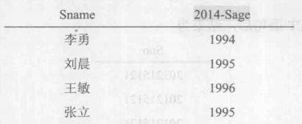

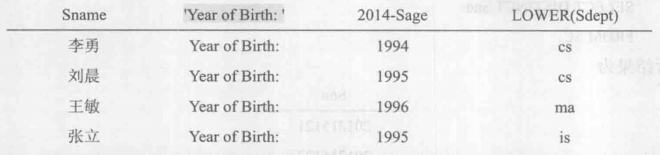

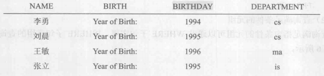

#### <font style="color:rgb(0,0,255);">选择表中的若干元组 </font>
<font style="color:rgb(255,69,0);">消除取值重复的行</font>

<font style="color:rgb(219,112,147);">语句格式</font>：

【 <font style="color:rgb(128,0,128);">SELECT </font><font style="color:rgb(255,69,0);">DISTINCT</font> < 目标列表达式 > [ , < 目标列表达式 > ] ... <font style="color:rgb(128,0,128);">FROM</font> < 表名或视图名 > ; 】

<font style="color:rgb(70,130,180);">说明</font>：如果没有指定 <font style="color:rgb(233,105,0);">DISTINCT </font>关键词，则默认为 <font style="color:rgb(233,105,0);">ALL </font>。

```sql
/*查询选修了课程的学生学号，查询结果不重复*/
SELECT DISTINCT Sno FROM SC；
```

<font style="color:rgb(255,69,0);">查询满足条件的元组 </font>

<font style="color:rgb(219,112,147);">语句格式</font>：【 <font style="color:rgb(128,0,128);">SELECT</font> [ <font style="color:rgb(255,69,0);">ALL</font> | <font style="color:rgb(255,69,0);">DISTINCT</font> ] < 目标列表达式 > [ , < 目标列表达式 > ] ... 

​				<font style="color:rgb(128,0,128);">                	FROM</font> < 表名或视图名 > [ , < 表名或视图名 > ] ... | ( < <font style="color:rgb(128,0,128);">SELECT </font>语句 > ) [ <font style="color:rgb(128,0,128);">AS</font> ] < 别名 > 

​			<font style="color:rgb(128,0,128);">               	 	WHERE</font> < 条件表达式 > ; 】

<font style="color:rgb(70,130,180);">说明</font>：WHERE 子句查询满足指定条件的元组，查询条件谓词如下表， 

**比较中**， <font style="color:rgb(233,105,0);"><> </font>等同于 <font style="color:rgb(233,105,0);">!= </font>； 

**确定范围中**， <font style="color:rgb(233,105,0);">BETWEEN </font>后是范围的下限（即低值）， <font style="color:rgb(233,105,0);">AND </font>后是范围的上限（即高值）。 

**字符匹配中**，字符串的匹配 <font style="color:rgb(219,112,147);">语法格式</font>：【 [ <font style="color:rgb(128,0,128);">NOT</font> ] <font style="color:rgb(128,0,128);">LIKE</font> '< 匹配串 >' [ <font style="color:rgb(128,0,128);">ESCAPE</font> ' < 换码字符 > ' ]】 

1. < 匹配串 > 可以是一个完整的字符串，也可以含有通配符 <font style="color:rgb(233,105,0);">% </font>和 <font style="color:rgb(233,105,0);">_ </font>。 
2. <font style="color:rgb(233,105,0);">% </font>：任意长度（长度可以为 0 ）的字符串。 
3. <font style="color:rgb(233,105,0);">_ </font>：任意单个字符
4. 如果 <font style="color:rgb(233,105,0);">LIKE </font>后面的匹配串中不含通配符，则可以用 <font style="color:rgb(233,105,0);">= </font>运算符取代 <font style="color:rgb(233,105,0);">LIKE </font>谓词，用 <font style="color:rgb(233,105,0);"><> </font>或 <font style="color:rgb(233,105,0);">!= </font>运算符取代 <font style="color:rgb(233,105,0);">NOT LIKE </font>谓词。
5. 数据库字符集为 ASCII 时一个汉字需要两个 <font style="color:rgb(233,105,0);">_，当字符集为 GBK（国家标准扩展编码）时只需要一个_</font><font style="color:rgb(233,105,0);"> </font>。
6. 如果用户要查询的字符串本身就含有通配符，则使用 ESCAPE ' < 换码字符 > ' 短语对通配符进行转义。 e.g. <font style="color:rgb(233,105,0);">ESCAPE '\' </font>表示 <font style="color:rgb(233,105,0);">\ </font>为换码字符。匹配串中在 <font style="color:rgb(233,105,0);">\ </font>后面的字符不再具有通配符含义，转义为普通字符。 

**空值中**， <font style="color:rgb(233,105,0);">IS </font>、 <font style="color:rgb(233,105,0);">IS NOT </font>不能使用 <font style="color:rgb(233,105,0);">= </font>、 <font style="color:rgb(233,105,0);"><> </font>或 <font style="color:rgb(233,105,0);">!= </font>代替。 

**多重条件中**，逻辑运算符 <font style="color:rgb(233,105,0);">AND </font>和 <font style="color:rgb(233,105,0);">OR </font>可用来连接多个查询条件。 <font style="color:rgb(233,105,0);">AND </font>优先级高于 <font style="color:rgb(233,105,0);">OR </font>，但可用括号改变。

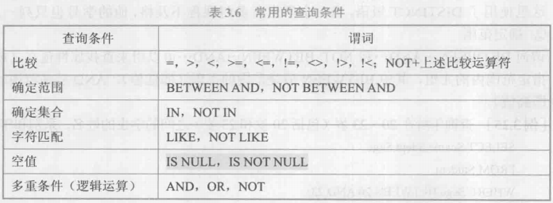

```sql
/*比较：查询考试成绩不及格的学⽣的学号*/ 
SELECT DISTINCT Sno FROM SC WHERE Grade<60;  
WHERE Grade<60; 
/*确定范围：查询年龄不在20～23岁之间的学⽣姓名、系别和年龄*/ 
SELECT Sname,Sdept,Sage FROM Student 
WHERE Sage NOT BETWEEN 20 AND 23; 

/*确定集合：查询计算机科学系[CS]、数学系[MA]和信息系[IS]学⽣的姓名和性别*/ 
SELECT Sname, Ssex FROM Student 
WHERE Sdept IN ('CS','MA','IS'); 

/*字符匹配.1：查询学号为 201215121 的学⽣的详细情况*/ 
SELECT * FROM Student 
WHERE Sno LIKE '201215121'; 

/*字符匹配.2：查询所有姓刘的学⽣的姓名、学号和性别*/ 
SELECT Sname,Sno,Ssex FROM Student 
WHERE Sname LIKE '刘%'; 

/*字符匹配.3：查询学号为 201215121 的学⽣的详细情况*/ 
SELECT * FROM Student 
WHERE Sno = '201215121'; 

/*字符匹配.4：查询姓“欧阳”且全名为三个汉字的学⽣的姓名*/ 
SELECT Sname FROM Student 
WHERE Sname LIKE '欧阳_'; /*ASCII*/ 
SELECT Sname FROM Student 
WHERE Sname LIKE '欧阳__'; /*GBK*/ 

/*字符匹配.5：查询以“DB_”开头，且倒数第三个字符为 i 的课程的详细情况，此处换码字符为'/' */ 
SELECT * FROM Course
          WHERE Cname LIKE 'DB/_%i__' ESCAPE '/'; 

/*空值：查询缺少成绩的学⽣的学号和相应的课程号*/ 
SELECT Sno,Cno FROM SC 
WHERE Grade IS NULL; 

/*多重条件：查询计算机科学系年龄在20岁以下的学⽣姓名*/ 
SELECT Sname FROM Student 
WHERE Sdept='CS' AND Sage<20;
```


<font style="color:rgb(0,0,255);">ORDER BY </font><font style="color:rgb(0,0,255);">子句 </font>

<font style="color:rgb(219,112,147);">语句格式</font>：

【 <font style="color:rgb(128,0,128);">SELECT</font> [ <font style="color:rgb(255,69,0);">ALL</font> | <font style="color:rgb(255,69,0);">DISTINCT</font> ] < 目标列表达式 > [ , < 目标列表达式 > ] ... 

<font style="color:rgb(128,0,128);">FROM</font> < 表名或视图名 > [ , < 表名或视图名 > ] ... | ( < <font style="color:rgb(128,0,128);">SELECT </font>语句 > ) [ <font style="color:rgb(128,0,128);">AS</font> ] < 别名 > 

[<font style="color:rgb(128,0,128);"> WHERE</font> < 条件表达式 > ] 

<font style="color:rgb(128,0,128);">ORDER BY</font> < 列名2 > [ <font style="color:rgb(255,69,0);">ASC</font> | <font style="color:rgb(255,69,0);">DESC</font> ] ; 】 

<font style="color:rgb(70,130,180);">说明</font>：ORDER BY 子句对查询结果按照一个或多个属性列的升序 <font style="color:rgb(233,105,0);">ASC </font>或降序 <font style="color:rgb(233,105,0);">DESC </font>排列，默认值为升序。 

当排序列含空值时：**空值默认为最⼤值**。 <font style="color:rgb(233,105,0);">ASC </font>空值的元组最后显示。 <font style="color:rgb(233,105,0);">DESC </font>空值的元组最先显示。

<font style="color:rgb(0,0,255);">聚集函数 </font>

<font style="color:rgb(219,112,147);">语句格式</font>：

【 <font style="color:rgb(128,0,128);">SELECT</font> [ <font style="color:rgb(128,0,128);">聚集函数</font> ] 

<font style="color:rgb(128,0,128);">               FROM</font> < 表名或视图名 > [ , < 表名或视图名 > ] ... | ( < <font style="color:rgb(128,0,128);">SELECT </font>语句 > ) [ <font style="color:rgb(128,0,128);">AS</font> ] < 别名 > 

[<font style="color:rgb(128,0,128);"> WHERE</font> < 条件表达式 > ] 

[ <font style="color:rgb(128,0,128);">ORDER BY</font> < 列名2 > [ <font style="color:rgb(255,69,0);">ASC</font> | <font style="color:rgb(255,69,0);">DESC</font> ] ] ; 】 

<font style="color:rgb(70,130,180);">说明</font>：SQL 提供的聚集函数主要如下，限制条件默认 <font style="color:rgb(233,105,0);">ALL </font>：

| **聚集函数**                        | **意义**                               |
| ----------------------------------- | -------------------------------------- |
| 【COUNT(*)】                        | 统计元组个数                           |
| 【COUNT([ALL \| DISTINCT] <列名>)】 | 统计一列中值的个数                     |
| 【SUM([ALL \| DISTINCT] <列名>)】   | 计算一列值的总和（此列必须是数值型）   |
| 【AVG([ALL \| DISTINCT] <列名>)】   | 计算一列值的平均值（此列必须是数值型） |
| 【MAX([ALL \| DISTINCT] <列名>)】   | 求一列值中的最大值                     |
| 【MIN([ALL \| DISTINCT] <列名>)】   | 求一列值中的最小值                     |


```sql
/*查询学⽣总⼈数*/ 
SELECT COUNT(*) FROM Student; 

/*查询选修了课程的学⽣⼈数*/ 
SELECT COUNT(DISTINCT Sno) FROM SC; 

/*计算选修 1 号课程的学⽣平均成绩*/ 
SELECT AVG(Grade) FROM SC WHERE Cno='1'; 

/*查询选修 1 号课程的学⽣最高分数*/ 
SELECT MAX(Grade) FROM SC WHERE Cno='1'; 

/*查询学⽣ 201215012 选修课程的总学分数*/ 
SELECT SUM(Ccredit) FROM SC, Course 
WHERE Sno='201215012' AND SC.Cno=Course.Cno;
```

<font style="color:rgb(0,0,255);">GROUP BY </font><font style="color:rgb(0,0,255);">子句 </font>

<font style="color:rgb(219,112,147);">语句格式</font>：

【 <font style="color:rgb(128,0,128);">SELECT</font> [ <font style="color:rgb(255,69,0);">ALL</font> | <font style="color:rgb(255,69,0);">DISTINCT</font> ] < 目标列表达式 > [ , < 目标列表达式 > ] ... 

<font style="color:rgb(128,0,128);">FROM</font> < 表名或视图名 > [ , < 表名或视图名 > ] ... | ( < <font style="color:rgb(128,0,128);">SELECT </font>语句 > ) [ <font style="color:rgb(128,0,128);">AS</font> ] < 别名 > 

[<font style="color:rgb(128,0,128);"> WHERE</font> < 条件表达式 > ] 

<font style="color:rgb(128,0,128);">      GROUP BY</font> < 列名1 > [ <font style="color:rgb(128,0,128);">HAVING</font> < 条件表达式 > ] 

[ <font style="color:rgb(128,0,128);">ORDER BY</font> < 列名2 > [ <font style="color:rgb(255,69,0);">ASC</font> | <font style="color:rgb(255,69,0);">DESC</font> ] ] ; 】 

<font style="color:rgb(70,130,180);">说明</font>：GROUP BY 子句将查询结果按某一列或多列的值分组，值相等的为一组。 

未分组时，聚集函数将作用于整个查询结果，**分组后聚集函数将作用于每一个组**，即每一组都有一个函数值。 

<font style="color:rgb(233,105,0);">HAVING </font>短语指定筛选条件，对组进行筛选，最终只输出满足指定条件的组。 

<font style="color:rgb(233,105,0);">WHERE </font>子句作用于基本表或视图，从中选择满足条件的元组。 <font style="color:rgb(233,105,0);">HAVING </font>短语作用于组，从中选择满足条件的组。 

<font style="color:rgb(233,105,0);">WHERE </font>子句与 <font style="color:rgb(233,105,0);">HAVING </font>短语的**作用对象不同**， <font style="color:rgb(233,105,0);">WHERE </font>**子句中不能用聚集函数作为条件表达式**。

```sql
/*求各个课程号及相应的选课⼈数*/ 
SELECT Cno, COUNT(Sno) FROM SC 
       GROUP BY Cno; 
       
/*查询选修了三⻔以上课程的学⽣学号*/ 
SELECT Sno FROM SC 
       GROUP BY Sno 
       HAVING COUNT(*) >3; 
       
/*查询平均成绩⼤于等于 90 分的学⽣学号和平均成绩*/ 
SELECT Sno, AVG(Grade) FROM SC 
        GROUP BY Sno 
        HAVING AVG(Grade)>=90;
```

### <font style="color:#DF2A3F;">连接查询</font>
**查询同时涉及两个以上的表**。 

<font style="color:rgb(0,0,255);">等值与⾮等值连接查询 </font>

连接查询的 WHERE 子句中用来连接两个表的条件称为 **连接条件** 或 **连接谓词**。 

<font style="color:rgb(219,112,147);">连接格式</font>：【 [ < 表名1 > .] < 列名1 > < <font style="color:rgb(255,69,0);">比较运算符</font> > [ < 表名2 > .] < 列名2 > 】 

【 [ < 表名1 > .] < 列名1 > <font style="color:rgb(128,0,128);">BETWEEN</font> [ < 表名2 > .] < 列名2 > <font style="color:rgb(128,0,128);">AND</font> [ < 表名3 > .] < 列名3 > 】 

当连接运算符为 <font style="color:rgb(233,105,0);">= </font>时，称为 **等值连接**。使用其他运算符称为 **⾮等值连接**。 

连接谓词中的列名称为 **连接字段**。连接条件中的各连接字段类型必须是可比的，但名字不必相同。 

连接操作的一种执行⽅法：**嵌套循环法** <font style="color:rgb(233,105,0);">NESTED-LOOP </font>。

```sql
/*查询每个学⽣及其选修课程的情况*/ 
SELECT Student.*,SC.* /* '表名.*' 表示表中所有信息 */ 
        FROM Student,SC 
        WHERE Student.Sno=SC.Sno;
```

**自然连接**：在等值连接中把目标列中重复的属性列去掉。

若属性名唯一，引用时可以去掉表名前缀；若一个属性在两个表中均出现，则引用时必须加上表名前缀。

一条 SQL 语句可以同时完成选择和连接查询，这时 WHERE 子句是由连接谓词和选择谓词组成的复合条件。

```sql
/*查询选修 2 号课程且成绩在 90 分以上的所有学⽣的学号和姓名*/ 
SELECT Student.Sno,Sname,Ssex,Sage, Sdept, Cno, Grade 
        FROM Student,SC 
        WHERE Student.Sno=SC.Sno AND 
                    SC.Cno='2' AND SC.Grade>90;
```

<font style="color:rgb(0,0,255);">⾃身连接 </font>

一个表与其⾃⼰进行连接。通过为其取两个别名加以区别，且必须使用别名前缀。

<font style="color:rgb(219,112,147);">连接格式</font>：【 <font style="color:rgb(128,0,128);">FROM</font> < 表名 > < 别名1 > , < 表名 > < 别名2 > <font style="color:rgb(128,0,128);">WHERE</font> [ <font style="color:rgb(128,0,128);">连接条件</font> ] 】 

若只取一个别名，另一个用原名，则 SQL 引擎将无法区分表中的不同实例。

```sql
/*查询每一⻔课的间接先修课（即先修课的先修课）*/ 
SELECT FIRSTC.Cno,SECONDC.Cpno 
        FROM Course FIRSTC,Course SECONDC /*MySQL 中 'FIRST' 是关键字，此处教材取别名为'FIRST'不合适*/ 
        WHERE FIRSTC.Cpno=SECONDC.Cno;
```

<font style="color:rgb(0,0,255);">外连接 </font>

MySQL 支持左外连接与右外连接。 

但不直接支持全外连接。如需实现全外连接，可通过将左外连接和右外连接的结果集进行 UNION 操作实现。 

<font style="color:rgb(219,112,147);">连接格式</font>：**左外连接**：【 <font style="color:rgb(128,0,128);">FROM</font> < 表名1 > <font style="color:rgb(128,0,128);">LEFT OUTER JOIN</font> < 表名2 > <font style="color:rgb(128,0,128);">ON</font> [ <font style="color:rgb(128,0,128);">连接条件</font> ] 】 

**右外连接**：【 <font style="color:rgb(128,0,128);">FROM</font> < 表名1 > <font style="color:rgb(128,0,128);">RIGHT OUTER JOIN</font> < 表名2 > <font style="color:rgb(128,0,128);">ON</font> [ <font style="color:rgb(128,0,128);">连接条件</font> ] 】 

**全外连接**：【 <font style="color:rgb(128,0,128);">FROM</font> < 表名1 > <font style="color:rgb(128,0,128);">LEFT OUTER JOIN</font> < 表名2 > <font style="color:rgb(128,0,128);">ON</font> [ <font style="color:rgb(128,0,128);">连接条件</font> ] 

<font style="color:rgb(128,0,128);">                                            UNION</font> < 表名1 > <font style="color:rgb(128,0,128);">RIGHT OUTER JOIN</font> < 表名2 > <font style="color:rgb(128,0,128);">ON</font> [ <font style="color:rgb(128,0,128);">连接条件</font> ] 】

```sql
/*查询每个学⽣及其选修课程的情况,左外连接实现*/ 
SELECT Student.Sno,Sname, Ssex,Sage,Sdept,Cno,Grade 
        FROM Student LEFT OUTER JOIN SC ON (Student.Sno=SC.Sno);
```

#### <font style="color:rgb(0,0,255);">多表连接 </font>
两个以上的表进行连接。

```sql
/*查询每个学⽣的学号、姓名、选修的课程名及成绩*/ 
SELECT Student.Sno,Sname,Cname,Grade 
        FROM Student,SC,Course 
        WHERE Student.Sno=SC.Sno AND SC.Cno=Course.Cno;
```

### <font style="color:#DF2A3F;">嵌套查询</font>
在 SQL 语言中，一个 SELECT—FROM—WHERE 语句称为一个 **查询块**。 

**嵌套查询** <font style="color:rgb(233,105,0);">nested query </font>：将一个查询块嵌套在另一个查询块的 WHERE 子句或 HAVING 短语的条件中的查询。 

上层的查询块称为 **外层查询** / **⽗查询**，下层查询块称为 **内层查询** / **子查询**。 

子查询中不能使用 ORDER BY 子句（ ORDER BY 子句只能对最终查询结果排序）。 

层层嵌套⽅式反映了 SQL 语言的结构化。 

有些嵌套查询可以用连接运算替代，有些是不能替代的。 

<font style="color:rgb(0,0,255);">带有 IN 谓词的子查询</font>

在嵌套查询中，子查询的结果往往是个集合，用 IN 谓词表示⽗查询的条件在子查询结果的集合中。

<font style="color:rgb(219,112,147);">语句格式</font>：【 <font style="color:rgb(128,0,128);">SELECT</font> [ <font style="color:rgb(255,69,0);">ALL</font> | <font style="color:rgb(255,69,0);">DISTINCT</font> ] < 目标列表达式 > [ , < 目标列表达式 > ] ... 

<font style="color:rgb(128,0,128);">                   FROM</font> < 表名或视图名 > [ , < 表名或视图名 > ] ... | ( < <font style="color:rgb(128,0,128);">SELECT </font>语句 > ) [ <font style="color:rgb(128,0,128);">AS</font> ] < 别名 > 

<font style="color:rgb(128,0,128);">                   WHERE</font> < 目标列表达式 > <font style="color:rgb(128,0,128);">IN</font> ( [ <font style="color:rgb(128,0,128);">子查询</font> ] ) ; 】

```sql
/*查询选修了课程名为“信息系统”的学⽣学号和姓名。⽅法一：嵌套查询*/ 
SELECT Sno,Sname 
        FROM Student 
        WHERE Sno IN 
                 (SELECT Sno 
                        FROM SC 
                        WHERE Cno IN 
                                 (SELECT Cno 
                                        FROM Course 
                                        WHERE Cname='信息系统' 
                                   ) 
                 ); 
/*查询选修了课程名为“信息系统”的学⽣学号和姓名。⽅法⼆：连接查询*/ 
SELECT Student. Sno,Sname 
        FROM Student,SC,Course 
        WHERE Student.Sno=SC.Sno AND 
                 SC.Cno=Course.Cno AND 
                 Course.Cname='信息系统';
```

如果子查询的查询条件不依赖于⽗查询，称为 **不相关子查询**。 

如果子查询的查询条件依赖于⽗查询，称为 **相关子查询** <font style="color:rgb(233,105,0);">correlated subquery </font>， 

整个查询语句称为 **相关嵌套查询** <font style="color:rgb(233,105,0);">correlated nested query </font>语句。

#### <font style="color:rgb(0,0,255);">带有比较运算符的子查询 </font>
确切知道内层查询返回的是单个值时，可以用比较运算符与子查询结果进行比较。 

<font style="color:rgb(219,112,147);">语句格式</font>：【 <font style="color:rgb(128,0,128);">SELECT</font> [ <font style="color:rgb(255,69,0);">ALL</font> | <font style="color:rgb(255,69,0);">DISTINCT</font> ] < 目标列表达式 > [ , < 目标列表达式 > ] ... 

<font style="color:rgb(128,0,128);">                   FROM</font> < 表名或视图名 > [ <font style="color:rgb(128,0,128);">AS</font> ] < 别名 > 

<font style="color:rgb(128,0,128);">                   WHERE</font> < 目标列表达式 > < <font style="color:rgb(255,69,0);">比较运算符</font> > ( [ <font style="color:rgb(128,0,128);">单返回值子查询</font> ] ) ; 】

```sql
/*找出每个学⽣超过他⾃⼰选修课程平均成绩的课程号*/ 
SELECT Sno,Cno 
        FROM SC x 
        WHERE Grade >=(SELECT AVG(Grade) 
                                        FROM SC y 
                                        WHERE y.Sno=x. Sno);
```

#### <font style="color:rgb(0,0,255);">带有 ANY / SOME 或 ALL 谓词的子查询</font>
子查询返回多值时要用 ANY / SOME 或 ALL 谓词修饰符。使用 ANY 或 ALL 谓词时则必须同时使用比较运算符。

<font style="color:rgb(219,112,147);">语句格式</font>：【 <font style="color:rgb(128,0,128);">SELECT</font> [ <font style="color:rgb(255,69,0);">ALL</font> | <font style="color:rgb(255,69,0);">DISTINCT</font> ] < 目标列表达式 > [ , < 目标列表达式 > ] ... 

<font style="color:rgb(128,0,128);">                   FROM</font> < 表名或视图名 > [ <font style="color:rgb(128,0,128);">AS</font> ] < 别名 > 

<font style="color:rgb(128,0,128);">                   WHERE</font> < 目标列表达式 > < <font style="color:rgb(255,69,0);">比较运算符</font> > [ <font style="color:rgb(255,69,0);">ALL</font> | <font style="color:rgb(255,69,0);">ANY</font> ] ( [ <font style="color:rgb(128,0,128);">多返回值子查询</font> ] ) ; 】

```sql
/*查询⾮计算机科学系中比计算机科学系所有学⽣年龄都⼩的学⽣姓名及年龄。⽅法一：多返回值子查询*/ 
SELECT Sname,Sage 
        FROM Student 
        WHERE Sage < ALL 
                 (SELECT Sage FROM Student 
                           WHERE Sdept='CS') 
                           AND Sdept<>'CS': 
/*查询⾮计算机科学系中比计算机科学系所有学⽣年龄都⼩的学⽣姓名及年龄。⽅法⼆：聚集函数*/ 
SELECT Sname,Sage 
        FROM Student 
        WHERE Sage < 
                 (SELECT MIN(Sage) 
                        FROM Student 
                        WHERE Sdept='CS') 
                        AND Sdept<>'CS';
```

**用聚集函数实现子查询通常比直接用** **ANY** **或 ALL** **查询效率要高**。

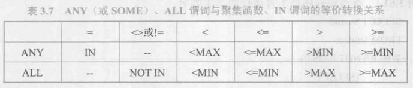

#### <font style="color:rgb(0,0,255);">带有 EXISTS 谓词的子查询</font>
EXISTS 代表存在量词。带有 EXISTS 谓词的子查询不返回任何数据，只产生逻辑真值 “true” 或逻辑假值 “false”。

<font style="color:rgb(219,112,147);">语句格式</font>：【 <font style="color:rgb(128,0,128);">SELECT</font> [ <font style="color:rgb(255,69,0);">ALL</font> | <font style="color:rgb(255,69,0);">DISTINCT</font> ] < 目标列表达式 > [ , < 目标列表达式 > ] ... 

<font style="color:rgb(128,0,128);">                   FROM</font> < 表名或视图名 > [ <font style="color:rgb(128,0,128);">AS</font> ] < 别名 > 

<font style="color:rgb(128,0,128);">                   WHERE</font> [ <font style="color:rgb(128,0,128);">NOT</font> ] <font style="color:rgb(128,0,128);">EXIETS</font> ( [ <font style="color:rgb(128,0,128);">子查询</font> ] ) ; 】

<font style="color:rgb(70,130,180);">说明</font>：由 EXISTS 引出的子查询目标列表都用 <font style="color:rgb(255,69,0);">* </font>， 因为带 EXISTS 子查询只返回真值或假值，给出列名无实际意义。 

<font style="color:rgb(255,69,0);">( * 待复习 ) </font>**全称量词** <font style="color:rgb(233,105,0);">for all </font>通过 **(∀**_**x**_**)**_**P**_**≡¬(∃**_**x**_**)(¬**_**P**_**)**实现。 

<font style="color:rgb(255,69,0);">( * 待复习 ) </font>**蕴涵** <font style="color:rgb(233,105,0);">implication </font>通过**p→q≡¬p∨q**_**p**_**→**_**q**_**≡¬**_**p**_**∨**_**q**_实现。

```sql
/*查询所有选修了 1 号课程的学生姓名*/
SELECT Sname
    FROM Student
    WHERE EXISTS
        (SELECT *
            FROM SC
            WHERE Sno=Student.Sno AND Cno='1');
/*查询没有选修 1 号课程的学生姓名*/
SELECT Sname
    FROM Student
    WHERE NOT EXISTS
        (SELECT *
            FROM SC
            WHERE Sno=Student.Sno AND Cno='1');
/*查询选修了全部课程的学生姓名*/
SELECT Sname
    FROM Student
    WHERE NOT EXISTS
        (SELECT *
            FROM Course
            WHERE NOT EXISTS
                (SELECT *
                    FROM SC
                    WHERE Sno=Student.Sno
                    AND Cno=Course.Cno));
/*查询⾄少选修了学生 201215122 选修的全部课程的学生号码*/
SELECT DISTINCT Sno
    FROM SC SCX
    WHERE NOT EXISTS
    (SELECT *
        FROM SC SCY
        WHERE SCY.Sno=' 201215122 ' AND
           NOT EXISTS
           (SELECT *
                FROM SC SCZ
                WHERE SCZ.Sno=SCX.Sno AND
            SCZ.Cno=SCY.Cno));
```

### <font style="color:#DF2A3F;">集合查询</font>
SELECT 语句的查询结果是元组的集合，所以多个 SELECT 语句的结果可进行集合操作。

集合操作主要包括**并操作** **UNION**、**交操作 INTERSECT** 和**差操作 EXCEPT**。

**参加集合操作的各查询结果的列数必须相同，对应项的数据类型也必须相同。**

<font style="color:#2F4BDA;">并操作 UNION | 交操作 INTERSECT | 差操作 EXCEPT</font>

语句格式：

【[ <font style="color:#601BDE;">SELECT</font> 子句( 结尾无分号 ) ]
  [ <font style="color:#601BDE;">UNION</font> [ <font style="color:#601BDE;">ALL</font> ] | <font style="color:#601BDE;">INTERSECT</font> | <font style="color:#601BDE;">EXCEPT</font> ]
  [ <font style="color:#601BDE;">SELECT </font>子句 ] ;】


<font style="color:#ED740C;">UNION</font>：将多个查询结果合并起来，自动去掉重复元组。

<font style="color:#ED740C;">UNION ALL</font>：将多个查询结果合并起来时，保留重复元组。

```sql
/*查询选修了课程1或者选修了课程2的学生*/
SELECT Sno
    FROM SC
    WHERE Cno='1'
UNION
SELECT Sno
    FROM SC
    WHERE Cno='2';
    
/*查询计算机科学系的学生与年龄不大于19岁的学生的交集*/
SELECT *
    FROM Student
    WHERE Sdept='CS'
INTERSECT
SELECT *
    FROM Student
    WHERE Sage<=19;
    
/*查询计算机科学系的学生与年龄不大于19岁的学生的差集*/
SELECT *
    FROM Student
    WHERE Sdept='CS'
EXCEPT
SELECT *
    FROM Student
    WHERE Sage<=19;
```

### <font style="color:#DF2A3F;">基于派生表的查询</font>
子查询不仅可以出现在 WHERE 子句中，还可以出现在 FROM 子句中， 这时子查询生成的临时 **派生表** `derived table` 成为主查询的查询对象。

<font style="color:#F1A2AB;">语句格式</font>：【<font style="color:#601BDE;">SELECT</font> [ <font style="color:#ED740C;">ALL</font> | <font style="color:#ED740C;">DISTINCT </font>] < 目标列表达式 > [ , < 目标列表达式 > ] ...

FROM < 表名或视图名 > [ , < 表名或视图名 >  ] ...  , < SELECT 语句 >  [ AS ] < 别名 >

[ WHERE < 条件表达式 > ] 

[ GROUP BY < 列名1 > 

[ HAVING < 条件表达式 > ] ] 

[ ORDER BY < 列名2 > [ ASC | DESC ] ] ;】

说明：通过 FROM 子句生成派生表时，AS 关键字可以省略，但**必须为派生关系指定一个别名**。

```sql
/*查询所有选修了1号课程的学生姓名*/
SELECT Sname
    FROM Student,(SELECT Sno FROM SC WHERE Cno='1') AS SC1
    WHERE Student.Sno=SC1.Sno;
```

<font style="color:#DF2A3F;">SELECT 语句的一般格式</font>

语句格式：【<font style="color:#601BDE;">SELECT</font> [ <font style="color:#ED740C;">ALL</font> | <font style="color:#ED740C;">DISTINCT</font> ] < 目标列表达式 > [ , < 目标列表达式 > ] ...

<font style="color:#601BDE;">FROM</font> < 表名或视图名 > [ , < 表名或视图名 >  ] ... | ( < <font style="color:#601BDE;">SELECT</font> 语句 > ) [ AS ] < 别名 >

[ <font style="color:#601BDE;">WHERE</font> < 条件表达式 > ] 

[ <font style="color:#601BDE;">GROUP BY</font> < 列名1 > 

[ <font style="color:#601BDE;">HAVING</font> < 条件表达式 > ] ] 

[ <font style="color:#601BDE;">ORDER BY</font> < 列名2 > [ <font style="color:#ED740C;">ASC</font> | <font style="color:#ED740C;">DESC</font> ] ] ;】

<font style="color:#ED740C;">( * 待复习 )</font>

## 3.5 数据更新
### <font style="color:#DF2A3F;">插入数据</font>
#### <font style="color:#2F4BDA;">插入元组</font>
语句格式：【<font style="color:#601BDE;">INSERT INTO</font> < 表名 > [ ( < 属性列1 > [, < 属性列2 > ] … ) ] 

<font style="color:#601BDE;">VALUES</font> ( < 常量1 > [, < 常量2 > ] … ) ;】

说明：功能是将新元组插入指定表中。INTO 子句中没有出现的属性列，新元组在这些列上将取空值。

若在 INTO 子句中只指出表名，没有指出属性名：

表示新元组要在表的所有属性列上都指定值，属性列的次序与 CREATE TABLE 中的次序相同。

```sql
/*将一个新学生元组（学号：201215128，姓名：陈冬，性别：男，所在系：IS，年龄：18岁）插入到 Student表中*/
INSERT INTO Student(Sno,Sname,Ssex,Sdept,Sage)
        VALUES ('201215128', 陈冬,'男','IS',18);
```

#### <font style="color:#2F4BDA;">插入子查询结果</font>
语句格式：【<font style="color:#601BDE;">INSERT INTO</font> < 表名 > [ ( < 属性列1 > [, < 属性列2 > ] … ) ] 

[ 子查询 ] ;】

```sql
/*对每一个系，求学生的平均年龄，并把结果存入数据库*/
CREATE TABLE Dept_age (Sdept CHAR(15), Avg_age SMALLINT);  /*建立新表*/
INSERT INTO Dept_age(Sdept, Avg_age)  /*插入*/
       SELECT Sdept,AVG(Sage)
          FROM Student
          GROUP BY Sdept;
```

### <font style="color:#DF2A3F;">修改数据</font>
语句格式：【<font style="color:#601BDE;">UPDATE</font> < 表名 > 

​				<font style="color:#601BDE;">SET </font>< 列名 > = < 表达式 > [ , < 列名 > = < 表达式 > ] ...

​				[ <font style="color:#601BDE;">WHERE</font> < 条件 > ] ;】

说明：修改操作⼜称更新操作，其功能是修改指定表中满足 WHERE 子句条件的元组。

SET 子句给出 < 表达式 > 的值用于取代相应的属性列值。如果省略 WHERE 子句，则表示要修改表中的所有元组。

#### <font style="color:#2F4BDA;">修改某一个元组的值</font>

```sql
/*将学生 201215121 的年龄改 22 岁*/
UPDATE Student
    SET Sage=22
    WHERE Sno='201215121';
```

#### <font style="color:#2F4BDA;">修改多个元组的值</font>
```sql
/*将所有学生的年龄增加 1 岁*/
UPDATE Student
    SET Sage=Sage+1;
```

#### <font style="color:#2F4BDA;">带子查询的修改语句</font>
```sql
/*将计算机科学系全体学生的成绩置零*/
UPDATE SC
    SET Grade=0
    WHERE Sno IN
        (SELECT Sno
              FROM Student
              WHERE Sdept='CS');
```

### <font style="color:#DF2A3F;">删除数据</font>
语句格式：【<font style="color:#601BDE;">DELETE FROM</font> < 表名 > 

​				[ <font style="color:#601BDE;">WHERE </font>< 条件 > ] ;】

说明：功能是删除指定表中满足 WHERE 子句条件的元组。

如果省略 WHERE 子句则表示删除表中全部元组，但表的定义仍在字典中。

#### <font style="color:#2F4BDA;">删除某一个元组的值</font>
```sql
/*删除学号为 201215128 的学生记录*/
DELETE FROM Student
       WHERE Sno='201215128';
```

#### <font style="color:#2F4BDA;">修改多个元组的值</font>
```sql
/*删除所有的学生选课记录*/
DELETE FROM SC;
```

#### <font style="color:#2F4BDA;">带子查询的修改语句</font>
```sql
/*删除计算机科学系所有学生的选课记录*/
DELETE FROM SC
       WHERE Sno IN
          (SELECT Sno
                FROM Student
                WHERE Sdept='CS');
```

## 3.6 空值的处理
空值的存在是因为取值有不确定性，对关系运算带来特殊的问题，所以需要做特殊的处理。

SQL 语言中允许某些元组的某些属性取空值，一般有以下几种情况：

1. 该属性有值，但当前不知道它的具体值。
2. 该属性不应该有值。
3. 由于某种原因不便于填写。

#### <font style="color:#2F4BDA;">空值的产生</font>
在插入时定义为空值，取空值；

插入语句中没有赋值的属性，其值为空值；

外连接也会产生空值，空值的关系运算也会产生空值。

#### <font style="color:#2F4BDA;">空值的判断</font>
判断一个属性的值是否为空值，用 <font style="color:#601BDE;">IS NULL</font> 或 <font style="color:#601BDE;">IS NOT NULL</font> 来表示。

#### <font style="color:#2F4BDA;">空值的约束条件</font>
1. 属性定义（或者域定义）中有 <font style="color:#601BDE;">NOT NULL</font> 约束条件的不能取空值
2. 加了<font style="color:#ED740C;"> UNIQUE</font> 限制的属性不能取空值
3. 码属性不能取空值

#### <font style="color:#2F4BDA;">空值的算术运算、比较运算和逻辑运算</font>
算术运算：空值与另一个值（包括另一个空值）的算术运算的结果为空值；

比较运算：空值与另一个值（包括另一个空值）的比较运算结果为 UNKNOWN；

逻辑运算：扩展成三值逻辑，如下：

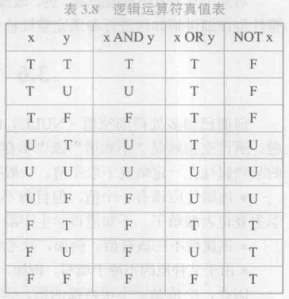

## 3.7 视图
**视图是从一个或几个基本表（或视图）导出的表。它与基本表不同，是一个虚表。** 数据库中只存放视图的定义，不存放视图对应的数据。

表中的数据发生变化，视图中查询出的数据也就随之改变。

### <font style="color:#DF2A3F;">定义视图</font>
#### <font style="color:#2F4BDA;">建立视图</font>
<font style="color:#F1A2AB;">语句格式</font>：【<font style="color:#601BDE;">CREATE VIEW</font> < 视图名 > [ ( < 列名 > [ , < 列名 > ] ... ) ] 

​				<font style="color:#601BDE;">AS</font> < 子查询 > 

​				[ <font style="color:#ED740C;">WITH CHECK OPTION</font> ] ;】

说明：组成视图的属性列名：全部省略或全部指定。

子查询不允许含有 ORDER BY 子句和 DISTINCT 短语（教材：是否可以含有取决于具体系统的实现）。

RDBMS 执行 CREATE VIEW 语句时只是把视图定义存入当据字并不执行其中的 SELECT 语句。

在对视图查询时，按视图的定义从基本表中将数据查出。

<font style="color:#ED740C;">WITH CHECK OPTION</font>：对视图进行 UPDATE、INSERT 和 DELETE 操作时要保证操作后的行满足子查询条件表达式。

如果不满足，则拒绝更新操作。

**行列子集视图**：若一个视图是从单个基本表导出的，并且只是去掉了基本表的某些行和某些列，但保留了主码。视图可以建立在一个或多个基本表和视图上。

**带虚拟列的视图** **/** **带表达式的视图**：定义视图时可以根据应用的需要设置一些派生属性列，这些派生属性由于在基 本表中并不实际存在，也称它们为 **虚拟列**。

**分组视图**：带有聚集函数和 GROUP BY 子句的查询来定义视图。

```sql
/*建立信息系学生的视图，并要求进行修改和插入操作时仍需保证该视图只有信息系的学生,此视图为：行列子集视图*/
CREATE VIEW IS_Student
       AS SELECT Sno,Sname,Sage
              FROM Student
              WHERE Sdept='IS'
              WITH CHECK OPTION;
/*定义一个反映学生出生年份的视图，此视图为：带虚拟列的视图 / 带表达式的视图*/
CREATE VIEW BT_S(Sno,Sname,Sbirth)
       AS SELECT Sno,Sname,2014-Sage FROM Student;
       
/*将学生的学号及平均成绩定义为一个视图，此视图为：分组视图*/
CREATE VIEW S_G(Sno,Gavg)
       AS SELECT Sno,AVG(Grade)
              FROM SC
              GROUP BY Sno;
```

#### <font style="color:#2F4BDA;">删除视图</font>
语句格式：【<font style="color:#601BDE;">DROP VIEW</font> < 视图名 > [ <font style="color:#ED740C;">CASCADE</font> ] ;】

删除基表时，由该基表导出的所有视图定义都必须显式地使用 DROP VIEW 语句删除。

```sql
/*删除视图 BT_S*/
DROP VIEW BT_S;

/*级联删除视图 IS_S1*/
DROP VIEW IS IS_S1 CASCADE;
```

#### <font style="color:#2F4BDA;">查询视图</font>
视图定义后，用户就可以像对基本表一样对视图进行查询了。

**视图消解** <font style="color:#ED740C;">view resolution</font>：关系数据库管理系统执行对视图的查询时，⾸先进行有效性检查，检查查询中涉 及的表、视图等是否存在。如果存在，则从数据字典中取出视图的定义，把定义中的子查询和用户的查询结合起 来，转换成等价的对基本表的查询，然后再执行修正了的查询。

有些情况下，视图消解法不能生成正确查询，目前多数关系数据库系统对行列子集视图的查询均能进行正确转换。

#### <font style="color:#2F4BDA;">更新视图</font>
说明：更新视图是指通过视图来插入、删除和数据，因为视图不适宜存储数据，因此对视图的更新操作将通过视图 消解，转为对实际表的更新操作。

为防止在更新视图时出错，定义视图时要加上 <font style="color:#ED740C;">WITH CHECK OPTION </font>子句。

**更新视图的限制**：

一些视图是不可更新的，因为对这些视图的更新不能唯一地有意义地转换成对相应基本表的更新。

一般地，行列子集视图是可更新的。除行列子集视图外，有些视图理论上是可更新的，还有些视图是不可更新的。

#### <font style="color:#2F4BDA;">视图的作用</font>
1. 视图能够简化用户的操作。
2. 视图使用户能以多种⻆度看待同一数据。
3. 视图对重构数据库提供了一定程度的逻辑独立性。
4. 视图能够对机密数据提供安全保护。
5. 适当的利用视图可以更清晰的表达查询。

# Note 04 数据库安全性
## 4.1 数据库安全性概述
数据库的一大特点是数据可以共享，但共享必然带来数据库的安全性问题，因此不能是无条件的共享。

**数据库的安全性**：指保护数据库以防止不合法使用所造成的数据泄露、更改或破坏。

系统安全保护措施是否有效是数据库系统的主要技术指标之一。

### <font style="color:#DF2A3F;">数据库的不安全因素</font>
#### <font style="color:#2F4BDA;">非授权用户对数据库的恶意存取和破坏</font>
一些黑客和犯罪分子在用户存取数据库时猎取用户名和用户口令，然后假冒合法用户偷取、修改或破坏用户数据。

因此，必须阻止有损数据库安全的非法操作，以保证数据免受未经授权的访问和破坏。

数据库管理系统提供的安全措施主要包括 **用户身份鉴别、存取控制和视图** 等技术。

#### <font style="color:#2F4BDA;">数据库中重要或敏感的数据被泄露</font>
黑客和敌对分子千方百计盗窃数据库中的重要数据，一些机密信息可能被暴露。

数据库管理系统提供的主要技术有 **强制存取控制、数据加密存储和加密传输** 等。

安全要求较高的系统提供 **审计日志** 分析。对潜在的威胁提前采取措施加以防范。

#### <font style="color:#2F4BDA;">安全环境的脆弱性</font>
数据库的安全性与计算机系统的安全性紧密联系，主要包括计算机硬件、操作系统、⽹络系统等的安全性。

在计算机安全方面需要建立一套 **可信** `Trusted` 计算机系统的概念和标准。

### <font style="color:#DF2A3F;">安全标准简介</font>
#### <font style="color:#2F4BDA;">安全标准的发展历史</font>
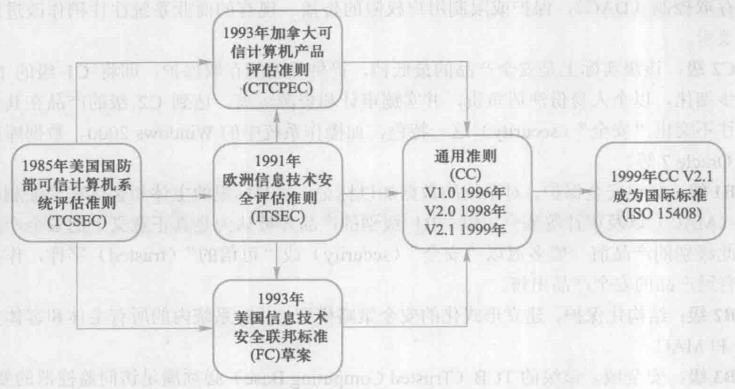

<font style="color:#2F4BDA;">TCSEC / TDI </font>将系统划分为 4 组`division`，共 7 个等级。（用于设计前？）

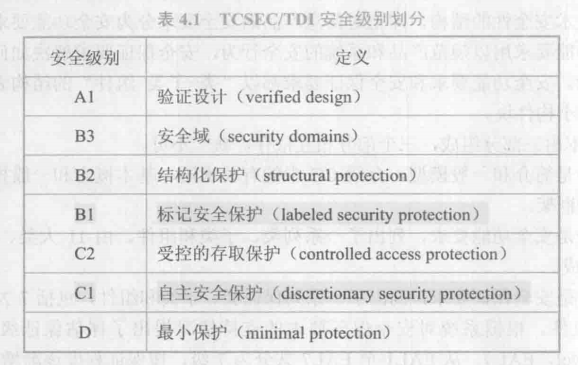

D 级：最低级别。实现操作系统基本功能，无安全性保障。[ DOS ] 

C1 级：能够实现对用户和数据的分离，进行自主存取控制 <font style="color:#ED740C;">DAC</font>，给不同用户分配不同权限。

C2 级：安全产品的最低档，细化 <font style="color:#ED740C;">DAC</font>，以个⼈身份注册负责，并实施审计和资源隔离。[ Windows2000, Oracle7 ] 

B1 级：标记安全保护。对标记主客体实施强制存取控制 <font style="color:#ED740C;">MAC</font>，给不同文件加密级标签。 [ SQL Server ] 

B2 级：结构化保护。建立形式化的安全策略模型。对所有主客体实施 `DAC` 和 `MAC`。

B3 级：安全域。访问监控器负责所有访问请求的授权决定，审计更强，提供系统恢复过程（数据库备份）。

A 级： 验证设计，给出系统的形式化设计说明和验证（确保每个部分的功能和行为都是明确的和可验证的）。

<font style="color:#2F4BDA;">CC </font>（用于设计后验证？）

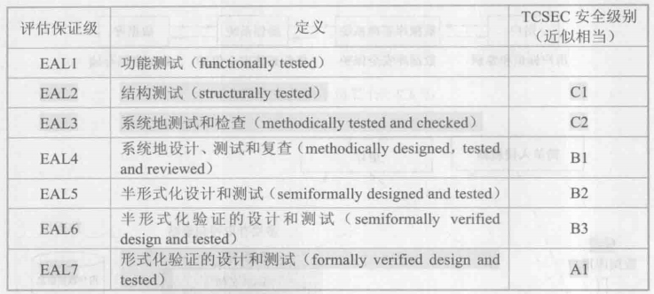

## 4.2 数据库安全性控制
### <font style="color:#DF2A3F;">概述</font>
#### <font style="color:#2F4BDA;">非法使用数据库的情况</font>
1. 编写合法程序绕过数据库管理系统及其授权机制。
2. 直接或编写应用程序执行非授权操作。
3. 通过多次合法查询数据库，从中推导出一些保密数据。

<font style="color:#2F4BDA;">计算机系统的安全模型</font>：计算机系统中安全措施是一级一级层层设置的。

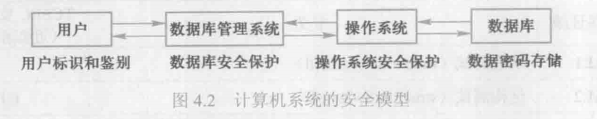

#### <font style="color:#2F4BDA;">数据库管理系统安全性控制模型</font>
1. 数据库管理系统对提出 SQL 访问请求的数据库用户进行身份鉴别，防止不可信用户使用系统；
2. 在 SQL 处理层进行自主存取控制和强制存取控制，进一步还可以进行推理控制。
3. 为监控恶意访问，可根据具体安全需求配置审计规则，对用户访问行为和系统关键操作进行审计。
4. 通过设置简单入侵检测规则，对异常用户行为进行检测和处理。
5. 在数据存储层，数据库管理系统不仅存放用户数据，还存储安全数据，提供存储加密功能等。

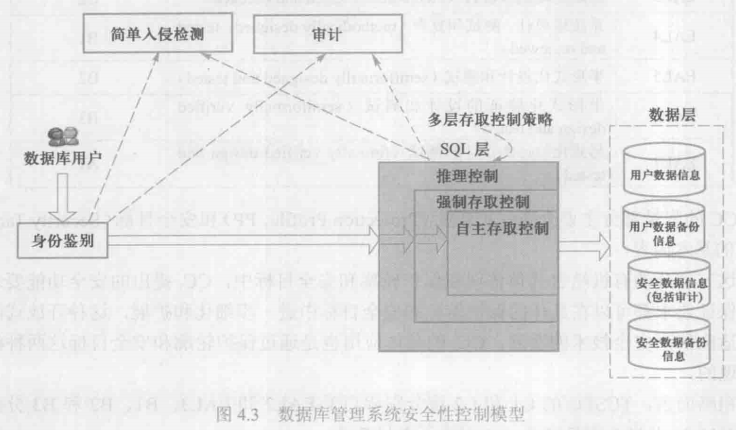

### <font style="color:#DF2A3F;">用户身份鉴别</font>
用户身份鉴别是数据库管理系统提供的最外层安全保护措施。每个用户在系统中都有个用户标识。

每个用户标识由 **用户名**`user name` 和唯一 **用户标识号**`UID` 两部分组成。

每次用户要求进入系统时，由系统进行核对，通过鉴定后才提供使用数据库管理系统的权限。

#### <font style="color:#2F4BDA;">用户身份鉴别的方法</font>
**静态口令鉴别**：静态口令一般由用户自己设定，这些口令是静态不变的。

**动态口令鉴别**，口令是动态变化的，每次鉴别时均需使用动态产生的新口令登录数据库管理系统，一次一密。

**生物特征鉴别**：通过生物特征进行认证的技术，生物特征如指纹、虹膜和掌纹等。

**智能卡鉴别**：智能卡是一种不可复制的硬件， 内置集成电路的芯⽚，具有硬件加密功能。

### <font style="color:#DF2A3F;">存取控制</font>
#### <font style="color:#2F4BDA;">存取控制机制组成</font>
**存取控制机制主要包括定义用户权限和合法权限检查两部分。**

1. 定义用户权限，并将用户权限登记到数据字典中

DBMS 提供适当的语言来定义用户权限，存放在数据字典中，称做安全规则或授权规则。

2. 合法权限检查

用户发出存取数据库操作请求。DBMS 查找数据字典，进行合法权限检查。

#### <font style="color:#2F4BDA;"> 常用存取控制方法  </font>
1. **自主存取控制** <font style="color:#ED740C;">DAC, Discretionary Access Control</font>

用户对于不同的数据库对象有不同的存取权限，不同的用户对同一对象也有不同的权限， 用户可将其拥有的存取权限转授给其他用户。

自主存取控制非常灵活。

2. **强制存取控制** <font style="color:#ED740C;">MAC, Mandatory Access Control</font>

每一个数据库对象被标以一定的密级，每一个用户也被授予某一个级别的许可证。

对于任意一个对象，只有具有合法许可证的用户才可以存取。

强制存取控制因此相对比较严格。

#### <font style="color:#2F4BDA;">自主存取控制方法</font>
**用户权限是由两个要素组成的：数据库对象和操作类型。**定义存取权限称为 **授权** `authorization`。

RDBMS 存取控制的对象不仅有数据本身还有数据库模式，关系数据库系统中存取控制对象如下：

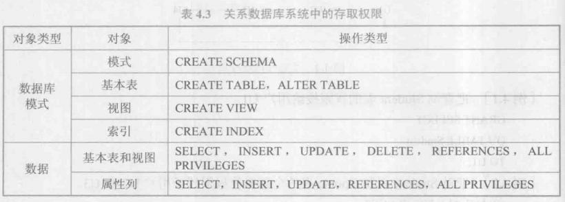

在给用户授予列 INSERT 权限时，需要包含主码的 INSERT 权限，否则用户的插入动作会因为主码为空而被拒绝。

**<font style="color:#2F4BDA;">授权：授予与收回</font>** 

SQL 中使用 GRANT 和 REVOKE 语句向用户授予或收回对数据的操作权限。

GRANT 语句向用户授予权限，REVOKE 语句收回己经授予用户的权限。


<font style="color:#ED740C;">GRANT</font>：**权限授予**

<font style="color:#F1A2AB;">语句格式</font>：【GRANT < 权限 > [ , < 权限 > ] ... 

​				ON < 对象类型 > < 对象名 > [ , < 对象类型 > < 对象名 >] ... 

​				TO < 用户 > [ , < 用户 > ] ... 

​				[ <font style="color:#ED740C;">WITH GRANT OPTION</font> ] ;】

说明：接受权限的用户可以是一个或多个具体用户，也可以是 <font style="color:#ED740C;">PUBLIC</font>，即全体用户。

<font style="color:#ED740C;">WITH GRANT OPTION</font>：获得某种权限的用户还可以把这种权限再授予其他的用户。

SQL 标准不允许循环授权，即被授权者不能把权限再授回给授权者或其祖先。

```sql
/*把查询 Student 表的权限授给所有用户*/
GRANT SELECT ON TABLE Student TO PUBLIC;

/*把对 Student 表和 Course 表的全部操作权限授予用户 U2 和 U3 */
GRANT ALL PRIVILEGES ON TABLE Student, Course TO U2,U3;

/*把查询 Student 表和修改学生学号的权限受给用户 U4，并允许将此权限再授予其他用户。*/
GRANT UPDATE(Sno),SELECT
      ON TABLE Student TO U4
      WITH GRANT OPTION;
```

<font style="color:#ED740C;">REVOKE</font>：**权限回收**

语句格式：【<font style="color:#601BDE;">ROVOKE</font> < 权限 > [ , < 权限 > ] ... 

​				<font style="color:#601BDE;">ON</font> < 对象类型 > < 对象名 > [ , < 对象类型 > < 对象名 >] ...

​				<font style="color:#601BDE;">FROM</font> < 用户 > [ ,  < 用户 > ] ...

​				[ <font style="color:#ED740C;">CASCADE</font> | <font style="color:#ED740C;">RESTRICT</font> ] ;】

说明：数据库管理员或其他授权者可以使用 REVOKE 语句将授予的权限收回。

```sql
/*把用户 U4 修改学生学号的权限收回*/
REVOKE UPDATE(Sno) ON TABLE Student FROM U4 CASCADE;
```

创建数据库模式的权限 对创建数据库模式一类的数据库对象的授权由数据库管理员在创建用户时实现。

语句格式：【<font style="color:#601BDE;">CREATE USER</font> < 用户名 > [ <font style="color:#601BDE;">WITH</font> ] [ <font style="color:#ED740C;">DBA</font> | <font style="color:#ED740C;">RESOURCE</font> | <font style="color:#ED740C;">CONNECT</font> ] ;】

<font style="color:#81DFE4;">说明</font>：新创建的数据库用户有三<font style="color:#ED740C;"></font>种权限：CONNECT、RESOURCE 和 DBA，默认 CONNECT。权限如下：

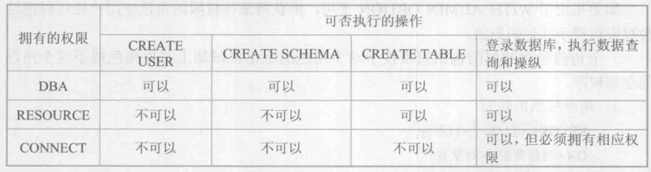

#### <font style="color:#2F4BDA;">数据库角色</font>
数据库角色是被命名的一组与数据库操作相关的权限，角色是权限的集合。

可以为一组具有相同权限的用户创建一个角色，简化授权。

<font style="color:#ED740C;">角色的创建</font> 

<font style="color:#F1A2AB;">语句格式</font>：【<font style="color:#601BDE;">CREATE ROLE</font> < 角色名 > ;】

```sql
/*创建一个角色 R1*/
CREATE ROLE R1:
```

<font style="color:#ED740C;">给角色授权 </font><font style="color:#601BDE;"></font>

语句格式：【<font style="color:#601BDE;">GRANT</font> < 权限 > [ , < 权限 > ] ... 

​				<font style="color:#601BDE;">ON </font>< 对象类型 > < 对象名 > [ , < 对象类型 > < 对象名 >] ... 

​				<font style="color:#601BDE;">TO</font> < 角色 > [ , < 角色 > ] ... ;】

```sql
/*授予角色 RI Student 表的 SELECT、UPDATE、 INSERT 权限*/
GRANT SELECT,UPDATE,INSERT
      ON TABLE Student 
      TO R1; 
```

<font style="color:#ED740C;">将一个角色授予其他的角色或用户 </font>

<font style="color:#F1A2AB;">语句格式</font>：【<font style="color:#601BDE;">GRANT</font> < 角色1 > [ , < 角色2 > ] ... 

​				<font style="color:#601BDE;">TO</font> < 角色3 > [ , < 用户1 > ] ... 

​				[ <font style="color:#ED740C;">WITH ADMIN OPTION</font> ] ;】

<font style="color:#81DFE4;">说明</font>：<font style="color:#ED740C;">WITH ADMIN OPTION</font>：获得某种权限的角色或用户还可以把这种权限再授予其他的角色或用户。

```sql
/*将角色 R1 授予WANG、ZHANG、ZHAO，使他们具有角色 R1 所包含的全部权限，且可授权子角色及用户*/
GRANT R1 TO WANG、ZHANG、ZHAO WITH ADMIN OPTION；
```

<font style="color:#ED740C;">角色权限的收回 </font>

<font style="color:#F1A2AB;">语句格式</font>：【<font style="color:#601BDE;">ROVOKE</font> < 权限 > [ , < 权限 > ] ... 

​				<font style="color:#601BDE;">ON</font> < 对象类型 > < 对象名 > [ , < 对象类型 > < 对象名 >] ...

​				<font style="color:#601BDE;">FROM</font> < 角色 > [ ,  < 角色 > ] ...  ; 】

```sql
/*收回 R1 在 Student 表的 SELECT 权限*/
REVOKE SELECT ON TABLE Student FROM R1;
```

<font style="color:#ED740C;">角色回收</font> 【( * 待补充 ) 原书及课程并无说明，仅有一例回收角色，暂不清楚是否区分 CASCADE 和 RESTRICT。】

<font style="color:#F1A2AB;">语句格式</font>：【<font style="color:#601BDE;">REVOKE</font> < 角色1 > [ , < 角色2 > ] ...

​				<font style="color:#601BDE;">FROM</font> < 角色3 > [ ,  < 用户1 > ] ...

​				[ <font style="color:#ED740C;">CASCADE</font> | <font style="color:#ED740C;">RESTRICT </font>] ;】

```sql
REVOKE R1 FROM WANG;
```

#### 强制存取控制方法
自主存取控制可能存在数据 “无意泄露” 的风险 

**原因**：DAC 仅仅通过对数据的存取权限来进行安全控制而数据本身并无安全性标记。

**解决**：对系统控制下的所有主客体实施强制存取控制策略 MAC。

<font style="color:#ED740C;">强制存取控制 </font><font style="color:#ED740C;">MAC</font> 

**作用**：保证更高程度的安全性、用户不能直接感知或进行控制。

适用于对数据有严格而固定密级分类的部门，如军事部门，政府部门。

<font style="color:#81BBF8;">在强制存取控制中实体分类</font> 

**主体**：系统中的活动实体，既包括数据库管理系统所管理的实际用户，也包括代表用户的各进程。

**客体**：系统中的被动实体，是受主体操纵的，包括文件、基本表、索引、视图等。

<font style="color:#81BBF8;">敏感度标记</font><font style="color:#ED740C;">label</font> 

对于主体和客体，DBMS 为它们每个实例（值）指派一个敏感度标记。敏感度标记被分成若干级别。

如 **绝密** <font style="color:#ED740C;">TS, Top Secret</font>、**机密** <font style="color:#ED740C;">S, Secret</font>、**可信** <font style="color:#ED740C;">C, Confidential</font>、**公开** <font style="color:#ED740C;">P, Public</font> 等。

密级的次序是 TS >= S >= C >= P。

主体的敏感度标记称为**许可证级别**<font style="color:#ED740C;">clearance level</font>，客体的敏感度标记称为**密级** <font style="color:#ED740C;">classification</font><font style="color:#ED740C;"> </font><font style="color:#ED740C;">level</font>。

强制存取控制机制就是通过对比主体的敏感度标记和客体的敏感度标记，最终确定主体是否能够存取客体。

<font style="color:#81BBF8;">强制存取控制规则 </font>

仅当主体的许可证级别大于或等于客体的密级时，该主体才能读取相应的客体。

仅当主体的许可证级别⼩于或等于客体的密级时，该主体才能写相应的客体。

注：如果高级主体写了低级客体，则低级主体可访问高级主体写的数据，造成数据泄露。

如果低级主体写高级客体，看似荒谬但低级主体无法访问自己写的客体数据，不会造成客体密级降低。


MAC 是对数据本身进行密级标记，标记与数据不可分，只有符合密级标记要求的用户才可以操纵数据。

实现 MAC 要⾸先实现 DAC，因为较高安全性级别提供的安全保护要包含较低级别的所有保护。

MAC 与 DAC 共同构成数据库管理系统的安全机制。

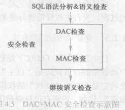

## 4.3 视图机制
视图对数据库安全的作用：

1. 把要保密的数据对无权存取这些数据的用户隐藏起来，对数据提供一定程度的安全保护。
2. 间接地实现支持存取谓词的用户权限定义。

```sql
/*建立计算机系学生的视图，把对该视图的 SELECT 权限授予王平，把该视图上的所有操作权限授予张明。*/
CREATE VIEW CS_Student
       AS SELECT *
              FROM Student
              WHERE Sdept=‘CS‘；            /*先建立视图 CS_ _Student*/
              
GRANT SELECT ON CS_Student TO 王平；         /*王平⽼师只能检索计算机系学生的信息*/

GRANT ALL PRIVILEGES ON CS_Student TO 张明； /*系主任具有检索和增删改计算机系学生信息的所有权限*/
```

## 4.4 审计
#### <font style="color:#2F4BDA;">审计</font>
**审计日志** `Audit Log`：启用一个专用的审计日志户对数据库的所有操作记录在上面。

**审计员**：利用审计日志监控数据库中的各种行为，找出非法存取数据的⼈、时间和内容。

C2 以上安全级别的 DBMS 必须具有审计功能。

#### <font style="color:#2F4BDA;">审计功能的可选性</font>
审计很费时间和空间。

DBA 可以根据应用对安全性的要求，灵活地打开或关闭审计功能。主要用于安全性要求较高的部门。

#### <font style="color:#2F4BDA;">审计事件</font>
1. <font style="color:#ED740C;">服务器事件</font>：审计数据库服务器发生的事件，包含数据库服务器的启动、停止、数据库服务器配置文件的重新加载。
2. <font style="color:#ED740C;">系统权限</font>：对系统拥有的结构或模式对象进行操作的审计，要求该操作的权限是通过系统权限获得的。
3. <font style="color:#ED740C;">语句事件</font>：对 SQL 语句，如DDL、DML、DQL <font style="color:#ED740C;">Data Query Language</font> 数据查询语言 及 DCL 语句的审计。
4. <font style="color:#ED740C;">模式对象事件</font>：对特定模式对象上进行的SELECT 或 DML 操作的审计。模式对象

#### <font style="color:#2F4BDA;">审计功能</font>
1. <font style="color:#ED740C;">基本功能</font>：提供多种审计查阅方式：基本的、可选的、有限的 等。
2. <font style="color:#ED740C;">提供多套审计规则</font>：审计规则一般在数据库初始化时设定，以方便审计员管理。
3. <font style="color:#ED740C;">提供审计分析和报表功能</font>
4. <font style="color:#ED740C;">审计日志管理功能</font>
    1. 为防止审计员误删审计记录，审计日志必须先转储后删除；
    2. 对转储的审计记录文件提供完整性和保密性保护；
    3. 只允许审计员查阅和转储审计记录，不允许任何用户新增和修改审计记录等。
5. <font style="color:#ED740C;">系统提供查询审计设置及审计记录信息的专门视图</font>

####  <font style="color:#2F4BDA;">审计分类  </font>
<font style="color:#ED740C;">用户级审计 </font>

任何用户可设置的审计， 主要是用户针对自己创建的数据库表或视图进行审计。

<font style="color:#ED740C;">系统级审计 </font>

只能由数据库管理员设置，用以监测成功或失败的登录要求、监测授权和收回操作及其他数据库级权限下的操作。

#### <font style="color:#2F4BDA;">AUDIT 语句和 NOAUDIT 语句</font>
AUDIT 语句用来设置审计功能 

<font style="color:#F1A2AB;">语句格式</font>：【<font style="color:#601BDE;">AUDIT</font> < 权限1 > [ , < 权限2 >]... 

<font style="color:#601BDE;">ON</font> < 对象类型 > < 对象名 > [ , < 对象类型 > < 对象名 >] ... 

[ <font style="color:#601BDE;">BY</font> [ <font style="color:#ED740C;">SESSION</font> | <font style="color:#ED740C;">ACCESS</font> ] ] 

[<font style="color:#601BDE;"> WHENEVER</font> [ <font style="color:#ED740C;">SUCCESSFUL</font> | <font style="color:#ED740C;">NOT SUCCESSFUL</font> | <font style="color:#ED740C;">ANY</font> ] ] ;】

BY 子句：指定审计粒度， <font style="color:#ED740C;">SESSION</font> 表示每个会话记录一次，<font style="color:#ED740C;">ACCESS</font> 表示每次访问都记录。默认 <font style="color:#ED740C;">SESSION</font>。

WHENEVER 子句：精准地监控和分析数据库活动，<font style="color:#ED740C;">SUCCESSFUL</font> 仅审计成功执行的操作，<font style="color:#ED740C;">NOT SUCCESSFUL</font> 仅审计 执行失败的操作， <font style="color:#ED740C;">ANY</font> 同时审计成功和失败的操作。默认 <font style="color:#ED740C;">ANY</font>。

```sql
/*对修改 SC 表结构或修改 SC 表数据的操作进行审计*/
AUDIT ALTER, UPDATE ON SC:
```

NOAUDIT 语句则取消审计功能。

<font style="color:#F1A2AB;">语句格式</font>：【<font style="color:#601BDE;">NOAUDIT </font>< 权限1 > [ , < 权限2 >]... 

<font style="color:#ED740C;">ON </font>< 对象类型 > < 对象名 > [ , < 对象类型 > < 对象名 >] ... ;】

```sql
/*取消对 SC 表的一切审计*/
NOAUDIT ALTER, UPDATE ON SC;
```

## 4.5 数据加密
数据加密是防止数据库中数据在存储和传输中失密的有效手段。

基本思想：根据一定的算法将原始数据 / **明文**<font style="color:#ED740C;">plain text</font>变换为不可直接识别的格式 / **密文**<font style="color:#ED740C;">Cipher text</font>。

数据加密包括存储加密和传输加密。

#### <font style="color:#2F4BDA;">存储加密</font>
一般提供透明和非透明两种存储加密方式。

透明存储加密是内核级加密保护方式，对用户完全透明；非透明存储加密则是通过多个加密函数实现的。

#### <font style="color:#2F4BDA;">传输加密</font>
常用的传输加密方式如链路加密和端到端加密。

**<font style="color:#ED740C;">链路加密 </font>**

对传输数据在链路层进行加密，它的传输信息由报头和报文两部分组成，前者是路由选择信息，而后者是传送的数 据信息。这种方式对报文和报头均加密。

**<font style="color:#ED740C;">端到端加密</font>**<font style="color:#ED740C;"> </font>

对传输数据在发送端加密，接收端解密。它只加密报文，不加密报头。

所需密码设备数量相对较少，容易被非法监听者发现并从中获取敏感信息。


基于基于安全套接层协议<font style="color:#ED740C;">SSL, Security Socket Layer</font> 的数据库管理系统可信传输方案：

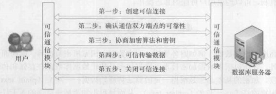

## 4.6 其他安全性保护
**<font style="color:#2F4BDA;">推理控制</font>** `inference control` 

处理强制存取控制未解决的问题，避免用户利用能够访问的数据推知更高密级的数据。

常用方法：基于函数依赖的推理控制、基于敏感关联的推理控制。

**<font style="color:#2F4BDA;">隐蔽信道</font>** `covert channal` 

处理强制存取控制未解决的问题。

**<font style="color:#2F4BDA;">数据隐私保护</font>**

描述个⼈控制其不愿他⼈知道或他⼈不便知道的个⼈数据的能⼒。

主要用于数据收集存储处理和数据发布等各个阶段。

# <font style="color:#2F4BDA;">Note 05 数据库完整性</font>
## 5.0 数据库完整性简介
#### <font style="color:#2F4BDA;">数据库的完整性</font>
数据库的 **完整性** <font style="color:#ED740C;">integrity</font> 是指数据的 **正确性** <font style="color:#ED740C;">correctness</font> 和**相容性** <font style="color:#ED740C;">compat- ability</font>。

**正确性**：指数据是符合现实世界语义、反映当前实际状况的；

**相容性**：指数据库同一对象在不同关系表中的数据是符合逻辑的。

#### <font style="color:#2F4BDA;">完整性与安全性的区别</font>
**数据的完整性**：防止数据库中存在不符合语义的数据，也就是防止数据库中存在不正确的数据。

**防范对象**：不合语义的、不正确的数据。

**数据的安全性**：保护数据库防止恶意的破坏和非法的存取。

**防范对象**：非法用户和非法操作。

#### <font style="color:#2F4BDA;">数据库在完整性方面应具备的功能</font>
<font style="color:#ED740C;">提供定义完整性约束条件的机制 </font>

完整性约束条件也称为完整性规则，是数据库中的数据必须满足的语义约束条件。

SQL 标准使用了一系列概念来描述完整性，包括关系模型的实体完整性、参照完整性和用户定义完整性。

<font style="color:#ED740C;">提供完整性检查的方法 </font>

数据库管理系统中检查数据是否满足完整性约束条件的机制称为完整性检查。

一般在 INSERT、UPDATE、DELETE 语句执行后开始检查，也可以在事务提交时检查。

<font style="color:#ED740C;">进行违约处理 </font>

数据库管理系统若发现用户的操作违背了完整性约束条件， 就采取 **拒绝** <font style="color:#ED740C;">NO ACTION</font> 执行该操作或 **级连** <font style="color:#ED740C;">CASCADE</font> 执行其他操作或 **设空值** 等方式保证完整性。

## 5.1 实体完整性
### <font style="color:#DF2A3F;">实体完整性定义</font>
关系模型的实体完整性在 CREATE TABLE 中用 PRIMARY KEY 定义。

对单属性构成的码有两种说明方法，一种是定义为列级约束条件，另一种是定义为表级约束条件。

对多个属性构成的码只有一种说明方法，即定义为表级约束条件。

```sql
/*单属性构成的码：将 Student 表中的 Sno 属性定义为码*/
CREATE TABLE Student
      (Sno CHAR(9) PRIMARY KEY,            /*在列级定义主码*/
       Sname CHAR(20) NOT NULL,
       Ssex CHAR(2),
       Sage SMALLINT,
       Sdept CHAR(20)
      );
CREATE TABLE Student
       (Sno CHAR(9),
       Sname CHAR(20) NOT NULL,
       Ssex CHAR(2),
       Sage SMALLINT,
       Sdept CHAR(20),
       PRIMARY KEY(Sno)                    /*在表级定义主码*/
      );
/*多属性构成的码：将 SC 表中的 Sno、Cno 属性组定义为码*/
CREATE TABLE SC
      (Sno CHAR(9) NOT NULL,
       Cno CHAR(4) NOT NULL,
       Grade SMALLINT,
       PRIMARY KEY (Sno,Cno)               /*只能在表级定义主码*/
      );
```

### <font style="color:#DF2A3F;">实体完整性检查和违约处理</font>
#### <font style="color:#2F4BDA;">完整性检查的内容</font>
关系数据库管理系统按照实体完整性规则自动进行检查。检查内容主要包括：

1. 检查主码值是否唯一，如果不唯一则拒绝插入或修改。
2. 检查主码的各个属性是否为空，只要有一个为空就拒绝插入或修改。

#### <font style="color:#2F4BDA;">检查主码值方法</font>
检查记录中主码值是否唯一的一种方法是进行 **全表扫描**：

依次判断表中每一条记录的主码值与将插入记录的主码值（或者修改的新主码值）是否相同。

全表扫描十分耗时。

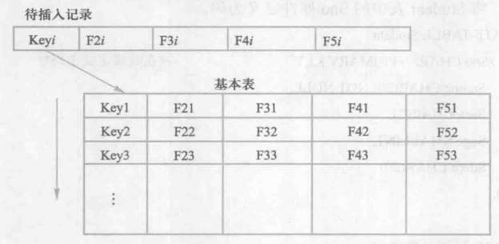

为避免对基本表进行全表扫描，RDBMS 核心一般都在主码上自动建立一个索引。如 B+ 树索引。

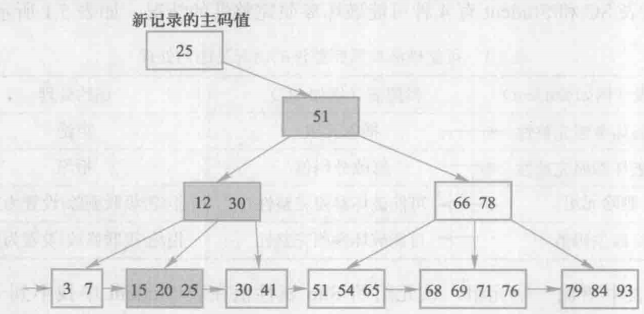

## 5.2 参照完整性
### <font style="color:#DF2A3F;">参照完整性定义</font>
关系模型的参照完整性在 CREATE TABLE 中用 FOREIGN KEY 短语定义哪些列为外码， 用 REFERENCES 短语指明这些外码参照哪些表的主码。

```sql
/*定义 SC 中的参照完整性*/
CREATE TABLE SC
      (Sno CHAR(9) NOT NULL，
       Cno CHAR(4) NOT NULL，
       Grade SMALLINT，
       PRIMARY KEY (Sno， Cno)，                       /*在表级定义实体完整性*/
       FOREIGN KEY (Sno) REFERENCES Student(Sno)，     /*在表级定义参照完整性*/
       FOREIGN KEY (Cno) REFERENCES Course(Cno)        /*在表级定义参照完整性*/
      )；
```

### <font style="color:#DF2A3F;">参照完整性检查和违约处理</font>
参照完整性将两个表中的相应元组联系起来了。

对被参照表和参照表进行增、删、改操作时有可能破坏参照完整性，此时必须进行检查以保证这两个表的相容性。

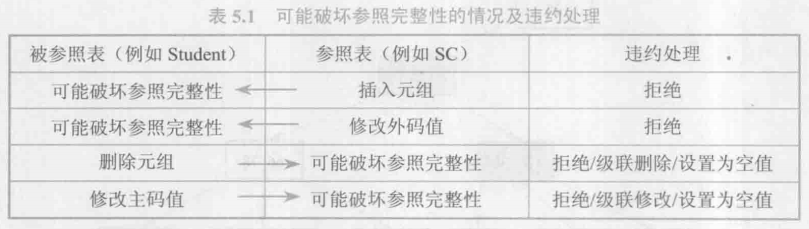

当发生以上 4 种可能破坏参照完整性的情况时，系统可以采用以下 3 种策略加以处理。

#### 拒绝 `NO ACTION`
不允许该操作执行。该策略一般设置默认策略。

#### 级连 `CASCADE`
当删除或修改被参照表的一个元组导致与参照表的不一致时，删除或修改参照表中的所有导致不一致的元组。

#### 设置为空值
当删除或修改被参照表的一个元组时造成了不一致，则将参照表中的所有造成不一致的元组对应属性设置为空值。

```sql
/*显式说明参照完整性的违约处理示例*/
CREATE TABLE SC
    (Sno CHAR(9)，
     Cno CHAR(4)，
     Grade SMALLINT，
     PRIMARY KEY (Sno，Cno)，             /*在表级定义实体完整性，Sno、Cno 都不能取空值*/ 
     FOREIGN KEY (Sno) REFERENCES Student(Sno)   /*在表级定义参照完整性*/
          ON DELETE CASCADE           /*当删除 Student 表中的元组时，级联删除SC表中相应的元组*/
          ON UPDATE CASCADE,          /*当更新 Student 表中的 sno 时，级联更新SC表中相应的元组*/
     FOREIGN KEY (Cno) REFERENCES Course(Cno)    /*在表级定义参照完整性*/ 
          ON DELETE NO ACTION        /*当删除 Course 表中的元组造成与SC表不一致时，拒绝删除*/
          ON UPDATE CASCADE          /*当更新 Course 表中的cno 时，级联更新SC 表中相应的元组*/
)；
```

## 5.3 用户定义的完整性
用户定义的完整性就是针对某一具体应用的数据必须满足的语义要求。

目前的关系数据库管理系统都提供了定义和检验这类完整性的机制，不必由应用程序承担这一功能。

### <font style="color:#DF2A3F;">属性上的约束条件</font>
#### <font style="color:#2F4BDA;">属性上约束条件的定义</font>
在 CREATE TABLE 中定义属性的同时，可以根据应用要求定义属性上的约束条件， 即属性值限制，包括：

1. **列值非空**： `NOT NULL`
2. **列值唯一**： `UNIQUE`
3. 检查列值是否满足一个**条件表达式**： `CHECK` 短语

```sql
/*建⽴部⻔表 DEPT，要求部⻔名称 Dname 列取值唯一，城市只允许在北京或上海，部⻔编号 Deptno 列为主码*/
CREATE TABLE DEPT
      (Deptno NUMERIC(2),
       Dname CHAR(9) UNIQUE NOT NULL,        /*要求 Dname 列值唯一,且不能取空值*/
       Location CHAR(10) CHECK(Location IN ('Beijing','Shanghai')), /*城市只允许在北京或上海*/
       PRIMARY KEY (Deptno) 
      ):
```

#### <font style="color:#2F4BDA;">属性上约束条件的检查和违约处理</font>
当往表中插入元组或修改属性的值时，RDBMS 将检查属性上的约束条件是否被满足，不满足则操作被拒绝执行。

### <font style="color:#DF2A3F;">元组上的约束条件</font>
#### <font style="color:#2F4BDA;">元组上约束条件的定义</font>
在 CREATE TABLE 时可以用 CHECK 短语定义元组上的约束条件，即元组级的限制。

元组级的限制可以设置不同属性之间的取值的相互约束条件。

```sql
/*当学生的性别是男时，其名字不能以 Ms.打头*/
CREATE TABLE Student
    (Sno CHAR(9),
     Sname CHAR(8) NOT NULL,
     Ssex CHAR(2),
     Sage SMALLINT,
     Sdept CHAR(20),
     PRIMARY KEY (Sno),
    CHECK (Ssex='½' OR Sname NOT LIKE 'Ms.%') /*定义了元组中 Sname和 Ssex两个属性值之间的约東条件
*/
    );
```

#### <font style="color:#2F4BDA;">元组上约束条件的检查和违约处理</font>
当往表中插入元组或修改属性的值时，RDBMS 将检查属性上的约束条件是否被满足，不满足则操作被拒绝执行。

## 5.4 完整性约束命名子句
#### <font style="color:#2F4BDA;">完整性约束命名子句</font>
<font style="color:#F1A2AB;">语句格式</font>：【<font style="color:#601BDE;">CONSTRAINT</font> < 完整性约束条件名 > < 完整性约束条件 >】

<font style="color:#81DFE4;">说明</font>：< 完整性约束条件 > 包括 NOT NULL、UNIQUE、PRIMARY KEY、FOREIGN KEY、 CHECK 短语 等。

```sql
/*建立学生登记表 Student，要求学号在90000～99999之间，姓名不能取空值，年龄⼩于30，性别只能是“男”或“⼥”*/
CREATE TABLE Student
      (Sno NUMERIC(6)
          CONSTRAINT CI CHECK (Sno BETWEEN 90000 AND 99999), /*C1 列级约束*/
       Sname CHAR(20)
          CONSTRAINT C2 NOT NULL,                            /*C2 列级约束*/
       Sage NUMERIC(3)
          CONSTRAINT C3 CHECK (Sage < 30),                   /*C3 列级约束*/
       Ssex CHAR(2)
          CONSTRAINT C4 CHECK (Ssex IN ('男'，'⼥')),         /*C4 列级约束*/
       CONSTRAINT StudentKey PRIMARY KEY(Sno)      /*名为StudentKey的主码约束：Sno设为主码*/
       );
```

#### <font style="color:#2F4BDA;">修改表中的完整性限制</font>
可以使用 ALTER TABLE 语句修改表中的完整性限制。

<font style="color:#F1A2AB;">语句格式</font>：

【<font style="color:#601BDE;">ALTER TABLE</font> < 表名 > <font style="color:#601BDE;">ADD CONSTRAINT</font> < 完整性约束名 > < 完整性约束条件 > ;】

【<font style="color:#601BDE;">ALTER TABLE</font> < 表名 > <font style="color:#601BDE;">DROP CONSTRAINT </font>< 完整性约束名 > [ CASCADE | RESTRICT ] ] ;】

<font style="color:#81DFE4;">说明</font>：约束条件的修改通过可以先删除原来的约束条件，再增加新的约束条件完成。

```sql
/*修改表 Student 中的约束条件，要求学号改为在900000~999999之间， 年龄由⼩于30改为⼩于40*/
ALTER TABLE Student 
      DROP CONSTRAINT C1;
ALTER TABLE Student 
      ADD CONSTRAINT C1 CHECK (Sno BETWEEN 900000 AND 999999):
ALTER TABLE Student
      DROP CONSTRAINT C3;
ALTER TABLE Student
      ADD CONSTRAINT C3 CHECK (Sage < 40);
```


## 5.5 域中的完整性限制
域是一组具有相同数据类型的值的集合，即属性的取值范围。

SQL 可以用 CREATE DOMAIN 语句建立一个域以及域应该满足的完整性约束条件，然后用域定义属性。

<font style="color:#F1A2AB;">语句格式</font>：

【<font style="color:#601BDE;">CREATE DOMAIN</font> < 域名 > < 数据类型 > < 完整性约束条件 > ;】

【<font style="color:#601BDE;">ALTER DOMAIN</font> < 域名 > <font style="color:#601BDE;">ADD CONSTRAINT</font> < 完整性约束名 > < 完整性约束条件 > ;】

【<font style="color:#601BDE;">ALTER DOMAIN</font> < 域名 > <font style="color:#601BDE;">DROP CONSTRAINT</font> < 完整性约束名 > [ CASCADE | RESTRICT ] ] ;】

```sql
/*把性别的取值范围由（男，⼥）改为（1，0）*/

/*建立一个性别域，并声明性别域的取值范围*/
CREATE DOMAIN GenderDomain CHAR(2) 
       CHECK (VALUE IN ('男','⼥'));
       /*对 Ssex 的说明可以改写为 ·Ssex GenderDomain· */
       
/*建立一个性别域 GenderDomain，并对其中的限制命名*/
CREATE DOMAIN GenderDomain CHAR(2) 
       CONSTRAINT GD CHECK (VALUE IN ('男','⼥'));
/*删除域 GenderDomain 的限制条件GD*/
ALTER DOMAIN GenderDomain 
      DROP CONSTRAINT GD;
/*在域 GenderDomain 上增加性别的限制条件 GDD*/
ALTER DOMAIN GenderDomain
      ADD CONSTRAINT GDD 
          CHECK (VALUE IN ('1','0'));
```

## 5.6 断言
在 SQL 中通过 **声明性断言** `declarative assertions` 来指定更具一般性的约束。

可以定义涉及多个表或聚集操作的比较复杂的完整性约束。断言创建以后， 任何对断言中所涉及关系的操作都会触发关系数据库管理系统对断言的检查， 任何使断言不为真值的操作都会被拒绝执行。

#### <font style="color:#2F4BDA;">创建断言的语句格式</font>
<font style="color:#F1A2AB;">语句格式</font>：【CREATE ASSERTION < 断言名 > < CHECK 子句 > ;】

```sql
/*限制数据库课程最多60名学⽣选修*/
CREATE ASSERTION ASSE_SC_DB_NUM
       CHECK(60 >= (SELECT count(*)
                            FROM Course,SC
                            WHERE SC.CNO=COURSE.CNO AND
                                  COURSE.CNAME = '数据库')    
            );
```

<font style="color:#2F4BDA;">删除断言的语句格式</font>

<font style="color:#F1A2AB;">语句格式</font>： 【 CREATE ASSERTION < 断言名 > < CHECK 子句 > ; 】  

## 5.7 触发器
**触发器** <font style="color:#ECAA04;">trigger</font>：用户定义在关系表上的一类由事件驱动的特殊过程。

1. 触发器保存在数据库服务器中。
2. 任何用户对表的增、删、改操作均由服务器自动激活相应的触发器。
3. 触发器可以实施更为复杂的检查和操作，具有更精细和更强大的数据控制能⼒。

### <font style="color:#DF2A3F;">定义触发器</font>
触发器⼜叫做 **事件**—**条件**—**动作** <font style="color:#ECAA04;">event-condition-action</font> 规则。

语句格式：

【<font style="color:#601BDE;">CREATE TRIGGER</font> < 触发器名 > 

​			{ BEFORE | AFTER } < 触发事件 > ON < 表名 > 

​			REFERENCING NEW | OLD ROW AS < 变量 >

​			FOR EACH { ROW | STATEMENT }

​			[ WHEN < 触发条件 > ] < 触发动作体 > ;】

<font style="color:#81DFE4;">说明</font>： 表的拥有者才可以在表上创建触发器。

| **语法部分** | **说明** |
| --- | --- |
| <font style="color:#ED740C;">触发器名</font> | 可以包含模式名，也可以不包含模式名。 |
|  | 同一模式下，触发器名必须是唯一的，并且触发器和表名必须在同一模式下。 |
| <font style="color:#ED740C;">表名</font> | 触发器只能定义在基本表上，不能定义在视图上。该表也称为触发器的目标表。 |
| <font style="color:#ED740C;">触发事件</font> | 触发事件可以是 `INSERT`、`DELETE`或 `UPDATE`，也可以是这几个事件的组合。 |
|  | 【`UPDATE OF`触发列，...】：进一步指明修改哪些列时激活触发器。 |
|  | 触发时机：<font style="color:#ED740C;">AFTER</font>触发事件操作执行之后激活；<font style="color:#ED740C;">BEFORE</font>触发事件操作执行之前激活。 |
| <font style="color:#ED740C;">触发器类型</font> | 可分为行级触发器 <font style="color:#ED740C;">FOR EACH ROW</font>和语句级触发器 <font style="color:#ED740C;">FOR EACH STATEMENT</font>。 |
|  | 行级触发器：每当影响到表中的一行数据时，触发器就会被触发一次。 |
|  | 语句级触发器：执行一个数据库操作语句时，触发器才会被触发一次。 |
| <font style="color:#ED740C;">触发条件</font> | `WHEN`<br/> 触发条件：只有当触发条件为真时触发动作体才执行，否则触发动作体不执行。 |
|  | 如果省略，则触发动作体在触发器激活后立即执行。 |
| <font style="color:#ED740C;">触发动作体</font> | 触发动作体既可以是一个匿名 PL/SQL 过程块，也可以是对已创建存储过程的调用。 |
|  | 行级触发器：可以在过程中使用 <font style="color:#ED740C;">NEW</font>和 <font style="color:#ED740C;">OLD</font>引用事件之后的新值和事件之前的旧值。 |
|  | 语句级触发器：不能在触发动作体中使用 <font style="color:#ED740C;">NEW</font>和 <font style="color:#ED740C;">OLD</font>进行引用，无法区分新旧。 |
|  | 如果触发动作体执行失败，激活触发器的事件就会终止执行。 |
|  | 触发器的目标表或触发器可能影响的其他对象不发生任何变化。 |


```sql
/*当对表 SC 的 Grade 属性进⾏修改时，若分数增加了 10% ，则将此次操作记录到另一个表
    SC_U(Sno,Cno,Oldgrade,Newgrade)中*/
CREATE TRIGGER SC_T                                 /*SC_T是触发器的名字*/
       AFTER UPDATE OF Grade ON SC                  /*当对SC的Grade属性更新完后触发下面的规则*/
       REFERENCING
            OLD ROW AS OldTuple，
            NEW ROW AS NewTuple
       FOR EACH ROW                                  /*⾏级触发器，即每执⾏一次更新，执⾏一次下述操作*/ 
       WHEN (NewTuple.Grade >= 1.1 * OldTuple.Grade) /*触发条件，只有该条件为真时才执⾏下面的操作*/
       INSERT INTO SC_U (Sno,Cno,OldGrade,NewGrade)  /*存储过程*/
            VALUES(OldTuple.Sno,OldTuple.Cno，OldTuple.Grade,NewTuple.Grade);
            
/*定义一个 BEFORE ⾏级触发器，为教师表 Teacher 定义完整性规则
      “教授的工资不得低于4000元，如果低于4000元，⾃动改为4000元”*/
CREATE TRIGGER Insert_Or_Update_Sal                 /*对教师表插⼊或更新时激活触发器*/ 
       BEFORE INSERT OR UPDATE ON Teacher           /*BEFORE 触发事件*/
       REFERENCING 
            NEW ROW AS newTuple
       FOR EACH ROW                                 /*⾏级触发器*/
BEGIN                                        
/*定义触发动作体，这是一个 PL/SQL 过程块*/
IF (newtuple.Job='教授') AND (newtuple.Sal < 4000) /*⾏级触发器，可在过程体中使用新值*/
THEN newtuple.Sal:=4000；      
/* ":=" 是赋值操作符，将右边的值或结果赋给左边变量。*/
END IF；
END；                                        
/*触发动作体结束*/
```

### <font style="color:#DF2A3F;">激活触发器</font>
触发器的执行是由触发事件激活，并由数据库服务器自动执行的。

一个数据表上可能定义了多个触发器，如多个 BEFORE 触发器、多个 AFTER 触发器等， 同一个表上的多个触发器激活时遵循如下的执行顺序：

1. 执行该表上的 BEFORE 触发器。
2. 激活触发器的 SQL 语句。
3. 执行该表上的 AFTER 触发器。

对于同一个表上的多个 BEFORE / AFTER 触发器，遵循 “谁先创建谁先执行” 的原则（有些遵循字⺟顺序）。

### <font style="color:#DF2A3F;">删除触发器</font>
<font style="color:#F1A2AB;">语句格式</font>：【<font style="color:#7E45E8;">DROP TRIGGER</font> < 触发器名 > <font style="color:#7E45E8;">ON</font> < 表名 > ;】

<font style="color:#81BBF8;">说明</font>： 触发器必须是一个已经创建的触发器，并且只能由具有相应权限的用户删除。

触发器功能强大，但使用时要慎重，每次访问一个表时都可能触发一个触发器，这样会影响系统的性能。

···
