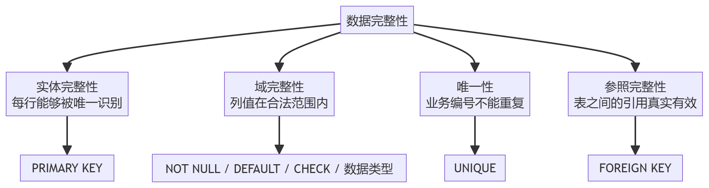
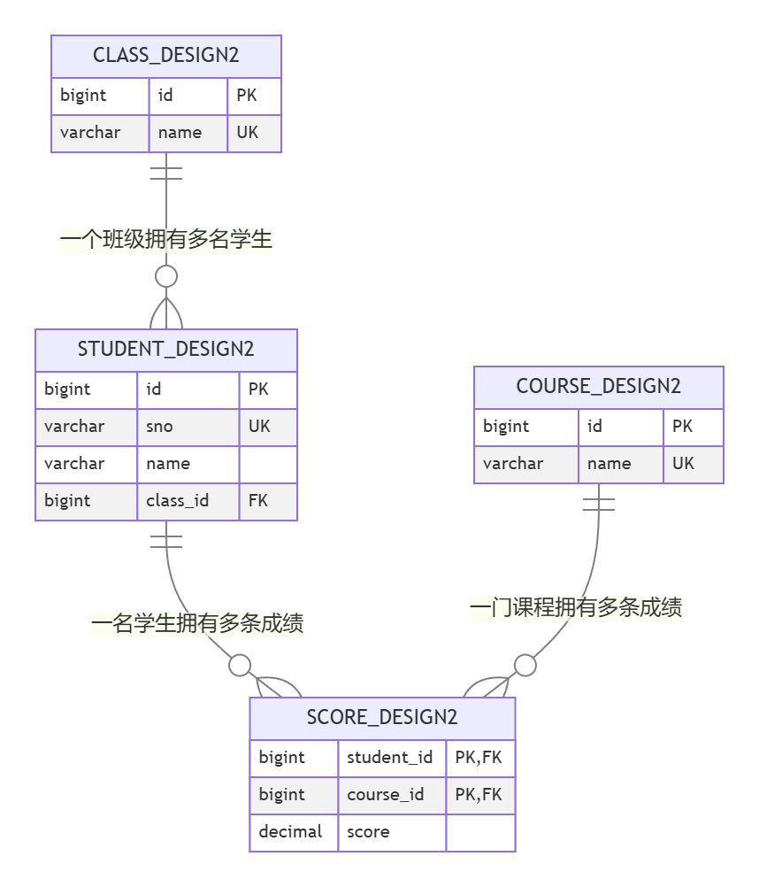
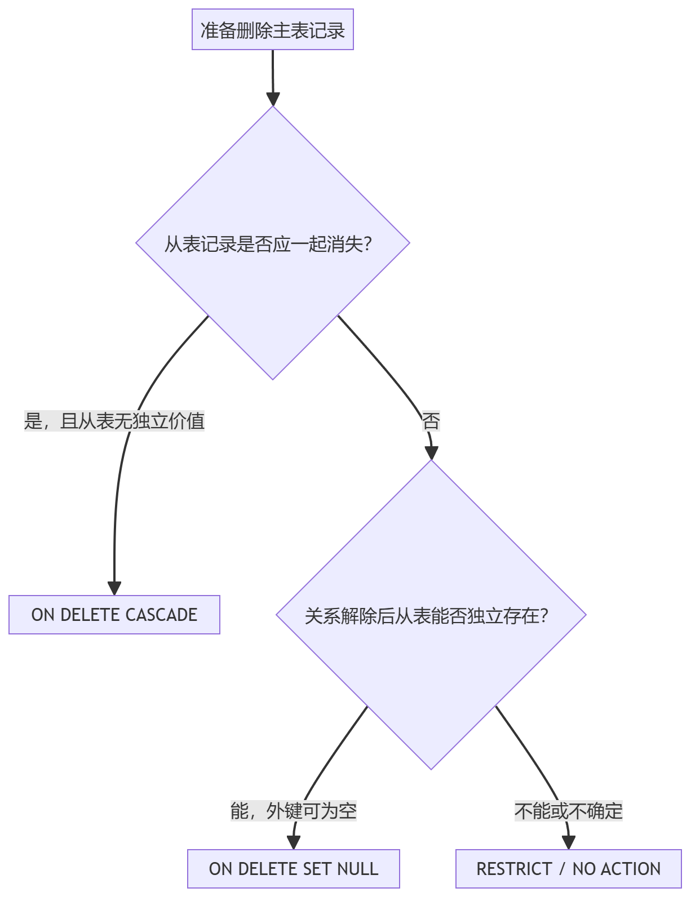

> 适用环境：MySQL 8.0（本文实操按 MySQL 8.0.39 编写）

## 1. 数据库约束

### 1.1 概念
数据库约束（**Constraint**）是数据库对表中数据设置的规则。

当执行 `insert`、`update` 或某些 `delete` 操作时，MySQL 会检查数据是否满足这些规则：

+ 满足规则：允许操作。
+ 不满足规则：拒绝操作并返回错误。

比如，一个学生系统可能有以下要求：

+ 学生姓名不能为空。
+ 年龄不小于 16 岁。
+ 每名学生的学号不能重复。
+ 每条学生记录必须有一个唯一编号。
+ 学生填写的班级编号必须在班级表中真实存在。

如果只把这些要求写在需求文档中，数据库并不会自动遵守;

只有把它们定义为约束，数据库才会在每次写入时主动检查

> 可以把约束理解为数据库的“数据守门员”。应用程序可以提前校验用户输入，但数据库约束负责守住最终的数据底线。
>

### 1.2  数据完整性的四个角度

### 

这张图说明：

+ `primary key` 解决“这一行是谁”的问题。
+ `not null`、`default`、`check` 和数据类型共同限制“这一列可以放什么”。
+ `unique` 解决“业务值不能重复”的问题。
+ `foreign key` 解决“引用的另一行是否存在”的问题。

### 1.3 常用约束
| 约束 | 中文名称 | 核心作用 | 典型字段 |
| --- | --- | --- | --- |
| `not null` | 非空约束 | 不允许列值为 SQL `null` | 姓名、创建时间 |
| `default` | 默认值约束 | 未指定列值时自动使用默认值 | 状态、年龄、创建时间 |
| `unique` | 唯一约束 | 限制一列或一组列的非空组合不能重复 | 学号、手机号、用户名 |
| `primary key` | 主键约束 | 唯一且非空地标识每一行 | `id` |
| `foreign key` | 外键约束 | 保证从表引用的主表记录存在 | `class_id`、`student_id` |
| `check` | 检查约束 | 限制值范围或列之间的关系 | 年龄、分数、开始结束时间 |


> 原资料中的 `DEFALUT` 是拼写错误，正确关键字是 `DEFAULT`。
>

### 1.4 列级表级写法
约束可以写在列定义后面，也可以单独写成表级约束。

#### 列级写法
```sql
create table constraint_demo (
    id bigint primary key auto_increment,
    name varchar(20) not null,
    age int default 18,
    sno varchar(20) unique,
    score decimal(5, 2) check (score between 0 and 100)
);
```

这种写法简洁，适合只涉及一个字段的约束。

#### 表级写法
```sql
create table constraint_demo (
    id bigint auto_increment,
    name varchar(20) not null,
    sno varchar(20),
    score decimal(5, 2),

    constraint pk_constraint_demo primary key (id),
    constraint uk_constraint_demo_sno unique (sno),
    constraint ck_constraint_demo_score
        check (score between 0 and 100)
);
```

表级写法**优点**：

1. 可以给约束**起名称**，后续删除和排错更方便。
2. 可以定义包含多个字段的复合约束。

本文在综合建表中优先采用“字段定义在前、命名约束集中放在后面”的写法，原因是结构更清晰，也更符合正式项目的维护需求。

### 1.5 约束命名
| 对象 | 推荐前缀 | 示例 |
| --- | --- | --- |
| 主键约束 | `pk_` | `pk_student_design2` |
| 唯一约束或唯一索引 | `uk_` | `uk_student_design2_sno` |
| 外键约束 | `fk_` | `fk_student_design2_class` |
| 检查约束 | `ck_` | `ck_score_design2_score` |
| 普通索引 | `idx_` | `idx_student_design2_name` |


命名的目的是让错误信息、建表语句和后续修改更容易读懂

**注意**：MySQL 中主键对应的索引名称固定显示为 `PRIMARY`。`pk_` 名称仍可用于设计文档、迁移脚本的可读性以及其他数据库系统，但不要依赖 MySQL 一定保留自定义主键名称。

---

## 2. NOT NULL 非空约束
### 2.1 作用
`not null` 表示该列不能保存 SQL 中的空值 `null`。

例如，学生姓名是识别学生的基本信息。如果允许姓名为 `null`，就可能出现一条不完整的学生记录。

### 2.2 不加非空约束时
```sql
drop table if exists student_not_null_demo;

create table student_not_null_demo (
    id bigint,
    name varchar(20)
);

insert into student_not_null_demo (id, name)
values (1, null);

select * from student_not_null_demo;
```

结果中会出现：

| id | name |
| :--- | :--- |
| 1 | `NULL` |


原因是 `name` 没有 `not null`，MySQL 认为 `null` 是合法值。

### 2.3 添加非空约束
```sql
drop table if exists student_not_null_demo;

create table student_not_null_demo (
    id bigint,
    name varchar(20) not null
);
```

再次插入：

```sql
insert into student_not_null_demo (id, name)
values (1, null);
```

会出现类似错误：

```latex
ERROR 1048 (23000): Column 'name' cannot be null
```

错误产生的原因是待插入的 `null` 违反了 `name` 列的非空约束。

正常数据可以成功写入：

```sql
insert into student_not_null_demo (id, name)
values (1, '张三');
```

### 2.4 `NULL`、空字符串和数字 0 的区别
区别：

| 值 | 含义 | 是否违反 `not null` |
| --- | --- | --- |
| `null` | 未知、缺失或不适用 | 是 |
| `''` | 已知是一个长度为 0 的字符串 | 否 |
| `'   '` | 由空格组成的字符串 | 否 |
| `0` | 一个明确的数字 | 否 |


以下语句不会违反 `not null`：

```sql
insert into student_not_null_demo (id, name)
values (2, '');
```

但空字符串通常也不是合法姓名。`not null` 只能阻止 `null`，不能自动阻止空字符串。因此正式项目还需要后端校验，或根据业务使用更合适的 `check` 约束。

### 2.5 查看非空约束
```sql
desc student_not_null_demo;
```

`Null` 列的含义：

+ `NO`：不允许为 `null`。
+ `YES`：允许为 `null`。

更完整的检查方式：

```sql
show create table student_not_null_demo;
```

`desc` 适合快速查看字段概况，`show create table` 更适合检查真实、完整的建表定义。

### 2.6 给已有列添加非空约束
先检查是否已经存在 `null`：

```sql
select *
from student_not_null_demo
where name is null;
```

必须先检查，原因是已有脏数据会导致添加约束失败。

如果业务允许把缺失姓名统一改成“待补充”，可以先清理：

```sql
update student_not_null_demo
set name = '待补充'
where name is null;
```

然后修改字段：

```sql
alter table student_not_null_demo
modify name varchar(20) not null;
```

> 使用 `modify` 时要把字段类型、长度以及需要保留的字段属性重新写完整。不要只写 `not null`，否则可能意外丢失原有定义。
>

### 2.7 删除非空约束
MySQL 没有单独的 `drop not null` 写法。要把该列重新修改为允许 `null`：

```sql
alter table student_not_null_demo
modify name varchar(20) null;
```

## 3. DEFAULT 默认值约束
### 3.1 作用
`default` 用于指定字段的默认值。

当 `insert` 语句没有给该字段赋值时，MySQL 会自动使用默认值。

例如，学生的默认年龄设为 18：

```sql
drop table if exists student_default_demo;

create table student_default_demo (
    id bigint primary key auto_increment,
    name varchar(20) not null,
    age int default 18
);
```

### 3.2 省略字段时使用默认值
```sql
insert into student_default_demo (name)
values ('张三');

select * from student_default_demo;
```

结果：

| id | name | age |
| :--- | :--- | :--- |
| 1 | 张三 | 18 |


原因是插入时没有指定 `age`，因此 MySQL 使用了默认值 `18`。

### 3.3 显式写 `NULL` 不等于省略字段
```sql
insert into student_default_demo (name, age)
values ('李四', null);
```

由于 `age` 允许为 `null`，最终存入的是 `null`，而不是默认值 `18`。

两种情况要明确区分：

+ 没有给 `age` 赋值：使用默认值。
+ 明确给 `age` 赋 `null`：保存 `null`，前提是该列允许为 `null`。

如果要求年龄既不能缺失，又希望不填写时使用 18，应同时使用：

```sql
age int not null default 18
```

此时：

```sql
insert into student_default_demo (name)
values ('王五');
```

会使用默认值；而：

```sql
insert into student_default_demo (name, age)
values ('赵六', null);
```

会违反 `not null`。

### 3.4 使用 `DEFAULT` 关键字
除了省略字段，也可以显式要求使用默认值：

```sql
insert into student_default_demo (name, age)
values ('钱七', default);
```

更新时也可以恢复为默认值：

```sql
update student_default_demo
set age = default
where name = '钱七';
```

### 3.5 常用的时间默认值
```sql
create table article_demo (
    id bigint primary key auto_increment,
    title varchar(100) not null,
    create_time datetime not null default current_timestamp,
    update_time datetime not null
        default current_timestamp
        on update current_timestamp
);
```

含义：

+ 新增记录时，`create_time` 和 `update_time` 自动写入当前时间。
+ 更新记录时，`update_time` 自动变为本次更新时间。

这适合记录数据创建时间与最后修改时间。

### 3.6 修改和删除默认值
添加或修改默认值：

```sql
alter table student_default_demo
alter column age set default 18;
```

删除默认值：

```sql
alter table student_default_demo
alter column age drop default;
```

删除默认值不会删除已有数据，只会影响之后没有指定该字段的新写入。

### 3.7 `DEFAULT` 不能替代业务校验
默认值只负责“未填写时用什么”，不负责“填写的值是否合理”。

例如：

```sql
age int default 18
```

仍然允许写入 `-100`。如果年龄必须不小于 16，还应增加：

```sql
constraint ck_student_age check (age >= 16)
```

---

## 4. UNIQUE 唯一约束
### 4.1 作用
`unique` 保证某一列或某一组列的值不重复。

典型场景包括：

+ 学号不能重复。
+ 用户名不能重复。
+ 手机号不能重复。
+ 同一个学生不能重复选择同一门课程。

### 4.2 单列唯一约束
```sql
drop table if exists student_unique_demo;

create table student_unique_demo (
    id bigint primary key auto_increment,
    name varchar(20) not null,
    sno varchar(20),

    constraint uk_student_unique_demo_sno unique (sno)
);
```

正常插入：

```sql
insert into student_unique_demo (name, sno)
values ('张三', '20260001');
```

重复插入相同学号：

```sql
insert into student_unique_demo (name, sno)
values ('李四', '20260001');
```

会出现类似错误：

```latex
ERROR 1062 (23000): Duplicate entry '20260001'
for key 'student_unique_demo.uk_student_unique_demo_sno'
```

错误原因是学号 `20260001` 已经存在，违反了唯一约束。

### 4.3 MySQL 的唯一约束允许多个 `NULL`
如果唯一列本身允许 `null`，MySQL 允许多行都保存 `null`：

```sql
insert into student_unique_demo (name, sno)
values ('王五', null);

insert into student_unique_demo (name, sno)
values ('赵六', null);
```

两条语句都可以成功。

原因是 SQL 中的 `null` 表示未知，两个未知值不会被直接判定为相等。

如果业务要求“学号必须填写并且不能重复”，应该组合使用：

```sql
sno varchar(20) not null,
constraint uk_student_unique_demo_sno unique (sno)
```

### 4.4 联合唯一约束
联合唯一约束同时检查多个字段的组合。

例如，规定同一个班级内学生姓名不能重复：

```sql
create table class_student_name_demo (
    id bigint primary key auto_increment,
    class_id bigint not null,
    name varchar(20) not null,

    constraint uk_class_student_name
        unique (class_id, name)
);
```

以下两行可以同时存在：

| class_id | name | 是否允许 |
| :--- | :--- | :--- |
| 1 | 张三 | 允许 |
| 2 | 张三 | 允许 |


因为组合 `(1, '张三')` 与 `(2, '张三')` 不同。

但再次插入 `(1, '张三')` 会冲突。

> 联合唯一约束限制的是“字段组合不能重复”，不是要求每个字段各自都唯一。
>

### 4.5 唯一约束与唯一索引
下面两种 MySQL 写法都能限制 `username` 不重复：

```sql
constraint uk_index_user_username unique (username)
```

```sql
unique index uk_index_user_username (username)
```

其中：

+ `uk_index_user_username` 是人为指定的名称。
+ `uk` 常用来表示 unique key。
+ `index_user` 可以表示表名。
+ `username` 表示被约束的字段。

从概念上看：

+ 唯一约束表达的是数据规则：“值不能重复”。
+ 唯一索引是 MySQL 实现并快速检查这条规则的数据结构。

因此二者密切相关，但“约束”和“索引”仍然不是同一个概念。普通索引只用于提高查询效率，并不会禁止重复值。

### 4.6 添加和删除唯一约束
为了让下面的 `alter table` 可以直接练习，先创建一张尚未设置唯一约束的表：

```sql
drop table if exists student_unique_alter_demo;

create table student_unique_alter_demo (
    id bigint primary key auto_increment,
    sno varchar(20)
);
```

添加前先检查重复数据：

```sql
select sno, count(*) as duplicate_count
from student_unique_alter_demo
where sno is not null
group by sno
having count(*) > 1;
```

必须先检查，原因是只要存在一组重复数据，添加唯一约束就会失败。

添加：

```sql
alter table student_unique_alter_demo
add constraint uk_student_unique_alter_sno unique (sno);
```

在 MySQL 中删除唯一约束通常使用索引名称：

```sql
alter table student_unique_alter_demo
drop index uk_student_unique_alter_sno;
```

---

## 5. PRIMARY KEY 主键约束
### 5.1 作用
主键用于唯一标识表中的每一行数据。

主键具有三个核心特点：

1. 主键值不能重复。
2. 主键列不能为 `null`。
3. 一张表只能有一个主键约束，但这个主键可以由一个或多个字段组成。

注意“一张表只能有一个主键”不等于“主键只能有一列”。多列可以共同组成一个复合主键。

### 5.2 常用的自增主键
```sql
drop table if exists student_primary_demo;

create table student_primary_demo (
    id bigint primary key auto_increment,
    name varchar(20) not null
);
```

插入时可以省略 `id`：

```sql
insert into student_primary_demo (name)
values ('张三'), ('李四');
```

MySQL 会生成主键值。

`auto_increment` 的作用是让数据库生成递增编号，减少应用程序自行计算主键时产生冲突的风险。

### 5.3 常用 `BIGINT`
在业务系统中，主键常用：

```sql
id bigint primary key auto_increment
```

原因包括：

+ `bigint` 的可用范围大，数据量增长后不容易耗尽。
+ 整数比较和索引处理通常比较直接。
+ Java 中可以使用 `Long` 对应。

但“所有项目必须使用自增 `bigint`”并不是绝对规则。分布式系统也可能使用雪花 ID、UUID 或其他全局 ID。当前学习阶段先掌握自增整数主键最合适。

### 5.4 自增主键不保证连续
下面这些情况都可能让 ID 出现空缺：

+ 插入失败前已经申请了自增值。
+ 事务回滚。
+ 删除了一行数据。
+ 并发插入。
+ 手工插入了更大的主键值。

因此：

+ 主键只负责唯一标识。
+ 不要把“必须连续”当成主键规则。
+ 不要用主键是否连续判断数据有没有被删除。

例如出现 `1、2、4、5` 是正常现象，缺少 `3` 不代表数据库损坏。

### 5.5 `PRIMARY KEY` 与 `NOT NULL + UNIQUE` 的区别
从数据限制上看，单列主键确实同时具有“非空”和“唯一”的效果，但下面两种定义仍然不是完全相同的概念：

```sql
id bigint primary key
```

```sql
id bigint not null unique
```

主要区别：

| 对比点 | `primary key` | `not null unique` |
| --- | --- | --- |
| 语义 | 表中每行的主要身份标识 | 一个不能为空且不能重复的候选字段 |
| 每张表数量 | 只能有一个主键约束 | 可以有多个唯一约束 |
| InnoDB 组织方式 | 主键通常作为聚簇索引键 | 通常属于二级唯一索引 |
| 外键引用 | 最常用、最清晰 | 也可作为候选键被引用，但设计语义不同 |


#### 为什么 `DESC` 有时会把 `NOT NULL UNIQUE` 显示为 `PRI`
当表没有显式主键时，MySQL 的某些元数据展示会把第一个“非空唯一索引”作为主键候选显示。不能因此断定建表语句中真的声明了 `primary key`。

最可靠的检查方法是：

```sql
show create table student_primary_demo;
```

如果输出中明确存在：

```sql
primary key (`id`)
```

才能确认它是显式定义的主键。

> 不要仅凭 `desc` 的 `Key` 列判断所有约束。`desc` 是摘要，`show create table` 才能还原更完整的定义。
>

### 5.6 复合主键
成绩表天然适合使用“学生编号 + 课程编号”组成主键：

```sql
create table score_primary_demo (
    student_id bigint not null,
    course_id bigint not null,
    score decimal(5, 2),

    constraint pk_score_primary_demo
        primary key (student_id, course_id)
);
```

以下数据可以同时存在：

| student_id | course_id | score |
| ---: | ---: | ---: |
| 1 | 1 | 90.00 |
| 1 | 2 | 85.00 |
| 2 | 1 | 88.00 |


但 `(student_id, course_id) = (1, 1)` 不能再次出现。

它表达的业务规则是：

> 同一名学生对同一门课程只能有一条成绩记录。
>

### 5.7 复合主键与联合唯一约束
二者都能限制字段组合不重复，但角色不同：

```sql
primary key (student_id, course_id)
```

表示这两个字段的组合就是该行的主要身份标识。

```sql
id bigint primary key auto_increment,
unique (student_id, course_id)
```

表示：

+ `id` 是该行的主身份标识。
+ `(student_id, course_id)` 是额外的业务唯一规则。

两种设计都可能合理：

| 设计 | 优点 | 适合场景 |
| --- | --- | --- |
| 复合主键 `(student_id, course_id)` | 直接表达业务身份，不需要额外 `id` | 纯关联表、结构较简单 |
| 自增主键 `id` + 联合唯一约束 | 其他表引用方便，ORM 使用较简单 | 关联记录还会被其他表引用，或项目统一使用单列主键 |


### 5.8 添加和删除主键
为了单独练习主键变更，先使用一张不带 `auto_increment` 的测试表：

```sql
drop table if exists student_primary_alter_demo;

create table student_primary_alter_demo (
    id bigint not null,
    name varchar(20) not null
);
```

给已有字段添加主键前，要保证该字段没有 `null` 且没有重复值：

```sql
select id, count(*) as duplicate_count
from student_primary_alter_demo
group by id
having count(*) > 1;
```

添加主键：

```sql
alter table student_primary_alter_demo
add primary key (id);
```

删除主键：

```sql
alter table student_primary_alter_demo
drop primary key;
```

生产环境删除主键属于高风险结构变更，原因是它可能影响外键、索引组织、查询性能及其他依赖。实际项目中应先检查依赖并做好变更方案。

如果主键列还带有 `auto_increment`，通常不能直接删除它唯一可用的键；应先设计新的键方案并处理 `auto_increment` 属性。不要把上面的简单测试语句直接用于生产表。

---

## 6. FOREIGN KEY 外键约束
### 6.1 外键解决什么问题作用
外键用于保证表与表之间引用关系的完整性。

例如：

+ 班级表保存班级。
+ 学生表通过 `class_id` 保存学生所属班级。

如果学生表中出现 `class_id = 100`，但班级表根本没有编号 100 的班级，这条数据就失去了真实指向。外键可以阻止这种无效引用。

### 6.2 主表、从表、主键和外键




以班级与学生为例：

| 术语 | 对应对象 | 说明 |
| --- | --- | --- |
| 主表、父表、被引用表 | `class_design2` | 保存被其他表引用的班级 |
| 从表、子表、引用表 | `student_design2` | 保存外键并引用班级 |
| 被引用键 | `class_design2.id` | 通常是主键或唯一键 |
| 外键列 | `student_design2.class_id` | 保存主表中已经存在的编号 |


> “主表”和“从表”是相对于某一条外键关系而言的。同一张表在不同关系中可能既是主表又是从表。
>

### 6.3 创建主表
先创建班级表：

```sql
drop table if exists student_fk_demo;
drop table if exists class_fk_demo;

create table class_fk_demo (
    id bigint primary key auto_increment,
    name varchar(30) not null,

    constraint uk_class_fk_demo_name unique (name)
) engine = innodb;
```

插入班级：

```sql
insert into class_fk_demo (name)
values ('Java001班'), ('MySQL001班');
```

先创建主表的原因是从表在创建外键时必须能够找到被引用的表与字段。

### 6.4 创建从表并定义外键
```sql
drop table if exists student_fk_demo;

create table student_fk_demo (
    id bigint primary key auto_increment,
    sno varchar(20) not null,
    name varchar(20) not null,
    class_id bigint,

    constraint uk_student_fk_demo_sno
        unique (sno),

    constraint fk_student_fk_demo_class
        foreign key (class_id)
        references class_fk_demo (id)
) engine = innodb;
```

外键核心语法：

```sql
constraint 外键名称
foreign key (从表字段)
references 主表名称 (主表被引用字段)
```

推荐主动给外键命名。否则 MySQL 会生成类似 `student_fk_demo_ibfk_1` 的名称，出现错误或删除外键时不够直观。

### 6.5 外键写入
#### 情况一：主表中存在该编号
```sql
insert into student_fk_demo (sno, name, class_id)
values ('20260001', '张三', 1);
```

只要班级表存在 `id = 1`，就可以成功。

#### 情况二：主表中不存在该编号
```sql
insert into student_fk_demo (sno, name, class_id)
values ('20260002', '李四', 100);
```

会出现类似错误：

```latex
ERROR 1452 (23000): Cannot add or update a child row:
a foreign key constraint fails
```

错误原因是 `class_id = 100` 在主表中没有对应记录。

#### 情况三：外键值为 `NULL`
```sql
insert into student_fk_demo (sno, name, class_id)
values ('20260003', '王五', null);
```

这条语句可以成功，因为 `class_id` 没有 `not null`。

此时 `null` 可以表达“暂未分配班级”。如果业务要求每名学生必须属于一个班级，应把字段定义为：

```sql
class_id bigint not null
```

> 外键约束检查的是“非空外键值是否存在于主表”。是否允许不填写，还要由 `not null` 决定。
>

### 6.6 默认情况下为什么不能删除被引用的主表记录
如果 `Java001班` 已经有学生，执行：

```sql
delete from class_fk_demo
where id = 1;
```

通常会出现：

```latex
ERROR 1451 (23000): Cannot delete or update a parent row:
a foreign key constraint fails
```

MySQL 拒绝删除，原因是删除班级后，学生表中的 `class_id = 1` 会变成无效引用。

如果一个班级没有任何学生引用，则可以正常删除。

### 6.7 `ON DELETE` 与 `ON UPDATE`
外键可以指定主表记录被删除或被更新时，从表如何处理。

基本语法：

```sql
constraint fk_student_fk_demo_class
foreign key (class_id)
references class_fk_demo (id)
on delete restrict
on update cascade
```

常用动作：

| 动作 | 主表被删除或更新时 | 适用思路 |
| --- | --- | --- |
| `restrict` | 如果存在从表引用，就拒绝操作 | 默认且最保守，适合重要业务数据 |
| `no action` | InnoDB 中与 `restrict` 基本等价 | SQL 标准写法 |
| `cascade` | 自动删除或更新对应从表记录 | 强依赖关系，如订单与纯明细 |
| `set null` | 把从表外键值设为 `null` | 关系可以解除，且外键列允许 `null` |


`set default` 虽然会被 MySQL 语法解析器识别，但 InnoDB 不接受这种引用动作，不应把它作为普通可用方案。

#### `ON DELETE RESTRICT`
```sql
on delete restrict
```

存在学生时禁止删除班级。省略 `on delete` 时，InnoDB 的默认行为也相当于限制删除。

#### `ON DELETE CASCADE`
```sql
on delete cascade
```

删除班级时，属于该班级的学生也会自动删除。

这种操作影响范围可能很大。除非从表数据没有独立保留价值，否则不要因为“删除方便”就随意使用级联删除。

#### `ON DELETE SET NULL`
```sql
on delete set null
```

删除班级时，学生仍然保留，但其 `class_id` 自动变为 `null`。

要使用它，外键字段必须允许 `null`：

```sql
class_id bigint
```

如果写成 `class_id bigint not null`，就与 `set null` 的行为矛盾。

#### `ON UPDATE CASCADE`
```sql
on update cascade
```

如果主表被引用键发生修改，从表外键会同步修改。

主键通常不应频繁改变，因此它更多是完整性保障，而不是日常更新手段。

### 6.8 如何选择外键动作
可以按下面的顺序思考：


初学和普通业务设计中，优先使用 `restrict`，等业务语义非常明确时再选择 `cascade` 或 `set null`。

### 6.9 添加和删除外键
前面的建表语句已经创建了外键。为了演示修改流程，先删除原外键：

```sql
alter table student_fk_demo
drop foreign key fk_student_fk_demo_class;
```

重新添加前要检查是否已经存在孤立数据：

```sql
select s.*
from student_fk_demo as s
left join class_fk_demo as c
    on s.class_id = c.id
where s.class_id is not null
  and c.id is null;
```

这条查询的逻辑是：

1. 使用左连接保留所有学生。
2. 尝试根据 `class_id` 找对应班级。
3. 外键不为空但 `c.id` 仍为空，说明引用的班级不存在。

存在这种数据时，应先清理或补齐班级，再添加外键。

确认查询没有返回孤立数据后，重新添加：

```sql
alter table student_fk_demo
add constraint fk_student_fk_demo_class
foreign key (class_id)
references class_fk_demo (id)
on delete restrict
on update cascade;
```

如果后续确实不再需要这条关系，可以再次删除：

```sql
alter table student_fk_demo
drop foreign key fk_student_fk_demo_class;
```

注意：删除外键约束后，外键列上的索引可能仍然存在。是否继续保留要根据查询需求决定，可以使用下面的语句检查：

```sql
show index from student_fk_demo;
```

### 6.10 创建外键的必要条件
常见要求包括：

1. 主表和从表都应使用支持外键的存储引擎，通常是 InnoDB。
2. 对应字段的数据类型要匹配。
3. 整数类型的长度与是否 `unsigned` 要一致。
4. 字符串外键的字符集与排序规则要一致。
5. 被引用字段要有合适的索引；正式关系设计中通常引用主键或唯一键。
6. 现有数据必须已经满足引用关系。
7. 创建从表前，主表必须存在。

例如，下面两列并不完全匹配：

```sql
-- 主表
id bigint unsigned

-- 从表
class_id bigint
```

一个是无符号 `bigint unsigned`，另一个是有符号 `bigint`，创建外键可能失败。应把两边统一。

### 6.11 外键常伴随索引
MySQL 检查外键时需要快速完成两类查询：

+ 写入从表时，查找主表中是否存在被引用值。
+ 删除或更新主表时，查找从表中是否存在引用。

如果没有索引，每次检查都可能扫描大量数据。因此 MySQL 要求外键两端具有合适的索引；从表没有可用索引时，InnoDB 通常会自动创建。

但是必须区分：

+ 外键是数据关系规则。
+ 索引是帮助查找数据的数据结构。
+ 索引可以为外键检查服务，但索引本身不会保证引用关系。

`desc student_fk_demo` 中 `class_id` 的 `Key` 可能显示 `MUL`。`MUL` 只说明该列位于一个可重复值的索引中，不能单凭它证明该列一定有外键。

检查外键应该使用：

```sql
show create table student_fk_demo;
```

### 6.12 外键不会自动完成连接查询
定义外键后，查询学生及班级仍然需要显式连接：

```sql
select
    s.id,
    s.sno,
    s.name as student_name,
    c.name as class_name
from student_fk_demo as s
left join class_fk_demo as c
    on s.class_id = c.id;
```

外键负责保证关系正确，`join` 负责按照关系取出数据，二者作用不同。

外键负责保证关系正确，`join` 负责按照关系取出数据，二者作用不同。

## 7. CHECK 检查约束
### 7.1 作用与版本
`check` 用于限制列值范围，或限制同一行中多个字段之间的关系。

MySQL 8.0.16 之前虽然能解析 `check` 语法，但通常不会真正执行检查。从 MySQL 8.0.16 开始才正式执行核心 `check` 约束。

### 7.2 限制年龄与性别
```sql
drop table if exists student_check_demo;

create table student_check_demo (
    id bigint primary key auto_increment,
    name varchar(20) not null,
    age int not null default 18,
    gender char(1),

    constraint ck_student_check_demo_age
        check (age >= 16),

    constraint ck_student_check_demo_gender
        check (gender in ('男', '女') or gender is null)
);
```

正常数据：

```sql
insert into student_check_demo (name, age, gender)
values ('张三', 17, '男');
```

年龄不合法：

```sql
insert into student_check_demo (name, age, gender)
values ('李四', 15, '女');
```

会出现类似错误：

```latex
ERROR 3819 (HY000): Check constraint
'ck_student_check_demo_age' is violated.
```

性别不合法：

```sql
insert into student_check_demo (name, age, gender)
values ('王五', 18, '未知');
```

会违反性别检查约束。

使用：

```sql
gender in ('男', '女')
```

比下面的写法更容易扩展和阅读：

```sql
gender = '男' or gender = '女'
```

### 7.3 `CHECK` 与 `NULL` 的关系
`check` 表达式的结果为：

+ `true`：通过。
+ `false`：拒绝。
+ `unknown`：通常也通过；涉及 `null` 的比较往往得到 `unknown`。

例如：

```sql
age int check (age >= 16)
```

如果 `age = null`，表达式 `null >= 16` 不是 `false`，而是 `unknown`，因此不能只靠这条 `check` 阻止 `null`。

如果要求年龄必须填写且不小于 16，应写：

```sql
age int not null,
constraint ck_student_age check (age >= 16)
```

其中：

+ `not null` 负责“必须填写”。
+ `check` 负责“填写后必须在合法范围内”。

### 7.4 限制数值范围
成绩应在 0 到 100 之间：

```sql
score decimal(5, 2),
constraint ck_score_range
    check (score between 0 and 100)
```

`between 0 and 100` 包含边界 0 与 100。

如果成绩必须存在：

```sql
score decimal(5, 2) not null,
constraint ck_score_range
    check (score between 0 and 100)
```

### 7.5 检查多个字段之间的关系
```sql
create table activity_check_demo (
    id bigint primary key auto_increment,
    activity_name varchar(50) not null,
    start_time datetime not null,
    end_time datetime not null,

    constraint ck_activity_time
        check (end_time > start_time)
);
```

这里必须使用表级约束，原因是规则同时引用了 `start_time` 和 `end_time`。

它保证结束时间一定晚于开始时间。

### 7.6 添加、暂停执行和删除检查约束
前面的建表语句已经定义了年龄检查。为了演示完整管理流程，先删除原约束：

```sql
alter table student_check_demo
drop check ck_student_check_demo_age;
```

重新添加：

```sql
alter table student_check_demo
add constraint ck_student_check_demo_age
check (age >= 16);
```

暂停执行但保留定义：

```sql
alter table student_check_demo
alter check ck_student_check_demo_age not enforced;
```

重新执行：

```sql
alter table student_check_demo
alter check ck_student_check_demo_age enforced;
```

删除：

```sql
alter table student_check_demo
drop check ck_student_check_demo_age;
```

`not enforced` 更适合受控迁移，不适合作为长期绕过规则的手段。

### 7.7 `CHECK` 的边界
适合：

+ 数值范围。
+ 枚举值范围。
+ 同一行字段之间的大小或逻辑关系。
+ 简单、稳定、必须由所有写入入口遵守的规则。

不适合：

+ 需要查询其他表才能判断的复杂规则。
+ 经常变化的业务流程。
+ 需要调用外部服务的规则。
+ 复杂权限与状态机。

这些规则通常应由后端业务代码、事务和其他数据库机制共同完成。

---

## 8. 使用 ALTER TABLE 管理已有表的约束
### 8.1 常用操作
下面各段是独立语法模板，不是一组应当从头到尾连续执行的脚本。使用其中一项前，要先确认当前表是否已经存在同类约束。

#### 添加非空约束
```sql
alter table student_design2
modify name varchar(20) not null;
```

#### 删除非空约束
```sql
alter table student_design2
modify name varchar(20) null;
```

#### 添加默认值
```sql
alter table student_design2
alter column age set default 18;
```

#### 删除默认值
```sql
alter table student_design2
alter column age drop default;
```

#### 添加唯一约束
```sql
alter table student_design2
add constraint uk_student_design2_sno unique (sno);
```

#### 删除唯一约束
```sql
alter table student_design2
drop index uk_student_design2_sno;
```

#### 添加主键
```sql
alter table student_design2
add primary key (id);
```

#### 删除主键
```sql
alter table student_design2
drop primary key;
```

如果主键列带有 `auto_increment` 或正在被外键引用，不能直接照搬这条语句，必须先处理相关属性与依赖。

#### 添加外键
```sql
alter table student_design2
add constraint fk_student_design2_class
foreign key (class_id)
references class_design2 (id);
```

#### 删除外键
```sql
alter table student_design2
drop foreign key fk_student_design2_class;
```

#### 添加检查约束
```sql
alter table student_design2
add constraint ck_student_design2_age
check (age between 16 and 100);
```

#### 删除检查约束
```sql
alter table student_design2
drop check ck_student_design2_age;
```

## 9. 约束、索引和数据类型的关系
### 9.1 三者解决的问题不同
| 对象 | 主要问题 | 示例 |
| --- | --- | --- |
| 数据类型 | 这一列存储哪一类数据 | `int`、`varchar(20)`、`datetime` |
| 约束 | 哪些数据允许进入数据库 | `not null`、`unique`、`foreign key` |
| 索引 | 怎样更快定位数据 | 普通索引、唯一索引、主键索引 |


例如：

```sql
sno varchar(20) not null unique
```

可以拆成三层理解：

+ `varchar(20)`：数据类型，限制为最多 20 个字符的变长字符串。
+ `not null`：非空规则。
+ `unique`：不重复规则，并由 MySQL 建立相应的唯一索引来实现高效检查。

### 9.2 约束不是索引
#### 约束关注数据正确性
```sql
constraint fk_student_class
foreign key (class_id)
references class_design2 (id)
```

它要求 `class_id` 必须引用真实班级。

#### 索引关注数据查找效率
```sql
index idx_student_name (name)
```

它可以提高按姓名查找的效率，但允许姓名重复，也不检查班级关系。

### 9.3 如何检查表中到底有什么

#### 快速查看字段
```sql
desc student_design2;
```

#### 查看完整建表定义
```sql
show create table student_design2;
```

#### 查看索引
```sql
show index from student_design2;
```

#### 查看当前数据库的约束
```sql
select
    constraint_name,
    constraint_type,
    table_name
from information_schema.table_constraints
where table_schema = database()
  and table_name = 'student_design2';
```

推荐理解为：

+ `desc`：看摘要。
+ `show create table`：看完整定义。
+ `show index`：看索引细节。
+ `information_schema`：批量查询数据库元数据。

---

## 10. 数据迁移与表复制中的约束问题
### 10.1 `CREATE TABLE ... LIKE`
复制表结构：

```sql
drop table if exists student_backup;

create table student_backup
like student_design2;
```

再复制数据：

```sql
insert into student_backup
select *
from student_design2;
```

这种方式把“创建结构”和“复制数据”分成两步，容易检查和控制。

### 10.2 `LIKE` 会复制什么
在 MySQL 8.0 中，`create table ... like` 会复制大量表结构信息，例如：

+ 字段名与数据类型。
+ `not null`。
+ 默认值。
+ 主键和索引，因此唯一约束对应的唯一索引也会复制。
+ `check` 约束，但 MySQL 会为副本重新生成检查约束名称。

它不会复制：

+ 表中的数据。
+ 外键定义。

所以一定要比较：

```sql
show create table student_design2;
show create table student_backup;
```

不能只看字段表面相同，就判断两个表的完整结构完全一致。

### 10.3 如何给副本重新添加外键
如果副本确实需要继续引用原班级表，可以执行：

```sql
alter table student_backup
add constraint fk_student_backup_class
foreign key (class_id)
references class_design2 (id)
on delete restrict
on update cascade;
```

外键名称使用 `fk_student_backup_class`，而不是复用原表名称，原因是名称应明确对应当前关系，也可避免命名冲突。

但备份表是否应该保留外键要看目的：

+ 如果只是保存历史快照，保留外键可能导致主表数据变化时备份受影响。
+ 如果副本仍参与正常业务，保留外键更有利于一致性。

不能机械地认为“结构越一样越好”，应先明确副本用途。

### 10.4 `CREATE TABLE ... SELECT`
```sql
create table student_backup2 as
select *
from student_design2;
```

这种方式可以一次完成“建表 + 复制查询结果”，但通常不会完整保留原表的主键、唯一索引、外键和其他完整定义。

因此：

+ 临时分析表可以使用。
+ 需要精确保留表设计时，不应只依赖这种方式。
+ 正式复制后必须用 `show create table` 检查。

推荐的正式学习写法仍然是：

```sql
create table student_backup like student_design2;

insert into student_backup
select *
from student_design2;
```

然后按业务需要单独恢复外键。

## 11. 主键或唯一键冲突时的写入方式
原资料把这部分放在主键章节中，因为这些语句都依赖主键或唯一键发现冲突。

### 11.1 普通 `INSERT`
```sql
insert into student_design2
    (sno, name, age, class_id)
values
    ('20260001', '张三', 18, 1);
```

如果 `sno = '20260001'` 已存在，普通插入会报 1062 重复键错误。

### 11.2 `INSERT ... ON DUPLICATE KEY UPDATE`
它的含义是：

+ 没有主键或唯一键冲突：插入新行。
+ 发生冲突：更新已经存在的行。

MySQL 8.0.19 之后可以给待插入的新行起别名：

```sql
insert into student_design2
    (sno, name, age, class_id)
values
    ('20260001', '张三（已更新）', 19, 1) as new
on duplicate key update
    name = new.name,
    age = new.age,
    class_id = new.class_id;
```

这里通过学号唯一约束发现冲突，然后更新原来的学生记录。

> 原资料中“受影响 2 行表示删除原记录再插入一条”的解释不准确。`on duplicate key update` 执行的是更新；默认连接行为下，更新已有行时受影响行数常显示为 2，这是 MySQL 的计数约定，不代表真的删除了两行或重新插入了一行。
>

另外，旧写法中常见：

```sql
name = values(name)
```

从 MySQL 8.0.20 起，这种在更新部分使用 `values()` 引用新值的方式已被弃用。新代码更适合使用上面的行别名。

### 11.3 `REPLACE`
```sql
replace into student_design2
    (id, sno, name, age, class_id)
values
    (1, '20260001', '张三', 20, 1);
```

逻辑上：

+ 没有主键或唯一键冲突：插入。
+ 有冲突：删除冲突的旧行，再插入新行。

如果单行 `replace` 显示：

+ `1 row affected`：通常只发生了插入。
+ 大于 1：通常删除了冲突行并插入了新行。

### 11.4 三种写入方式对比
| 写法 | 无冲突 | 有主键或唯一键冲突 | 适合场景 |
| --- | --- | --- | --- |
| `insert` | 插入 | 报错 | 必须确保是全新数据 |
| `insert ... on duplicate key update` | 插入 | 更新旧行 | 幂等写入、同步某些业务数据 |
| `replace` | 插入 | 删除旧行后插入 | 明确需要替换语义且已评估副作用 |


---

## 参考

[MySQL 8.0 Reference Manual - FOREIGN KEY Constraints](https://dev.mysql.com/doc/refman/8.0/en/create-table-foreign-keys.html)

[MySQL 8.0 Reference Manual - CHECK Constraints](https://dev.mysql.com/doc/refman/8.0/en/create-table-check-constraints.html)

[MySQL 8.0 Reference Manual - CREATE TABLE ... LIKE](https://dev.mysql.com/doc/refman/8.0/en/create-table-like.html)

[MySQL 8.0 Reference Manual - INSERT ... ON DUPLICATE KEY UPDATE](https://dev.mysql.com/doc/refman/8.0/en/insert-on-duplicate.html)

