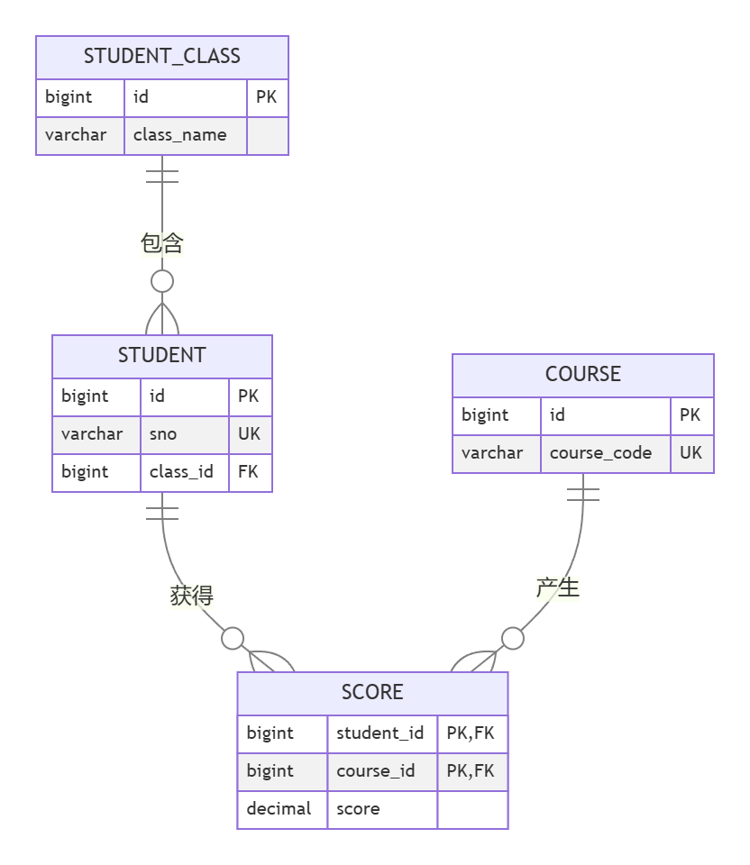
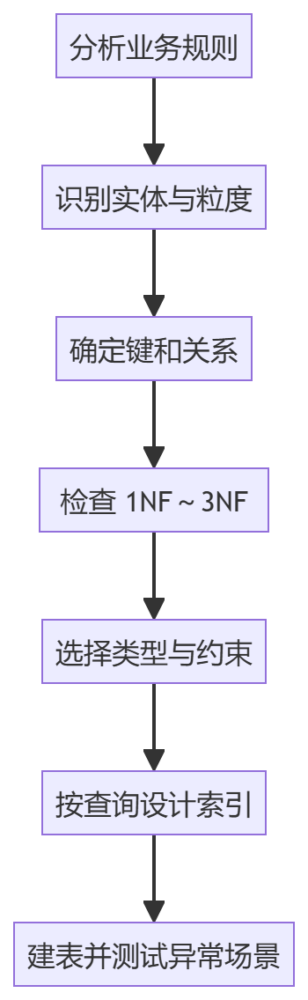

> 适用环境：MySQL 8.0（示例按 MySQL 8.0.39 编写）  

## 1. 数据库设计
数据库设计首先考虑的是以下问题：

1. 业务中有哪些需要长期保存的对象？
2. 每个对象应该保存哪些属性？
3. 一行数据代表什么，即表的粒度是什么？
4. 哪些字段能够唯一标识一行？
5. 对象之间是一对一、一对多还是多对多？
6. 哪些数据会重复，修改时是否可能产生不一致？
7. 常用查询是什么，需要怎样的索引？

### 1.1 类、实体与表
| 分析层次 | 含义 | 学生系统示例 |
| --- | --- | --- |
| 概念类 | 从现实业务中抽象出的对象 | 学生、班级、课程 |
| 实体 | 需要长期保存的数据对象 | 某个具体学生 |
| 表 | 实体在关系数据库中的存储结构 | `student_design2` |
| 属性 | 实体具有的特征 | 学号、姓名、出生日期 |
| 列 | 属性在表中的实现 | `sno`、`name`、`birthday` |


类、实体和表经常近似一一对应，但不能机械地认为“一个 Java 类必须是一张表”。DTO、VO 通常不需要建表，集合属性往往要设计为子表或中间表。

---

## 2. 部分概念
### 2.1 表的粒度
粒度指“一行数据到底描述什么”

例如，成绩表的一行可以定义为：

> 一名学生对一门课程的最终成绩。
>

于是 `(student_id, course_id)` 可以唯一确定一行。如果业务改为“一名学生同一门课程可以补考多次”，原粒度就不够了，应增加 `attempt_no`，或单独设计考试场次表。

### 2.2 候选键、主键与业务键
+ **候选键**：能够唯一标识一行的最小字段集合。
+ **主键**：从候选键中选出的主要行标识。
+ **业务键**：业务本身具有唯一性的字段，如学号、课程编号。
+ **代理键**：没有业务含义、专门用于标识行的字段，如自增 `id`。

学生表可以使用自增 `id` 作为主键，同时给 `sno` 添加唯一约束。这样连接时主键稳定，数据库又能保证学号不重复。

### 2.3 函数依赖
若已知 A 的值，就能唯一确定 B 的值，可以写成：

```latex
A → B
```

例如：

```latex
学号 → 学生姓名
课程编号 → 课程名、学分
(学号, 课程编号) → 成绩
```

范式的核心就是检查：每个非关键字段究竟依赖谁。

## 3. 数据库范式
范式是一组减少重复和异常的设计规则。常见范式包括 1NF、2NF、3NF、BCNF、4NF 和 5NF。一般业务系统先把表设计到第三范式，再根据明确的性能证据决定是否反范式。

### 3.1 第一范式
**一列保存一个业务意义上的值**

第一范式（1NF）要求每个字段在当前业务语义下是原子的，不能在一列中保存一组可独立查询和维护的值。

反例：

| student_id | name | course_ids |
| --- | --- | --- |
| 1 | 张三 | `1,2,5` |


`course_ids` 保存了多个课程编号，难以使用外键、连接和普通索引，也容易在增删编号时破坏格式。

正确方式是把选课关系拆成多行：

| student_id | course_id |
| --- | --- |
| 1 | 1 |
| 1 | 2 |
| 1 | 5 |


> “原子”与业务语义有关。地址在只展示的场景中可以是一个字符串；若要按省、市统计，就应拆成独立字段或关联地区表。因此，字段使用了 MySQL 基本数据类型，并不代表设计天然合理。
>

### 3.2 第二范式
**消除对复合候选键的部份依赖**

第二范式（2NF）建立在 1NF 之上，要求每个非关键字段依赖候选键的全部字段，而不是只依赖其中一部分。

假设把所有数据放进一张表：

```latex
student_course(
  sno, course_code, student_name, birthday,
  course_name, credit, score
)
```

候选键是 `(sno, course_code)`，但实际依赖关系为：

```latex
sno → student_name, birthday
course_code → course_name, credit
(sno, course_code) → score
```

学生信息只依赖 `sno`，课程信息只依赖 `course_code`，因此发生了部分依赖，应拆为：

+ 学生表：保存 `sno → 学生属性`。
+ 课程表：保存 `course_code → 课程属性`。
+ 成绩表：保存 `(sno, course_code) → score`。

不满足 2NF 容易产生四类异常：

1. **数据冗余**：学生姓名和课程学分反复保存。
2. **更新异常**：修改学分时必须更新多行，可能出现不同值。
3. **插入异常**：还没有学生选课时，无法单独录入新课程。
4. **删除异常**：删除最后一条成绩时，课程信息也被误删。

如果所有候选键都是单列，就不存在“只依赖键的一部分”，因此不会违反 2NF；但仍可能违反 3NF。

### 3.3 第三范式
**消除非关键字段的传递依赖**

第三范式（3NF）建立在 2NF 之上，重点消除非关键字段通过另一个非关键字段间接依赖候选键的情况。

反例：

```latex
student(
  id, sno, name, college_id,
  college_name, college_phone
)
```

依赖链为：

```latex
id → college_id → college_name, college_phone
```

学院名称和电话描述的是学院，不是学生。若每个学生都保存一份学院电话，修改时就会产生大量重复更新。应拆成：

```latex
student(id, sno, name, college_id)
college(id, college_name, college_phone)
```

记忆方式：

> 非关键字段应依赖于键、依赖于整个键，并且只依赖于键。
>

### 3.4 范式不是拆表越多越好
范式主要保证一致性和可维护性，不直接保证查询最快。拆表过多会增加连接查询和维护成本；反范式则会增加重复数据及同步成本。

合理顺序是先按 3NF 建立正确模型，再用真实慢查询和执行计划确认瓶颈。只有收益明确时，才增加汇总表或缓存列，并设计可靠的同步机制；不要仅凭“以后可能更快”就提前反范式。

---

## 4. E-R 图与关系落地
E-R 图用于在写 SQL 前表达实体、属性、关系、基数和可选性。矩形通常表示实体，属性描述实体特征，连线表示关系。




### 4.1 一对一关系（1:1）
一对一关系必须同时保证“能够引用”和“不能重复引用”。只添加普通 `account_id` 并不能阻止多个用户指向同一个账户。

最严格的实现是让从表主键同时充当外键：

```sql
create table user_profile (
    user_id bigint unsigned primary key,
    nickname varchar(30),
    constraint fk_user_profile_user
        foreign key (user_id) references users(id)
);
```

因为 `user_id` 是主键，所以同一用户最多只有一份档案。若使用独立主键，则关联列必须再加 `unique`。外键放在哪一侧，应根据生命周期和访问方向决定。

### 4.2 一对多关系（1:N）
把“一”方主键保存到“多”方：

```latex
class_design2.id ← student_design2.class_id
```

原因是一个班级对应多名学生，而每名学生只需要保存一个所属班级编号。不要在班级表中保存用逗号拼接的学生编号。

### 4.3 多对多关系（M:N）
关系数据库不能用一个普通外键直接表达多对多，需要建立中间表：

```latex
student_design2
        ↓ 1:N
score_design2
        ↑ N:1
course_design2
```

中间表不仅保存两端主键，还可以保存关系自身的属性，如成绩、选课时间、状态。若业务规定同一学生只能选同一课程一次，应使用复合主键或联合唯一约束防止组合重复。

## 5. 从需求到建表的设计过程

## 

操作顺序不能颠倒：先澄清能否退课、重修和多次考试等规则，才能确定实体粒度；再用候选键和基数表达关系，通过范式检查消除错误依赖；最后根据数据范围选择类型与约束，并用真实查询设计索引。建表后还要主动测试重复学号、无效班级、重复选课和越界成绩。

## 6. 学生选课系统完整设计

下面是我练习用的四张练习表。

```sql
create database if not exists design_study
    character set utf8mb4
    collate utf8mb4_0900_ai_ci;

use design_study;

drop table if exists score_design2;
drop table if exists student_design2;
drop table if exists course_design2;
drop table if exists class_design2;

create table class_design2 (
    id bigint unsigned primary key auto_increment,
    class_name varchar(30) not null,
    constraint uk_class_design2_name unique (class_name)
) engine = InnoDB;

create table course_design2 (
    id bigint unsigned primary key auto_increment,
    course_code varchar(20) not null,
    course_name varchar(50) not null,
    credit decimal(3, 1) not null,
    constraint uk_course_design2_code unique (course_code),
    constraint ck_course_design2_credit
        check (credit between 0.5 and 20.0)
) engine = InnoDB;

create table student_design2 (
    id bigint unsigned primary key auto_increment,
    sno varchar(20) not null,
    name varchar(30) not null,
    birthday date,
    gender tinyint unsigned,
    enroll_date date not null,
    class_id bigint unsigned not null,
    constraint uk_student_design2_sno unique (sno),
    constraint ck_student_design2_gender
        check (gender in (0, 1, 2)),
    constraint fk_student_design2_class
        foreign key (class_id)
        references class_design2(id)
        on delete restrict
) engine = InnoDB;

create table score_design2 (
    student_id bigint unsigned not null,
    course_id bigint unsigned not null,
    score decimal(5, 2),
    selected_at datetime not null default current_timestamp,
    constraint pk_score_design2
        primary key (student_id, course_id),
    constraint ck_score_design2_score
        check (score is null or score between 0 and 100),
    constraint fk_score_design2_student
        foreign key (student_id)
        references student_design2(id)
        on delete restrict,
    constraint fk_score_design2_course
        foreign key (course_id)
        references course_design2(id)
        on delete restrict
) engine = InnoDB;
```

### 6.1 关键设计原因
+ 学号使用 `varchar`，因为编号可能有前导 0，也不参与数学运算。
+ 保存 `birthday` 而不是 `age`，因为年龄会随时间变化，可在查询时计算。
+ 学分和成绩使用 `decimal`，避免 `float` 的近似值误差。
+ `score` 允许为 `null`，用于表示已经选课但尚未出分；`0` 表示实际得了 0 分。
+ 成绩表使用 `(student_id, course_id)` 复合主键，直接表达“一名学生一门课程一条记录”。
+ `on delete restrict` 防止误删学生或课程后连带丢失成绩。是否级联删除必须由业务规则决定。
+ 班级表不保存 `student_count`，因为人数可从学生表统计，重复保存会产生同步问题。

如果需要记录补考或多次考试，应将主键改为 `(student_id, course_id, attempt_no)`，或增加考试场次表，不能继续假设一门课程只有一个成绩。

## 7. 常用验证与查询
### 7.1 检查实际表结构
```sql
show create table score_design2;
show index from score_design2;
```

`SHOW CREATE TABLE` 用于检查主键、外键、检查约束和引擎；`SHOW INDEX` 用于检查索引列顺序。设计文档写了什么不重要，数据库实际创建出的结构才是最终结果。

### 7.2 统计班级人数
```sql
select
    c.id,
    c.class_name,
    count(s.id) as student_count
from class_design2 c
left join student_design2 s on s.class_id = c.id
group by c.id, c.class_name;
```

使用 `left join` 是为了让暂时没有学生的班级也能显示为 0 人。

## 参考资料
+ [MySQL 8.0 Reference Manual：CHECK Constraints](https://dev.mysql.com/doc/refman/8.0/en/create-table-check-constraints.html)
+ [MySQL 8.0 Reference Manual：FOREIGN KEY Constraints](https://dev.mysql.com/doc/refman/8.0/en/create-table-foreign-keys.html)
+ [MySQL 8.0 Reference Manual：DECIMAL and NUMERIC](https://dev.mysql.com/doc/refman/8.0/en/fixed-point-types.html)
+ [MySQL 8.0 Reference Manual：Numeric Data Type Syntax](https://dev.mysql.com/doc/refman/8.0/en/numeric-type-syntax.html)

