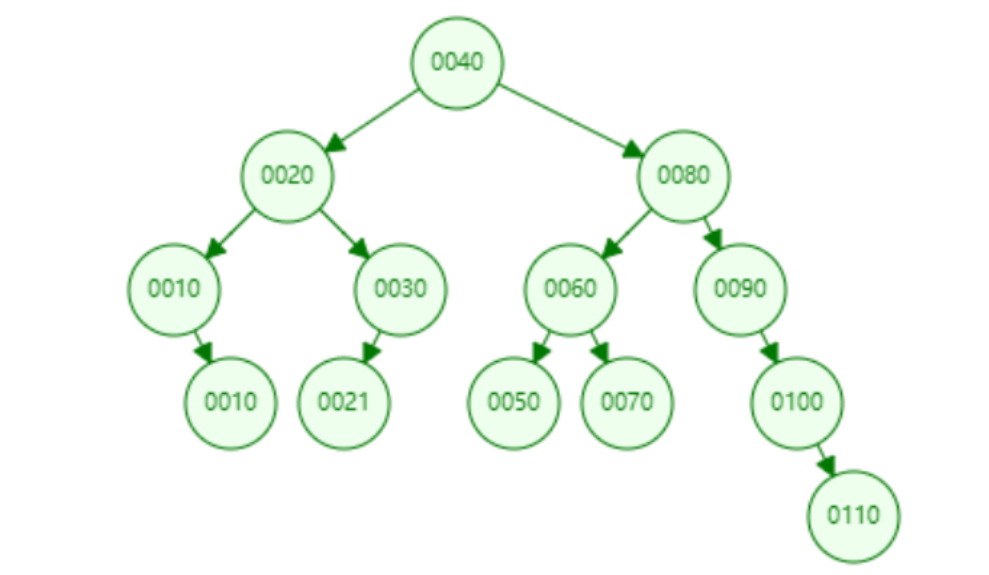
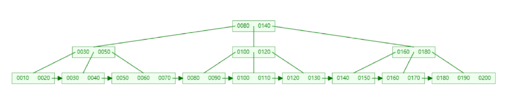
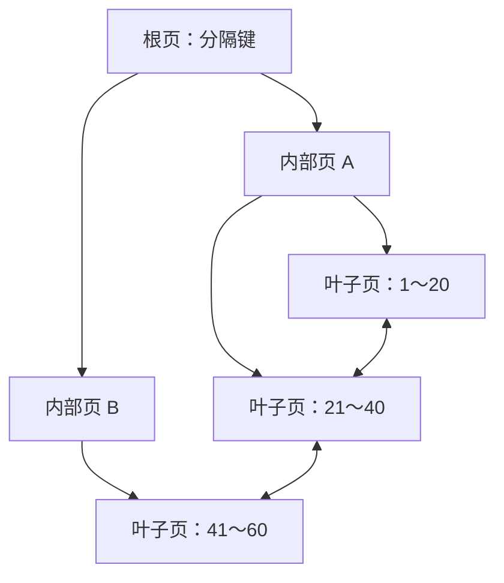
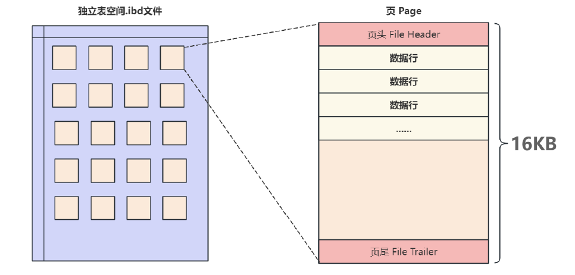
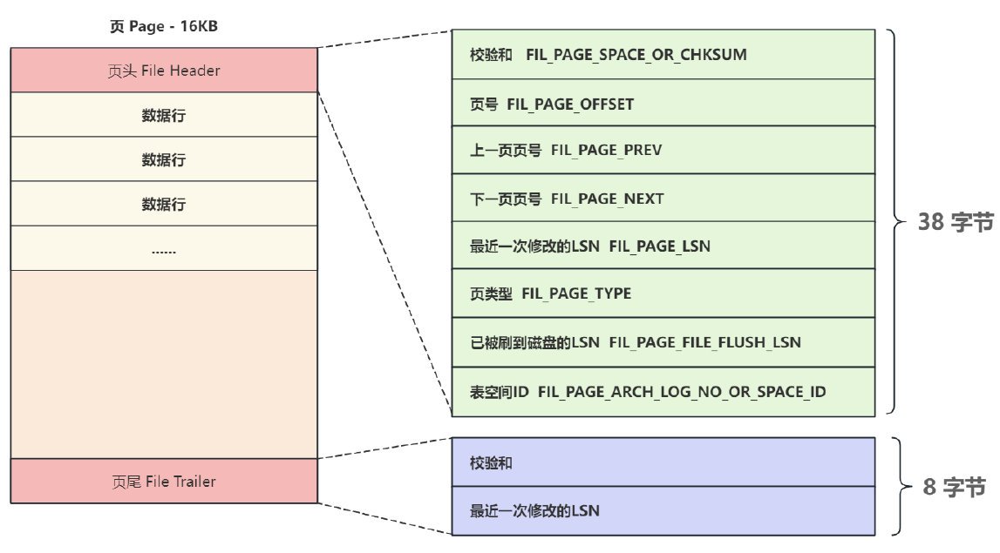
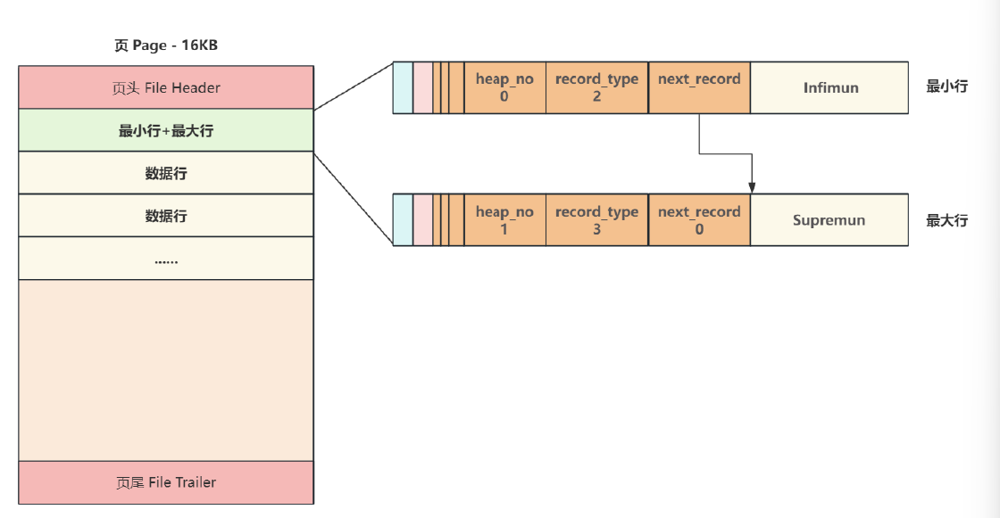
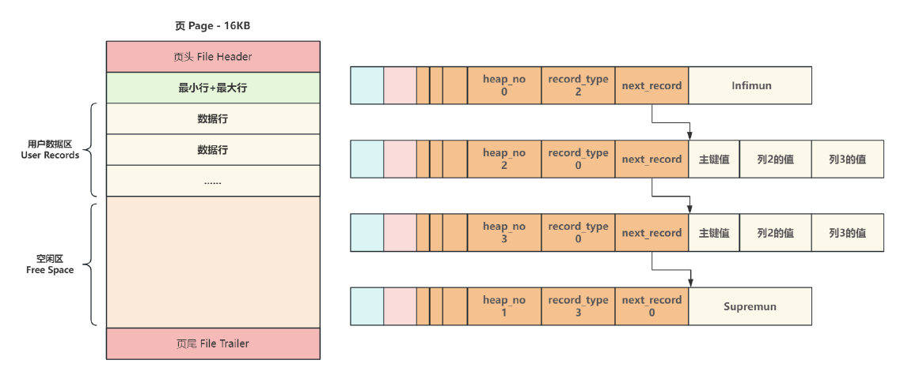
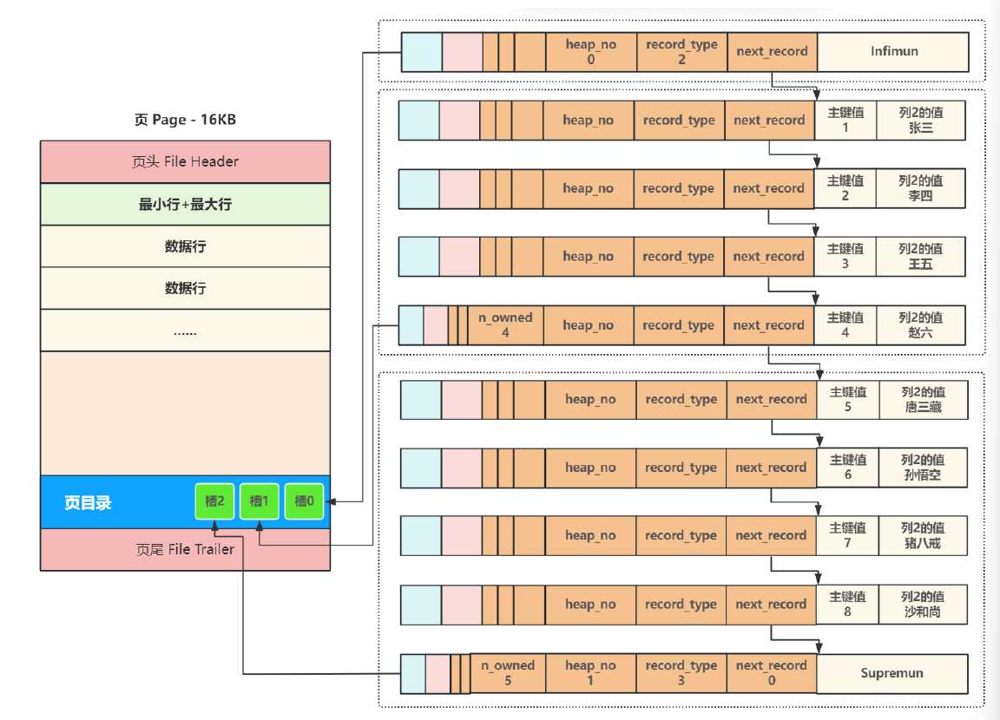
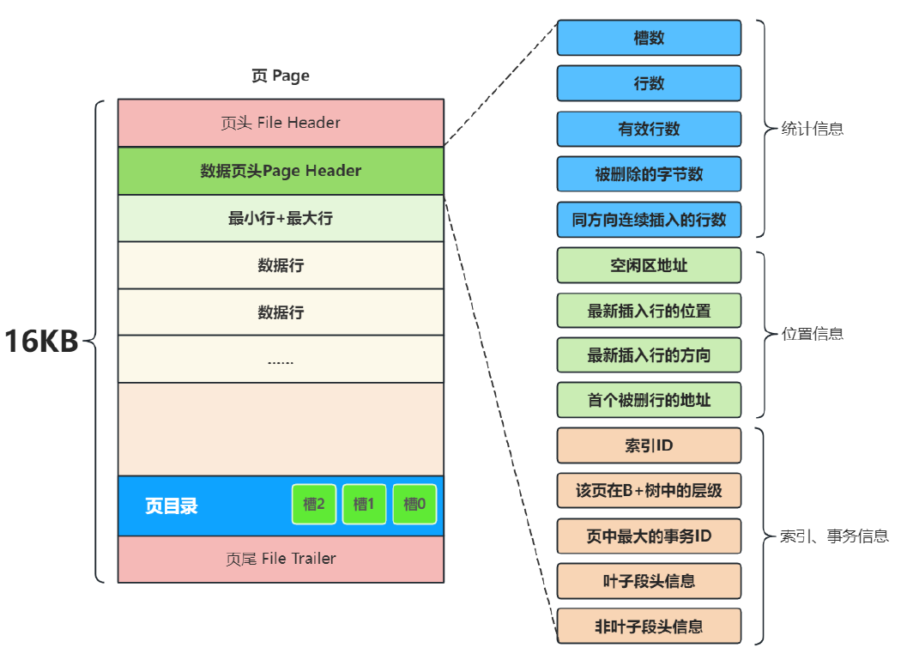
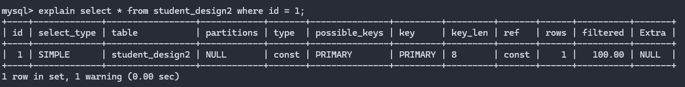

> 适用环境：MySQL 8.0，存储引擎以 InnoDB 为主。
>
> 索引的最终目标不是“数量多”，而是让常用查询以更少的页面访问得到更少的候选行。

---

## 1. 索引

索引是存储引擎维护的、有序的数据结构。它保存索引键及定位记录所需的信息，使 MySQL 不必从第一行扫描到最后一行

索引类似书的目录，但数据库索引还会随着数据变化而维护：

- `select` 可能因索引减少扫描、排序和回表；
- `insert`、`delete`、更新索引列时，需要同步修改索引；
- 索引占用磁盘与缓冲池空间；
- 优化器按成本选择执行计划，有索引不等于一定使用；

因此，索引是“以空间和写入成本换取读取效率”，适合高频查询，而不是给所有列机械建索引

---

## 2. InnoDB 主要使用 B+ 树

> [!NOTE]
>
> **InnoDB** 是 **MySQL** 的一种存储引擎，负责真正管理表的数据、索引、事务等底层操作

### 2.1 Hash 为什么不是默认选择

Hash 根据哈希值定位桶，平均等值查找很快，但键值没有顺序，难以支持 `<`、`between`、前缀排序和连续范围扫描。InnoDB 的普通索引只支持 B-tree；`MEMORY` 引擎才允许显式选择 Hash。InnoDB 内部的自适应哈希索引是一种自动优化机制，不能等同于用户创建的索引。

### 2.2 二叉树为什么不适合磁盘索引



普通二叉搜索树可能退化成链表；

AVL、红黑树虽能控制高度，但每个节点只有两个分支；

面对海量数据时树仍然较高；

索引节点通常按“页”存储，向下一层可能意味着访问另一个页面，所以数据库更希望一层容纳更多分支，减少树高和页面访问次数

### 2.3 B+ 树

#### 2.3.1 B+树的优势

B+ 树是多路平衡查找树，核心特点如下：



1. 非叶子节点主要保存分隔键和子页面指针，同一页可容纳较多分支，树通常很矮；
2. 真正的索引记录集中在叶子层，从根到任意叶子的路径长度相同；
3. 叶子页按键值顺序组织，并通过链表相连，找到范围起点后可顺序扫描；
4. 插入、删除会触发页分裂、合并或重平衡，仍能保持有序和平衡；



等值查询沿根页逐层缩小范围；范围查询先定位第一个叶子记录，再沿叶子页有序扫描。MySQL 文档常统称其为 B-tree，讨论 InnoDB 实现原理时通常称 B+ 树。

#### 2.3.2 B树与B+树的区别

| 区别         | B树          | B+树         |
| ------------ | ------------ | ------------ |
| 数据存在哪里 | 所有节点     | 只有叶子节点 |
| 非叶子节点   | 保存数据     | 只保存索引   |
| 叶子节点     | 没有特殊关系 | 通过链表连接 |
| 范围查询     | 一般         | 非常方便     |
| 数据库使用   | 较少         | 大量使用     |

---

## 3. MySQL 中的页

### 3.1 InnoDB 的数据页

页是 InnoDB 管理索引和数据的基本单位，索引页默认大小为 16KB：

```sql
show variables like 'innodb_page_size';
```

每一个页中即使没有数据也会使用`16KB`的存储空间；

一次查询需要的页若已在 Buffer Pool 中，可直接从内存读取；不在时才需要从磁盘加载。按页读取利用了局部性：刚访问的数据及其附近数据，近期再次使用的概率较高。

一个索引页可概括为：

| 区域 | 作用 |
| --- | --- |
| File Header / Trailer | 页号、校验及前后页等信息 |
| Page Header | 记录数、目录槽数、空闲空间等页内状态 |
| Infimum / Supremum | 表示页内最小、最大边界的系统记录 |
| User Records | 按索引键组织的用户记录 |
| Page Directory | 保存分组末端记录的槽，辅助页内二分定位 |

数据页的基本结构如下图：



页内记录通过链表维持逻辑顺序；查询时先对 Page Directory 的槽做二分定位，再在很小的分组内查找。B+ 树解决“定位哪一页”，页目录解决“在这一页的哪里”。叶子页之间的双向链表则服务于跨页范围扫描。

类似“**三层 B+ 树可存两千多万行**”只是基于固定页大小、索引项和行大小的估算。真实容量会受主键长度、行格式、变长列、页填充率和分裂影响；实际查询也不等于固定发生三次磁盘 I/O，因为根页和热点页通常已被缓存。

### 3.2 页文件头和页文件尾

页文件头与页文件尾中包含的信息如下图：



上图中我们只关注：上一页页号和下一页页号，就类似链表中的头节点、尾节点链接形成一个**双向链表**

### 3.3 页主体

页主体是保存真实数据的主要区域，在每当创建一个新页时，都会自动分配两个行，分别是页内最小行`Infimun`、页内最大行`Supremun`，这两行实际不存储任何真实信息，而是做为数据行链表的头和尾。

此外，每一个数据行都有一个记录下一行的地址偏移量的区域`next_record`将页内所有数据行组成了一个单向链表，其结构图如下：



当有一个新页插入数据时，将`Infimun`连接第一个数据行,最后一行真实数据行连接`Supremun`，该单向链表就如下图结构所示：



### 3.4 页目录

为了避免沿着链表顺序逐个比对查找每个页数百行数据，InnoDB通过二分查找法来解决查找效率问题；

所利用的方式就是在每一页中加入一个叫页目录`Page Directory`的结构，将页内包括头行、尾行在内的所有行进行分组，约定头行单独为一组，其他组**最多8条数据**，同时把每个组最后一行在页中的地址**按主键从小到大**的顺序记录在页目录中；

页目录中的每一个位置称为一个**槽**，每个槽都对应了一个分组，一旦分组中的数据行超过分组的上限8个时，就会分裂出一个新的分组；

所以后续在查询某行时，通过二分查找，先找到对应的槽，随后在槽内最多8个数据行中进行遍历即可；



### 3.5 数据页头

数据页头记录了当前页保存数据相关的信息，如下图：



## 4. 聚集索引、二级索引与回表

### 4.1 聚集索引

每张 InnoDB 表都有一个聚集索引，其叶子记录保存完整行数据，数据按聚集键组织：

1. 有 `primary key`：使用主键作为**聚集索引**；
2. 无主键：选择第一个所有列都为 `not null` 的 `unique` **唯一索引**作为聚集索引；
3. 两者都没有：创建名为 `GEN_CLUST_INDEX` 的**隐藏聚集索引**，使用 6 字节行 ID，也就是偷偷生成`DB_ROW_ID`，按照这个 `GEN_CLUST_INDEX` 隐藏ID建立聚集索引；

所以“主键索引就是聚集索引”只适用于通常的 InnoDB 主键场景，并非概念上的绝对同义关系。主键应尽量短、稳定；因为主键值还会存入每个二级索引。递增主键通常有利于顺序插入，但仍应先满足业务身份和分布式设计要求

### 4.2 二级索引与回表

聚集索引之外的索引称为**二级索引**。其叶子记录主要保存“二级索引列 + 对应主键值”。例如往篇中提及的在 `student_design2(name)` 上建索引后，按姓名查询的过程是：

1. 搜索姓名索引，得到匹配记录的主键 `id`；
2. 再用 `id` 搜索聚集索引，取得完整学生行。

第二步叫**回表**。如果查询**所需列已全部包含在同一个二级索引中**，可直接返回，这叫**覆盖索引**。例如索引 `(class_id, name)` 可覆盖：

```sql
select class_id, name
from student_design2
where class_id = 1;
```

覆盖索引减少回表，但不要为了覆盖 `select *` 而建立过宽索引；宽索引会降低单页容量并增加写入成本。

---

## 5. 索引的分类

| 分类角度 | 类型 | 含义 |
| --- | --- | --- |
| 业务与约束 | 主键、唯一、普通 | 主键标识行；唯一索引限制重复；普通索引只加速访问 |
| 索引列数 | 单列、复合 | 一个索引由一列或多列按顺序组成 |
| InnoDB 存储 | 聚集、二级 | 叶子保存完整行，或保存索引键与主键 |
| 专用用途 | 全文、空间 | 全文检索使用倒排结构；空间索引使用 R-tree |

约束负责数据规则，索引负责访问路径，两者不是同一种对象。`primary key`、`unique` 会用唯一索引实现；外键要求相关列存在可用索引，从表缺少时 MySQL 会自动创建，但这不代表外键就是索引。

---

## 6. 索引操作

### 6.1 手动创建索引

#### 6.1.1 主键索引

主键列的值必须唯一且非空，一张表只能定义一个主键，但主键可以由多列组成。

##### 方式一：建表时使用列级语法

适合单列主键，写法最简洁。

```sql
create table t_user_pk1 (
    id bigint unsigned primary key auto_increment,
    username varchar(30) not null
);
```

##### 方式二：建表时使用表级语法

主键定义与字段定义分开，结构更清晰，并且可以定义复合主键。

```sql
create table t_user_pk2 (
    id bigint unsigned auto_increment,
    username varchar(30) not null,
    primary key (id)
);
```

##### 方式三：给已有表添加主键

先添加主键，再设置自增，是因为 `auto_increment` 列必须受到索引支持。

```sql
create table t_user_pk3 (
    id bigint unsigned not null,
    username varchar(30) not null
);

alter table t_user_pk3
    add primary key (id);

alter table t_user_pk3
    modify id bigint unsigned not null auto_increment;
```

添加前必须检查已有的 `id` 是否包含 `NULL` 或重复值，否则主键创建会失败。`CREATE INDEX` 不能创建主键，已有表必须使用 `ALTER TABLE ... ADD PRIMARY KEY`；

#### 6.1.2 唯一索引

唯一索引用于电话号码、学号、邮箱等不可重复的业务字段。若字段允许 `NULL`，MySQL 唯一索引通常允许多个 `NULL`；要求必须填写且唯一时，应同时定义 `NOT NULL`。

##### 方式一：建表时使用列级语法

```sql
create table t_user_uk1 (
    id bigint unsigned primary key auto_increment,
    username varchar(30) not null unique
);
```

##### 方式二：建表时命名唯一约束

显式命名便于根据业务含义识别和删除，工程中更推荐这种写法。

```sql
create table t_user_uk2 (
    id bigint unsigned primary key auto_increment,
    username varchar(30) not null,
    constraint uk_user_username unique (username)
);
```

##### 方式三：给已有表添加唯一约束

```sql
alter table t_user_uk3
    add constraint uk_user_username unique (username);
```

##### 方式四：使用独立的索引语句

```sql
create unique index uk_user_username
    on t_user_uk4 (username);
```

`UNIQUE` 强调“不允许重复”的数据规则，`UNIQUE INDEX` 强调实现该规则的索引结构；在 MySQL 中，两者都会建立唯一索引；

#### 6.1.3 普通索引

普通索引只提供查询访问路径，不限制字段值重复。索引名建议使用 `idx_表或业务_字段`，便于维护。

##### 方式一：建表时创建

```sql
create table t_user_idx1 (
    id bigint unsigned primary key auto_increment,
    phone varchar(20),
    index idx_user_phone (phone)
);
```

##### 方式二：使用 `ALTER TABLE` 给已有表添加

```sql
alter table t_user_idx2
    add index idx_user_phone (phone);
```

##### 方式三：使用 `CREATE INDEX` 独立创建

```sql
create index idx_user_phone
    on t_user_idx3 (phone);
```

方式二和方式三最终都给已有表增加索引。`ALTER TABLE` 适合把多项表结构调整写在一起，`CREATE INDEX` 的语义则更直观。

MySQL 8.0.13 及以上还支持函数索引，表达式需要额外一层括号：

```sql
create index idx_user_birth_year
    on t_user_idx3 ((year(birthday)));
```

函数索引保存的是表达式结果，适合不能改写成原列范围查询、且确实频繁使用相同表达式的场景；

#### 6.2.4 复合索引

复合索引包含两个或更多索引列，创建语法与单列索引相同，只需按查询需要排列多个字段。具体利用规则见第 7 节“复合索引与最左前缀”。

##### 方式一：建表时创建

```sql
create table t_user_multi1 (
    id bigint unsigned primary key auto_increment,
    class_id bigint unsigned not null,
    username varchar(30) not null,
    index idx_user_class_name (class_id, username)
);
```

##### 方式二：使用 `ALTER TABLE` 添加

```sql
alter table t_user_multi2
    add index idx_user_class_name (class_id, username);
```

##### 方式三：使用 `CREATE INDEX` 创建

```sql
create index idx_user_class_name
    on t_user_multi3 (class_id, username);
```

复合索引也可以具有主键或唯一属性：

```sql
-- 复合主键：同一学生与同一课程只能形成一条记录
primary key (student_id, course_id)

-- 复合唯一索引：同一班级中学号不能重复
unique index uk_student_class_sno (class_id, sno)
```

### 6.2 查看索引

#### 6.2.1 查看完整索引信息

下面三种写法等价，实际使用一种即可：

```sql
show index from t_user_multi1;
show indexes from t_user_multi1;
show keys from t_user_multi1;
```

MySQL 命令行客户端可用 `\G` 将宽表结果纵向显示：

```sql
show keys from t_user_multi1\G
```

`\G` 是客户端结束符，不是标准 SQL 语法。在 DBeaver 中通常直接执行带分号的 `SHOW INDEX`，通过结果网格查看即可。

| 字段           | 含义                                          |
| -------------- | --------------------------------------------- |
| `Key_name`     | 索引名称；主键固定为 `PRIMARY`                |
| `Non_unique`   | `0` 表示不允许重复，`1` 表示允许重复          |
| `Seq_in_index` | 当前列在复合索引中的顺序，从 `1` 开始         |
| `Column_name`  | 索引列名                                      |
| `Cardinality`  | 不同值数量的估算，不是精确统计值              |
| `Index_type`   | 索引结构，InnoDB 普通索引通常显示 `BTREE`     |
| `Visible`      | 该索引是否对优化器可见                        |
| `Expression`   | 函数索引使用的表达式，普通列索引通常为 `NULL` |

#### 6.2.2 查看表结构摘要

```sql
desc t_user_multi1;
```

`DESC` 的 `Key` 列只提供摘要：`PRI` 表示主键，`UNI` 表示唯一索引，`MUL` 表示该列可出现重复值的索引。它不能完整展示索引名和复合索引列顺序，因此不能代替 `SHOW INDEX`。

#### 6.2.3 查看真实建表定义

```sql
show create table t_user_multi1;
```

修改或删除索引前先查看建表语句，可以确认字段完整属性、约束名和索引名，避免删除错对象。

#### 6.2.4 查看是否使用索引

使用 `explain + select ` 查询可以知道该查询**是否使用了索引**以及**使用了哪个索引**

例如：



1. `select_type`：查询类型，常见有`simple`、`primary`、`subquery`、`derived`、`union`；

2. `type`：MySQL 访问这张表时采用什么方式。排序有以下 

   【**好** <- system、const、eq_ref、ref、fulltext、ref_or_null、index_merge、unique_subquery、index_subquery、range、index、ALL -> **差**】；

   All：全表扫描

   **index**：扫描全部索引树

   range：扫描部分索引，索引范围扫描，对索引的扫描开始于某一点，返回匹配值域的行，常见于between、<、>等的查询

   **ref**：使用非唯一索引或非唯一索引前缀进行的查找，不是主键或不是唯一索引

   （eq_ref和const的区别）

   **eq_ref**：唯一索引性扫描，对于每个索引键，表中只有一条记录与之匹配。常见于主键或唯一索引扫描

   **const**、**system**：单表中最多有一个匹配行，查询起来非常迅速，例如根据主键或唯一索引查询。system是const类型的特例，当查询的表只有一行的情况下，使用system。

   **NULL**：不用访问表或者索引，直接就能得到结果

3. possible_keys：MySQL 判断这条 SQL **可能使用的索引**，但不代表最终真的用了；

4. key：这个才表示 MySQL 最终实际选择使用的索引；

5. Extra：执行情况的说明和描述，常见有以下

| Extra                          | 含义                                           |
| ------------------------------ | ---------------------------------------------- |
| `Using index`                  | 使用覆盖索引，不需要回表读取完整行             |
| `Using where`                  | 还需要通过 WHERE 条件进行过滤                  |
| `Using index condition`        | 使用索引条件下推（ICP）                        |
| `Using temporary`              | 使用临时表                                     |
| `Using filesort`               | 需要额外排序                                   |
| `Using index for group-by`     | GROUP BY / DISTINCT 等利用索引优化             |
| `Impossible WHERE`             | WHERE 条件不可能成立                           |
| `Select tables optimized away` | 优化器可以直接得到结果，不需要按常规方式访问表 |
| `NULL`                         | 没有额外信息                                   |

### 6.3 修改索引

MySQL 可以重命名索引：

```sql
alter table t_user_multi1
    rename index idx_user_class_name to idx_user_class_username;
```

但不能直接修改索引包含的字段或字段顺序。此时应先删除旧索引，再创建新索引；把两个动作写在同一条 `ALTER TABLE` 中，可以清楚表达一次结构调整：

```sql
alter table t_user_multi1
    drop index idx_user_class_username,
    add index idx_user_name_class (username, class_id);
```

MySQL 8.0 还可修改非主键索引的可见性，用于验证优化器不使用该索引时的执行计划：

```sql
alter table t_user_multi1
    alter index idx_user_name_class invisible;

alter table t_user_multi1
    alter index idx_user_name_class visible;
```

不可见索引仍会在写入时维护，所以它不能减少索引的空间和写入成本。

### 6.4 删除索引

删除前先执行 `SHOW CREATE TABLE` 或 `SHOW INDEX`，原因是主键、唯一约束、外键和普通索引的删除语法及依赖关系不同。

#### 6.4.1 删除主键索引

```sql
alter table t_user_pk1
    drop primary key;
```

主键名固定为 `PRIMARY`，不能使用普通的 `DROP INDEX 索引名` 代替。若主键列带有 `auto_increment`，并且主键是支持该自增列的唯一索引，直接删除会报错。应先核对字段完整定义，再移除自增属性：

```sql
-- 第一步：确认 unsigned、not null、default、comment 等原有属性
show create table t_user_pk1;

-- 第二步：只移除 auto_increment，其他需要保留的属性必须重新写全
alter table t_user_pk1
    modify id bigint unsigned not null;

-- 第三步：自增依赖解除后再删除主键
alter table t_user_pk1
    drop primary key;
```

`MODIFY` 不会自动保留未写出的字段属性，因此不能不看原定义就机械执行 `MODIFY id BIGINT`。生产表还应先检查该主键是否被其他表的外键引用。

#### 6.4.2 删除普通、唯一或复合索引

以下两种写法等价：

```sql
drop index idx_user_phone on t_user_idx1;

alter table t_user_idx1
    drop index idx_user_phone;
```

删除唯一索引会同时取消它所实现的唯一性规则。删除复合索引会删除整个索引，不能只从索引中直接移除某一列；若需改变列组成，应删除后重建。

外键约束与支持外键的索引是两个对象。如果某索引仍被外键检查需要，MySQL 会拒绝直接删除；应先确认依赖，再决定是保留索引、建立替代索引，还是删除对应外键约束。

---

## 参考

- [MySQL 8.0：InnoDB 聚集索引与二级索引](https://dev.mysql.com/doc/refman/8.0/en/innodb-index-types.html)
- [MySQL 8.0：InnoDB 索引物理结构](https://dev.mysql.com/doc/refman/8.0/en/innodb-physical-structure.html)
- [MySQL 8.0：复合索引](https://dev.mysql.com/doc/refman/8.0/en/multiple-column-indexes.html)
- [MySQL 8.0：B-tree 与 Hash 索引](https://dev.mysql.com/doc/refman/8.0/en/index-btree-hash.html)
- [MySQL 8.0：CREATE INDEX](https://dev.mysql.com/doc/refman/8.0/en/create-index.html)
- [MySQL 8.0：EXPLAIN](https://dev.mysql.com/doc/refman/8.0/en/explain.html)
