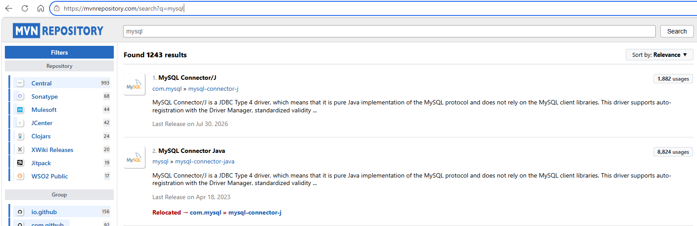
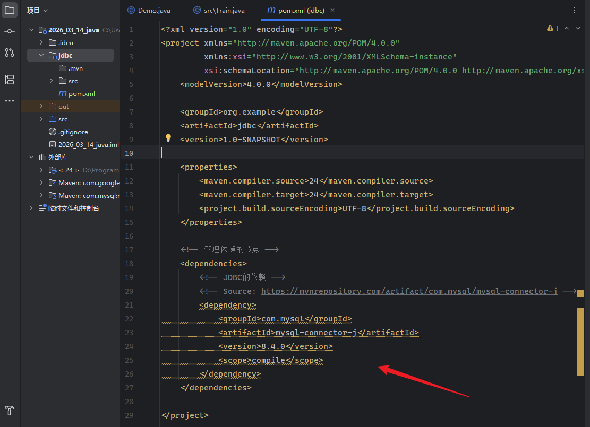
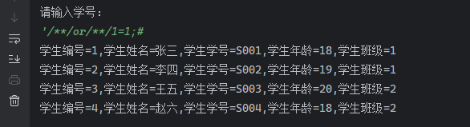

> 适用环境：Java 8 及以上、JDBC 4.2、MySQL 8.0.39。
>
> 该部分内容为了解，实际中数据库连接已被包装好，仅需调用即可


## 1. JDBC 是什么

JDBC（Java Database Connectivity）**是 Java 访问关系型数据库的一套标准 API**，具体实现是由数据库厂商去完成的。它规定了连接数据库、发送 SQL、接收结果和处理异常的统一接口，真正与 MySQL 通信的代码则由 MySQL 驱动实现。

可以把三者的关系理解为：

```text
Java 程序 → JDBC 标准接口 → MySQL Connector/J 驱动 → MySQL 服务器
```

业务代码主要面向 `java.sql`、`javax.sql` 中的接口编程。更换数据库时虽然仍要调整驱动、地址和方言 SQL，但操作流程基本不变。

一次完整的 JDBC 操作通常包括：

1. 引入数据库驱动；
2. 获取 `Connection` 连接；
3. 定义 SQL，并创建 `PreparedStatement`；
4. 为 SQL 中的占位符绑定参数；
5. 执行 SQL；
6. 处理执行结果：增删改读取影响行数，查询读取 `ResultSet`；
7. 按照结果集、执行对象、数据库连接的顺序释放资源。

如果多条增删改语句属于同一个业务，还要在同一个连接中统一提交或回滚事务。上面的顺序就是后文各节的编排顺序，也对应一段 JDBC 程序从开始到结束的实际执行过程。

---

## 2. 引入 MySQL 驱动

### 2.1 Maven 依赖

maven：类似应用商店，在maven仓库中维护了所有的Java工程需要用到的依赖，IDEA中已经内置好了maven

由于我的mysql版本为8.4.xx，因此使用的maven对应的是下面这部分依赖；

不同版本可以到[Maven Repository: mysql](https://mvnrepository.com/search?q=mysql)此处找对应版本依赖



第一个 MySQL Connector-j 为最新版本的依赖推荐

**IDEA创建模块选择maven后，在其下的pom.xml插入该依赖**



```xml
<dependency>
    <groupId>com.mysql</groupId>
    <artifactId>mysql-connector-j</artifactId>
    <version>8.4.0</version>
    <scope>compile</scope>
</dependency>
```

驱动必须进入运行时类路径，否则连接时会出现 `No suitable driver` 一类错误。

**如无法加载该依赖，则还需修改镜像源**

### 2.2 配置国内镜像

内置的maven路径：IDEA安装目录/plugins/maven/lib/maven3/conf/setting.xml

```xml
<!-- 加入如下 Mirror 节点，使用国内阿里云仓库镜像 开始 -->
<mirror>
    <id>aliyunmaven</id>
    <mirrorOf>*</mirrorOf>
    <name>阿里云公共仓库</name>
    <url>https://maven.aliyun.com/repository/public</url>
</mirror>

<mirror>
    <id>central</id>
    <mirrorOf>*</mirrorOf>
    <name>aliyun central</name>
    <url>https://maven.aliyun.com/repository/central</url>
</mirror>

<mirror>
    <id>spring</id>
    <mirrorOf>*</mirrorOf>
    <name>aliyun spring</name>
    <url>https://maven.aliyun.com/repository/spring</url>
</mirror>
<!-- 加入如下 Mirror 节点，使用国内阿里云仓库镜像 结束 -->
```

### 2.3 是否还要手动加载驱动

旧代码常写 `Class.forName("com.mysql.cj.jdbc.Driver")`。从 JDBC 4 开始，驱动通常会自动注册，现代项目一般可以不用写。自动加载失败时，先检查运行时依赖；旧环境或特殊类加载器才可能显式调用。

---

## 3. 核心接口

| 接口或类 | 作用 |
|---|---|
| `DriverManager` | 根据 JDBC URL 获取连接，适合简单程序和入门练习 |
| `DataSource` | 对“连接来源”的抽象，更适合配置、容器和连接池环境 |
| `Connection` | 表示一次数据库会话，也负责事务控制 |
| `Statement` | 执行不带参数的静态 SQL，不适合拼接外部输入 |
| `PreparedStatement` | 预编译 SQL、绑定参数，是日常增删改查的首选 |
| `CallableStatement` | 调用存储过程，继承自 `PreparedStatement` |
| `ResultSet` | 保存查询结果，并通过游标逐行读取 |
| `SQLException` | JDBC 操作异常，可取得状态码、错误码和错误信息 |

这些对象多数是接口，变量也应尽量声明为接口类型，减少对具体驱动的依赖。

---

## 4. 建立数据库连接

### 4.1 JDBC URL

MySQL 连接地址的基本格式是：

```text
jdbc:mysql://主机:端口/数据库?参数1=值1&参数2=值2
```

本机练习可以写成：

```text
jdbc:mysql://127.0.0.1:3306/jdbc_demo?sslMode=DISABLED&allowPublicKeyRetrieval=true
```

其中，`127.0.0.1:3306` 是主机和端口，`jdbc_demo` 是数据库。后两个参数用于**关闭 TLS**、**允许获取认证公钥**，只适合可信的本地环境。生产环境应配置 TLS 和严格的证书校验，不能为了消除报错而照搬这两个参数。

### 4.2 使用 `DriverManager`

```java
import java.sql.Connection;
import java.sql.DriverManager;
import java.sql.SQLException;

public final class JdbcConfig {
    private static final String URL =
        "jdbc:mysql://127.0.0.1:3306/jdbc_demo"
        + "?sslMode=DISABLED&allowPublicKeyRetrieval=true";
    private static final String USER = System.getenv("DB_USER");
    private static final String PASSWORD = System.getenv("DB_PASSWORD");

    // 私有构造方法，禁止随意创建JdbcConfig对象
    private JdbcConfig() {}
	
    // 建立数据库连接
    public static Connection getConnection() throws SQLException {
        return DriverManager.getConnection(URL, USER, PASSWORD);
    }
}
```

由于方法都是静态方法，所以只需要使用JdbcConfig.function()调用即可，不需要创建对象。

账号和密码通过环境变量读取，避免直接写入源码并提交到仓库。应用程序也不应长期使用 `root`，应为它创建只拥有所需权限的独立账号。

### 4.3 `DataSource` 与连接池

**`DataSource`** 是 JDBC 提供的一个**标准接口**，但**不等于连接池**。`MysqlDataSource` 是基础数据源；HikariCP 等连接池会实现或包装它。使用连接池后，`close()` 通常表示归还连接，仍要及时调用。

`DataSource` 作用是：

> 向程序提供 `Connection`，并把连接地址、用户名、密码等配置集中管理起来；

使用方式为：

```java
Connection connection = dataSource.getConnection();
```

但使用连接池仍然需要close()：

```java
connection.close();
```


**连接池**可以理解为一个专门存放数据库连接的“容器”。

程序启动后，连接池会提前建立多个连接：

```txt
连接池
├── Connection 1：空闲
├── Connection 2：正在使用
├── Connection 3：空闲
└── Connection 4：空闲
```

比起 `DriverManager` 每次调用 `getConnection()`通常都要重新建立一次数据库连接，连接池够创建多个连接；可以避免频繁创建和关闭连接，节省开销。

---

## 5. 定义 SQL、创建执行对象与参数绑定

不要把外部输入拼进 SQL，例如 `"... where name='" + inputName + "'"`。输入中的引号或逻辑表达式可能改变语句结构，形成 **SQL 注入**。

可以举个例子（**SQL注入演示**）：

```java
System.out.println("请输入学号：");
            String sno = scanner.next();
            String sql = "select id,name,sno,age,class_id from student_design2 where sno = '"+ sno +"'";
            // 5.执行SQL，获取查询结果
            resultSet = statement.executeQuery(sql);  
```

由于使用的是 `Scanner.next()` ,`Scanner.next()` 遇到空格就停止读取。

因此我们可以**用别的表示方法绕过空格**，比如 `/**/` ，如果是网页中注入的话，通过url可以有：

> %20 --代表url编码的空格，在空格过滤时可以代替。
>
> %09--用于在输出或显示文本时在该位置产生一个固定的水平间距，类似于tab键。
>
> %0a--代表换行符
>
> %0b--用于在输出或显示文本时在该位置产生一个固定的垂直间距，类似于tab键。
>
> %0d--回车换行
>
> %a0--代表的是非断行空格
>
> %00--%00代表的是ASCII码中的空字符

都是之前学攻防的底子哈哈哈哈哈

因此可以这样注入：`'/**/or/**/1=1;#`，使得查询语句被这样闭合

> `select id, name, sno, age, class_id from student_design2 where sno = ' sno ' or 1=1;#`

使用**#**将后续语句屏蔽，由于**1=1**恒成立，因此完成全查询




**所以应把 SQL 结构与参数值分开**：

用预编译的方式 `PreparedStatement` 解决SQL注入问题

```java
String sql = "select id, name, age from student where name = ? and age >= ?";

try (PreparedStatement ps = connection.prepareStatement(sql)) {
    ps.setString(1, inputName);
    ps.setInt(2, minAge);

    // 参数绑定完成后，在同一个 try 代码块中执行 SQL
}
```

这里的实际顺序是：先定义带 `?` 的 SQL，再通过连接创建 `PreparedStatement`，最后调用 `setXxx()` 绑定参数。绑定完成后，才能在同一个 `PreparedStatement` 上执行 SQL。

使用时要记住：

- `?` 是参数占位符，编号从 **1** 开始；
- 占位符外不要再加引号，应写 `name = ?`，不能写 `name = '?'`；
- `setString`、`setInt`、`setBigDecimal` 等方法会按类型安全传值；
- Java 值为 `null` 时可使用 `setNull(index, Types.INTEGER)`，或在驱动支持的情况下使用 `setObject`；
- 占位符只能代表“值”，不能代替表名、列名、`ASC/DESC` 等 SQL 结构。动态结构必须使用白名单选择，不能直接拼接外部输入。

`PreparedStatement` 既降低 SQL 注入风险，也让类型转换和重复执行更清晰，应作为业务代码的默认选择。

---

## 6. 执行 SQL 的三个方法

| 方法 | 适用场景 | 返回值 |
|---|---|---|
| `executeQuery()` | `SELECT` 查询 | `ResultSet` |
| `executeUpdate()` | `INSERT`、`UPDATE`、`DELETE`，以及部分 DDL | `int`，表示驱动报告的影响行数 |
| `execute()` | 结果类型事先不确定、可能返回多个结果 | `boolean`，`true` 表示当前结果为 `ResultSet` |

日常代码应选含义最明确的方法。不要对查询调用 `executeUpdate()`，也不要为了省事全部使用 `execute()`。

调用存储过程时使用 `CallableStatement`，形如 `prepareCall("{call procedure_name(?, ?)}")`；输出参数先用 `registerOutParameter` 注册。

---

## 7. 增删改查写法

以下代码假设 `student` 表含有自增主键 `id`、姓名 `name`、年龄 `age` 和创建时间 `created_at`。

### 7.1 新增并取得自增主键

```java
String sql = "insert into student(name, age) values (?, ?)";

try (Connection conn = JdbcConfig.getConnection();
     PreparedStatement ps = conn.prepareStatement(
         sql, Statement.RETURN_GENERATED_KEYS)) {

    ps.setString(1, "小林");
    ps.setInt(2, 20);

    int rows = ps.executeUpdate();
    if (rows == 1) {
        try (ResultSet keys = ps.getGeneratedKeys()) {
            if (keys.next()) {
                long newId = keys.getLong(1);
                System.out.println("新增编号：" + newId);
            }
        }
    }
}
```

只有创建语句时传入 `Statement.RETURN_GENERATED_KEYS`，执行后才能规范地读取生成的主键。

### 7.2 删除

```java
String sql = "delete from student where id = ?";

try (Connection conn = JdbcConfig.getConnection();
     PreparedStatement ps = conn.prepareStatement(sql)) {
    ps.setLong(1, 1L);

    int rows = ps.executeUpdate();
    System.out.println("删除行数：" + rows);
}
```

删除前要确认 `WHERE` 条件正确，并检查影响行数。没有 `WHERE` 条件的 `DELETE` 可能删除整张表中的记录。

### 7.3 修改

```java
String sql = "update student set age = ? where id = ?";
try (Connection conn = JdbcConfig.getConnection();
     PreparedStatement ps = conn.prepareStatement(sql)) {
    ps.setInt(1, 21);
    ps.setLong(2, 1L);
    int rows = ps.executeUpdate();
    System.out.println("修改行数：" + rows);
}
```

新增、删除和修改都使用 `executeUpdate()`，并通过返回的影响行数判断条件是否匹配、操作是否符合预期。

### 7.4 查询

```java
String sql = "select id, name, age from student where age >= ?";

try (Connection conn = JdbcConfig.getConnection();
     PreparedStatement ps = conn.prepareStatement(sql)) {
    ps.setInt(1, 18);

    try (ResultSet rs = ps.executeQuery()) {
        while (rs.next()) {
            long id = rs.getLong("id");
            String name = rs.getString("name");
            int age = rs.getInt("age");
            System.out.println(id + "，" + name + "，" + age);
        }
    }
}
```

查询使用 `executeQuery()` 获得 `ResultSet`，然后移动游标并读取每一行。查询结果的具体读取规则见下一节。

---

## 8. 读取 `ResultSet`

查询刚返回时，游标位于第一行之前。每次调用 `next()`，游标向后移动一行；有数据时返回 `true`，越过最后一行时返回 `false`。所以多行查询使用 `while (rs.next())`，只期待一行时可以使用 `if (rs.next())`。

读取列时推荐使用列名或别名，可读性比数字下标更好。联表查询若出现重名列，可写 `c.name as class_name`，再通过 `rs.getString("class_name")` 读取。

常见类型对应关系：

| MySQL 类型 | 推荐 Java 类型 | 常用方法 |
|---|---|---|
| `VARCHAR`、`TEXT` | `String` | `getString`、`setString` |
| `INT` | `int` / `Integer` | `getInt`、`setInt` |
| `BIGINT` | `long` / `Long` | `getLong`、`setLong` |
| `DECIMAL` | `BigDecimal` | `getBigDecimal`、`setBigDecimal` |
| `DATE` | `LocalDate` | `getObject(..., LocalDate.class)` |
| `DATETIME`、`TIMESTAMP` | `LocalDateTime` | `getObject(..., LocalDateTime.class)` |
| `BLOB` | `byte[]` 或流 | `getBytes`、`getBinaryStream` |

`getInt`、`getLong` 等基本类型方法遇到 SQL `NULL` 会返回 `0`，因此可在读取后调用 `wasNull()`；如果业务上需要区分“空值”和“数字 0”，应使用包装类型保存结果。金额不要用 `double`，应使用 `BigDecimal`。

---

## 9. 释放资源

执行结果处理完毕后，应关闭 `ResultSet`、`Statement` 或 `PreparedStatement`、`Connection`。推荐使用 **try-with-resources**：

```java
String sql = "select id, name, age from student where id = ?";

try (Connection connection = JdbcConfig.getConnection();
     PreparedStatement ps = connection.prepareStatement(sql)) {

    ps.setLong(1, 1L);

    try (ResultSet rs = ps.executeQuery()) {
        if (rs.next()) {
            System.out.println(rs.getString("name"));
        }
    }
}
```

Java 会自动按照声明的相反顺序关闭资源，因此实际关闭顺序是：

1. `ResultSet`；
2. `PreparedStatement`；
3. `Connection`。

这与手动在 `finally` 中“先关闭结果集，再关闭执行对象，最后关闭连接”的顺序相同。try-with-resources 比逐个判空关闭更简洁，也能在发生异常时可靠释放资源。使用连接池时，`connection.close()` 通常表示把连接归还连接池，仍然必须调用。

---

## 10. JDBC 事务

新连接默认开启自动提交，即每条 SQL 执行成功后立即提交。一个业务动作包含多条 SQL 时，必须在**同一个 `Connection`** 上关闭自动提交，再统一提交或回滚。

```java
public static void transfer(long fromId, long toId, BigDecimal amount)
        throws SQLException {
    try (Connection conn = JdbcConfig.getConnection()) {
        boolean oldAutoCommit = conn.getAutoCommit();
        try {
            conn.setAutoCommit(false);

            String debitSql = "update account set balance = balance - ? "
                            + "where id = ? and balance >= ?";
            try (PreparedStatement debit = conn.prepareStatement(debitSql)) {
                debit.setBigDecimal(1, amount);
                debit.setLong(2, fromId);
                debit.setBigDecimal(3, amount);
                if (debit.executeUpdate() != 1) {
                    throw new SQLException("扣款失败：账号不存在或余额不足");
                }
            }

            String creditSql =
                "update account set balance = balance + ? where id = ?";
            try (PreparedStatement credit = conn.prepareStatement(creditSql)) {
                credit.setBigDecimal(1, amount);
                credit.setLong(2, toId);
                if (credit.executeUpdate() != 1) {
                    throw new SQLException("收款账号不存在");
                }
            }

            conn.commit();
        } catch (SQLException e) {
            conn.rollback();
            throw e;
        } finally {
            conn.setAutoCommit(oldAutoCommit);
        }
    }
}
```

关键是多条语句共用同一连接，全部成功才 `commit()`，任意一步失败都 `rollback()`。归还池前还要恢复原来的 `autoCommit`，避免影响下一位使用者；事务中途不能重新获取连接。

数据库表还必须使用支持事务的存储引擎，例如 InnoDB，否则 Java 代码写了回滚也达不到预期效果。

---

## 11. 异常排查

排错时应保留 `SQLException` 的状态码、数据库错误码和信息：

```java
catch (SQLException e) {
    System.err.println("SQLState：" + e.getSQLState());
    System.err.println("错误码：" + e.getErrorCode());
    System.err.println("错误信息：" + e.getMessage());
    throw e;
}
```

| 现象 | 常见检查方向 |
|---|---|
| `No suitable driver` | 驱动依赖是否进入运行时、URL 是否以 `jdbc:mysql:` 开头 |
| `Access denied` | 用户名、密码、连接来源和 MySQL 授权是否匹配 |
| `Unknown database` | 数据库是否创建，URL 中名称是否拼错 |
| `Communications link failure` | MySQL 是否启动，地址、端口、防火墙是否正确 |
| `Public Key Retrieval is not allowed` | 优先配置 TLS；可信本机可按需启用公钥获取 |
| SQL 语法异常 | 在数据库客户端中验证 SQL，并检查字段、表名和占位符数量 |

日志可记录 SQL 模板、SQLState 和错误码，但不能输出密码等敏感参数。异常也不能空处理，否则上层会误以为业务成功。

---

## 参考

- [MySQL Connector/J：使用 Maven 安装](https://dev.mysql.com/doc/connector-j/en/connector-j-installing-maven.html)
- [Java JDBC API：Connection](https://docs.oracle.com/en/java/javase/25/docs/api/java.sql/java/sql/Connection.html)
- [Java JDBC API：PreparedStatement 与 ResultSet](https://docs.oracle.com/en/java/javase/25/docs/api/java.sql/java/sql/PreparedStatement.html)
