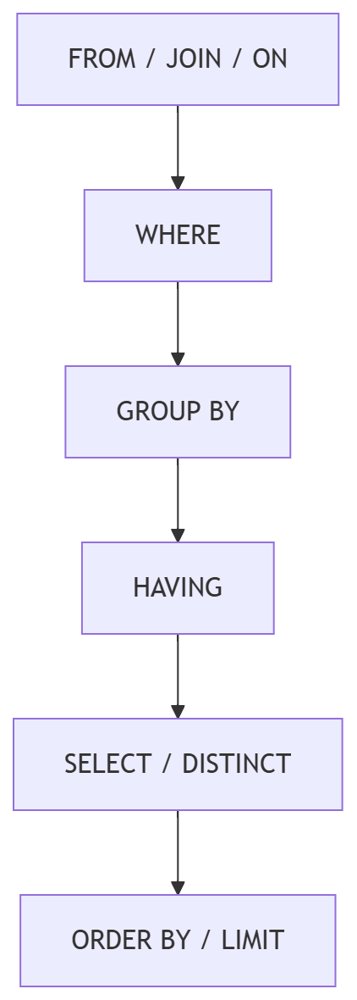

> 适用环境：MySQL 8.0（示例按 MySQL 8.0.39 编写）  

## 1. 联合查询解决什么问题

规范化会把实体拆到不同表中；读取完整业务信息时，需要重新组合数据

“联合查询”在本章中是一个宽泛概念，主要包括：

| 类型 | 解决的问题 | 常用语法 |
| --- | --- | --- |
| 表连接 | 横向组合有关联的表，增加列 | `join`、`left join` |
| 子查询 | 把一个查询的结果交给另一个查询使用 | `in`、`exists`、标量子查询 |
| 集合查询 | 纵向合并多个结构相同的结果集，增加行 | `union`、`union all` |
| 查询结果写入 | 把查询出的行保存到表中 | `insert ... select`、`create table ... select` |

外键不会自动连接表，查询仍须写连接条件

## 2. 多表查询的逻辑与实际执行

### 2.1 用笛卡尔积理解逻辑结果

若 A 表有 3 行、B 表有 4 行，交叉连接会产生 `3 × 4 = 12` 行：

```sql
select *
from table_a cross join table_b;
```

内连接可在逻辑上理解为“组合后保留满足条件的行”：

```sql
select s.name, c.class_name
from student_design2 s
join class_design2 c on c.id = s.class_id;
```

漏写条件会使行数成倍膨胀；一对多连接还会按匹配数重复左侧行

### 2.2 MySQL 不一定真的生成完整笛卡尔积

笛卡尔积是逻辑模型，不等于物理执行。优化器会根据统计信息、索引和成本：

1. 决定表的连接顺序，而不一定按 SQL 中的书写顺序
2. 为每张表选择全表扫描、索引范围扫描或索引查找
3. 选择嵌套循环连接或 Hash Join 等算法
4. 尽早过滤无效行

MySQL 常用嵌套循环，合适的连接索引可加快内层查找。8.0.18 起支持 Hash Join，8.0.20 起用它替代 Block Nested-Loop 的场景

SQL 的逻辑处理顺序可简化为：



---

## 3. 内连接 INNER JOIN

### 3.1 语法

```text
select 查询列
from 表1 别名1
[inner] join 表2 别名2 on 连接条件
where 普通过滤条件;
```

`join` 默认就是 `inner join`，内连接只返回两边能够匹配的行。

`from a, b where ...` 也能表达内连接，但工程中推荐显式 `join ... on`，因为它把连接条件与普通过滤分开，更不容易漏写条件

### 3.2 表别名与列歧义

多个表都有 `id`、`name` 时，裸写列名可能出现错误 1052。应使用短别名和 `别名.列名`：

```sql
select
    s.id as student_id,
    s.name as student_name,
    c.class_name
from student_design2 s
join class_design2 c on c.id = s.class_id
where s.name = '孙悟空';
```

### 3.3 三表、四表连接

查询每名学生的课程与成绩：

```sql
select
    s.sno,
    s.name,
    c.course_name,
    sc.score
from student_design2 s
join score_design2 sc on sc.student_id = s.id
join course_design2 c on c.id = sc.course_id
order by s.id, c.id;
```

每增加一张表都要确认连接列和连接基数；结果异常时检查条件、列和源数据。

### 3.4 连接后分组

统计每名学生已出分课程数和平均分：

```sql
select
    s.id,
    s.name,
    count(sc.score) as graded_count,
    avg(sc.score) as avg_score
from student_design2 s
join score_design2 sc on sc.student_id = s.id
group by s.id, s.name;
```

`count(sc.score)` 不统计 `NULL`，适合统计已出分课程；`count(*)` 统计结果行。开启 `only_full_group_by` 时，查询列应参与分组、被聚合，或能被分组列函数依赖

---

## 4. 外连接 OUTER JOIN

### 4.1 左连接与右连接

```text
-- 保留左表全部行
select ...
from 表1 left join 表2 on 连接条件;

-- 保留右表全部行
select ...
from 表1 right join 表2 on 连接条件;
```

`left join` 保留左表全部行，右侧无匹配时补 `NULL`。交换表顺序即可把右连接改为左连接，项目中统一左连接通常更易读

统计所有班级人数，包括 0 人班级：

```sql
select
    c.id,
    c.class_name,
    count(s.id) as student_count
from class_design2 c
left join student_design2 s on s.class_id = c.id
group by c.id, c.class_name;
```

必须用 `count(s.id)`；若用 `count(*)`，外连接产生的空行会让空班级被统计为 1

### 4.2 查找“没有关联记录”的数据

查找没有任何选课记录的学生：

```sql
select s.id, s.sno, s.name
from student_design2 s
left join score_design2 sc on sc.student_id = s.id
where sc.student_id is null;
```

应检查右表中本来就不允许为 `NULL` 的主键或外键列。不要用
`sc.score is null` 判断“没有记录”，因为本系统允许 `score` 为 `NULL`
表示已选课但尚未出分。

这叫反连接模式，也可用 `not exists` 表达

### 4.3 ON 与 WHERE 的关键区别

`on` 决定如何匹配，`where` 过滤连接后的结果。右表条件放在 `where` 中会删除补出的 `NULL` 行，使左连接近似退化为内连接：

```sql
-- 只返回存在及格成绩的学生
select s.name, sc.score
from student_design2 s
left join score_design2 sc on sc.student_id = s.id
where sc.score >= 60;
```

要保留所有学生，只匹配及格成绩，应把条件写入 `on`：

```sql
select s.name, sc.score
from student_design2 s
left join score_design2 sc
    on sc.student_id = s.id and sc.score >= 60;
```

### 4.4 全外连接

MySQL 8.0 没有原生 `full outer join`，可用“左连接 + 反向左连接的未匹配部分”：

```sql
select a.id, b.id
from table_a a
left join table_b b on b.id = a.id
union all
select a.id, b.id
from table_b b
left join table_a a on a.id = b.id
where a.id is null;
```

---

## 5. 自连接 SELF JOIN

自连接不是新关键字，而是同一张表在一个查询中扮演不同角色，必须使用不同别名。比较同一学生的 MySQL 与 Java 成绩：

```sql
select s.name, m.score as mysql_score, j.score as java_score
from score_design2 m
join score_design2 j on j.student_id = m.student_id
join student_design2 s on s.id = m.student_id
join course_design2 cm on cm.id = m.course_id
join course_design2 cj on cj.id = j.course_id
where cm.course_name = 'MySQL'
  and cj.course_name = 'Java'
  and m.score > j.score;
```

用 `m`、`j` 区分两种成绩，用 `student_id` 保证比较同一学生。

---

## 6. 子查询

子查询嵌套在另一条语句中，其用法取决于返回一个值、一行、多行还是结果表。

### 6.1 标量子查询：返回一个值

查询高于全体平均分的成绩：

```sql
select student_id, course_id, score
from score_design2
where score > (
    select avg(score) from score_design2
);
```

单值比较要求子查询至多返回一行一列；返回多行会出现错误 1242。

### 6.2 多行子查询：IN

查询 Java 或 MySQL 课程的成绩：

```sql
select *
from score_design2
where course_id in (
    select id
    from course_design2
    where course_name in ('Java', 'MySQL')
);
```

`in` 表示等于集合中的任意值。若子查询含 `NULL`，`not in` 可能得到
`unknown` 而查不到行；排除关联记录时优先用 `not exists`，或显式排除
`NULL`。

### 6.3 EXISTS 与关联子查询

查询至少选过一门课的学生：

```sql
select s.id, s.name
from student_design2 s
where exists (
    select 1
    from score_design2 sc
    where sc.student_id = s.id
);
```

内层引用外层 `s.id`，属于关联子查询。`exists` 只判断匹配行是否存在；没有选课则用 `not exists`。

子查询不一定比连接慢。MySQL 可能将 `in`、`exists` 转为半连接或物化结果，应通过执行计划验证。

### 6.4 多列子查询

行构造器可让多个列作为一个整体比较：

```sql
select *
from score_demo
where (student_id, course_id, score) in (
    select student_id, course_id, score
    from score_demo
    group by student_id, course_id, score
    having count(*) > 1
);
```

内外列的数量、顺序、类型须对应。正式表已有复合主键，重复选课应在写入时被拒绝

### 6.5 FROM 中的子查询与 CTE

`from` 中的子查询称为派生表，MySQL 要求给它别名：

```sql
select t.class_id, t.avg_score
from (
    select s.class_id, avg(sc.score) as avg_score
    from student_design2 s
    join score_design2 sc on sc.student_id = s.id
    group by s.class_id
) t
where t.avg_score >= 80;
```

MySQL 8.0 还可用 `with 名称 as (子查询)` 定义 CTE，提高复杂查询可读性。派生表或 CTE 不代表一定创建磁盘临时表；优化器可能合并它，也可能物化后使用

### 6.6 如何选择

返回关联表列用 `join`；判断存在性用 `exists`；与单值比较用标量子查询；与集合比较用 `in`；复杂逻辑可用 CTE。先保证语义清楚，再验证性能

---

## 7. 集合查询

连接是在同一行上横向补列；集合操作把多个查询的结果纵向叠加

### 7.1 UNION 与 UNION ALL

```sql
select sno, name from current_student
union
select sno, name from archived_student;

select sno, name from current_student
union all
select sno, name from archived_student;
```

- `union` 默认去除完全相同的结果行，需要额外的去重工作
- `union all` 保留重复行，通常更快；业务允许重复时优先考虑
- 各查询必须返回相同列数，同一位置的数据类型应兼容
- 最终列名取第一个查询的列名或别名
- 整体排序应在最后写一次，并使用最终结果的列名：

```sql
select sno, name from current_student
union all
select sno, name from archived_student
order by sno;
```

### 7.2 MySQL 8.0.31 之后的集合运算

MySQL 8.0.31 新增 `intersect`（交集）和 `except`（差集）：

```text
查询1 intersect [all | distinct] 查询2;

查询1 except [all | distinct] 查询2;
```

8.0.39 支持；旧版需用连接改写。集合运算默认 `distinct`。

---

## 8. 保存查询结果

### 8.1 INSERT ... SELECT

把查询结果插入已有表：

```sql
insert into excellent_student (student_id, avg_score)
select student_id, avg(score)
from score_design2
group by student_id
having avg(score) >= 90;
```

目标列与查询列的数量、顺序、类型须对应，并应显式写目标列名。目标表约束仍会执行；自增列通常省略

它只复制数据。大量迁移前先单独核对 `select`，并按原子性要求使用事务

### 8.2 CREATE TABLE ... SELECT

根据查询结果直接创建新表：

```sql
create table class_score_report as
select
    s.class_id,
    count(sc.score) as graded_count,
    avg(sc.score) as avg_score
from student_design2 s
join score_design2 sc on sc.student_id = s.id
group by s.class_id;
```

它适合临时报表，但不会自动创建索引，`auto_increment` 等属性也可能丢失，表达式应起别名。复制同构表通常使用：

```sql
create table student_backup like student_design2;
insert into student_backup select * from student_design2;
```

`like` 复制字段属性和索引，但不复制外键；完成后用 `show create table` 检查

---

## 9. 用 EXPLAIN 理解执行计划

不要凭 SQL 外观猜性能，应查看执行计划：

```sql
explain analyze
select s.name, sc.score
from student_design2 s
join score_design2 sc on sc.student_id = s.id;
```

`explain` 展示估算计划；`explain analyze` 会实际执行并显示行数与耗时，不要对高风险语句随意使用

重点检查：

1. 实际连接顺序及各步读取行数
2. `key` 是否使用预期索引，是否出现不必要的 `ALL` 扫描
3. 估算与实际行数是否差异很大
4. 是否出现 Hash Join、临时表、排序或大量循环

连接列两侧类型应一致，被驱动表的连接列需要可用索引；复合索引应依据真实筛选和排序设计。索引会增加写入成本，并非越多越好

---

## 10. 常见错误与排查

| 现象 | 常见原因 | 检查方法 |
| --- | --- | --- |
| 结果行数异常巨大 | 漏写条件，或误判连接基数 | 分步连接并统计行数 |
| 错误 1052 | 多表存在同名列 | 使用 `表别名.列名` |
| 左连接查不到无匹配行 | 右表条件写进了 `where` | 判断条件是否应移入 `on` |
| 无记录被误判 | 检查了可为 `NULL` 的业务列 | 检查右表非空主键/外键 |
| 错误 1242 | 标量子查询返回多行 | 改用 `in`，或保证只返回一行 |
| `not in` 意外返回空集 | 子查询含 `NULL` | 改用 `not exists` 或排除 `NULL` |
| `union` 报列数错误 | 各查询列数不同 | 逐个执行并核对列的位置 |
| 聚合结果偏大 | 连接先重复了事实行 | 确认表粒度和连接基数 |

排查时先验证单表条件，再一次加入一张表和一个 `on`，比较每步行数，最后添加分组与排序。连接错误进入聚合后，常只留下看似合理的错误数字

---

## 11. 综合查询

查询所有学生的班级、已选课程数、平均分，并保留没有选课的学生：

```sql
select
    s.id,
    s.sno,
    s.name,
    c.class_name,
    count(sc.course_id) as course_count,
    round(avg(sc.score), 2) as avg_score
from student_design2 s
join class_design2 c on c.id = s.class_id
left join score_design2 sc on sc.student_id = s.id
group by s.id, s.sno, s.name, c.class_name
order by avg_score desc, s.id;
```

设计原因：

1. 学生必须属于有效班级，所以学生与班级使用内连接。
2. 学生可以暂时没有选课，所以成绩使用左连接。
3. `count(sc.course_id)` 让无选课学生得到 0，而不是 1。
4. `avg` 忽略未出分的 `NULL`；没有有效成绩时仍为 `NULL`，不同于 0 分。
5. 聚合发生在连接之后，因此分组必须与“一名学生一行”的目标粒度一致。

---

## 12. 总结

1. 内连接只保留匹配行；外连接还保留指定一侧的未匹配行。
2. `on` 决定如何匹配，`where` 过滤连接结果；自连接靠角色别名区分。
3. 子查询按结果形态选择 `=`、`in`、`exists` 或派生表，`not in` 要警惕 `NULL`。
4. `union` 去重，`union all` 保留重复且通常更高效。
5. `insert ... select` 写入已有表；`create table ... select` 创建表并写入。
6. 笛卡尔积解释逻辑语义，物理执行和性能必须通过 `explain` 验证。

---

## 参考

- [MySQL 8.0：嵌套循环连接](https://dev.mysql.com/doc/refman/8.0/en/nested-loop-joins.html)
- [MySQL 8.0：Hash Join 优化](https://dev.mysql.com/doc/refman/8.0/en/hash-joins.html)
- [MySQL 8.0：子查询优化](https://dev.mysql.com/doc/refman/8.0/en/subquery-optimization.html)
- [MySQL 8.0：UNION](https://dev.mysql.com/doc/refman/8.0/en/union.html)
- [MySQL 8.0：INSERT ... SELECT](https://dev.mysql.com/doc/refman/8.0/en/insert-select.html)
- [MySQL 8.0：CREATE TABLE ... SELECT](https://dev.mysql.com/doc/refman/8.0/en/create-table-select.html)
- [MySQL 8.0：使用 EXPLAIN 优化查询](https://dev.mysql.com/doc/refman/8.0/en/using-explain.html)
