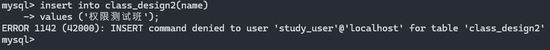
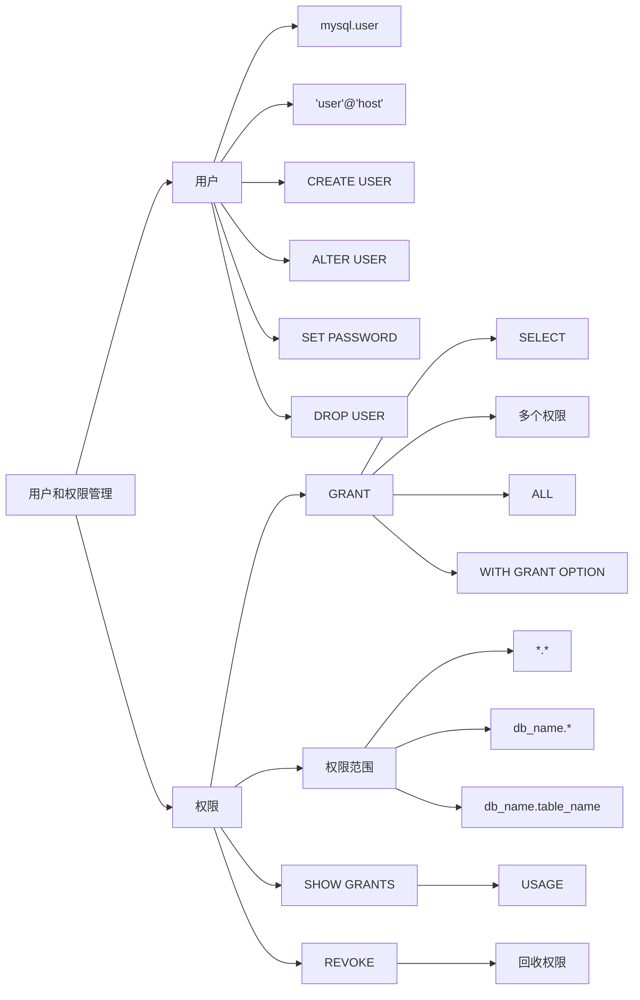

> 适用环境：MySQL 8.0.39。

## 1. 用户和权限

MySQL 安装完成后通常会有管理账号 `root`。它适合安装、维护和授权，但不适合作为普通项目的连接账号。

MySQL 的访问控制可以分成两步：

1. **身份验证**：根据用户名、连接来源和密码确定能否登录。
2. **权限验证**：登录成功后，每执行一条 SQL，MySQL 都会检查该账号是否拥有相应权限。

所以，“密码正确”只表示可以连接，并不代表可以查询、插入或删除数据。

---

## 2. MySQL 账号的组成

### 2.1 账号不是单独的用户名

MySQL 账号的完整格式为：

```sql
'user_name'@'host_name'
```

- `user_name`：用户名；
- `host_name`：允许该用户从什么主机连接。

例如，下面是两个不同的账号：

```sql
'app_user'@'localhost'
'app_user'@'192.168.1.10'
```

虽然用户名相同，但是是两个独立账号，密码和权限也可以不同。MySQL 按“用户名 + 主机”定位账号。

用户名和主机名要分别加引号：

```sql
-- 正确
'app_user'@'localhost'

-- 错误理解：这是用户名 app_user@localhost，主机部分被省略
'app_user@localhost'
```

**省略主机**等价于 `'user_name'@'%'`，允许从任意主机匹配。实际创建账号时应该明确写出主机。

### 2.2 常见主机范围

| 写法 | 含义 | 建议 |
|---|---|---|
| `'localhost'` | 只允许本机连接 | 本机应用优先使用 |
| `'192.168.1.10'` | 只允许指定 IP | 范围明确，安全性较高 |
| `'192.168.1.0/24'` | 允许指定 IPv4 网段 | MySQL 8.0.23 起支持 CIDR |
| `'192.168.1.0/255.255.255.0'` | 使用 IPv4 地址和子网掩码 | 可用于限制网段 |
| `'%'` | 任意主机 | 范围过大，不建议直接使用 |

MySQL 8.0.35 起，主机部分的 `%`、`_` 通配符已被弃用。MySQL 8.0.39 应优先使用明确 IP、主机名或 CIDR，并配合防火墙限制来源。

---

## 3. 查看用户和当前身份

### 3.1 查看已有账号

用户信息保存在 `mysql` 系统数据库的授权表中。管理员可以查看常用账号属性：

```sql
select
    user,
    host,
    plugin,
    account_locked,
    password_expired
from mysql.user;
```

字段含义如下：

- `user`、`host`：共同组成完整账号；
- `plugin`：账号使用的认证插件；
- `account_locked`：账号是否被锁定；
- `password_expired`：密码是否已经过期；

`mysql.infoschema`、`mysql.session`、`mysql.sys` 等通常是 MySQL 自己使用的保留账号，不应随意改密或删除。也不建议直接对 `mysql.user` 执行 `INSERT`、`UPDATE`、`DELETE`；应使用专门的账号管理语句，让 MySQL 正确维护所有授权表和内存权限数据。

### 3.2 `USER()` 与 `CURRENT_USER()`

```sql
select user(), current_user();
```

二者含义不同：

- `USER()`：客户端连接时提供的用户名，以及客户端来源；
- `CURRENT_USER()`：MySQL 最终用于身份验证和权限检查的账号。

普通情况下两者看起来相同，但匿名账号匹配、代理用户等场景下可能不同。判断权限属于哪个账号，应以 `CURRENT_USER()` 为准。

### 3.3 查看权限和账号定义

```sql
-- 查看当前账号的权限
show grants;

-- 查看指定账号的权限
show grants for 'app_user'@'localhost';

-- 查看账号的认证、密码策略和锁定状态等定义
show create user 'app_user'@'localhost';
```

如果结果中出现：

```sql
grant usage on *.* to 'app_user'@'localhost';
```

`USAGE` 不代表拥有全局操作权限，而表示账号存在，但在该层级没有实际权限。

---

## 4. 创建用户

### 4.1 基本语法

```sql
create user [if not exists]
    'user_name'@'host_name'
    identified by 'password';
```

示例：

```sql
create user if not exists
    'sqllearn_app'@'localhost'
    identified by 'Study-MySQL_2026!';
```

执行后只完成三件事：创建账号、限制连接来源、设置登录密码。新账号默认没有业务数据库的访问权限，还需要单独执行 `GRANT`。

`IF NOT EXISTS` 可避免账号已存在时报错，但不会修改已有账号。简单密码可能被密码策略拒绝。

MySQL 8.0 中推荐把创建和授权分开写：

```sql
create user if not exists 'sqllearn_app'@'localhost'
identified by 'Study-MySQL_2026!';

grant select, insert, update, delete
on sqllearn.*
to 'sqllearn_app'@'localhost';
```

这样能清楚区分“创建身份”和“授予权限”。

### 4.2 创建限定网段的账号

```sql
create user 'report_user'@'192.168.1.0/24'
identified by 'Report-Read_2026!';
```

该账号只能从匹配的 IPv4 网段连接。远程连接还取决于 MySQL 监听地址、防火墙和云服务器安全组。

---

## 5. 修改和删除用户

### 5.1 修改密码

推荐使用 `ALTER USER`：

```sql
alter user 'sqllearn_app'@'localhost'
identified by 'New-Study_2026!';
```

修改**当前已认证账号**的密码：

```sql
-- USER() 是 ALTER USER 为当前账号提供的专用写法
alter user user()
identified by 'My-New-Password_2026!';
```

也可以使用 `SET PASSWORD`：

```sql
-- 修改指定账号密码
set password for 'sqllearn_app'@'localhost'
= 'New-Study_2026!';

-- 修改当前账号密码
set password = 'My-New-Password_2026!';
```

优先掌握 `ALTER USER`，因为它还能管理账号锁定和密码过期等属性。

### 5.2 锁定、解锁和要求改密

```sql
-- 暂停账号登录，但保留账号和权限
alter user 'sqllearn_app'@'localhost' account lock;

-- 恢复账号登录
alter user 'sqllearn_app'@'localhost' account unlock;

-- 要求用户下次连接时修改密码
alter user 'sqllearn_app'@'localhost' password expire;
```

暂时停用时先锁定，确认废弃后再删除，便于恢复。

### 5.3 重命名和删除账号

```sql
rename user
    'sqllearn_app'@'localhost'
to  'sqllearn_service'@'localhost';
```

`RENAME USER` 会保留旧账号的权限。删除语法为：

```sql
drop user if exists 'sqllearn_service'@'localhost';
```

`DROP USER` 会删除账号及其授权记录，但不会删除它创建的数据库和表。删除前应检查它是否是视图、触发器或存储程序的 `DEFINER`。已有连接也不会被强制立即断开。

---

## 6. 权限类型和作用层级

### 6.1 常用权限

| 权限 | 作用 |
|---|---|
| `SELECT` | 查询数据 |
| `INSERT` | 插入数据 |
| `UPDATE` | 修改数据 |
| `DELETE` | 删除数据 |
| `CREATE` | 创建数据库或表，具体能力取决于授权层级 |
| `ALTER` | 修改表结构 |
| `DROP` | 删除数据库、表或视图；`TRUNCATE TABLE` 也需要该权限 |
| `INDEX` | 创建或删除索引 |
| `CREATE VIEW` | 创建或修改视图 |
| `SHOW VIEW` | 查看视图定义 |
| `EXECUTE` | 执行存储过程或函数 |
| `ALL PRIVILEGES` | 指定层级内的全部可用权限，不包含 `GRANT OPTION` 和 `PROXY` |

`FILE`、`CREATE USER`、`PROCESS` 等影响范围较大，普通应用通常不需要。

### 6.2 权限层级

同一种权限可以授予不同范围：

| 授权对象 | 层级 | 含义 |
|---|---|---|
| `*.*` | 全局级 | 整个 MySQL 服务中的所有数据库 |
| `sqllearn.*` | 数据库级 | `sqllearn` 中现有及以后创建的对象 |
| `sqllearn.student` | 表级 | 只作用于 `student` 表 |
| `SELECT(name, age)` | 列级 | 只能查询指定列 |
| `PROCEDURE sqllearn.p_demo` | 存储过程级 | 只作用于指定过程 |

范围越大，风险越高。应用账号一般使用数据库级或更小的范围，不应轻易授权 `*.*`。

`GRANT ALL ON sqllearn.*` 只表示拥有 `sqllearn` 数据库层级能够授予的全部权限，不会因此获得 `FILE`、`CREATE USER` 等全局管理权限。

---

## 7. 授予权限

### 7.1 基本语法

```sql
grant priv_type [, priv_type ...]
on priv_level
to 'user_name'@'host_name'
[with grant option];
```

`priv_type`：权限类型

`priv_level`：权限作用范围，如数据库、某数据库中的某表...

`with grant option`：允许该用户把自己拥有的权限继续授权给其他用户

示例：授予 `sqllearn` 数据库的常用增删改查权限。

```sql
grant select, insert, update, delete
on sqllearn.*
to 'sqllearn_app'@'localhost';
```

创建只读账号：

```sql
create user 'sqllearn_read'@'localhost'
identified by 'Read-Only_2026!';

grant select
on sqllearn.*
to 'sqllearn_read'@'localhost';
```

在`select`权限下执行`insert`操作会有如下报错：



限制到一张表：

```sql
grant select
on sqllearn.student
to 'sqllearn_read'@'localhost';
```

限制到部分列：

```sql
grant select (id, name, age)
on sqllearn.student
to 'sqllearn_read'@'localhost';
```

### 7.2 `WITH GRANT OPTION`

```sql
grant select
on sqllearn.*
to 'team_leader'@'localhost'
with grant option;
```

该选项还允许 `team_leader` 把这项权限授予其他账号。普通业务用户不需要这种能力。

### 7.3 权限何时生效

通过 `CREATE USER`、`GRANT`、`REVOKE`、`ALTER USER` 等专用语句修改账号时，MySQL 会主动更新权限数据，**通常不需要执行 `FLUSH PRIVILEGES`**。

`FLUSH PRIVILEGES`表示**刷新权限操作**；

已有连接中不同层级的变化可能在不同时间体现：

- 表级、列级权限通常**在下一条请求时**体现；
- 数据库级权限可能要再次执行 `USE 数据库名`；
- 静态全局权限或密码变化通常要重新连接后体现。

若授权后仍报错，先确认授权账号与 `CURRENT_USER()` 是否一致，再根据层级重新选择数据库或连接。

`FLUSH PRIVILEGES` 主要用于直接修改授权表后重新加载，或 `--skip-grant-tables` 启动后的恢复；直接修改授权表并不推荐。

---

## 8. 回收权限

### 8.1 基本语法

```sql
revoke [if exists] priv_type [, priv_type ...]
on priv_level
from 'user_name'@'host_name';
```

回收写权限，只保留原有查询权限：

```sql
revoke insert, update, delete
on sqllearn.*
from 'sqllearn_app'@'localhost';
```

回收 `sqllearn` 数据库上的全部权限：

```sql
revoke all privileges
on sqllearn.*
from 'sqllearn_app'@'localhost';
```

清除该账号在所有层级的权限和转授权能力：

```sql
revoke all privileges, grant option
from 'sqllearn_app'@'localhost';
```

注意：

- `REVOKE` 只撤销权限，不删除账号；账号仍可能登录，但无法执行未获授权的操作。
- 只想撤销某个数据库的权限时，应写 `sqllearn.*`，不要误写成范围更大的全局清除语句。
- `REVOKE IF EXISTS` 从 MySQL 8.0.30 起支持。
- 撤权后使用 `SHOW GRANTS` 核对结果，不要只根据 `SHOW DATABASES` 判断。

区分**授予**和**回收**语法：

授予

```sql
grant ... to 用户;
```

回收

```sql
revoke ... from 用户;
```

---

## 9. 使用角色管理权限

许多用户需要同一组权限时，可以把权限封装成角色，再分配给用户。

```sql
-- 1. 创建角色
create role 'r_sqllearn_read';

-- 2. 给角色授权
grant select
on sqllearn.*
to 'r_sqllearn_read';

-- 3. 创建实际登录账号
create user 'analyst'@'localhost'
identified by 'Analyst-Read_2026!';

-- 4. 把角色授予用户；授予角色时没有 ON 子句
grant 'r_sqllearn_read'
to 'analyst'@'localhost';

-- 5. 设置为默认激活角色
set default role 'r_sqllearn_read'
to 'analyst'@'localhost';
```

查看当前会话已经激活的角色：

```sql
select current_role();
```

角色适合账号较多、权限模板相同的场景。少量账号直接 `GRANT` 即可。

---

## 10. 常见错误

### 10.1 `Access denied for user`（1045）

表示连接阶段失败，优先检查：

1. 用户名或密码是否正确；
2. 连接来源是否匹配账号的 `host`；
3. 使用的是否是预期账号，例如 `'user'@'localhost'` 与 `'user'@'%'` 并非同一个账号；
4. 客户端连接的是不是预期 MySQL 服务器和端口。

### 10.2 `Access denied ... to database`（1044）

账号已经登录，但没有目标数据库的访问权限。使用管理员账号执行：

```sql
show grants for 'user_name'@'host_name';
```

检查授权数据库名和账号主机是否准确。

### 10.3 `command denied ... for table`（1142）

说明账号能够访问数据库，但缺少当前命令所需权限。例如能 `SELECT` 却不能 `INSERT`，就需要检查是否授予 `INSERT`，而不是重新设置密码。

### 10.4 授权后仍未生效

依次检查：

```sql
select current_user();
show grants;
```

如果账号正确，再尝试重新执行 `USE 数据库名` 或重新连接。使用专用授权语句时不应把 `FLUSH PRIVILEGES` 当成固定步骤。

---

## 参考




- [MySQL 8.0：账号名称](https://dev.mysql.com/doc/refman/8.0/en/account-names.html)
- [MySQL 8.0：创建与管理账号](https://dev.mysql.com/doc/refman/8.0/en/creating-accounts.html)
- [MySQL 8.0：GRANT](https://dev.mysql.com/doc/refman/8.0/en/grant.html)
- [MySQL 8.0：REVOKE](https://dev.mysql.com/doc/refman/8.0/en/revoke.html)
- [MySQL 8.0：权限变化何时生效](https://dev.mysql.com/doc/refman/8.0/en/privilege-changes.html)
- [MySQL 8.0：角色](https://dev.mysql.com/doc/refman/8.0/en/roles.html)
