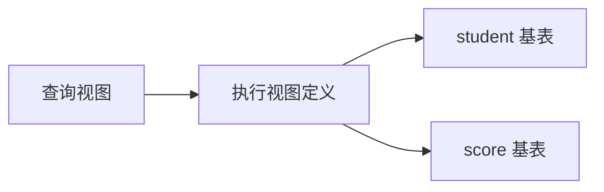

> 适用环境：MySQL 8.0。
>
> 视图可以理解为“有名字、可重复查询的 `SELECT`”，主要用于封装查询、限制可见数据和提供稳定的查询接口


## 1. 视图

视图（View）是一张虚拟表，它的内容来自一个或多个基表、其他视图或表达式的查询结果；
创建视图时，MySQL 主要保存的是视图名称、列信息和 `SELECT` 定义，**而不是另存一份结果数据**



视图有以下特点：

- 查询视图时，MySQL **根据视图定义读取**当时的基表数据；
- 基表数据改变后，再次查询视图通常会**看到新结果**；
- 删除视图只删除查询定义，不会删除基表及其数据；
- 普通视图**不是数据副本、备份或快照**，也不会自动提高查询速度；
- 视图定义仍会保存在数据字典中，所以“视图不存结果数据”不等于完全不占任何空间。

例如，下面的视图只展示学生编号、姓名和年龄：

```sql
create view v_student_basic as
select id, name, age
from student;
```

查询视图与查询普通表的写法相同：

```sql
select * from v_student_basic;
```

---

## 2. 视图优点

**简化复杂查询**

> 多表连接、筛选和计算可以封装到视图中。应用以后只查询视图，不必反复编写同一段复杂 SQL。
>

**限制可见的行和列**

> 视图可以不暴露密码、身份证号等敏感列，也可以通过 `WHERE` 只展示某些行。但这只有与权限控制结合才真正安全：如果用户仍拥有基表的 `SELECT` 权限，他依然可以绕过视图直接查询基表。
>

**提供相对稳定的查询接口**

> 应用统一查询视图。底层表调整后，有时只需重新定义视图即可保持视图的列名不变，减少应用改动。但这种独立性并非绝对：删除视图依赖的列仍可能使视图失效。
>

**统一名称和业务口径**

> 视图可以为列起更清楚的名称，并把“总分如何计算”“有效记录如何筛选”等规则集中在一处，避免不同程序写出不同口径。
>

---

## 3. 创建视图

### 3.1 基本语法

```sql
create view 视图名 [(视图列名列表)] as
select 查询列
from 表名
[where 条件];
```

较完整的 MySQL 语法为：

```sql
create [or replace]
    [algorithm = {undefined | merge | temptable}]
    [definer = 用户]
    [sql security {definer | invoker}]
view 视图名 [(视图列名列表)] as
select_statement
[with [cascaded | local] check option];
```

- algorithm：这个是视图执行算法，MySQL 查询视图时，有三种处理方式。undefined（默认）、merge（合并）、tempable（临时表）
- definer：指定创建这个视图的人。如`definer='root'@'localhost'`表示该视图属于root用户
- sql security：表示查询视图时，使用谁的权限
  - definer 则表示使用创建视图用户的权限；
  - invoker 则表示当前查询用户自己的权限；

- with check option：防止通过视图修改出视图范围之外的数据
  - cascaded：检查所有关联视图；
  - local：只检查当前视图；


**示例**：

```sql
create or replace
algorithm = merge
definer = 'root'@'localhost'
sql security definer
view v_java_student (student_id, student_name, class_name)
as
select
    s.id,
    s.name,
    c.name
from student_design2 s
join class_design2 c
    on c.id = s.class_id
where c.name = 'Java001班'
with cascaded check option;
```

### 3.2 使用别名确定视图列名

以下示例连接学生、班级、课程和成绩表。显式 `JOIN ... ON ...` 能把连接条件与普通筛选条件分开，比逗号连接更容易阅读，也能减少漏写连接条件造成笛卡尔积的风险。

```sql
create view v_student_score as
select
    s.id          as student_id,
    s.name        as student_name,
    s.sno,
    s.age,
    s.gender,
    s.enroll_date,
    c.id          as class_id,
    c.name        as class_name,
    co.id         as course_id,
    co.name       as course_name,
    sc.id         as score_id,
    sc.score
from student s
join class c
    on c.id = s.class_id
join score sc
    on sc.student_id = s.id
join course co
    on co.id = sc.course_id;
```

来自不同表的列可能同名，例如四张表都可能有 `id`。视图中的列名必须唯一，所以要用 `AS` 改成 `student_id`、`class_id` 等明确名称。

### 3.3 在视图名后指定列名

也可以统一列出视图的列名：

```sql
create view v_student_name_age
    (student_id, student_name, student_age) as
select id, name, age
from student;
```

括号中的名称数量必须与 `SELECT` 返回的列数完全相同。两种命名方法选择一种即可；复杂查询通常使用 `AS` 别名更直观，因为名称紧挨对应表达式。

### 3.4 创建时的注意事项

1. 视图与表属于同一数据库名称空间，不能在同一数据库中同名。
2. 建议明确写出字段，不要长期依赖 `SELECT *`。视图定义在创建时确定；基表以后新增列，不会自动加入既有视图。
3. 如果基表的依赖列被删除或改名，查询视图可能报错，需要重新定义视图。
4. 不要依赖视图定义中的 `ORDER BY` 保证顺序。查询视图时应在最外层明确排序；外层自己的 `ORDER BY` 会取代视图内的排序。
5. `CREATE VIEW` 是 DDL，会触发隐式提交，不要把它混入需要回滚的业务事务。

---

## 4. 查询和使用视图

视图可出现在普通表能够出现的许多查询位置，并可继续筛选、连接、分组和排序：

```sql
-- 查询全部视图数据
select *
from v_student_score;

-- 对视图结果继续筛选和排序
select student_name, course_name, score
from v_student_score
where score >= 90
order by score desc;

-- 视图与真实表连接
select v.student_name, v.course_name, v.score, s.enroll_date
from v_student_score v
join student s
    on s.id = v.student_id;
```

视图也可以隐藏查询细节。例如只对外提供姓名和总分：

```sql
create view v_student_total_points as
select
    s.id as student_id,
    s.name as student_name,
    sum(sc.score) as total_points
from student s
join score sc
    on sc.student_id = s.id
group by s.id, s.name;
```

```sql
select student_name, total_points
from v_student_total_points
order by total_points desc;
```

用户只能从该视图获得定义中已有的列，不能临时查询未被视图暴露的学号或各科明细。若确实需要这些字段，应修改视图、另建视图或在有权限时查询基表。

---

## 5. 视图与基表数据的关系

### 5.1 修改基表会影响视图结果

```sql
update score
set score = 99
where student_id = 1 and course_id = 1;

select *
from v_student_score
where student_id = 1 and course_id = 1;
```

`UPDATE` 修改的是 `score` 基表。视图没有独立保存旧结果，所以再次查询时会显示修改后的成绩。

### 5.2 修改可更新视图会影响基表

创建一个行与基表行一一对应的简单视图：

```sql
create view v_class_one_student as
select id, name, age, class_id
from student
where class_id = 1;
```

```sql
update v_class_one_student
set age = 20
where id = 1;
```

如果这个视图满足可更新条件，这条语句最终修改的是 `student` 基表中 `id=1` 的记录。因此能看出，视图不是基表的副本；通过视图写数据同样需要**事务、权限和条件控制**。

---

## 6. 可更新视图

视图能够被 `UPDATE`、`DELETE` 或 `INSERT` 操作的核心条件是：
视图中的一行能够明确对应到底层表中的一行。
最容易更新的是“单表 + 简单列 + 普通 `WHERE`”视图。

以下结构**通常**会使视图不可更新：

- 聚合函数或窗口函数，如 `SUM()`、`COUNT()`、`AVG()`；
- `DISTINCT`；
- `GROUP BY`、`HAVING`；
- `UNION`、`UNION ALL`；
- 查询列表中的子查询；
- 某些多表连接；
- 在 `FROM` 中引用不可更新视图；
- 只查询常量，没有可对应的基表行；
- 明确使用 `ALGORITHM = TEMPTABLE`。

例如 `v_student_total_points` 使用了 `SUM()` 和 `GROUP BY`。
一条总分记录由多条成绩记录合成，MySQL 无法判断“把总分改成 500”应当修改哪一科，所以它只适合查询。

`ORDER BY` 可以出现在视图定义中，但不能把它简单记成“只要有 `ORDER BY`，视图就一定不可更新”。可更新性取决于完整定义和处理方式；为了职责清楚，可写视图通常不在内部排序，而在查询视图时排序。

“可更新”也不一定代表“可插入”。通过视图插入时，视图还要能为基表中所有没有默认值的必填列提供值，而且目标列通常必须是简单的基表列引用。

检查 MySQL 记录的可更新状态：

```sql
select table_name, is_updatable
from information_schema.views
where table_schema = database();
```

`IS_UPDATABLE='YES'` 表示该视图可用于某些更新操作，不表示任意 `INSERT`、`UPDATE`、`DELETE` 都必然合法；实际操作还受列、连接方式和权限等条件限制。

---

## 7. WITH CHECK OPTION

普通可更新视图有一个容易忽略的问题：通过视图修改数据后，新数据可能不再满足视图的 `WHERE` 条件，于是该行会从视图中“消失”。

```sql
create view v_class_one_student as
select id, name, age, class_id
from student
where class_id = 1;

-- 若没有检查选项，这次修改可能成功，随后该行不再出现在视图中
update v_class_one_student
set class_id = 2
where id = 1;
```

在可更新视图后加入 `WITH CHECK OPTION`，可以阻止通过该视图写入不再满足视图条件的数据：

```sql
create or replace view v_class_one_student as
select id, name, age, class_id
from student
where class_id = 1
with check option;
```

此时把 `class_id` 改为 `2` 会失败，因为修改后的记录不符合 `class_id=1`。
它既检查 `UPDATE` 后的行，也检查通过视图 `INSERT` 的行。

视图基于其他视图时还可指定检查范围：

- `WITH LOCAL CHECK OPTION`：检查当前视图的条件，并按下层视图原有的检查设置继续处理；
- `WITH CASCADED CHECK OPTION`：检查当前视图及所有下层视图的条件；
- 不写 `LOCAL` 或 `CASCADED` 时，默认是 `CASCADED`。

没有嵌套视图时，直接写 `WITH CHECK OPTION` 最容易理解。

---

## 8. 修改、查看与删除视图

### 8.1 修改定义

```sql
create or replace view v_student_basic as
select id, name, age, gender
from student;
```

`CREATE OR REPLACE VIEW` 在视图不存在时创建，在已存在时替换。也可以使用：

```sql
alter view v_student_basic as
select id, name, age, gender
from student;
```

`ALTER VIEW` 要求目标视图已经存在。两种方式都是重新定义视图，不会直接修改基表数据；它们属于 DDL，同样可能隐式提交当前事务。

### 8.2 查看视图

```sql
-- 查看当前数据库中的视图
show full tables where table_type = 'VIEW';

-- 查看完整创建语句，排查算法、安全模式和检查选项
show create view v_student_basic;

-- 查看视图对外提供的列
desc v_student_basic;

-- 检查视图依赖是否仍然有效
check table v_student_basic;
```

还可查询更完整的元数据：

```sql
select
    table_name,
    is_updatable,
    check_option,
    security_type
from information_schema.views
where table_schema = database();
```

### 8.3 删除视图

```sql
drop view if exists v_student_basic;

-- 一次删除多个视图
drop view if exists v_student_score, v_student_total_points;
```

`IF EXISTS` 可避免视图不存在时直接报错。
删除视图不会删除 `student`、`score` 等基表数据；但如果其他视图依赖被删除的视图，
依赖者可能变得不可用。`DROP VIEW` 也是会隐式提交的 DDL。

---

## 9. 视图处理原理

MySQL 处理视图主要有三种算法：

| 算法 | 基本原理 | 主要特点 |
| --- | --- | --- |
| `MERGE` | 把外层查询与视图定义合并成一个查询 | 通常更容易继续优化，满足其他条件时可更新 |
| `TEMPTABLE` | 先把视图结果放入本次语句使用的内部临时表，再查询临时结果 | 该视图不可更新；临时结果不是永久保存的物化视图 |
| `UNDEFINED` | 由 MySQL 选择，可能优先尝试 `MERGE` | 默认思路，通常不必手动指定 |

例如：

```sql
create algorithm = merge view v_adult_student as
select id, name, age
from student
where age >= 18;
```

执行：

```sql
select *
from v_adult_student
where id < 100;
```

采用 `MERGE` 时，可以近似理解为 MySQL 合并两个条件后查询基表：

```sql
select id, name, age
from student
where age >= 18 and id < 100;
```

视图不会自动拥有索引，普通视图也不能像表一样单独创建索引。查询性能主要取决于展开后的 SQL、基表索引、数据量和优化器选择；应使用 `EXPLAIN` 分析最终查询，不能把“创建视图”等同于“查询加速”。

---

## 10. 视图的安全上下文

完整语法中的 `SQL SECURITY` 决定执行视图时按照谁的权限检查底层对象：

- `SQL SECURITY DEFINER`：按视图定义者的权限执行，是默认值；
- `SQL SECURITY INVOKER`：按调用视图的用户权限执行。

```sql
create sql security invoker view v_student_public as
select id, name, age
from student;
```

要使用视图保护数据，应让普通用户只有所需视图的权限，而没有敏感基表的直接权限。仅仅不把敏感列写进视图，并不能阻止一个本来就能查询基表的用户。

---

## 参考

- [MySQL 8.0：CREATE VIEW](https://dev.mysql.com/doc/refman/8.0/en/create-view.html)
- [MySQL 8.0：视图处理算法](https://dev.mysql.com/doc/refman/8.0/en/view-algorithms.html)
- [MySQL 8.0：可更新与可插入视图](https://dev.mysql.com/doc/refman/8.0/en/view-updatability.html)
- [MySQL 8.0：WITH CHECK OPTION](https://dev.mysql.com/doc/refman/8.0/en/view-check-option.html)
- [MySQL 8.0：视图元数据](https://dev.mysql.com/doc/refman/8.0/en/view-metadata.html)
- [MySQL 8.0：DROP VIEW](https://dev.mysql.com/doc/refman/8.0/en/drop-view.html)
