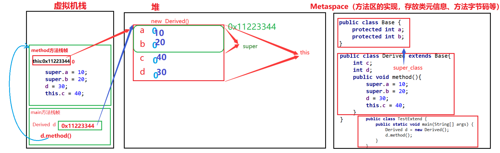

## 1.继承

### 1.1类的继承
#### 1.1.1 继承格式
Java 中通过 `extends`关键字可以声明一个类是从另外一个类继承而来的，形式如下：

```java
class 父类 {
}

class 子类 extends 父类 {
}
```

继承的目的是为了降低代码的重复，避免代码量大且臃肿。通过提取出代码的共性，实现代码的复用。

**要注意：**

**1.子类会将父类中的成员变量或者成员方法继承到子类中**

**2.子类继承父类后，要添加自己特有成员，体现出与父类不同，否则没必要经行继承。**

#### 1.1.1 extends关键字
在 Java 中，类的继承是单一继承的，也就是说，**一个子类只能拥有一个父类，所以 extends 只能继承一个类**。


### 1.2继承类型
注意的是 java 不支持多继承，但支持多重继承。


要知道，事实上我们并不需要过多的继承关系，这会导致向上追踪过于复杂。如果需要继承层次太多，就需要考虑对代码进行重构了。**一般我们不希望超过三层的继承关系。**

如果想从语法上进行限制继承，就可以使用**<font style="color:#DF2A3F;">final </font>关键字**了

### 1.3继承的特性
+ 子类拥有父类非private 的属性、方法
+ 子类可以拥有自己的属性和方法，即子类可以对父类进行扩展。
+ 子类可以用自己的方式实现父类的方法
+ Java 的继承是单继承，但是可以多重继承，单继承就是一个子类只能继承一个父类，多重继承就是，例如 B 类继承 A 类，C 类继承 B 类，所以按照关系就是 B 类是 C 类的父类，A 类是 B 类的父类，这是 Java 继承区别于 C++ 继承的一个特性。
+ 提高了类之间的耦合性（继承的缺点，耦合度高就会造成代码之间的联系越紧密，代码独立性越差）。


### 1.4子类访问父类
#### 1.4.1 子类访问父类成员变量
通常子类在继承父类之后，父类的成员变量就会依附在子类中。但是如果**子类重新定义了与父类同名的成员变量**时，那么访问该变量时，会**优先访问子类的变量**。

eg:

```java
class TestA {
    int a = 1;
    int b = 2;
}
class TestB extends TestA{
    int a = 1111;
}

//实例化 TestB b 
//此时System.out.println(b.a);得到的结果会是 1111
```

总结：**成员变量访问遵循就近原则，自己有优先自己的，如果没有则向父类中找**。

#### 1.4.2 子类访问父类的成员方法
与访问成员变量，如果名字相同以及参数相同，那么会优先访问子类的。

<font style="color:rgb(51,51,51);">通过派生类对象访问父类与子类同名方法时，如果父类</font>**<font style="color:rgb(51,51,51);">和子类同名方法的参数列表不同(重载)</font>**<font style="color:rgb(51,51,51);">，根据调用 </font>

<font style="color:rgb(51,51,51);">方法适传递的参数选择合适的方法访问，如果没有则报错；</font>

<font style="color:rgb(51,51,51);">因此引出了一个问题，如果我偏偏想要访问父类的方法呢？ 那么就需要我们学习下面这个关键字了(</font>**<font style="color:rgb(51,51,51);">super</font>**<font style="color:rgb(51,51,51);">)</font>

### <font style="color:rgb(51,51,51);">1.5 super 与 this 关键字</font>
#### 1.5.1 super & this
该关键字主要作用：**在子类方法中访问父类的成员**。

**super 关键字：**我们可以通过 super 关键字来实现对父类成员的访问，用来引用当前对象的父类。

**this关键字：**指向自己的引用，引用当前对象，即它所在的方法或构造函数所属的对象实例。

```java
class Animal {
    void eat() {
        System.out.println("animal : eat");
    }
}
 
class Dog extends Animal {
    void eat() {
        System.out.println("dog : eat");
    }
    void eatTest() {
        this.eat();   // this 调用自己的方法
        super.eat();  // super 调用父类方法
    }
}
 
public class Test {
    public static void main(String[] args) {
        Animal a = new Animal();
        a.eat();
        Dog d = new Dog();
        d.eatTest();
    }
}
```

输出结果为：

```bash
animal : eat
dog : eat
animal : eat
```



​									**类以及变量都存放如图位置（jdk8之后）**

**<font style="color:rgb(51,51,51);">注意：</font>**

<font style="color:rgb(51,51,51);">1. </font>**<font style="color:rgb(51,51,51);">只能在非静态方法中使用 </font>**

<font style="color:rgb(51,51,51);">2. </font>**<font style="color:rgb(51,51,51);">在子类方法中，访问父类的成员变量和方法</font>**<font style="color:rgb(51,51,51);">。</font>

#### 1.5.2 final 关键字
final 可以用来修饰变量 （包括类属性、对象属性、局部变量和形参）、方法（包括类方法和对象方法）和类。

使用final 关键字声明类，就是把类定义为最终类，不能被继承，或者用于修饰方法，该方法不能被子类重写（密封类）：

+ 声明类：

```java
final class 类名 {}
```

+ 声明方法：

```java
修饰符(public/private/default/protected) final 返回值类型 方法名(){//方法体}
```

**注意：**

**1.final 定义的类，其中的属性、方法不是final 的**。

### 1.6 子类构造方法
<font style="color:rgb(51,51,51);">父子父子，先有父再有子，即：子类对象构造时，需要先调用基类构造方法，然后执行子类的构造方法。</font>

<font style="color:rgb(51,51,51);">注意：是在父类显示构造方法时。子类需要去调用。</font>

<font style="color:rgb(51,51,51);">父子父子肯定是先有父再有子，所以在构造子类对象时候 ，</font>**<font style="color:rgb(51,51,51);">先要调用基类的构造方法</font>**<font style="color:rgb(51,51,51);">，将从基类继承下来的成员构造完整，然后</font>**<font style="color:rgb(51,51,51);">再调用子类自己的构造方法</font>**<font style="color:rgb(51,51,51);">，将子类自己新增加的成员初始化完整。</font>

```java
class Base{
    int age;
    String name;
    double length;

    public Base(int age, String name) {
        this.age = age;
        this.name  = name;
        System.out.println("Base constructor called");
    }
}

public class Derived extends Base {
    public Derived(int age, String name) {
        super(1,"1");
    }
}

public class Main {
    public static void main(String[] args) {
        Derived d = new Derived(1,"1");
    }
}

//输出结果为：Base constructor called
```

注意：

1.若父类显示定义无参或者默认的构造方法，在子类构造方法第一行默认由隐含的super()调用，即调用基类构造方法

2.如果父类构造方法是带有参数的，此时需要用户为子类显式定义构造方法，并在子类构造方法中选择合适的父类构造方法调用，否则编译失败。

3.在子类构造方法中，super(...)只能在子类构造方法中出现一次，并且不能和this同时出现

### 1.7 再谈初始化
#### 1.7.1 代码块的执行顺序
```java
class Base {
    public String name;
    public int age;

    public Base(String name,int age){
        this.name=name;
        this.age=age;
        System.out.println("Base构造方法");
    }
    {
        System.out.println("Base实例代码块");
    }
    static{
        System.out.println("Base静态代码块");
    }
}

class Derived extends Base {
    public Derived(){
        super("Derived",20);
        System.out.println("Derived构造方法");
    }
    {
        System.out.println("Derived实例代码块");
    }
    static{
        System.out.println("Derived静态代码块");
    }
}

public class Main{
    public static void main(String[] args) {
        Derived d = new Derived();
        System.out.println("==============");
        Derived e = new Derived();
    }
}

//输出结果：
Base静态代码块
Derived静态代码块
Base实例代码块
Base构造方法
Derived实例代码块
Derived构造方法
==============
Base实例代码块
Base构造方法
Derived实例代码块
Derived构造方法
```

我们可以得到该结论：

1、父类静态代码块优先于子类静态代码块执行，且是最早执行的

2、**父类实例代码块和父类构造方法**紧接着执行

3、**子类的实例代码块和子类构造方法**紧接着在执行

4、第二次实例化子对象时，父类和子类的静态代码块都将不会再执行


#### 1.7.1 构造方法的执行顺序
##### 顺序一：
```java
class Y {
    public Y() {
        System.out.print("Y");
    }
}

class X {
    Y y = new Y();  // 成员变量的初始化
    public X() {
        System.out.print("X");
    }
}

public class Main {
    public static void main(String[] args) {
        X x = new X();
    }
}

//执行结果：YX
```

🔑**Java 对象的初始化顺序(记住：先成员，后构造）**

在 Java 中，当你 `new X()` 时，发生的步骤是：

1. **分配内存**  
JVM 为 `X` 对象分配空间。
2. **初始化成员变量（包括显式赋值）**  
在执行构造方法体之前，<font style="color:#DF2A3F;">先对所有 实例成员变量（包括 </font>`new Y()`<font style="color:#DF2A3F;">）进行初始化</font>。  
所以会先执行 `Y` 的构造方法，打印 `"Y"`。
3. **执行构造方法体**  
然后才会进入 `X` 的构造方法，打印 `"X"`。

##### 顺序二：
```java
class Y{
    public Y(){
        System.out.print("Y");
    }
}
class X extends Y{
    Y y = new Y();
    public X(){
        System.out.print("X");
    }
}
public class Test {
    public static void main(String[] args) {
        X x = new X();
    }
}

//执行结果：YYX
```

执行顺序是：

1. 因为是继承父类，所以先调用父类构造
2. 其次才是子类字段`Y y = new Y();`可看作是实例代码块执行顺序
3. 最后才是子类自己的构造方法

##### 顺序三：
```java
class X {
    Y y = new Y(); // (1)
    public X() {   // (2)
        System.out.print("X");
    }
}

class Y {
    public Y() {   // (3)
        System.out.print("Y");
    }
}

public class Z extends X {
    Y y = new Y(); // (4)
    public Z() {   // (5)
        System.out.print("Z");
    }
    public static void main(String[] args) {
        new Z();
    }
}

//执行结果：YXYZ
```

执行`new Z();`顺序说明：

1.  执行 `X` 里的 `Y y = new Y(); // (1)`， 调用 `Y()` 构造器  
2.  👉 进入 `X()` 构造器  
3.   执行 `Z` 里的 `Y y = new Y(); // (4)`， 调用 `Y()` 构造器
4.  👉 进入 `Z()` 构造器  

调用说明：

1.  JVM 给 `Z` 对象分配内存，成员变量先设为默认值（此时 `X.y = null`, `Z.y = null`）。  
2. `Z` extends `X`，所以先去构造 `X`。   但在调用 `X()` 构造方法体前，必须先初始化 `X` 的成员变量。 

**总结： “父变量 → 父构造 → 子变量 → 子构造”  ** 

### 1.8protected关键字
主要限制：类或类中成员能否在类外或者其他包中被访问。


注意：父类中private成员变量虽然在子类中不能直接访问，但是也继承到子类中了

### 1.9 继承与组合
组合，组合并没有涉及到特殊的语法，仅仅是将一个类的实例作为另一个类的字段。

继承表示对象间is-a的关系：狗是动物，猫是动物

<font style="color:rgb(51,51,51);">组合表示对象间has-a的关系：汽车（包含轮子，车座...）</font>

```java
class Tire{
    ...
}
class Engine{
    ..
}
class VehicleSystem{
    ...
}

class Car{
    private Tire tire;
    private Engine engine;
    private VehicleSystem vs;
    ...
}

class Benz extends Car{
    ...
}
```

<font style="color:rgb(51,51,51);">一般建议：能用组合尽量用组合。</font>


以上是我关于Java继承的笔记分享，

感谢你读到这里，这也是我学习路上的一个小小记录。希望以后回头看时，能看到自己的成长~
