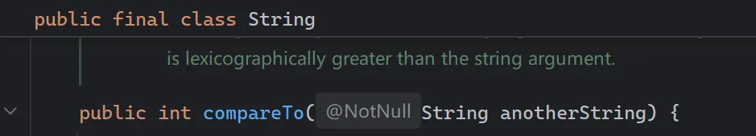
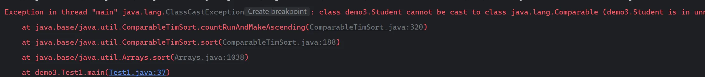
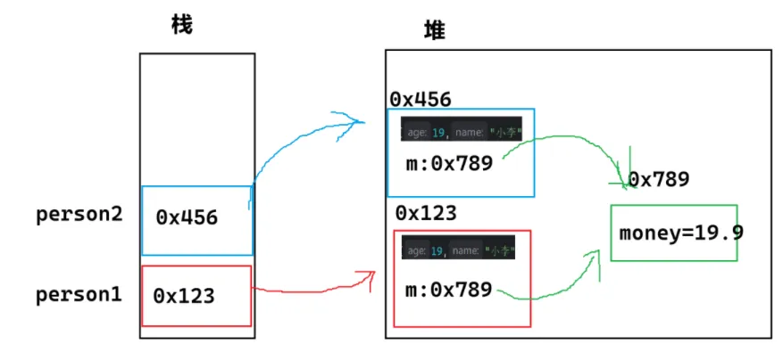

### 接口使用实例以及Object类中的equals,hashcode方法

## 1.Comparable 接口实现

实现该接口时需要加上一个泛型（类比 C++的模板）

`Class Student implements Comparable<Student>`,我们比较什么类型就填什么类型在<>

我们了解了 Comparable 接口之后，会知道里面存在一个方法 compareTo()

因此 compareTo()需要我们去重写，这其实就是一个**比较规则**，需要怎么比较类型可以由我们来完成，我们举出一个例子如下

```java
class Student implements Comparable<Student>{
    public String name;
    public int age;

    public Student(String name, int age) {
        this.name = name;
        this.age = age;
    }
    @Override
    public int compareTo(Student o) {
        //通过年龄比较
        return this.age - o.age;
        //通过名字比较
        //return this.name.compareTo(o.name);
    }
}

public class Test {
    public static void main(String[] args) {
        Student std1 = new Student("小李",20);
        Student std2 = new Student("小刘",19);
        System.out.println(std1.compareTo(std2));
    }
}

//运行结果为 1
```

有人会好奇，为什么用名字比较会这么写 `return this.name.compareTo(o.name);`



可以发现，String 类型中也有 compareTo()方法，因此我们直接调用即可

当我们将**用到数组对对象进行排序**时，中间的对比过程正是运用了类似这个步骤

```java
class Student /*implements Comparable<Student>*/{
    public String name;
    public int age;

    public Student(String name, int age) {
        this.name = name;
        this.age = age;
    }
    @Override
    public String toString(){
        return "Student {name=" + name + ", age=" + age + "}";
    }
    /*@Override
    public int compareTo(Student o) {
        return this.age - o.age;
        //return this.name.compareTo(o.name);
    }*/
}

public class Test {
    public static void main(String[] args) {
        Student std[] = new Student[3];
        std[0] = new Student("小李",20);
        std[1] = new Student("小刘",19);
        std[2] = new Student("小新",18);
        Arrays.sort(std);
        System.out.println(Arrays.toString(std));
    }
}
```

我们继续使用上面那个例子，将 `compareTo()`方法以及接口屏蔽 会发现运行到`Arrays.sort(std);`这里的时候发生异常



**ClassCastException **报错信息中 为类型转换异常

`class demo3.Student cannot be cast to class java.lang.Comparable`也就是说 Student 不能被转换为 Comparable 型，


图片中的意思是：

> **这是报错信息中的一个方法，Object[] a 是我们传 Student std[] 的形参**
>
> **这是原本正确运行需要进行的，但是 我们现在连 Comparable 接口都还没有实现，怎么能强转为 Comparable 类型呢，更不用说调用 compareTo()方法了**
>
> **因此当我们放开 Comparable 实现和 compareTo()方法重写，那么 Arrays.sort()就会按照我们是按名字还是按年龄写的 compareTo()方法去排序**。实际上也就是把**比较规则**放出来，别人才能拿来比较

那么我们得到的结论就是：

> **只要是自定义的类型，涉及到了大小比较，那就得一定实现 Comparable 接口**

至于 `Arrays.sort()`内部是怎样实现的，我给出一个**大概的模拟实现**，实际内部更复杂

类似冒泡排序的排序方法

```java
public static void mySort(Comparable[] comparables){
    for (int i = 0; i < comparables.length-1; i++) {
        for (int j = 0; j < comparables.length-1-i; j++) {
            if(comparables[j].compareTo(comparables[j+1]) > 0) {
                Comparable tmp = comparables[j];
                comparables[j] = comparables[j+1];
                comparables[j+1] = tmp;
            }
        }
    }
}
```

为什么要用 `Comparable[] comparables` 作为形参呢，因为就是我们前面说的**向上转型**一样转为 `Comparable 类型`，我们就可以直接使用这个接口中的方法。

再整体看一下这段代码

```java
class Student implements Comparable<Student>{
    public String name;
    public int age;

    public Student(String name, int age) {
        this.name = name;
        this.age = age;
    }
    @Override
    public String toString(){
        return "Student {name=" + name + ", age=" + age + "}";
    }
    @Override
    public int compareTo(Student o) {
        //方法二：将this和o调换位置也可以变为降序
        return this.age - o.age;
        //return this.name.compareTo(o.name);
    }
}

public class Test1 {
    public static void mySort(Comparable[] comparables){
        for (int i = 0; i < comparables.length-1; i++) {
            for (int j = 0; j < comparables.length-1-i; j++) {
                //方法一：这里大于零做的是一个升序的排序，改为小于零就是降序了
                if(comparables[j].compareTo(comparables[j+1]) > 0) {
                    //swap(comparables, j, j+1);
                    Comparable tmp = comparables[j];
                    comparables[j] = comparables[j+1];
                    comparables[j+1] = tmp;
                }
            }
        }
    }

    // public static <T> void swap(T[] arr, int i, int j) {
    //     T tmp = arr[i];
    //     arr[i] = arr[j];
    //     arr[j] = tmp;
    // }


    public static void main(String[] args) {
        Student std[] = new Student[3];
        std[0] = new Student("小李",20);
        std[1] = new Student("小刘",19);
        std[2] = new Student("小新",18);
        mySort(std);
        System.out.println(Arrays.toString(std));
        //System.out.println(std1.compareTo(std2));
    }
}
```

但是这个接口的方法存在一定的局限性，就是我有时候想用年龄去排可以，但我有时候又想用名字去排，但这个方法不能共存，只能一个 **compareTo()**方法（比较器）（/也就是比较规则）


**补充建议**：

其实像上面提到的用年龄比较

```java
    @Override
    public int compareTo(Student o) {
        //通过年龄比较
        return this.age - o.age;
    }
```

我们实际上还可以用它类型自带的 `compare()`方法，下面我们举一个例子

+ 让 `compareTo()` 按 **score 从高到低排序**；
+ 如果分数相同，则按 **年龄从小到大排序**。

```java
    @Override
    public int compareTo(Student o) {
        int cmp = Double.compare(o.score,this.score);
        if(cmp == 0){
            cmp = Integer.compare(this.age,o.age);
        }
        return cmp;
    }
```

这里我们就用到了整型自带的`Integer.compare()`方法和 double 型自带的`Double.compare()`方法；为什么建议用类型自带的方法呢而不用以下这种

```java
@Override
public int compareTo(Student o) {
    if (this.score < o.score) {
        return 1;              // 分数低的排在后面
    } else if (this.score > o.score) {
        return -1;             // 分数高的排在前面
    } else {
        return o.age - this.age; // 分数相同时，年龄大的排前
    }
}

```

**问题：compareTo 的返回值逻辑不够直观**

🔹 那样写更安全（避免浮点数误差问题）  
🔹 逻辑清晰，可读性高  
🔹 不会因为 `==` 比较浮点数出问题  

## 2.Comparator 接口实现

我们可以创建一个新的类 `NameComparator`

```java
import java.util.Comparator;

public class NameComparator implements Comparator<Student>{
    @Override
    public int compare(Student o1,Student o2){
        return o1.name.compareTo(o2.name);
    }
}
```

以及另外一个新的类 `AgeComparator`

```java
import java.util.Comparator;

public class AgeComparator implements Comparator<Student> {
    @Override
    public int compare(Student o1, Student o2) {
        //按照降序排
        return o1.age - o2.age;
    }
}
```

这个方法不需要依赖 Student类 去实现任何接口

```java
AgeComparator ageComparator = new AgeComparator();
System.out.println(ageComparator.compare(std[0],std[1]));
```

直接实例化调用，如果需要升序降序我们可以再去分类写几个升序降序的类即可；即我们可以同时存在多个类似地比较方法，**只需要放在不同类去实现接口重写 compare()方法就行！！！**

## 3.Clonable 接口和深拷贝

当我们先了解到下面要讲的 Object 类之后可以再回头看看

Object 类中有一个 clone 方法，这个方法的作用就是字面意思，克隆一个对象

举一个例子：

```java
public class Person implements Cloneable{
    public int age;

    @Override
    protected Object clone() throws CloneNotSupportedException {
        return super.clone();
    }

    @Override
    public String toString() {
        return "Person{" +
                "age=" + age +
                '}';
    }
}
```

使用步骤：

> 1. 创建 Person 类，然后实例化一个 person1，接着再克隆给对象 person2
>
> 2.重写 Object 父类的 clone() 方法（因为该方法在 Object 中是 protected 访问权） [Alt+Ins 键 选择重写克隆 clone()方法即可]
>
> 4.注意返回值是父类 Object，所以我们需要向下转型为 Person
>
> 5.在 Person类 中实现 Cloneable 接口
>
> 6.抛去异常处理`public static void main(String[] args) throws CloneNotSupportedException `

补充一下，Cloneable 是空接口，空接口也叫标记接口，表示当前类可以被克隆

```java
public static void main(String[] args) throws CloneNotSupportedException {
        Person person1 = new Person();
        person1.age = 19;
        Person person2 = (Person)person1.clone();
        System.out.println(person2.toString());
    }
```

我们再拓展一下，新增一个 Money 类

```java
class Money{
    public double money = 19.9;
}

public class Person implements Cloneable{
    public int age;
    public String name;

    public Person(int age,String name){
        this.age=age;
        this.name=name;
    }

    Money m = new Money();

    @Override
    protected Object clone() throws CloneNotSupportedException {
        return super.clone();
    }

    @Override
    public String toString() {
        return "Person{" +
                "age=" + age +
                ", name='" + name + '\'' +
                ", money=" + m.money +
                '}';
    }
}
```

此时在栈和堆中是这样的，引用同一个 m 对象，我们因此称之为**浅拷贝**

如果 m 对象也被拷贝了，那就是深拷贝

所以我们就进行如下操作变为**深拷贝**吧

1. 先让 Money 能够被克隆

```java
class Money implements Cloneable{
    public double money = 19.9;

    @Override
    protected Object clone() throws CloneNotSupportedException {
        return super.clone();
    }
}
```

2. 然后再修改一下克隆方法

```java
protected Object clone() throws CloneNotSupportedException {
    Person tmp = (Person)super.clone();
    tmp.m = (Money)m.clone();
    return tmp;
}
```

我们再进行测试一下即可

```java
public static void main(String[] args) throws CloneNotSupportedException {
        Person person1 = new Person(19,"小李");
        person1.age = 19;
        Person person2 = (Person)person1.clone();

        System.out.println("修改前："+person1.toString());
        System.out.println("修改前："+person2.toString());
        person2.m.money = 100;
        System.out.println("修改后："+person1.toString());
        System.out.println("修改后："+person2.toString());
    }
```

返回的结果：

> 修改前：Person{age=19, name='小李', money=19.9}
>
> 修改前：Person{age=19, name='小李', money=19.9}
>
> 修改后：Person{age=19, name='小李', money=19.9}
>
> 修改后：Person{age=19, name='小李', money=100.0}

此时的 Person2 的 m 对象是另外一个独立的对象，与 Person 引用的 m 不是同一个

## 4.对象比较equals方法

<font style="color:rgb(51,51,51);">在Java中，==进行比较时： </font>

<font style="color:rgb(51,51,51);">a.</font><font style="color:rgb(51,51,51);">如果</font><font style="color:rgb(51,51,51);">==</font><font style="color:rgb(51,51,51);">左右两侧是基本类型变量，比较的是变量中值是否相同 </font>

<font style="color:rgb(51,51,51);">b.</font><font style="color:rgb(51,51,51);">如果</font><font style="color:rgb(51,51,51);">==</font><font style="color:rgb(51,51,51);">左右两侧是引用类型变量，比较的是引用变量地址是否相同 </font>

<font style="color:rgb(51,51,51);">c.如果要比较对象中内容，必须重写Object中的equals方法，因为equals方法默认也是按照地址比较的：</font>

```java
// Object类中的equals方法
public boolean equals(Object obj) {
    return (this == obj); // 使用引用中的地址直接来进行比较
}
```

我们自己写一个比较引用类型中的基本类型比较(eg:Person类中的name和age)

```java
public boolean equals(Object obj) {
    if (obj == null) {
        return false ;
    }
    if(this == obj) {
        return true ;
    }
// 不是Person类对象
    if (!(obj instanceof Person)) {
        return false ;
    }
    Person person = (Person) obj ; // 向下转型，比较属性值
    return this.name.equals(person.name) && this.age==person.age ;
}
```

结论：比较对象中内容是否相等的时候，一定要重写equals方法。

## 5.hashcode方法

我们回忆一下Object中的toString方法

```java
// Object类中的toString()方法实现：
public String toString() {
    return getClass().getName() + "@" + Integer.toHexString(hashCode());
}
```

<font style="color:rgb(51,51,51);">我们看到了hashCode()这个方法，他帮我算了一个具体的</font>**<font style="color:rgb(51,51,51);">对象位置</font>**<font style="color:rgb(51,51,51);">，这里面涉及数据结构，但是我们还没学数据结构，没法讲述，所以我们只能说它是个内存地址。然后调用Integer.toHexString()方法，将这个地址以16进制输出。</font>

**<font style="color:rgb(51,51,51);">hashcode方法源码</font>**<font style="color:rgb(51,51,51);">：</font>

```java
public native int hashCode();
```

该方法是一个native方法，底层是由C/C++编写，无法观察到

<font style="color:rgb(51,51,51);">我们认为两个名字相同，年龄相同的对象，将存储在同一个位置，如果不重写hashcode()方法，我们可以来看示例代码：</font>

```java
class Person {
    public String name;
    public int age;
    public Person(String name, int age) {
        this.name = name;
        this.age = age;
    }
}
public class TestDemo4 {
    public static void main(String[] args) {
        Person per1 = new Person("Sirens", 20) ;
        Person per2 = new Person("Sirens", 20) ;
        System.out.println(per1.hashCode());
        System.out.println(per2.hashCode());
    }
}
//执行结果
460141958
1163157884
```

注意事项：两个对象的hash值不一样。

像重写equals方法一样，我们也可以重写hashcode()方法。此时我们再来看看。

```java
class Person {
    public String name;
    public int age;
    public Person(String name, int age) {
        this.name = name;
        this.age = age;
    }
    @Override
    public int hashCode() {
        return Objects.hash(name, age);
    }
}
public class TestDemo4 {
    public static void main(String[] args) {
        Person per1 = new Person("Sirens", 20) ;
        Person per2 = new Person("Sirens", 20) ;
        System.out.println(per1.hashCode());
        System.out.println(per2.hashCode());
    }
}
//执行结果
460141958 
460141958
```

<font style="color:rgb(51,51,51);">注意事项：哈希值一样。 </font>

<font style="color:rgb(51,51,51);">结论： </font>

> <font style="color:rgb(119,119,119);">1、hashcode方法用来确定对象在内存中存储的位置是否相同 </font>
>
> <font style="color:rgb(119,119,119);">2、事实上hashCode() 在散列表中才有用，在其它情况下没用。在散列表中hashCode() 的作用是获取对象的散列码，进而确定该对象在散列表中的位置。</font>


