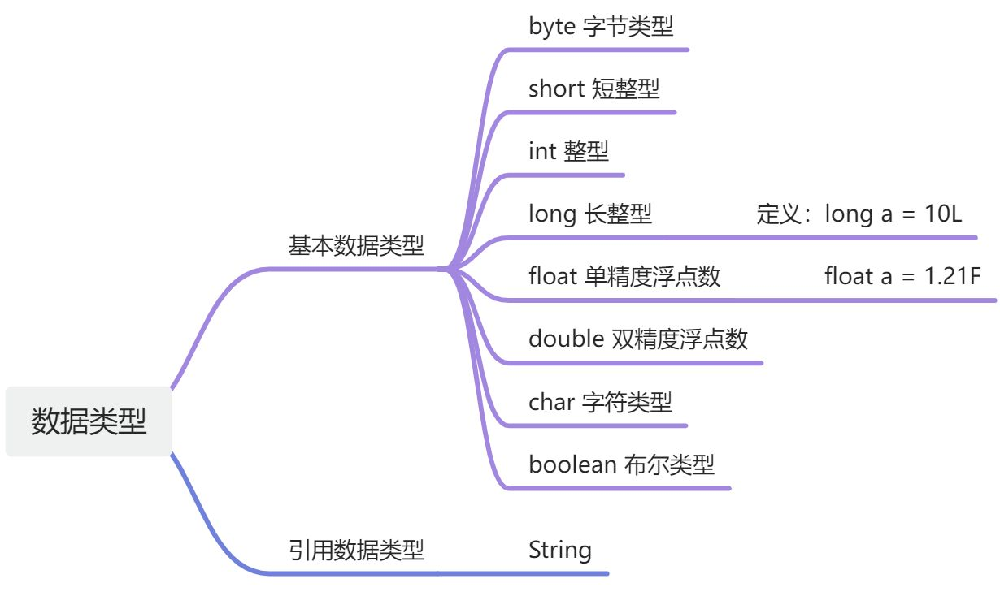

## 第一节.标识符

**即：在程序中由用户给类名、方法名或者变量所取的名字。**

有效字符：数字、字母、下划线、美元符号

其中<span style="color:red">**不能以数字开头，不能是关键字除（main），可以以下划线、美元符号开头**</span>

```java
public class Main {
    //psvm
    public static void main(String[] args) {
    }
}
```

注意：

1.java的数组的定义方式：int[] array  

C语言数组的定义方式：int arr[] 其中int[]才为类型 ，因此java是修正过来了

2.在java当中，函数叫做方法。

## 第二节.关键字

| 用于定义访问权限修饰符的关键字               |            |           |              |        |
| -------------------------------------------- | ---------- | --------- | ------------ | ------ |
| private                                      | protected  | public    |              |        |
| 用于定义类，函数，变量修饰符的关键字         |            |           |              |        |
| abstract                                     | final      | static    | synchronized |        |
| 用于定义类与类之间关系的关键字               |            |           |              |        |
| extends                                      | implements |           |              |        |
| 用于定义建立实例及引用实例，判断实例的关键字 |            |           |              |        |
| new                                          | this       | super     | instanceof   |        |
| 用于异常处理的关键字                         |            |           |              |        |
| try                                          | catch      | finally   | throw        | throws |
| 用于包的关键字                               |            |           |              |        |
| package                                      | import     |           |              |        |
| 其他修饰符关键字                             |            |           |              |        |
| native                                       | strictfp   | transient | volatile     | assert |


## 第三节.数据类型与变量

### 数据类型



| 类型      | 占用内存 | 例子                     | 说明                   |
| --------- | -------- | ------------------------ | ---------------------- |
| `byte`    | 1 字节   | `byte b = 100;`          | -128 ~ 127             |
| `short`   | 2 字节   | `short s = 1000;`        | 范围比 int 小          |
| `int`     | 4 字节   | `int age = 20;`          | **最常用整数类型**     |
| `long`    | 8 字节   | `long bigNum = 100000L;` | 末尾加 `L`             |
| `float`   | 4 字节   | `float pi = 3.14f;`      | 小数，末尾加 `f`       |
| `double`  | 8 字节   | `double price = 19.99;`  | **最常用小数类型**     |
| `char`    | 2 字节   | `char grade = 'A';`      | 单个字符，用 `' '`     |
| `boolean` | 1 位     | `boolean isOk = true;`   | 只有 `true` 或 `false` |

此处char与c++有所不同，c++为1个字节，并且java不区分32或64位操作系统

### 变量

**变量的命名规则**

- 只能用 **字母、数字、下划线、美元符号**，且不能以数字开头
- 不能用 Java 关键字（如 `class`、`int`）
- 见名知意（推荐小驼峰命名法：`myName`）


```java
double a = 1.1;
double b = 1.1;
System.out.println(a*b);
//1.2100000000000002
```

> 此处和浮点数的存储有关系
>
> float		double
>
> 精度：float 小数点后6位
>
> 1.123456789


**浮点型变量**

**double注意事项：**

1.double在任何系统下都占8个字节

2.浮点数与整数在内存中的存储方式不同，不能单纯使用2n的形式来计算

3.double的包装类型为Double

4.double类型的内存布局遵守 IEEE 754 标准（和C语言一样），尝试使用有限的内存空间表示可能无限的小数，势必会存在一定的精度误差，英雌浮点数是个近似值，并不是精确值。


**float注意事项：**

1.float类型在java中占4个字节，同样遵循 IEEE 754 标准，由于表示的数据精度范围小，一般在工程上用到浮点数都优先考虑double，不太推荐使用float，float的包装类型为Float。


**字符型变量**

**char注意事项：**

1.java中使用`单引号 + 单个字母 `的形式表示字符字面值。

2.计算机中的字符本质上是一个整数，在<span style="color:red">**C语言中使用ASCll表示字符，而java中使用 Unicode 表示字符因此一个字符占用两个字节**</span>，表示的字符种类更多，包括中文。所以Unicode的字符集比ASCll要大


**布尔型变量**

**boolean注意事项：**

1.boolean 类型的变量只有两种取值，true表示真，false表示假

2.java 的 boolean 类型和int 不能相互转换，**不存在** 1表示true，0表示false 这样的用法。


**类型转换**

在java中，当参与运算数据类型不一致时，就会进行类型转换，java中类型转换主要分为两种：自动类型转换(隐式) 和 强制类型转换(显式)。


> 自动类型转换（隐式）：
>
> 自动类型转换即：**在代码编译时，编译器会自动进行处理**；
>
> 特点：<span style="color:red">**数据范围小的转为数据范围大的时会自动进行**。</span>
>
>    **转换只发生在赋值的过程里**，变量本身的类型不会改变。  

```java
//整数类型的范围关系是：
byte < short < int < long < float < double

int a = 10;
long b = 10L;
b = a; 			//编译器会自动将int提升为long
b = (long) a;	//编译器自动帮你加上(long) 
```


强制类型转换（显式）：

强制类型转换：代码需要经过一定的格式处理，不能自动完成。

特点：数据范围大的到数据范围小的。

```java
float f = 3.14f;
double d = 3.14;
f =(float) d;	// float -> double,数据范围由大到小，需要强转，否则编译失败

//补充：
//当你参与运算的数据 小于4个字节的很好 会进行提升
byte a = 10;
byte b = 20;
//byte c = (byte)(a+b) //因为a + b会自动提升类型为int，底层为避免溢出而设计
int c = a+b;
```


注意：

1.不相干的类型，不能进行强制类型转换。

2.将一个字面值常量进行赋值的时候，java 会自动针对数字范围进行检查。

补充：题目

```java
short a = 128;
byte b = (byte)a;
System.out.println(b); // -128
```

原因：Java 的整数都是 **二进制补码存储**

- **short** 占 **16 位**（2 字节），范围是 -32768 ~ 32767。
- **byte** 占 **8 位**（1 字节），范围是 -128 ~ 127。

重点：当你从大类型（`short`）强制转换到小类型（`byte`）时，只会保留低 8 位，高位直接丢弃。

拆解过程：

Step 1：128 的二进制（short，16 位）

```java
0000 0000 1000 0000   （十六进制：0x0080）
```

Step 2：强制转换为 byte（取低 8 位）

```java
1000 0000
```

Step 3：解释这个 8 位二进制（byte 类型）

- 在 Java 中，`byte` 是有符号的，范围是 -128 ~ 127。
- `1000 0000` 的最高位是 **1**，说明它是一个负数（补码形式）。

补码 → 原码的过程：

```java
1000 0000 （补码）
= -128    （这是 byte 的最小值）
```

### 字符串类型

注意：

1.java当中的字符串不是以\0结尾的

2.当字符串和整数还在一起使用+号的意思 就是一个拼接的意思

eg:

```java
int a = 10,b = 20;
System.out.println("a:"+a + b);//a:1020
//原因：a:+a已经拼接表示为字符串了，因此该整体再与b之间也是拼接关系
```

部分情况下，需要将字符串和整型数字之间进行转换：

1.int 转成 String

```java
int num = 10;
//mean1
String str1 = num + "";
//mean2
String str2 = String.valueOf(num);
```

2.String 转成 int

```java
String str = "100";
int num = Integer.parseInt(str);
```