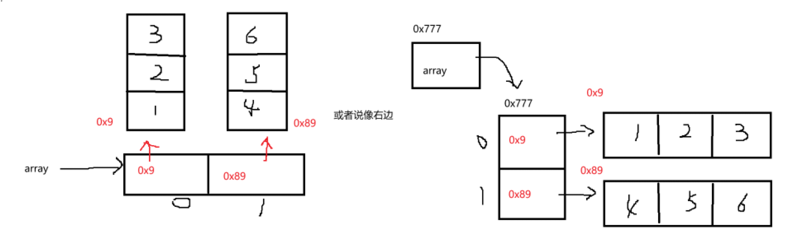

##  第四节.运算符

**1.仅补充%**

```java
System.out.println(10%3);//1
System.out.println(-10%3);//-1
System.out.println(10%-3);//1
System.out.println(-10%-3);//-1
```

**2.前置++与后置++**

> 可以理解为+号在前面就先加，加号在后面就不加
>

```java
int a = 1;
int b = ++a;
int c = a++;

System.out.println(b);	//2
System.out.println(c);	//1

//但要注意
a=a++;	//1,与c++不同
```

**3.关系运算符**

> < , > , <= , >= ,==  返回值：true or false;
>

**4.逻辑运算符**

| 运算符 | 作用 | 示例 | 结果 |
| --- | --- | --- | --- |
| `&&` | 逻辑与（都为真才真） | `true && false` | `false` |
| `||` | 逻辑或（有一个真就真） | `true || false` | `true` |
| `!` | 逻辑非（取反） | `!true` | `false` |


逻辑与

1.两个表达式必须都是布尔表达式

2.如果第一个表达式为假，那么就不会执行第二个表达式


逻辑或

1.两个表达式必须都是布尔表达式

2.只要有一个为真，那么整体为真

3.假设第一个为真，那么第二个就不会执行


逻辑非

1.作用在布尔表达式


& 和 | 如果表达式结果为 boolean 时，也表示逻辑运算，但与 && || 相比，他们不支持短路求值，

如果两边不是布尔表达式，那么还是按位与 按位或操作

```java
System.out.println(10 > 20 & 10 / 0 ==0)l;		//程序输出异常
System.out.println(10 < 20 | 10 / 0 ==0)l;		//程序输出异常
```

他们逻辑符号两侧都会执行


**5.位运算符**

按位与

```java
00001010
00010100
---------
00000000
```

按位或

```java
00001010
00010100
---------
00011110
```

按位异或：如果该位为 0 则转为 1，如果该位为 1 则转为 0

> 注意：
>
> 1.左移1位，相当于原数字 *2，左移N位，相当于原数字 *2 的N次方.
>
> 2.右移1位，相当于原数字 /2，右移N位，相当于原数字 /2 的N次方.
>
> 3.偶遇计算机计算位移效率高于计算乘除，当某个代码正好乘除 2 的N次方的时候可以用位移运算代替.
>
> 4.移动负数位或者移位位数过大都没有意义.
>

## 第五节.循环语句
1. `for` 循环

**适合：已知次数的循环**

```java
for (int i = 1; i <= 5; i++) {
    System.out.println("第 " + i + " 次执行");
}
```

执行结果：打印 1 到 5。

---

2. `while` 循环

**适合：不知道循环次数，但有一个条件控制**

```java
int i = 1;
while (i <= 5) {
    System.out.println("第 " + i + " 次执行");
    i++;
}
```

和上面的效果一样。


3. `do...while` 循环

**至少执行一次**，再判断条件。

```java
int i = 1;
do {
    System.out.println("第 " + i + " 次执行");
    i++;
} while (i <= 5);
```

和 `while` 的区别是：

    - `while`：先判断，再执行。
    - `do...while`：先执行，再判断。


4. `switch`语句

适合选项

```java
switch(表达式){
    case 常量值1:{
        语句1;
        [break;]
    }
    case 常量值2:{
        语句2;
        [break;]
    }
    ...
    default:{
        内容都不满足时执行语句;
        [break;]
    }
}
```

<font style="color:rgb(51,51,51);">多个</font><font style="color:rgb(51,51,51);">case</font><font style="color:rgb(51,51,51);">后的常量值不可以重复 </font>

<font style="color:rgb(51,51,51);">switch</font><font style="color:rgb(51,51,51);">的括号内只能是以下类型的表达式： </font>

+ <font style="color:rgb(51,51,51);">基本类型：byte、char、short、int，注意不能是long类型 </font>
+ <font style="color:rgb(51,51,51);">引用类型：String常量串、枚举类型</font>

## 第六节.数组（Array）
1. 什么是数组？

+ 数组就是 **一组相同类型的数据** 的集合。
+ 它可以用一个名字存放多个数据，并通过 **下标（索引）** 来访问。

例子：

```java
int[] scores = {95, 88, 76, 100};
System.out.println(scores[0]); // 输出第一个元素 95
System.out.println(scores[3]); // 输出第四个元素 100
```

👉 注意：数组的下标是 **从 0 开始** 的。


2. 数组的声明与初始化

<font style="color:rgb(51,51,51);">数组的初始化主要分为</font>**<font style="color:rgb(51,51,51);">动态初始化以及静态初始化</font>**<font style="color:rgb(51,51,51);">。 </font>

<font style="color:rgb(51,51,51);">1. </font>**<font style="color:rgb(51,51,51);">动态初始化：在创建数组时，直接指定数组中元素的个数 </font>**

```java
int[] array = new int[10];
```

<font style="color:rgb(51,51,51);">2. </font>**<font style="color:rgb(51,51,51);">静态初始化：在创建数组时不直接指定数据元素个数，而直接将具体的数据内容进行指定 </font>**

<font style="color:rgb(51,51,51);">语法格式： T[] 数组名称 = {data1, data2, data3, ..., datan};</font>

```java
int[] array1 = new int[]{0,1,2,3,4,5,6,7,8,9};
double[] array2 = new double[]{1.0, 2.0, 3.0, 4.0, 5.0};
String[] array3 = new String[]{"hell", "Java", "!!!"};
```

<font style="color:rgb(51,51,51);">【注意事项】 </font>

<font style="color:rgb(51,51,51);">静态初始化虽然没有指定数组的长度，编译器在编译时会根据</font><font style="color:rgb(51,51,51);">{}</font><font style="color:rgb(51,51,51);">中元素个数来确定数组的长度。 </font>

<font style="color:rgb(51,51,51);">静态初始化时</font><font style="color:rgb(51,51,51);">, {}</font><font style="color:rgb(51,51,51);">中数据类型必须与</font><font style="color:rgb(51,51,51);">[]</font><font style="color:rgb(51,51,51);">前数据类型一致。 </font>

<font style="color:rgb(51,51,51);">静态初始化可以简写，省去后面的new T[]。</font>

<font style="color:rgb(51,51,51);">3.数组初始化内容</font>

| 类型 | 默认值 |
| --- | --- |
| byte | 0 |
| short | 0 |
| int  | 0 |
| long | 0 |
| float | 0.0f |
| double | 0.0 |
| char | /u0000 |
| boolean | false |


4. 遍历数组

用循环来访问数组的所有元素：

```java
int[] arr = {10, 20, 30, 40, 50};
for (int i = 0; i < arr.length; i++) {
    System.out.println("第 " + (i+1) + " 个元素：" + arr[i]);
}
```

这里 `arr.length` 表示数组的长度。


5.二维数组

```java
数据类型[][] 数组名称 = new 数据类型 [行数][列数];
数据类型[][] 数组名称 = new 数据类型 [][] { 初始化数据 };
数据类型[][] 数组名称 = new 数据类型 [行数][];
```

补充对二维数组是一维数组的深度理解

```java
int[][] array ={{1,2,3},{4,5,6}};
System.out.println(array.length); //2
System.out.println(array[0].length);//3
System.out.println(Arrays.toString(array[1])); //[4, 5, 6]
String ret = System.out.println(Arrays.deepToString(array));
System.out.println(ret);	//[[1,2,3],[4,5,6]]
```

其中array的底层为图中所示



### 数组补充内容
#### 1. 找最大值和最小值
思路：

+ 假设第一个元素是最大/最小值。
+ 遍历数组，依次比较更新。

```java
int[] arr = {12, 45, 7, 89, 23};
int max = arr[0];
int min = arr[0];

for (int i = 1; i < arr.length; i++) {
    if (arr[i] > max) {
        max = arr[i];
    }
    if (arr[i] < min) {
        min = arr[i];
    }
}
System.out.println("最大值：" + max);
System.out.println("最小值：" + min);
```

#### 2. 倒序输出数组
有时我们希望反过来输出：

```java
int[] arr = {1, 2, 3, 4, 5};
for (int i = arr.length - 1; i >= 0; i--) {
    System.out.print(arr[i] + " ");
}
```

👉 这个思路也能用于「数组反转」。

#### 3. for each遍历（增强 for 循环）
Java 提供了简化的遍历写法（但不能改变数组里的值）：

```java
int[] arr = {10, 20, 30};
for (int num : arr) {
    System.out.println(num);
}
```

#### 4. 多维数组（二维数组）
二维数组 = 表格。  
比如存放学生成绩（3 个学生，每人 2 门课）：

```java
int[][] scores = {
    {90, 85},
    {70, 88},
    {100, 95}
};
System.out.println(scores[0][1]); // 第1个学生的第2门课成绩 85
```


