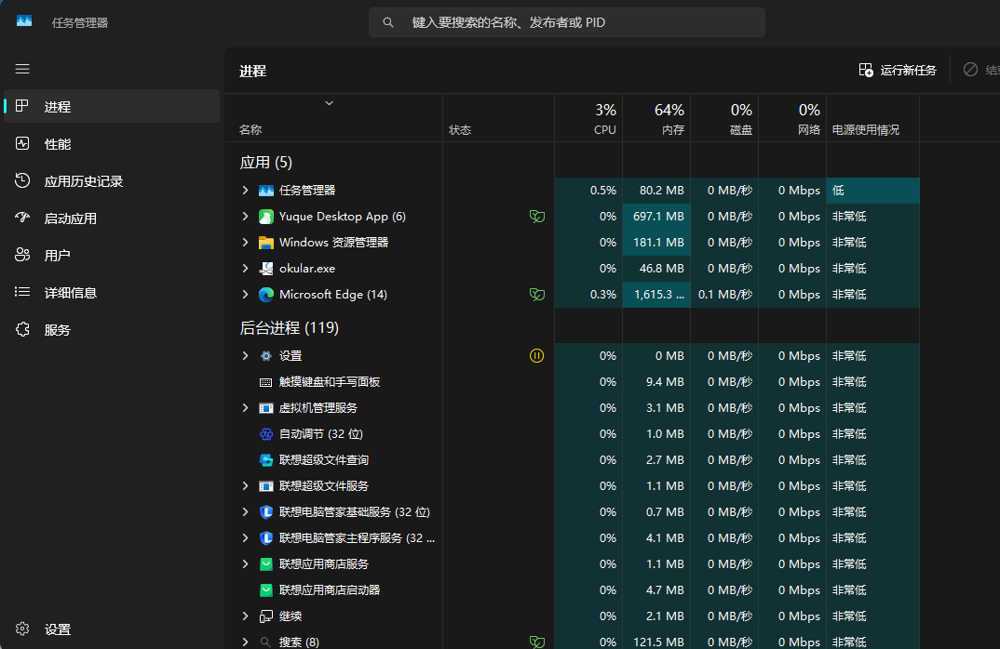
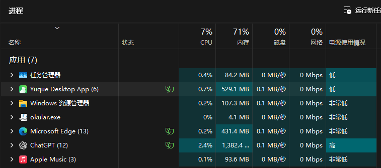
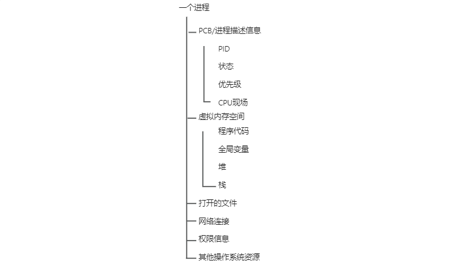
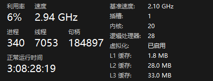
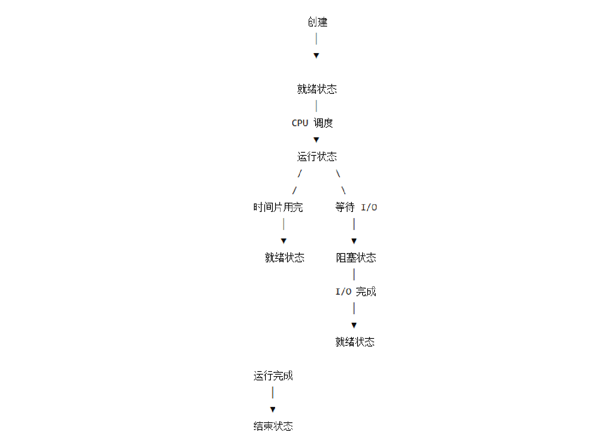

**你有没有想过，当我们双击一个程序时，操作系统到底做了什么？**

以 Windows 环境为例，磁盘中的`.exe`（可执行程序）文件本质上是一个静态程序，里面包含着程序运行所需的机器指令、数据，本身不会执行。只有当操作系统把程序加载到内存，为它分配运行需要的资源，并且让 CPU 执行其中的指令后，这个静态的可执行文件才真正变成一个正在运行的程序。

这个运行的程序实例，就是我想说的**进程**（Process）

## 1. 程序与进程
### 1.1 程序
点击键盘 CTRL + SHIFT + ESC 就会弹出下面这样一个界面，也就是任务管理器，正常会运行上百个进程。了解到这里，就应该想问出**进程到底是什么**？为什么**操作系统需要进程**？一个磁盘中的程序，又是**如何变成一个正在运行的进程**的？

首先得知道：**程序不等于进程**




程序 = 存放在磁盘上的一组指令和数据

就比如一个这样存放在你的电脑硬盘里的文件：

```java
C:\Program Files\Google\Chrome\Application\chrome.exe
```

只要`chrome.exe`还没有启动，他就只是磁盘上的一个程序。

主要因为一下几点：

1. 不占 CPU 执行时间；
2. 没有正在使用的寄存器；
3. 没有自己的运行状态；
4. 没有变化的内存数据；

综上，所以说程序是**静态**的。

### 1.2 进程
当我们双击`chrome.exe`后，事情就不一样了，Windows 操作系统就会开始为它准备运行环境。

补充一下**操作系统（Operating System, OS）**扮演的角色：

> 操作系统就是计算机里的“总管 + 调度中心 + 翻译层”，可以理解为酒店里的经理吧或者说公司里的运营官，嗯对；操作系统是介于硬件和软件之间，负责统一管理真正干活的 CPU、内存、硬盘、显卡、网卡...这些硬件，对没错就是牛马们。
>

这时候呢，操作系统就有以下动作：


此时，它就不再只是一个磁盘中的文件里，而是程序的一次**运行实例**；

根据上面的描述，我总结出一句：

> 程序描述“要做什么”，进程描述“程序现在运行到什么状态”
>

## 2. 一个进程中有什么

不知道会不会有个疑惑觉得**为什么会需要“进程”这个东西？**

就比如我当前电脑正在同时运行这些软件：




CPU、内存、磁盘这些资源都很有限，操作系统就得知道哪些程序正在运行、占用了多少内存、谁正在等待 I/O、谁已经准备好运行，以及接下来应该让谁获得 CPU。

所以对操作系统来说，它就会把每一个进程**抽象为用一个或多个结构体**来描述和管理。

知道上面结果后就会容易想，一个**进程中都有什么？或者一个进程运行本身需要哪些东西？**

我给出一个简单的模型：


 虚拟地址空间本身是一个比较大的话题，涉及代码段、数据段、堆、栈、内存映射...一些内容。这里暂时把它理解为：**操作系统为每个进程提供的一套独立的虚拟内存视图**，具体的内存管理机制后面有机会再展开~😁

上图其中**运行所需的系统资源**也包含里很多，比如 Chrome 运行起来后，就会需要内存、网络连接 Socket、文件描述符、权限信息、若干线程。 到这里我们能知道**一个进程运行起来，需要代码、数据、内存以及各种操作系统资源。**

但是，接着我再抛出一个问题：

> “**操作系统怎么知道这些东西属于哪一个进程？**”
>

## 3. PCB：操作系统如何管理进程
上面已经说过“操作系统会把每一个进程**抽象为用一个或多个结构体**来描述和管理”。但其实，在操作系统原理中，通常把描述和管理一个进程所需要的核心信息统称为 **PCB（Process Control Block，进程控制块）**，它会再把多个进程组织起来。

你可以脑补为这样：

```c
struct PCB {
    int pid;              // 进程编号
    int state;            // 运行、就绪、阻塞……
    registers regs;       // CPU寄存器现场
    memory_info memory;   // 内存信息
    file_info files;      // 打开的文件
    priority prio;        // 优先级
    ...
};
```

操作系统里就会有很多这样的“进程档案”，但真正的进程包含的东西比这个结构体多得多，我让 ai 给了一份内容：




可以把 PCB 理解为“进程的档案袋”，然后这样一整套运行的程序信息，就被操作系统抽象为一个**“进程”**。

我整理为一段话就是：

>  进程是正在运行的程序实例，而 PCB 是操作系统用来描述和管理这个进程的“档案”。  
>

PCB 中的一些关键点：

pid（进程的身份标识符）、内存管理信息（记录或指向进程的地址空间、页表等内存管理结构）、文件描述符表（记录打开了哪些文件/资源的表，这是在 Linux 中用叫法，Windows 常称句柄）、CPU 寄存器（保存进程当前正在使用的数据、地址和运算状态）......

## 4. 进程是如何被 CPU 运行的
 前面说过，PCB 中会记录一个进程当前的状态。但一个进程从创建到结束，并不会一直占着 CPU 运行……实际上，在现如今的操作系统中，同一时间会存在上百甚至上千个进程，而 CPU 的核心数远没有那么多，就拿我的电脑举例：




20 个内核，28 个逻辑处理器你可以理解为：

20 个牛马，其中一些牛马有两张工作台，因此公司排班中能看到 28 个工作位，也就是在干 28 个人的活

也就是说：

**想运行的进程很多，但真正能够同时在 CPU 上执行的进程数量是有限的。**

所以操作系统就得解决两个问题：

1.一个进程当前到底处于什么状态？

2.CPU 下一步该运行到哪个进程？

这两个问题就涉及到刚刚提到过一点的**状态、调度和上下文切换**了；

### 4.1 进程的生命周期与状态
同样先给出一个简化模型，有点模糊哈将就将就：




以上是最常见的几个状态，最典型的两个就是**就绪状态（Ready）**和**阻塞状态（Blocked/Waiting）**

就绪状态（Ready）

> 什么都准备好了，可以理解为随叫随到
>

运行状态（Running）

> 当 CPU 真正开始执行这个进程中的指令时，进程就进入运行状态。
>

阻塞状态（Blocked/Waiting）

> 进程当前不适合到 cpu 上执行。
>

不过在操作系统中，一般不区分就绪和执行，默认都是就绪。

举个例子：

> 假设 Chrome 发起一次网络请求：
>
> 在等待服务器返回的时候，即使一直把 CPU 给 Chrome，那它也没有办法继续执行。所以操作系统会让它进入阻塞状态，把 CPU 让给其他可以运行的进程。
>

这里的阻塞就可以理解为：CPU 给我也没用，我正在等别的东西。

> 等到网络数据回来后，这个进程就重新具备运行条件，于是：
>
> 阻塞状态->等待事件完成->就绪状态
>
> 注意，它通常不是直接变成运行状态，而是先进入**就绪状态**。
>
> 因为即使它已经准备好了，CPU 可能仍然正在执行其他进程。
>
> 至于什么时候再次获得 CPU，还需要由操作系统决定。
>

以上过程就是所说的 **CPU 进程调度**。

### 4.2 CPU 如何选择下一个进程
这一段的话，我就不是那么了解了，这部分就是借助 ai 理解了哈，如果有不对请纠正；

假设系统中同时存在这些进程：

> Chrome、IDEA、微信、MySQL、AppleMusic
>
> 并且以上都处于就绪状态，但当前只有一个 CPU 核心可以使用，此时该怎么办呢？
>

当然不能放肆给大家一起抢了，不然你的电脑就崩溃了哈哈

所以需要到操作系统中的专门负责这一版块的组件了，称之为**调度器（Scheduler）**。

调度器可以简单理解为：

**从所有可以运行的进程中，选择一个进程获得 CPU。**

刚刚的假设呢，至于调度器要选谁，当然也不是随机的。操作系统还是会根据一些因素来决策，就比如：**进程优先级**、**已经等待的时间**、**之前运行的时间**、**进程类型**、**系统调度策略**...

关于这里我有一个例子有点意思：

> 假设我是一个妹子~我长得好看又有才华，就有很多人追我~
>
> 有以下三个
>
> A：有钱
>
> B：帅
>
> C：会添
>

然后我同时和三个男朋友一起谈~

> 为了让这三个人不能刚知道对方存在
>
> 我就规划好，周一二和 A 约会；周三四和 B 约会；周五六和 C 约会；周日留给自己；默认每个小哥哥都是“随叫随到”
>
> 当前就是分时复用，并发执行
>
> 定制时间表并且按照时间表来执行，就是进程调度的过程~
>

当然这个例子只是用来理解“有限资源被多个任务轮流使用”，真正的 CPU 调度并没有一张提前写死的约会时间表，而是会根据任务状态、优先级和调度策略动态决定。

以上就涉及到 CPU 的一些调度算法了，关于调度算法这点我就不是很会啦~

不过只需要知道 **CPU 不是某个进程永久占有的资源，而是由操作系统不断在多个可运行任务之间进行分配**。

哦对了，这里还需要涉及一个概念——时间片**（Time Slice / Quantum）**。

又假如哈：

> 操作系统让 Chrome 得到了 CPU，Chrome 当然也不会一直运行下去，通常是毫秒级的一小段 CPU 时间，具体长度取决于操作系统和调度策略。
>

这段允许它连续使用 CPU 的时间，就可以理解为一个时间片。当时间片结束后，操作系统可能就会暂停 Chrome，然后让另一个进程运行，操作系统就是在不断的这样切换切换，让我们一直以为所有程序都在同时运行。当然，现代 CPU 通常有挺多个核心，所以也的确可以有多个任务在不同 CPU 核心上真正同时执行。


不过你想，一个 CPU 的常规为 1 秒计算 21 亿次，而且还不是睿频，所以可以想象到 CPU 切换的速度。

然后呢，在同一时刻真正同时执行多个任务的情况，通常称为**并行**；而在单个 CPU 核心上快速交替执行多个任务，更接近于**并发**。

上述提到的不断来回切换这里就产生了一个问题，就是 CPU 怎么知道刚刚的程序执行到哪个步骤？CPU 的寄存器里的数据怎么办？显然，操作系统不能简单地“停下来就不管了”。

所以这就需要进行**上下文切换**。

### 4.3 进程切换与上下文切换
CPU 在执行一个进程时，会存在大量和当前执行状态有关的信息。

就比如有：程序计数器、CPU 寄存器、栈指针、部分处理器状态；

其中程序计数器**（Program Counter，PC）**非常重要，你可以把它理解为：CPU 下一条应该执行哪条指令。

就比如 Chrome 当前执行到：

```java
指令 100
指令 101
指令 102  ← 当前执行位置
指令 103
指令 104
```

这个时候 CPU 突然切换到正在做笔记的语雀，那么此时执行到了 102 的这个位置的信息就必须保存下来。所以在切换之前，操作系统会先保存当前进程的执行现场，然后被保存的这些运行信息，就是进程的“上下文”的一部分了。

我还有个例子哈，就是刚刚的三个小哥哥~

> 我和 A 约会的时候，
>
> A：下个月，你陪我去一趟三亚，你提前准备准备~
>
> 我：好的好的~
>

> B：下个月，我的妈妈要过生日，想让你陪我去挑选一下礼物，提前准备准备~
>
> 我：好的好的~
>

这个时候，当然不能出现我拿着一个金手镯子面对 A 问我准备如何；我当然也不能准备了一套性感的泳衣面对 B 问我准备如何啦。所以我就得在和 ABC 约会·的时候，每次结束都拿一个小本本把当天一些重要的事情记录下来，下次再和这个人约会时，就先翻一下小本子，回忆一下上次的进展。

这个例子还是很生动吧，然后这整个过程包括 Chrome 那个例子就是：上下文切换**（Context Switch）**。

这也就是为什么前面 PCB 中要保存：CPU 寄存器信息、程序计数器、进程状态、调度信息这些内容的原因了。

当然了，上下文切换也并不是免费的，毕竟切换这个过程还是有些性能开销的，就比如像是保存寄存器、恢复寄存器、切换相关内存管理信息、更新进程状态、执行调度逻辑...

不过到这里还有一个新问题，之前我们一直把一个进程看成是一个相对独立的运行单位，每个进程都有自己的地址空间和系统资源。

但是现实中的程序并不是完全互不相干的，就比如：

> 浏览器进程要和渲染进程交换数据
>
> 客户端要和服务器通信
>
> 一个程序产生的数据可能要交给另一个程序处理
>

我们又说不同进程之间默认相互隔离，那么**一个进程要如何把数据交给另一个进程**，就得需要继续了解**进程之间如何交互协作**了。

## 5. 进程之间如何协作
现在看，前面一直把一个进程看作一个相对独立的运行单位。

每个进程都有自己的运行状态、虚拟地址空间以及各种系统资源，这样的设计其实就是为了像是：

如果其中一个进程出现了问题，通常不会直接把另一个进程的内存也一起搞坏，抽象理解为：


就像是大家各住各的房子，正常情况下不能直接翻墙去别人家拿东西。这样的隔离可以提高可以提高系统的**安全性**和**稳定性**，但问题也随之出现。

我们上面提到过，现实中的程序并不是完全互不相干的，就比如浏览器：

当前 Chorme 一个进程需要多个进程一起完成浏览器工作


当用户在地址栏输入一个网址，那么这个信息可能还需要交给其他进程处理，就比如：渲染进程可能需要知道页面内容是什么、GPU 相关进程可能需要知道有什么图形任务需要处理...

这些进程之间如果不能交流，显然用户就达不到他想要的结果。所以操作系统必须在“进程隔离”的基础上，再提供一些**受控制的数据交换方式**。这些机制统称为：**进程间通信（Inter-Process Communication，IPC）**。

这些机制可以倾向于这么理解：

> 就是你们这些进程不能随便进对方家，但是我可以给你们提供电话、快递柜、公共会议室之类的方式进行交流。
>

具体来说，操作系统提供了管道、共享内存、消息队列、Socket 等多种进程间通信方式，也就是前面说的 IPC。每一种方式具体怎么实现，还有不少内容，这里暂时先不展开。（其实是我不太懂了😁）

到这里其实已经能发现，**进程的一个重要特点就是彼此之间相对独立**。

独立当然有好处，一个进程出了问题不容易直接影响另一个进程，但这种独立也意味着：如果两个进程想共享数据，就得借助 IPC；创建和管理多个进程本身也需要一定的系统资源。

那么问题又来了。

假设现在不是两个独立程序需要协作，而是**同一个程序内部需要同时做很多事情**呢？

比如一个音乐软件可能需要同时：

> 播放音乐
>
> 响应鼠标操作
>
> 更新界面
>
> 读取本地文件
>
> 请求网络数据
>

如果每做一件事情都创建一个新的进程，显然有点太“重量级”了。

有没有一种比进程更加轻量，同时又能让一个程序内部存在多个执行任务的东西？

这就要继续说到——**线程（Thread）**。

## 6. 为什么有了进程还需要线程
从前面已经知道，一个进程可以看作一个正在运行的程序实例，它有自己的地址空间、系统资源，也可以被操作系统独立管理。**但是**，**如果同一个程序内部，需要同时做很多事情怎么办？**

比如一个音乐软件运行时，可能需要同时：

> 播放音乐
>
> 响应鼠标点击
>
> 更新界面
>
> 读取文件
>
> 请求网络数据
>

当然，我们可以给每一个任务都创建一个新的进程，比如：

> 播放音乐进程
>
> 界面更新进程
>
> 网络请求进程
>
> 文件读取进程
>

但如果每个软件都这样需要这么多进程的话，实在是太“重”了。因为每创建一个新的进程，操作系统都要给它准备相对独立的地址空间以及各种管理信息；另外不同进程之间如果需要交换数据，还要借助前面提到的 IPC。

如果这些任务本来就同属一个程序，还每做一件事情就创建一个新进程，显然不太划算。****

所以就出现了一个比进程更加轻量的执行单位：**线程（Thread）**

注意：进程是操作系统资源分配的基本单位；线程是 CPU 上调度执行的基本单位；

相比于进程：进程更像是一个程序的运行环境，而线程则是在这个环境中真正执行任务的执行流。

继续用前面的“房子”来比喻的话：

> 进程 = 一套房子
>
> 线程 = 住在房子里干活的人
>

不同进程就像不同的房子，彼此之间默认相互隔离。

而同一个进程中的多个线程，则像住在同一套房子里的人，它们可以共同使用客厅、厨房、冰箱这些公共资源，但每个人又可以同时做自己的事情。


我再换个比喻，这个可能会更生动些：

1. 两个老铁 两个酒桌 两套房间

> 我现在有 100 只鸡，需要人在房间的酒桌上吃完
>
> 此时如果有两个人，就得需要搞两套房间，两个酒桌，每个人就可以只需要吃 50 只鸡，但需要的花销就比较大
>


2. 一个房间 一个酒桌 两个老铁来吃

> 两个人在一个酒桌一个房间，两人一起吃 100 只，效率仍然能大幅度提高，还减少了酒桌和房间的开销
>


3. 引入更多线程的话，就如下图嘿嘿


不过虽然提高了线程的数目，能够提高效率，但也不是“线性增长”。线程数目达到一定程度之后，就算线程再多，也没法起到效果了。毕竟...桌子就那么大啦

线程数目太多的话，线程的调度开销的也会非常明显，从而拖慢了程序的性能。

所以：

**进程解决的是程序运行和资源隔离的问题，而线程解决的是一个进程内部如何同时存在多个执行任务的问题。**

而且严格来说，前面一直说“CPU 调度进程”主要是为了方便理解。现代操作系统中，真正被 CPU 调度执行的单位通常是线程。

至于线程到底是怎么创建的、多个线程是怎么同时运行的、为什么会出现线程安全问题，以及 Java 中的多线程到底是怎么回事，就留到下一篇继续说了。
