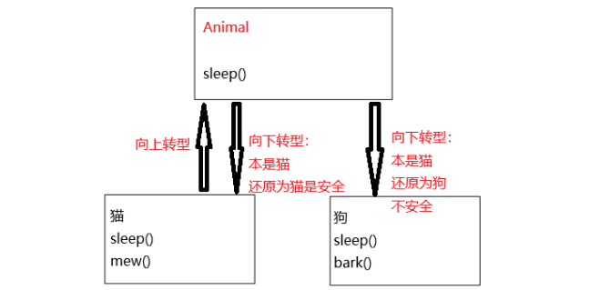

## <font style="color:rgb(51,51,51);">1.多态</font>

**对一个事物产生不同的态度**

### 1.1多态实现条件

**多态实现的三个必要条件**

+ 必须在父类的继承体系下
+ 子类必须要对父类中方法进行重写
+ 通过父类的引用调用重写的方法

当使用多态方式调用方法时，首先检查父类中是否有该方法，如果没有，则编译错误。**如果有，再去调用子类的同名方法**。

### 1.2向上转型和向下转型

#### 1.2.1向上转型

概念：创建一个子类对象，将其当成父类对象来使用。

语法格式：父类类型 对象名 = new 子类类型()

```java
Animal animal = new Cat("元宝",2);
```

animal是父类类型，但可以引用一个子类对象，因为是从小范围向大范围的转换。

**<font style="color:rgb(51,51,51);">向上转型的几种方法：</font>**

+ <font style="color:rgb(51,51,51);">直接赋值</font>
+ <font style="color:rgb(51,51,51);">方法的传参</font>
+ <font style="color:rgb(51,51,51);">方法的返回值</font>

注意事项：

+ 通过父类的引用，调用子类特有的方法是无法直接调用的，这里只能调用父类自己的。

```java
class Animal{
    public String name;
    public Animal(String name){
        this.name = name;
    }
}

class Dog extends Animal{
    public Dog(String name){
        super(name);
    }
}

class Cat extends Animal{
    public Cat(String name){
        super(name);
    }
}

public class Test {
    //方法二：方法的传参
    public static void function(Animal animal){
    }
    //方法三：返回值
    public static Animal function2(){
        Dog dog = new Dog("Papy Dog");
        return dog;
    }
    public static void main(String[] args) {
        //方法一：直接赋值
        Animal dog = new Dog("Papy Dog");
        Cat cat = new Cat("Papy Cat");
        //方法二：方法的传参
        function(cat);
        //方法三：返回值
        Animal dog2 = function2();
    }
}
```

#### 1.2.2向下转型

将一个子类对象经过向上转型之后当成父类方法使用，再无法调用子类的方法，但有时候可能需要调用子类特有的方法，此时：将父类引用再还原为子类对象即可，即向下转换。



继续根据向上转型的类举例：

```java
class Animal{
    public String name;
    public Animal(String name){
        this.name = name;
    }
}

class Dog extends Animal{
    public Dog(String name){
        super(name);
    }
}

class Cat extends Animal{
    public Cat(String name){
        super(name);
    }
}

public class Test{
    public static void main(String[] args){
        Dog dog = new Dog("Papy Dog");
        Cat cat = new Cat("Papy Cat");
        Animal animal = new Dog("Papy Dog");	//向上转型
        Dog dog = (Dog)animal;		//合法的向下转型
        //cat = (Cat)animal;		//非法的向下转型
    }
}
```

注意向下转型的要求：

+ 必须先有向上转型（前提）
+ 对象的真实类型必须是目标子类或者其子类
+ 需要强制类型转换（Cast）
+ 推荐`instanceof`检查类型（安全转型方式）

```java
if (a instanceof Dog) {
    Dog d = (Dog) a;
    d.bark();
}
```

来个比喻呢就是

+ 向上转型：你把 “iPhone” 当成 “手机” 来用，没问题。
+ 向下转型：你把 “手机” 强行当成 “iPhone” 用，只有当它本来就是 iPhone 才行，如果本来是 “小米”，那么立马报错。 

### 1.3重写与重载

#### 1.3.1重写

```java
class Animal{
    public String name;
    public Animal(String name){
        this.name = name;
    }
    public void eat(){
        System.out.println("Animal在吃饭");
    }
}

class Dog extends Animal{
    public Dog(String name){
        super(name);
    }
    public void eat(){
        System.out.println("Dog在吃饭");
    }
}

//输出结果：Dog在吃饭
```

以上例子构成了重写，按规则是要调用父类的eat的，但是构成了**动态绑定（**<font style="color:#DF2A3F;">伏笔</font>**）**

**<font style="color:rgb(51,51,51);">重写(override)</font>**<font style="color:rgb(51,51,51);">：也称为覆盖。重写是子类对父类非静态、非private修饰，非final修饰，非构造方法等的实现过程进行重新编写, </font>**<font style="color:rgb(51,51,51);">形参列表与被重写方法的参数列表必须完全相同</font>**<font style="color:rgb(51,51,51);">。</font>

<font style="color:rgb(51,51,51);">方法重写的规则：</font>

+ <font style="color:rgb(51,51,51);">子类在重写父类的方法时，一般必须与父类方法原型一致： 返回值类型方法名 (参数列表) 要完全一致 </font>
+ <font style="color:rgb(51,51,51);">被重写的方法返回值类型可以不同，</font>**<font style="color:rgb(51,51,51);">但是必须是具有父子关系</font>**<font style="color:rgb(51,51,51);">的</font>
+ <font style="color:rgb(51,51,51);">访问权限</font>**<font style="color:rgb(51,51,51);">不能比父类中被重写的方法的访问权限更低</font>**<font style="color:rgb(51,51,51);">。例如：如果父类方法被public修饰，则子类中重写该方法就不能声明为 protected </font>
+ <font style="color:rgb(51,51,51);">父类</font>**<font style="color:rgb(51,51,51);">被static、private修饰的方法</font>**<font style="color:rgb(51,51,51);">、</font>**<font style="color:rgb(51,51,51);">构造方法</font>**<font style="color:rgb(51,51,51);">都不能被重写。 </font>
+ <font style="color:rgb(51,51,51);">重写的方法, 可以使用 @Override 注解来显式指定. 有了这个注解能帮我们进行一些合法性校验. 例如不小心将方法名字拼写错了 (比如写成 aet), 那么此时编译器就会发现父类中没有 aet 方法, 就会编译报错, 提示无法构成重写.</font>

<font style="color:rgb(51,51,51);">对第二点解释：</font>

```java
class Parent {
    Number getValue() { return 1; }
}
class Child extends Parent {
    @Override
    Integer getValue() { return 2; } // OK，Integer 是 Number 的子类
}
```

#### 1.3.2重写与重载的区别

| 区别点     | 重载Overload | 重写Override                                   |
| ---------- | ------------ | ---------------------------------------------- |
| 参数列表   | 必须修改     | 一定不能修改                                   |
| 返回类型   | 可以修改     | 一定不能修改[除非构成父子类关系]               |
| 访问限定符 | 可以修改     | 可以减少或删除，一定不能抛出新的或者更广的异常 |
| 访问       | 可以修改     | 一定不能做更严格的限制（可以降低限制）         |


重写的原则：

对于已经投入使用的类，尽量不要进行修改。最好的方式是：重新定义一个新的类，来重复利用其中共性的内容，并且添加或者改动新的内容。

+ **父类：DrinkMachine（饮料机）**

```java
class DrinkMachine {
    public void makeDrink() {
        System.out.println("制作普通饮料");
    }
}
```

+ **子类：CoffeeMachine（咖啡机）**

```java
class CoffeeMachine extends DrinkMachine {
    @Override
    public void makeDrink() {
        System.out.println("制作咖啡");
    }
}
```

eg：比如饮料机。父类：DrinkMachine 子类：咖啡机CoffeeMachine，如果直接改`DrinkMachine`的`makeDrink()`方法把“普通饮料“换成”咖啡“，那以后所有买饮料的人都只能喝咖啡了， 果汁党就会抗议 😂。 

正确做法应该就是新建`CoffeeMachine`，只改子类逻辑，不影响父类

#### 1.3.3动态绑定与静态绑定

**<font style="color:rgb(51,51,51);">静</font>****态绑定**：也称为前期绑定(早绑定)，即在编译时，根据用户所传递实参类型就确定了具体调用那个方法。典型代表函数重载。

**动态绑定**：也称为后期绑定(晚绑定)，即在编译时，不能确定方法的行为，需要等到程序运行时，才能够确定具体调用那个类的方法。

解释如下：

```java
class Parent {
    void hello() {
        System.out.println("Parent hello");
    }
}

class Child extends Parent {
    @Override
    void hello() {
        System.out.println("Child hello");
    }
}

public class Main {
    public static void main(String[] args) {
        Parent p = new Child();  // 向上转型
        p.hello();               // 打印什么？
    }
}
```

(1)编译期

+ 编译器只知道 `p` 的静态类型是 `Parent`，所以它会去 `Parent` 类中查找有没有 `hello()` 方法。
+ 查到以后，编译器就说：“行，这个调用是合法的。”
+ 但 **它不会决定最终调用哪个版本**。

👉 所以编译期只检查 **方法是否存在**，但不绑定到具体实现。

(2)运行期

+ 运行时，`p` 实际上引用的是一个 `Child` 对象。
+ Java 虚拟机（JVM）在调用 `p.hello()` 的时候，会根据 **对象的真实类型（运行时类型）** 来决定到底执行 `Parent.hello()` 还是 `Child.hello()`。
+ 因为 `Child` 重写了 `hello()`，所以 JVM 调用的是 `Child` 的版本。

这就是动态绑定（Dynamic Dispatch）


**JVM底层原理**

在JVM的方法区（Java8后都是元空间Metaspace）里，每个类都会有一张**方法表** **（Method Table，类似 C++ 的 vtable）  。**

**1.类加载时**：

+ JVM 为 `Parent` 类建立方法表，里面有 `hello -> Parent.hello` 的映射。
+ JVM 为 `Child` 类建立方法表，发现 `hello` 被重写了，就把 `hello -> Child.hello` 替换掉。

**2.对象创建时**：

+ 当`new Child()`执行时，对象头里会有一个指针，指向`Child`的类信息（包括方法表）。

**3.方法调用时**：

执行 `p.hello()`，JVM 并不会直接调用 `Parent.hello()`，而是：

+ 看 `p` 的运行时类型 → 发现它指向 `Child`
+ 在 `Child` 的方法表里查找 `hello()` → 找到 `Child.hello()` → 调用它。

 👉 因此，真正起作用的是 **运行时对象的类信息 + 方法表查找**，而不是变量的声明类型 。

我们可以类比为：

编译期：老师点名检查->”这个学生‘回答问题’的功能吗？“（有）

运行期：真正回答问题的是具体学生，可能每个人回答的方式不同。

### 1.4回顾多态

#### 1.4.1多态思想

```java
class Animal{
    public String name;
    public Animal(String name){
        this.name = name;
    }
    public void eat(){
        System.out.println(this.name+"在吃饭");
    }
}

class Dog extends Animal{
    public Dog(String name){
        super(name);
    }
    @Override
    public void eat(){
        System.out.println(this.name+"在吃饭");
    }
}

class Cat extends Animal{
    public Cat(String name){
        super(name);
    }
    @Override
    public void eat(){
        System.out.println(this.name+"在吃饭");
    }
}

public class Test{
    public static void func(Animal animal){
        animal.eat();
    }
    public static void main(String[] args) {
        Dog dog = new Dog("Papy Dog");
        Cat cat = new Cat("Papy Cat");
        func(dog);
        func(cat);
    }
}

输出结果：
Papy Dog在吃饭
Papy Cat在吃饭
```

调用同一个方法，得到不同的结果（多态思想）

#### 1.4.2多态的优缺点

**优点：**

```java
public static void drawShapes() {
    Rect rect = new Rect();
    Cycle cycle = new Cycle();
    Flower flower = new Flower();
    String[] shapes = {"cycle", "rect", "cycle", "rect", "flower"};
    for (String shape : shapes) {
        if (shape.equals("cycle")) {
            cycle.draw();
        } else if (shape.equals("rect")) {
            rect.draw();
        } else if (shape.equals("flower")) {
            flower.draw();
        }
    }
}
```

我们使用多态的话，就能优化一下我们的代码

```java
public static void drawShapes() {
// 我们创建了一个 Shape 对象的数组.
    Shape[] shapes = {new Cycle(), new Rect(), new Cycle(),
            new Rect(), new Flower()};
    for (Shape shape : shapes) {
        shape.draw();
    }
}
```

缺点：

多态的缺陷--代码的运行效率降低

> 1.属性没有多态性
>
> 当父类和子类都有同名属性的时候，通过父类引用，只能引用父类自己的成员属性
>
> 2.构造方法没有多态性


以上是我关于Java多态的笔记分享，

感谢你读到这里，这也是我学习路上的一个小小记录。希望以后回头看时，能看到自己的成长~