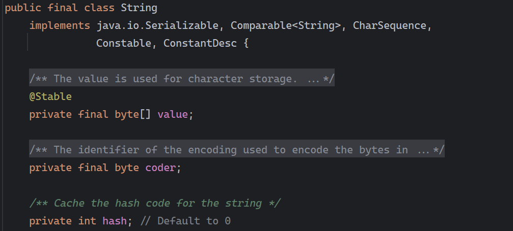
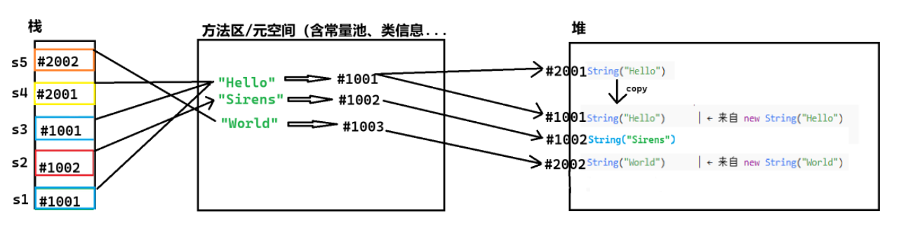
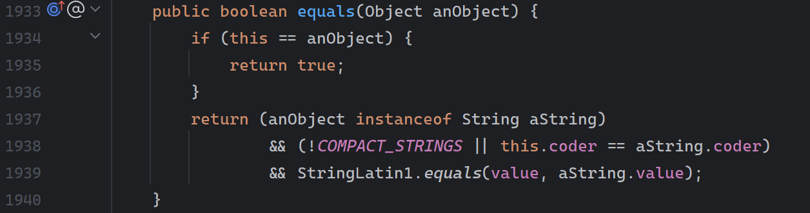
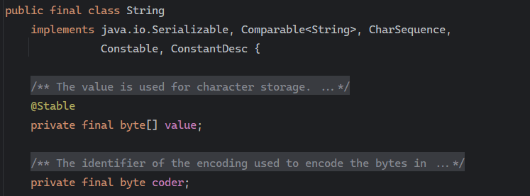
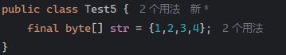
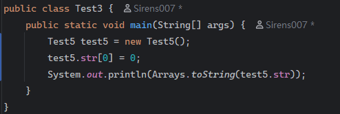
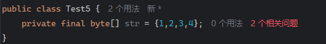
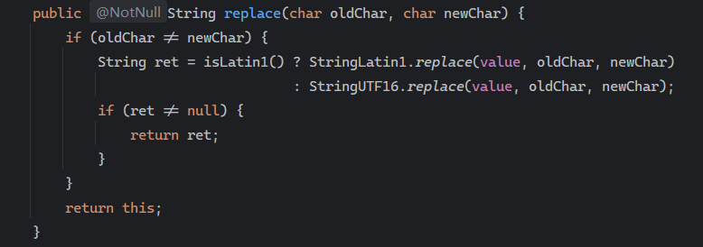

## 1.字符串构造

### 1.1 再识 String
String 类常用构造方式：

```java
String s1 = "Hello Sirens";					//直接创建
System.out.println(s1);

String s2 = new String("Hello Sirens");		//对象创建
System.out.println(s1);

char[] array = {'S','i','r','e','n','s'};
String s3 = new String(array);				//对象创建
System.out.println(s3);
```

**注意**：

> 1.String 是引用类型，内部并不存储字符串，而是像静态方法一样，通过引用去调用堆区的 value（JDK9 之后 value 由 char[] 类型改为了 byte[] 类型，）
>



### 1.2 String 直接创建与对象创建
```java
String s1 = "Hello";
String s2 = "Sirens";
String s3 = s1;
String s4 = new String("Hello");
String s5 = new String("World");
```

以上为 String `直接创建`和`对象创建`内存示意图（画起来真累



整个过程：

> 1️⃣ `String s1 = "Hello";`
>
> + JVM 检查字符串常量池：是否已有 `"Hello"`？
> + 如果没有，就在堆里创建一个 **String对象#1001**，内容为 `"Hello"`；
> + 常量池记录一条映射 `"Hello" → #1001`；
> + 局部变量表中的 `s1` 存放引用 `#1001`。
>
> 2️⃣ `String s2 = "Sirens";`
>
> + 常量池查找 `"Sirens"`，没有；
> + 在堆中创建一个新的 String 对象 **#1002**；
> + 常量池记录 `"Sirens" → #1002`；
> + s2 引用 #1002。
>
> 3️⃣ `String s3 = s1;`
>
> + 这是**引用赋值**，不是新建。
> + s3 和 s1 引用完全相同的对象。
>
> 4️⃣ `String s4 = new String("Hello");`
>
> + `"Hello"` 是常量池字面量，已存在，指向堆中 #1001；
> + `new String("Hello")` 表示：
>     1. 读取常量池引用 #1001；
>     2. 在堆中再创建一个新的 String 对象 #2001；
>     3. 把 #1001 的字符数组内容复制到 #2001；
>     4. s4 引用的是 #2001。
>
> 5️⃣ `String s5 = new String("World");`
>
> + 常量池中查找 `"World"`，发现没有；
> + 在堆中创建 `"World"` 的常量池条目 `"World" → #1003`；
> + `new String("World")` 又在堆中创建一个新的对象 #2002；
> + s5 引用 #2002。
>

### 1.3 编译器优化
**重点补充**：这是我在学校的课上遇到的代码，说到这我就想提提这个

```java
String hello = "你好";
String testOne = "你" + "好";    // [代码1]
System.out.println(hello == testOne); //输出结果是 true
System.out.println("你好" == testOne); //输出结果是 true
System.out.println("你好" == hello); //输出结果是 true
String you = "你";
String hi = "好";
String testTwo = you + hi;    // [代码2]
System.out.println(hello == testTwo); //输出结果是 false
String testThree = you + hi;
System.out.println(testTwo == testThree); //输出结果是 false
```

首先我们要知道：

> 常量+常量=常量
>
> 常量+变量=变量
>
> 变量+变量=变量
>

我们分成三部分分析：

**部分一：**

```java
String hello = "你好";
String testOne = "你" + "好";		//编译器优化
```

在编译时，Java 编译器发现 `"你"` 和 `"好"` 都是**常量字符串**，于是它直接在编译阶段就做了优化：

```plain
String testOne = "你好";
```

也就是说——

| 变量 | 存放内容 |
| --- | --- |
| `hello` | 指向字符串常量池中 `"你好"` |
| `testOne` | 也指向同一个常量池中的 `"你好"` |


**因为字符串常量池中，"你好" 只有一份副本**。  

所以：

```plain
hello == testOne   // true
"你好" == testOne   // true
"你好" == hello     // true
```

它们的“==”都在比较**同一个引用地址（常量池中同一个对象）**。

---

**部分二**：

```java
String you = "你";
String hi = "好";
String testTwo = you + hi;
```

这里的关键在于：

> `you` 和 `hi` 是**变量**，不是编译时的常量。
>
> 所以，编译器**无法在编译期确定 you + hi 的值**。  
只能在**运行时**由 `StringBuilder` 拼接生成新字符串对象。
>

编译器其实会把上面的代码翻译成：

```java
String testTwo = new StringBuilder()
                    .append(you)
                    .append(hi)
                    .toString();
```

这时候：

> `"你"` 和 `"好"` 各自仍然在**常量池**中；
>
> 但拼接产生的 `"你好"` 是在**堆**里新创建的对象；
>
> 它没有放回常量池。
>

于是：

```plain
hello == testTwo   // false
```

因为两者引用的地址不同：

> `hello` → 常量池
>
> `testTwo` → 堆中新对象
>

---

**部分三**：

为什么 testTwo 和 testThree 也不相等

```java
String testThree = you + hi;
System.out.println(testTwo == testThree); // false
```

理由同上，每次拼接：

> 都会通过 `StringBuilder` 重新 new 出一个新的字符串对象；
>
> 虽然内容相同，但内存地址不同。
>

因此：

```plain
testTwo == testThree   // false
```

除非你手动调用 `.intern()`：

```plain
testTwo.intern() == testThree.intern()   // true
```

`intern()` 会把字符串放进常量池里，如果常量池已有相同内容的，就直接返回那份引用。  

## 2.String 对象直接的比较
1.`==`比较所引用的是否同属一个地址

我们知道，当`==`两边都为基本数据类型变量时，比较的是两值之间是否相等而不是地址。

但 String 不一样，首先 String 不是基本数据类型，而是引用数据类型，这在我们的 Java SE 基础提及过。

```java
String s1 = new String("hello");
String s2 = new String("hello");
String s3 = new String("world");
String s4 = s1;
System.out.println(s1 == s2); // false
System.out.println(s2 == s3); // false
System.out.println(s1 == s4); // true
```

2.`boolean equals(Object anObject)`方法去按照字典顺序比较

字典序--字符大小的顺序（类比 ascii）

方法库中 String 类本身重写了父类 Object 中的 equals 方法，String 类重写后 equals 方法由比较地址改为了如下规则



```java
System.out.println(s1.equals(s2)); // true
System.out.println(s1.equals(s3)); // false
```

3.`int compareTo(String s)`方法去按照字典序进行比较

虽然与 equals 同为按照字典序比较，但其返回值不同。equals 返回 boolean 类型，而 compareTo 返回的是 int 类型。

这也和我们之前的文章谈 compareTo 的时候提到过，`(s1.compareTo(s2)`如果 s1 比 s2 大，那么返回正数；反之。

<font style="color:rgb(51,51,51);">但也有要点要注意：</font>

```java
String s1 = "abcd";
String s2 = "abe";
String s3 = "ab";
String s4 = "abcd";

System.out.println(s1.compareTo(s2));   //此时都为第三位不同，仅比较到第三位
System.out.println(s3.compareTo(s4));   //此时仅比较长度，因为前面都相同
```

4.`int compareToIgnoreCase(String str)`方法，与 compareTo 方式相同，但忽略大小写比较

```java
String s1 = new String("abc");
String s2 = new String("ac");
String s3 = new String("ABc");
String s4 = new String("abcdef");
System.out.println(s1.compareToIgnoreCase(s2)); // 不同输出字符差值-1
System.out.println(s1.compareToIgnoreCase(s3)); // 相同输出 0
System.out.println(s1.compareToIgnoreCase(s4)); // 前k个字符完全相同，输出长度差值 -3
```

## 3.字符串查找
查找，我们用到的思想就是索引了，String 类提供的常用查找的方法：

| **方法** | **功能** |
| --- | --- |
| char charAt(int index) | 返回 index 位置上字符，如果 index 为负数或者越界，抛出 IndexOutOfBoundsException 异常 |
| int indexOf(int ch) | 返回 ch 第一次出现的位置，没有返回 -1 |
| int indexOf(int ch,int fromIndex) | 从 fromindex 位置开始找 ch 第一次出现的位置，没有返回-1 |
| int indexOf(String str,int fromIndex) | 返回 str 第一次出现的位置，没有返回 -1 |
| int lastIndexOf(int ch) | 从 fromindex 位置开始找 str 第一次出现的位置，没有返回-1 |
| int lastIndexOf(int ch,int fromIndex) | 从后往前找，返回 ch 第一次出现的位置，没有返回-1 |
| int lastIndexOf(int ch,int fromIndex) | 从 fromIndex 位置开始找，从后往前找 ch 第一次出现的位置，没有返回-1 |
| int lastIndexOf(String str) | 从后往前找，返回 str 第一次出现的位置，没有返回-1 |
| int lastIndexOf(String str,int fromIndex) | 从 fromIndex 位置开始找，从后往前找 str 第一次出现的位置，没有返回-1 |


```java
public static void main(String[] args) {
        String s1 = "Hello SSiirrieeSns";	
        //S  S  i  i  r  r  i  e  e  S  n  s
        //0  1  2  3  4  5  6  7  8  9  10 11
        System.out.println(s1.charAt(2));				//l
        System.out.println(s1.indexOf("r"));			//10
        System.out.println(s1.indexOf("l",3));			//3
        System.out.println(s1.lastIndexOf("S"));		//15
        System.out.println(s1.lastIndexOf("S",13));		//7
        System.out.println(s1.lastIndexOf(" ",13));		//5
    }
```

以上所调用到的方法产生的 String 类型结果都是方法中 `return new String`；

## 4.String 方法
### 4.1 转换
**数值和字符串转换**

```java
String s1 = String.valueOf(1234);
String s2 = String.valueOf(12.34);
String s3 = String.valueOf(true);
String s4 = String.valueOf(new Student("Sirens", 19));
```

同样其他类型也能转为 String 类型

```java
int data1 = Integer.parseInt("1234");
double data2 = Double.parseDouble("12.34");
//Integer、Double等是Java中的包装类型
```

| **方法名** | **描述** |
| --- | --- |
| String toUpperCase() | 小写转大写 |
| String toLowerCase() | 大写转小写 |
| String toCharArray() | 字符串转数组 |
| format(格式,数值) | 格式化 |


### 4.2 字符串调整
**替换**

| **方法名** | **功能** |
| --- | --- |
| String replaceAll(String regex,String replace) | 替换所有的指定内容<br/>(匹配此字符串的正则表达式,用来替换每个匹配项的字符串) |
| String replaceFirst(String regex,String replacement) | 替换首个内容<br/>(匹配此字符串的正则表达式,<font style="color:rgb(51, 51, 51);background-color:rgb(250, 252, 253);">用来替换第一个匹配项的字符串)</font> |


注意: 

> 由于字符串是不可变对象, 替换不修改当前字符串, 而是产生一个新的字符串.
>


**拆分**

| **方法** | **功能** |
| --- | --- |
| String[] split(String regex) | 将字符串全部拆分<br/>(正则表达式分隔符) |
| String[] split(String regex,int limit) | 将字符串以指定的格式，拆分为 limit 组<br/>(正则表达式分隔符,分割的份数) |


**注意**：

> 像拆分 IP 地址，有的需要转义字符
>
> <font style="color:rgb(51,51,51);">1. 字符"|","*","+"都得加上转义字符，前面加上 "\\" . </font>
>
> <font style="color:rgb(51,51,51);">2. </font><font style="color:rgb(51,51,51);">而如果是 </font><font style="color:rgb(51,51,51);">"\" </font><font style="color:rgb(51,51,51);">，那么就得写成 </font><font style="color:rgb(51,51,51);">"\\\\" </font><font style="color:rgb(51,51,51);">. </font>
>
> <font style="color:rgb(51,51,51);">3. 如果一个字符串中有多个分隔符，可以用"|"作为连字符.</font>
>

```java
String site = "https://sirens007.github.io";
String[] s = site.split("\\.|://");
for (int i = 0; i < s.length; i++) {
    System.out.print(s[i]+" ");
}
```


**拆分**

| **方法** | **描述** |
| --- | --- |
| String[] substring(int beginIndex) | 从指定索引截取到结尾 |
| String[] substring(int beginIndex, int endIndex)  | 截取部分内容 |


**注意**：

> 1.索引是从 0 开始的
>
> 2.Java 中默认都是左闭右开区间，所以如果截取部分内容的话 [beginIndex, endIndex),不取右值
>

****

**补充方法**：

| **方法** | **描述** |
| --- | --- |
| boolean contains(CharSequence chars) | contains() 方法用于判断字符串中是否包含指定的字符或字符串<br/>chars -- 要判断的字符或字符串 |
| String trim() | 返回字符串的副本，忽略前导空白和尾部空白 |


使用案例：

```java
 String Str = new String("    sirens007.gtihub.io    ");
 System.out.print("原始值 :" );
 System.out.println( Str );

 System.out.print("删除头尾空白 :" );
 System.out.println( Str.trim() );

//执行结果
//原始值 :    sirens007.github.io        
//删除头尾空白 :sirens007.github.io
```

## 5.字符串的不可变性
**一、String 是一种不可变对象，字符串中的内容是不可改变的。**

为了求证官方文件，我们打开 jdk 源码可以看到该核心定义

> + `class String`首先被声明为`final`，表示不能被继承
> + 其次`value`数组被声明为`private final`--表明 value 自身的值不能改变，即不能引用其它字符数组，但是其引用空间中的内容可以修改。
>

这说明了以内容：

> 1.外部无法访问；
>
> 2.初始化后不可再被修改引用；
>
> 3.数组内容虽可变，但外部没有访问入口。
>

以上说明意味着：

String 对象一旦创建，就固定绑定了内部`value[]`;

修改字符串（如`"abc".replace("a","x")`）时，实际上是新创建了一个 String 对象。

**举例：**

可能很多人认为是 final 修饰了 value 导致 value 不能改变，其实不然

那我们就举一个例子找找是谁限制住了不可修改，**如下**



我们在 Test5 文件 `default final` 定义了数组 str，使用 Test3 去访问修改，可知编译器没有报错



当我们修改为了 private 后




显然爆红了，于此我们得到验证应该是 private 限制了你去访问。

二、所有涉及到可能修改字符串内容的操作都是创建一个新对象，改变的是新对象



我们就拿 String 类里的 replace 方法，可以看到的是只有”结果不变“的情况才返回`this`

即：当字符串内容没有发生任何变化时，直接返回原对象。

## 6. 字符串修改
我们要尽量避免直接对 String 类型对象进行修改，因为 String 类是不能修改的，所有的修改都会创建新对象，效率很低下，就比如下面这种变量拼接（常量拼接没有问题，零开销）

```java
String s1 = "hello";
String s2 = " world";
String s3 = s1 + s2;
```

此时编译器会在字节码层面生成：

```java
new StringBuilder()
    .append(s1)
    .append(s2)
    .toString();
//也就是下面这样
StringBuilder stringbuilder = new StringBuilder();
stringbuilder.append("hello");
stringbuilder.append("world");
String ret = stringbuilder.toString();
System.out.println(ret);
```

所以在运行时：

> 创建一个新的 `StringBuilder`；
>
> 两次 `append()`；
>
> 再调用 `toString()` 创建新字符串。
>

这就是为什么 `"hello" + " world"` 和 `s1 + s2`虽然语法一样，但性能差距巨大。


我们还可以用代码来粗略比较一下 StringBuffer 和 StringBuilder

```java
public static void main(String[] args) {
        long start = System.currentTimeMillis();
        String s = "";
        for(int i = 0; i < 10000; ++i){
            s += i;
        }
        long end = System.currentTimeMillis();
        System.out.println(end - start);
        start = System.currentTimeMillis();
        StringBuffer sbf = new StringBuffer("");
        for(int i = 0; i < 10000; ++i){
            sbf.append(i);
        }
        end = System.currentTimeMillis();
        System.out.println(end - start);
        start = System.currentTimeMillis();
        StringBuilder sbd = new StringBuilder();
        for(int i = 0; i < 10000; ++i){
            sbd.append(i);
        }
        end = System.currentTimeMillis();
        System.out.println(end - start);
    }
```

得到的结果依此是 70 、1、1，可以看出在对 String 进行修改时，效率是非常慢的。因此，如果要修改的话我们尽量使用 StringBuffer 或者 StringBuilder

## 7.StringBuilder 和 StringBuffer
### 7.1 二者区别
当对字符串进行修改的时候，需要使用 StringBuffer 和 StringBuilder 类。

和 String 类不同的是，StringBuffer 和 StringBuilder 类的对象能够被多次的修改，并且不产生新的未使用对象。


**StringBuilder**

```java
public final class StringBuilder extends AbstractStringBuilder
implements java.io.Serializable, CharSequence {

    public StringBuilder append(String str) {
        super.append(str);
        return this;
    }
}
```

**StringBuffer**

```java
public final class StringBuffer extends AbstractStringBuilder
implements java.io.Serializable, CharSequence {

    public synchronized StringBuffer append(String str) {
        super.append(str);
        return this;
    }
}
```

唯一的区别就在于：

> `StringBuffer` 的方法前多了一个 `synchronized` 关键字。
>

**StringBuffer**：多线程情况下

> StringBuffer 类比公共厕所，
>
> 每次只能进去一人；
>
> 门口有锁（`synchronized`同步锁），别人必须等前一个人出来才能进去。
>
> 确保每次使用都“安全”，不会出现混乱（数据不一致）
>

你可以这么理解：

>  假如你和同事都要上厕所（多个线程操作字符串），  
`StringBuffer` 就像门上了锁的公共厕所：  
一个用完另一个再用，虽然慢一点，但不会出事故。  
>

**StringBuilder**：单线程情况下

> 没有锁，谁抢到谁用
>
> 设计时假设“你家就你一个人”，所以没必要加锁
>

你也可以这么理解：

>  如果你自己住（单线程程序），  
当然不用给厕所门上锁，加锁反而浪费时间。  
所以 `StringBuilder` 就是单人卫生间，速度飞快，但只适合自己用。  
>

### 7.2 StringBuilder 和 StringBuffer
| **方法** | **说明** |
| --- | --- |
| `StringBuffer append(String str)` | 在尾部追加，相当于 `String` 的 `+=`，可以追加：`boolean`、`char`、`char[]`、`double`、`float`、`int`、`long`、`Object`、`String`、`StringBuffer`变量 |
| `char charAt(int index)` | 获取 `index`位置的字符 |
| `int length()` | 获取字符串的长度 |
| `int capacity()` | 获取底层保存字符串空间的大小 |
| `void ensureCapacity(int minimumCapacity)` | 扩容 |
| `void setCharAt(int index, char ch)` | 将 `index`位置的字符设置为 `ch` |
| `int indexOf(String str)` | 返回 `str`第一次出现的位置 |
| `int indexOf(String str, int fromIndex)` | 从 `fromIndex`位置开始找 `str`第一次出现的位置 |
| `int lastIndexOf(String str)` | 返回最后一次出现 `str`的位置 |
| `int lastIndexOf(String str, int fromIndex)` | 从 `fromIndex`位置开始找 `str`最后一次出现的位置 |
| `StringBuffer insert(int offset, String str)` | 在 `offset`位置插入各种基本类型、`String`类型或 `Object`类型数据 |
| `StringBuffer deleteCharAt(int index)` | 删除 `index`位置的字符 |
| `StringBuffer delete(int start, int end)` | 删除 `[start, end)`区间内的字符 |
| `StringBuffer replace(int start, int end, String str)` | 将 `[start, end)`区间的字符替换为 `str` |
| `String substring(int start)` | 从 `start`开始一直到末尾的子串以 `String`方式返回 |
| `String substring(int start, int end)` | 将 `[start, end)`范围内的子串以 `String`方式返回 |
| `StringBuffer reverse()` | 反转字符串 |
| `String toString()` | 将所有字符按 `String`的方式返回 |

