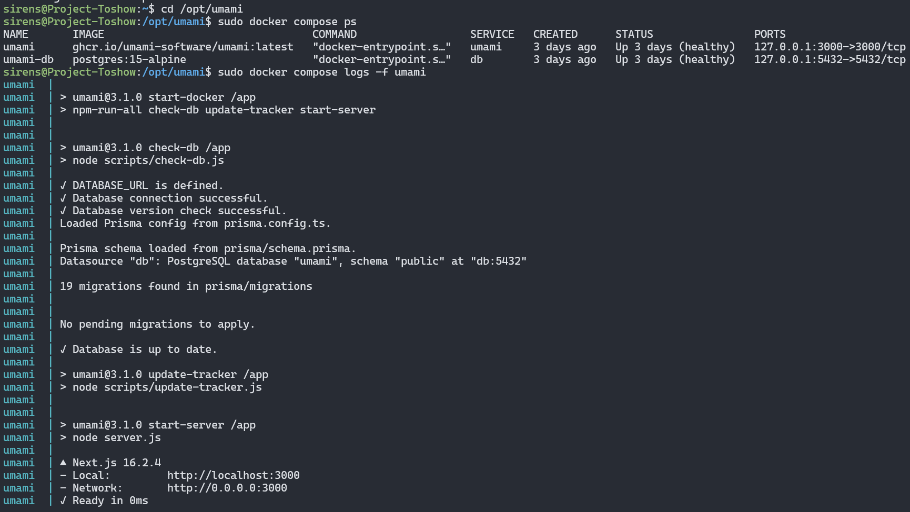
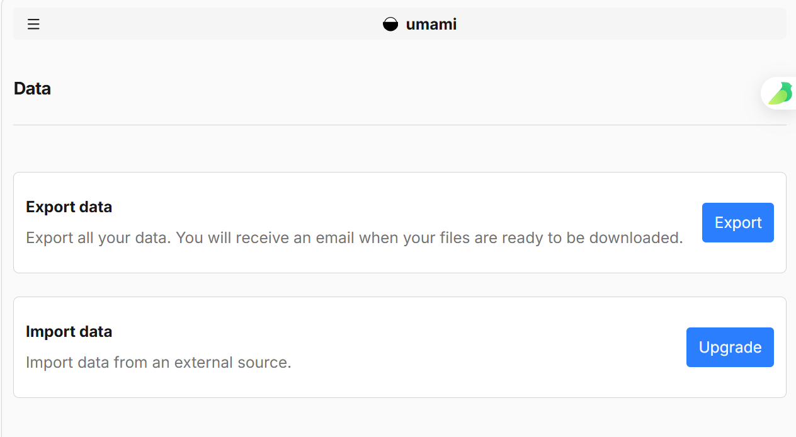
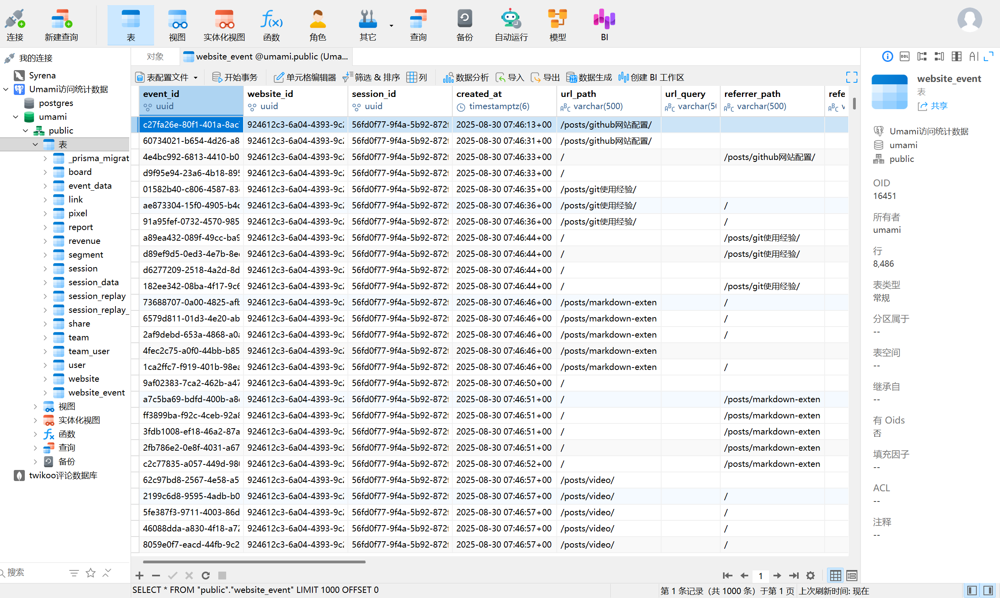
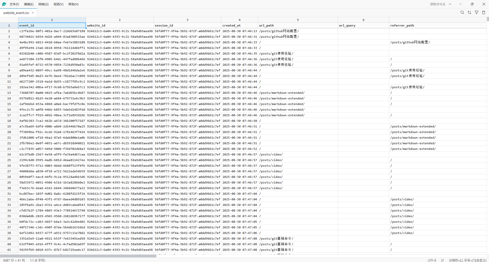

相信我，dockeZ 会比直接裸装数据库要好，因为很大可能你的 Umami build 不动，除非本地构建再上传；就是那样的话本地还得装环境，况且 Umami 官方是支持 docker 部署的

## 一、安装 Docker 和 Docker Compose
**1.添加 Docker 官方仓库(镜像)**

```bash
sudo apt-get update
sudo apt-get install -y ca-certificates curl gnupg
```

**2.添加 Docker GPG key 下载，换为阿里云的镜像**

 Docker 官方要求把 GPG key 存在这个目录，属于新的安全规范（避免污染系统 key）。  

```bash
sudo mkdir -p /etc/apt/keyrings

curl -fsSL https://mirrors.aliyun.com/docker-ce/linux/ubuntu/gpg \
| sudo gpg --dearmor -o /etc/apt/keyrings/docker.gpg
```

`https://download.docker.com` -> `https://mirrors.aliyun.com`

**3.添加 Docker apt 源**

+ 把 Docker 下载地址从官方改成镜像 
+  以后 `apt install docker-ce` 就走国内源

```bash
echo \
"deb [arch=$(dpkg --print-architecture) signed-by=/etc/apt/keyrings/docker.gpg] \
https://mirrors.aliyun.com/docker-ce/linux/ubuntu \
$(lsb_release -cs) stable" \
| sudo tee /etc/apt/sources.list.d/docker.list > /dev/null
```

**4.安装 Docker 和 Docker Compse**

 刚刚添加了新源，必须更新，否则 apt 不知道这个源存在  

```bash
sudo apt-get update
sudo apt-get install -y docker-ce docker-ce-cli containerd.io docker-compose-plugin
```

**5.验证安装完成**

```bash
docker -v
docker compose version
```

**6.允许普通用户使用 Docker，避免每一步 sudo**

```bash
sudo usermod -aG docker $USER
newgrp docker
```

 Umami 推荐用 Docker Compose 部署，这样 Umami 应用和 PostgreSQL 数据库可以统一管理。

**7.创建 Umami 部署目录**

```bash
sudo mkdir -p /opt/umami
sudo chown -R $USER:$USER /opt/umami
cd /opt/umami
```

 把 Umami 的配置文件和数据库挂载数据统一放在 `/opt/umami`，后期维护、备份、迁移更方便。  

## 二、编写 docker-compose.yml  
**切换目录为**：

```bash
cd /opt/umami
nano docker-compose.yml
```

写入内容如下（：`APP_SECRET`、`POSTGRES_DB`、`POSTGRES_USER`: umami

      `POSTGRES_PASSWORD`可自行更改

```bash
services:
  umami:
    image: ghcr.io/umami-software/umami:latest
    container_name: umami
    ports:
      - "127.0.0.1:3000:3000"
    environment:
      DATABASE_URL: postgresql://umami:umami_password@db:5432/umami
      APP_SECRET: your_random_app_secret
    depends_on:
      db:
        condition: service_healthy
    restart: always

  db:
    image: postgres:15-alpine
    container_name: umami-db
    environment:
      POSTGRES_DB: umami
      POSTGRES_USER: umami
      POSTGRES_PASSWORD: umami_password
    volumes:
      - ./postgres-data:/var/lib/postgresql/data
    restart: always
    healthcheck:
      test: ["CMD-SHELL", "pg_isready -U umami -d umami"]
      interval: 5s
      timeout: 5s
      retries: 5
```

**生成**  `APP_SECRET`：  

```bash
openssl rand -base64 32
```

`DATABASE_URL` 是 Umami 连接 PostgreSQL 的地址。  
`APP_SECRET` 用于加密会话，不能随便写固定弱字符串。  
`127.0.0.1:3000:3000` 表示 Umami 只允许本机访问，外部访问交给 Nginx 反代，更安全。  

## 三、启动 Umami
**1. 以下命令是在/opt/umami 下执行，否则会找不到 docker-compose.yml  **

```bash
cd /opt/umami
sudo docker compose up -d
```

**2. 查看容器**：

```bash
sudo docker compose ps
```

**3. 查看日志**：

```bash
sudo docker compose logs -f umami
```

确认 Umami 和 PostgreSQL 是否正常运行，尤其是数据库，像图片中就是正常运行了




**4.测试本地访问**

```bash
curl -I https://127.0.0.1:3000
```

正常是可以得到` HTTP/1.1 200 OK`此类回显；

我们的顺序是先确认 Umami 本身在服务器内部可访问，再配置域名和 HTTPS  

## 四、配置 Nginx 反向代理
**1.创建配置**：

```bash
sudo nano /etc/nginx/sites-available/umami
```

写入：

以下内容要**<font style="color:#DF2A3F;">注意更改证书路径</font>**

```bash
server {
    listen 80;
    server_name umami.sirens007.cn;

    return 301 https://$host$request_uri;
}

server {
    listen 443 ssl http2;
    server_name umami.sirens007.cn;

    ssl_certificate /path/to/your.crt;
    ssl_certificate_key /path/to/your.key;

    ssl_protocols TLSv1.2 TLSv1.3;
    ssl_ciphers HIGH:!aNULL:!MD5;

    location / {
        proxy_pass http://127.0.0.1:3000;

        proxy_set_header Host $host;
        proxy_set_header X-Real-IP $remote_addr;
        proxy_set_header X-Forwarded-For $proxy_add_x_forwarded_for;
        proxy_set_header X-Forwarded-Proto $scheme;
    }
}
```

 启用：  

```bash
sudo ln -s /etc/nginx/sites-available/umami /etc/nginx/sites-enabled/umami
sudo nginx -t
sudo systemctl reload nginx
```

是因为 Docker 里的 Umami 不直接暴露公网，而是通过 Nginx 提供 HTTPS 访问，后期方便配置证书、缓存...

注意，在访问并登录 Umami 前，**先申请 SSL 证书**以便支持 https 协议，如果是阿里云用户可

以在阿里云中申请个人测试证书，要记得三个月一换

申请后可以在阿里云的工作台**一键上传证书和私钥，记得上传**


随后便可以登录 Umami：

直接在浏览器访问`https://umami.sirens007.cn`，改为你的域名即可

默认账号密码为：

> 用户名：admin
>
> 密码：umami
>

 登录后立刻修改密码，否则你的账号可能被别人登录并改密

##  五、导入 Umami 访问数据
**1. 在 Umami 后台添加你的网站**，比如`blog.sirens007.cn`

创建一条 website，随后就可以得到 shareId，并且获取统计脚本，例如

```html
<script
  defer
  src="https://umami.sirens007.cn/script.js"
  data-website-id="新的 website_id">
</script>
```

为什么导入放在后面，因为可以让你的网站能拿到最新的访问数据...

开个玩笑，其实就是为了在能够拿到 website_id 后，才需要对导出的数据文件操作

**2.访问** [<u><font style="color:rgb(30, 30, 30);">Umami Cloud Data | Settings</font></u>](https://cloud.umami.is/settings/data)<font style="color:rgb(31, 31, 31);"> ，</font>**<font style="color:rgb(31, 31, 31);">选择导出数据</font>**




随后会在你注册的邮箱中收到一个 zip 压缩包，其中只有 website_event.csv 这个文件有数据，其他两个只有表头

不知道你是一位喜欢 CLI 界面还是 GUI 界面的爱好者，如果是喜欢命令行的话在服务器用查询语句就可以查到 umami 这个仓库下的所有字段；如果喜欢图形化，那么 Navicat 可能是你需要的，或者<font style="color:rgb(31, 31, 31);"> </font>[<u><font style="color:rgb(30, 30, 30);">pgAdmin - PostgreSQL Tools</font></u>](https://www.pgadmin.org/)。类似下图中可以看到各个字段的顺序，同时也可以修改





此时你可能还需要一个能够修改 csv 文件的一个软件，不推荐 wps 和 excel，首先 excel 可能是 CRLF 文件类型问题，wps 在你编辑后需要转为 xlsx 文件，所以还是奉劝下一个<font style="color:rgb(31, 31, 31);">CSV编辑软件： </font>[<u><font style="color:rgb(30, 30, 30);">SmoothCSV - The ultimate CSV editor for macOS & Windows</font></u>](https://smoothcsv.com/)<font style="color:rgb(30, 30, 30);">  </font>

<font style="color:rgb(30, 30, 30);">在我在的版本 </font>**<font style="color:rgb(30, 30, 30);">Umami3.1</font>**<font style="color:rgb(30, 30, 30);"> 中，</font>**<font style="color:rgb(30, 30, 30);">website_event.csv 文件中有 41 行数据</font>**<font style="color:rgb(30, 30, 30);">，而 PostgreSQL 数据库中的 </font>**<font style="color:rgb(30, 30, 30);">website_event 这个表中只有 31 条</font>**<font style="color:rgb(30, 30, 30);">，因此如果要导入该文件</font>**<font style="color:rgb(30, 30, 30);">需要删除 10 条数据库中不存在的字段的数据</font>**<font style="color:rgb(30, 30, 30);">，但是要先备份该文件，因为后 10 条数据实际上是放在数据库中的 session 这个表中的，因此将备份的文件删掉 event 表中的 31 列数据后并排好序就可导入</font>

<font style="color:rgb(30, 30, 30);">website_event.csv 该文件中的 event_id 需要</font>**<font style="color:rgb(30, 30, 30);">修改为服务器部署的 Umami 增设的 website 新获得的 websiteId</font>**<font style="color:rgb(30, 30, 30);">，只有此处有修改，剩下的只需要排序即可</font>



**3. 随后使用 scp 命令上传至服务器即可**

```bash
scp website_event.csv session.csv root@服务器IP:/home/sirens/
```

**4. 然后复制进 PostgreSQL 容器**：

```bash
sudo docker cp /home/root/website_event.csv umami-db:/tmp/website_event.csv
sudo docker cp /home/root/session.csv umami-db:/tmp/session.csv
```

主要是因为`psql \copy` 在容器里执行时，读取的是容器内部路径，所以要先把 CSV 放进容器的 `/tmp`

**5. 随后进入 PostgreSQL**：

```bash
sudo docker compose exec db psql -U umami -d umami
```

-U 代表用户 Users，-d 代表 database

数据导入、查看表结构、删除约束、恢复约束都要在 PostgreSQL 里完成或者在 Navicat 中完成；**<font style="color:#DF2A3F;">在导入前，最后检查一遍是否与数据库中的字段顺序对应上</font>**

**6. 查看** `website_event`：

```bash
SELECT ordinal_position, column_name, data_type
FROM information_schema.columns
WHERE table_name = 'website_event'
ORDER BY ordinal_position;
```

**6. 查看** `session`：

```bash
SELECT ordinal_position, column_name, data_type
FROM information_schema.columns
WHERE table_name = 'session'
ORDER BY ordinal_position;
```

注意可能输出的字段按页折叠，记得检查完全

重要步骤！！！

**7. 迁移前先备份数据库**

```bash
sudo docker compose exec db pg_dump -U umami -d umami > /opt/umami/backup_before_import.sql
```

**8.再检查一下本地 session 和 website_event 字段顺序**

检查 website_event：

```plsql
SELECT ordinal_position, column_name, data_type
FROM information_schema.columns
WHERE table_name = 'website_event'
ORDER BY ordinal_position;
```

然后根据实际字段写导入语句，例如常见结构可能类似：

```plsql
\copy website_event (
  event_id,
  website_id,
  session_id,
  created_at,
  url_path,
  url_query,
  referrer_path,
  referrer_query,
  referrer_domain,
  page_title,
  event_type,
  event_name,
  visit_id
)
FROM '/tmp/website_event.csv'
WITH (FORMAT csv, HEADER true, NULL '\N', QUOTE '"');
```

```bash
# 建议执行单条命令，如上条报错
sudo docker compose exec db psql -U umami -d umami -c "\copy session (session_id, website_id, browser, os, device, screen, language, country, region, city, created_at, distinct_id) FROM '/tmp/session.csv' WITH (FORMAT csv, HEADER true, NULL '\N', QUOTE '\"');"
```

注意：  
这条不能直接照抄，必须以你本地 `information_schema.columns` 查到的字段为准；

原因：  
Umami Cloud 导出的 CSV 字段和本地 v3.x 表结构可能不同。多字段、少字段、顺序不一致都会导入失败；

---

**检查 session 本地字段：**

```sql
SELECT column_name
FROM information_schema.columns
WHERE table_name = 'session'
ORDER BY ordinal_position;
```

然后导入时必须这样写成一整条命令，不要在 `psql` 交互里分开敲：

```sql
\copy session (
  session_id,
  website_id,
  browser,
  os,
  device,
  screen,
  language,
  country,
  region,
  city,
  created_at,
  distinct_id
)
FROM '/tmp/session.csv'
WITH (FORMAT csv, HEADER true, NULL '\N', QUOTE '"');
```

如果你是在 shell 里执行，推荐：

```bash
sudo docker compose exec db psql -U umami -d umami -c "\copy session (session_id, website_id, browser, os, device, screen, language, country, region, city, created_at, distinct_id) FROM '/tmp/session.csv' WITH (FORMAT csv, HEADER true, NULL '\N', QUOTE '\"');"
```

原因：

就是我之前有报错`syntax error at or near "session_id"`

**9.重启 Umami**

```bash
sudo docker compose restart umami
```

最后访问后台 umami.example.com 登录检查数据是否对应即可

总流程顺序：

```bash
1. 安装 Docker
2. 创建 /opt/umami
3. 写 docker-compose.yml
4. 启动 Umami + PostgreSQL
5. 配置 Nginx + HTTPS
6. 登录后台并修改密码
7. 创建网站
8. 导出 Umami Cloud 数据
9. 上传 CSV 到服务器
10. 备份本地数据库
11. 查看本地表结构
12. 修正 CSV 字段和 website_id
13. 导入 session
14. 导入 website_event
15. 检查数据关联
16. 恢复约束
17. 重启 Umami
18. 修改博客统计脚本
19. 后台验证统计结果
```

参考文章：

[Umami Cloud迁移到本地踩坑记录](https://blog.2x.nz/posts/umami-migration/)

[Installation](https://docs.umami.is/docs/install)

