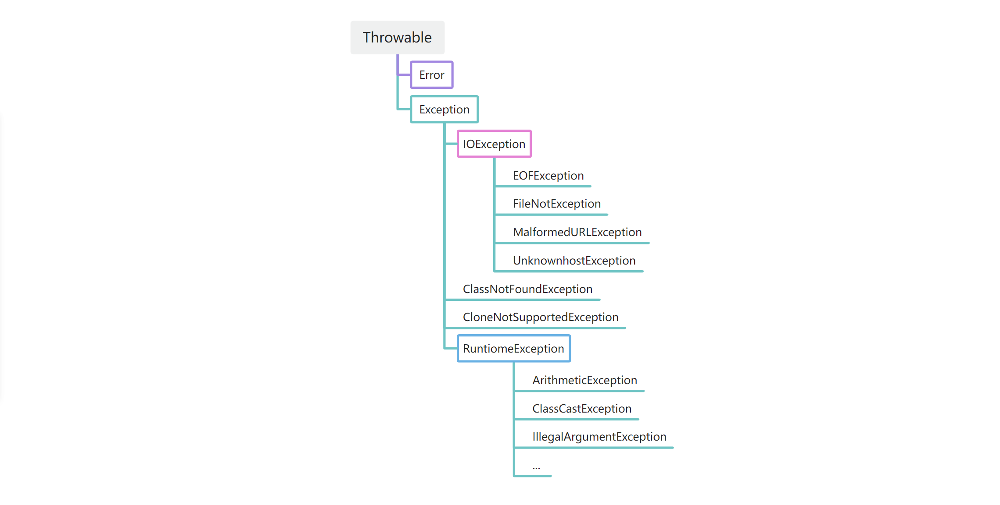

## 1.了解异常

### 1.1 初步认识异常，了解 Exception 家族
在任何代码中，错误以及意外是不可避免的——除数为零，文件路径不正确，非法输入...既然知道存在这种情况，我们就需要提前预防。

因此 Java 的异常处理机制就应运而生。通过**抛出异常（throw）**、**声明异常（throws）**和**捕获异常（try-catch）**，实现从错误检测到错误恢复的完整流程。

常见异常：

```java
System.out.println(10/0);
//ArithmeticException 算数异常

int[] arr = {1,2,3,4,5};
System.out.println(arr[10]);
//ArrayIndexOutOfBoundsException 数组越界异常

int arr = null;
System.out.println(arr.length);
//NullPointerException 空指针异常...
```

事实上，异常又分为**编译时异常（受检异常 **CheckedException**)**，**运行时异常（非受检异常 **UncheckedException**）**。

**编译时异常：**

> 1.编译阶段就会被检查，必须显式处理，否则编译不通过。
>
> 2.表示“可预料错误”，如：“文件不存在”、“网络中断”、“数据库连接失败”...
>

特点：

编译器要求：要么 `try-catch` 捕获，要么在方法上 `throws` 声明

**运行时异常：**

> 1.运行时才可能发生，编译器不会强制要求处理。
>
> 2.表示“程序包逻辑错误或无法预料的问题”。
>

特点：

通常是开发者的逻辑错误导致的，不建议用 try-catch 去包，而是应修正逻辑。


这里我们先了解下他们的继承关系，如下图



我们可以了解到：

`Throwable`是异常体系的根，他继承自`Object`。`Throwable`有两个体系：`Error`和`Exception`  


`Error`**表示严重的错误，程序对此一般无能为力**，错误不是异常，而是脱离程序控制的问题 eg：

`OutOfMemoryError`：内存耗尽

`NoClassDefFoundError`：无法加载某个 Class

`StackOverflowError`：栈溢出


`Exception`**则是运行时的错误，它可以被捕获并处理**。

某些异常是应用程序逻辑处理的一部分，应该捕获并处理。eg：

`NumberFormatException`：数值类型的格式错误

`FileNotFoundException`：未找到文件

`SocketException`：读取网络失败

## 2. 处理异常
### 2.1 防御式编程
先了解一下什么是防御式编程，以便让我们更好的了解如何处理异常

**防御式编程（Defensive Programming）** 是一种编程思想，指在写代码时**假设“可能出错”**，并提前在程序中**检测、预防、或妥善处理这些潜在错误**，以防止程序在异常情况下崩溃或产生错误结果

 简单理解：  
👉 就像司机开车时随时准备刹车，而不是等撞上去再想办法

我们可以举一个例子进行对比：

**普通写法（无防御）**

```java
import java.io.*;

public class Example1 {
    public static void main(String[] args) throws IOException {
        FileReader fr = new FileReader("data.txt");  // 假设文件存在
        BufferedReader br = new BufferedReader(fr);
        System.out.println("第一行内容是：" + br.readLine());
        br.close();
    }
}
```


**防御式编程**

```java
import java.io.*;

public class Example2 {
    public static void main(String[] args) {
        String filePath = "data.txt";
        File file = new File(filePath);

        // ① 防御：检查文件是否存在
        if (!file.exists()) {
            System.err.println("错误：文件不存在 → " + filePath);
            return;
        }

        // ② 防御：检查是否是普通文件（防止是目录）
        if (!file.isFile()) {
            System.err.println("错误：" + filePath + " 不是一个有效文件");
            return;
        }

        // ③ 使用 try-with-resources，自动关闭流
        try (BufferedReader br = new BufferedReader(new FileReader(file))) {
            String firstLine = br.readLine();

            // ④ 防御：检查文件是否为空
            if (firstLine == null) {
                System.err.println("提示：文件为空，没有任何内容。");
                return;
            }

            System.out.println("第一行内容是：" + firstLine);

        } catch (IOException e) {
            // ⑤ 防御：捕获所有IO错误并给出友好提示
            System.err.println("读取文件时出错：" + e.getMessage());
        }
    }
}
```

总结一句话就是： 防御式编程就是“**预先假设问题会发生，并设计好应对措施**”，而不是“等异常爆炸再修”。  

因此，我们开始踏入 Java 的异常使用啦，先初步了解五个异常常用关键字：

| 关键字 | 作用 | 位置 | 举例 |
| --- | --- | --- | --- |
| `throw` | 抛出一个具体的异常对象 | 方法体内 | `throw new Exception("出错了");` |
| `throws` | 声明该方法可能抛出哪些异常 | 方法声明上 | `public void readFile() throws IOException` |
| `try` | 可能出错的代码块 | 方法体内 | `try { riskyCode(); }` |
| `catch` | 捕获并处理异常 | 紧跟 try 后 | `catch(Exception e) { ... }` |
| `finally` | 无论是否异常都执行 | 可选 | `finally { cleanUp(); }` |


### 2.2 抛出异常
**追踪本源**

当发生错误时，比如用户输入非法字符，那么就可以抛出异常。

抛出异常分为两步，我们可以参考 `Integer.parseInt()`方法

1.创建`Exception`的实例

2.用 `throw`语句抛出 

eg:

```java
void example(String s){
    if(s == null){
        NullPointerException e = new NullPointerException();
    throw e;
    //通常写为一条语句，用匿名对象
    //throw new NullPointerException();
    }
}
```

**但是**，如果一个方法捕获了某个异常后，又在`catch`子句中抛出新的异常，就相当于把抛出的异常类型“转型”了:

```java
void example1(String s) {
    try {
        example2();
    } catch (NullPointerException e) {
        throw new IllegalArgumentException();
    }
}

void example2(String s) {
    if (s==null) {
        throw new NullPointerException();
    }
}

```

这段代码展示的就是将`NullPointerException`异常转为了`IllegalArgumentException`，最终展示报错结果只有`IllegalArgumentException`


我们补为 static 方法放在 main 方法中打印出异常栈看看：

```java
public class TestDemo3 {
    public static void main(String[] args) {
        try {
            example1();
        } catch (Exception e) {
            e.printStackTrace();
        }
    }

    
    static void example1() {
        try {
            example2();
        } catch (NullPointerException e) {
            throw new IllegalArgumentException();
        }
    }

    static void example2() {
        throw new NullPointerException();
    }
}
```

打印出的异常栈信息即为：

```java
java.lang.IllegalArgumentException
	at demo2.TestDemo3.example1(TestDemo3.java:23)
	at demo2.TestDemo3.main(TestDemo3.java:13)
```

说明了新的异常丢失了原始异常信息，即看不到了原本的`NullPointerException`的信息了。

**所以**，为了追踪完整的异常栈，我们在构造异常的时候就**把原始的**`Exception`**实例传进去(**将 e 对象进行**异常包装/异常链)**，新的`Exception`就可持有原来的`Exception`信息。代码如下：

```java
public class TestDemo3 {
    public static void main(String[] args) {
        try {
            example1();
        } catch (Exception e) {
            e.printStackTrace();
        }
    }

    static void example1() {
        try {
            example2();
        } catch (NullPointerException e) {
            throw new IllegalArgumentException(e);
        }
    }

    static void example2() {
        throw new NullPointerException();
    }
}
```

这样我们就保留下来最开始抛出的异常类型了，以方便我们直接溯源根源

```java
java.lang.IllegalArgumentException: java.lang.NullPointerException
	at demo2.TestDemo3.example1(TestDemo3.java:23)
	at demo2.TestDemo3.main(TestDemo3.java:13)
Caused by: java.lang.NullPointerException
	at demo2.TestDemo3.example2(TestDemo3.java:28)
	at demo2.TestDemo3.example1(TestDemo3.java:21)
```

在代码中获取原始异常可以使用`Throwable.getCause()`方法。若返回 null，说明已经是“根异常”了。

#### Throwable.getCause()方法使用
```java
Throwable cause = e.getCause();
```

->返回触发当前异常的“原始异常”

->如果返回 null，说明当前异常没有再包裹别的异常，是“根异常”。

**基本使用**：

```java
try {
    someMethod();
} catch (Exception e) {
    Throwable cause = e.getCause();
    System.out.println("当前异常是：" + e);
    System.out.println("原始原因是：" + cause);
}
```

**实际开发中常用：遍历整条异常链**

若异常被包装多次，可以使用循环一直调用 getCause()；

```java
static void printChain(Throwable t) {
    while (t != null) {
        System.out.println("异常: " + t);
        t = t.getCause();  // ⭐关键：向上查找
    }
}
```

### 2.3 捕获异常
#### 2.3.1 异常声明 throws
throws 处在方法声明参数列表之后，当方法中抛出编译时异常，用户不想处理该异常，此时就可以借助 throws 将异常抛出给方法的调用者来处理。**即当前方法不处理异常，提醒方法的调用者处理异常。**

```java
修饰词 返回值类型 方法名(参数列表) throws 异常类型1,异常类型2...{}
```

我们举个例子看看 throws 用法

```java
public void OpenConfig(String filename) throws FileNotFoundException{
    if(filename.equals("config.ini")){
        throw new FileNotFountException("配置文件名字不对");
    }
} 
```

**语法点注意**：

> 1.throws 必须更在方法的参数列表之后
>
> 2.声明的异常必须是 Exception 或者 Exception 的子类
>
> 3.方法内部如果抛出多个异常，throws 之后必须跟多个异常类型，之间用逗号隔开，如果抛出多个异常型具有父子关系，直接声明父类即可。
>
> 4.调用声明抛出异常的方法时，调用者必须对该异常进行处理，或者继续使用 throws 抛出
>

#### 2.3.2 try-catch 捕获并处理
throws 对异常并没有真正处理，而是将异常报告给抛出异常方法的调用者，由调用者处理。如果真正要对异常进行处理，就需要 try-catch。

```java
try{
// 将可能出现异常的代码放在这里
    } catch(要捕获的异常类型 e){
// 如果try中的代码抛出异常了，此处catch捕获时异常类型与try中抛出的异常类型一致时，或者是try中抛出异常的基类
//时，就会被捕获到
// 对异常就可以正常处理，处理完成后，跳出try-catch结构，继续执行后序代码
    } catch(异常类型 e){
// 对异常进行处理
    } finally{
// 此处代码一定会被执行到
        }
```

> 1.try 块内抛出异常位置，**之后的代码将不会被执行**
>
> 2.如果抛出异常类型与 catch 时异常类型不匹配，即异常不会被成功捕获，也就不会被处理，继续往外抛，知道 JVM 收到后中断程序----异常是按照类型来捕获的
>
> 3.try 中可能会抛出多个不同的异常对象，则必须使用多个 catch 来捕获----多种异常，多次捕获

#### 2.3.3finally
像在代码中，当程序需要中断并且需要我们关闭资源避免浪费的时候，finally 很好的帮我们解决了这个问题。

```java
语法格式：
        try{
// 可能会发生异常的代码
        }catch(异常类型 e){
// 对捕获到的异常进行处理
        }finally{
// 此处的语句无论是否发生异常，都会被执行到
        }
// 如果没有抛出异常，或者异常被捕获处理了，这里的代码也会执行
```

举个范例：

```java
public class TestFinally {
    public static int getData(){
        Scanner sc = null;
        try{
            sc = new Scanner(System.in);
            int data = sc.nextInt();
            return data;
        }catch (InputMismatchException e){
            e.printStackTrace();
        }finally {
            System.out.println("finally中代码");
        }
        System.out.println("try-catch-finally之后代码");
        if(null != sc){
            sc.close();
        }
        return 0;
    }
    public static void main(String[] args) {
        int data = getData();
        System.out.println(data);
    }
}
// 正常输入时程序运行结果：
100
finally中代码
100
```

上述程序，如果正常输入，成功接收输入后程序就返回了，try-catch-finally 之后的代码根本就没有被释放，造成资源泄漏。

**注意**：

> finally 中的代码一定会执行的，一般在 finally 中进行一些资源清理的扫尾工作。
>

```java
// 下面程序输出什么？
public static void main(String[] args) {
    System.out.println(func());
}
public static int func() {
    try {
        return 10;
    } finally {
        return 20;
    }
}
A: 10 B: 20 C: 30 D: 编译失败
```

答案解析：

> java 规则：
>
> 1.try 中遇到 return 时，先把返回值记录下来，但不立即返回
>
> 2.finally 会在 return 执行前运行
>
> 3.如果 finally 中也写了 return，他会覆盖 try 的返回值
>

因此建议：不在 finally 中写 return（被编译器当作一个警告）

【面试题】： 

1. throw 和 throws 的区别？ 

2. finally中的语句一定会执行吗？

> 1. throws 用于方法声明处，表示该方法可能抛出某类异常，让调用者处理。  
      throw 用于方法内部，创建并抛出一个异常对象，中断方法执行。  
      throws 是声明，throw 是动作；throws 后跟异常类型，throw 后跟异常对象。  
>
> 2.几乎一定会执行，但有两个例外！
>
>    JVM 提前退出，eg: 调用 `System.exit(0);` JVM 直接停止，不执行 finally
>
>    finally 执行前被线程杀死，eg: (1)线程再 finally 前被 stop() (2)程序崩溃导致线程终止
>

### 2.4 异常的处理流程
我们先了解一下“调用栈”

> 方法之间是存在互相调用关系的，这种调用关系我们可以用“调用栈”来描述，在 JVM 中有一块内存空间称为“虚拟机栈”专门存储方法之间的调用关系，当代码中出现异常的时候，我们就可以使用`e.printStackTrace();`的方式查看出现异常代码的调用栈
>

> + 你（main 方法）→ 去办业务
> + 办事人员让你先去窗口 A（调用 methodA）
> + 窗口 A 又让你先去窗口 B（调用 methodB）
> + 窗口 B 又让你去窗口 C（调用 methodC）
>
> **你去每一个窗口，都会把“你当前在哪一层”记录下来。**
>
> 这就是——**调用栈（Call Stack）**
>

然后呢，了解调用栈之后我们能更好的理解异常处理流程了

1.代码运行时发生错误 -> JVM 创建异常对象

2.JVM 将异常抛出到当前方法（throw）

3.JVM 查找匹配的 catch（当前方法内查找）

4.当前方法没有处理 -> 异常向上抛给调用者（throws）

5.异常层层向上，知道被某层 catch 处理

6.如果最终无人处理 -> JVM 答应异常栈 -> 程序终止

   如果有匹配的 catch -> catch 执行

7.finally 总会执行

8.若 catch 中再次 throw -> 异常类型被“转换”继续向上抛

## 3.自定义异常类
当我们在代码中需要抛出异常时，尽量使用 JDK 已定义的异常类型。例如，参数检查不合法，应该抛出`IllegalArgumentException`：

```java
static void example1(int age){
    if(age <= 0){
        throw new IllegalArgumentException();
    }
}
```

常见做法是自定义一个 `BaseException`作为“根异常”，然后，派生出各种业务类型的异常。

`BaseException`需要从一个适合的`Exception`派生，通常建议从`Runtime Exception`派生：

```java
public class BaseException extends RuntimeException {
}
```

也因此，其他业务类型的异常就可以从`BaseException`派生：

```java
public class UserNotFoundException extends BaseException {
}

public class LoginFailedException extends BaseException {
}

...
```

自定义的`BaseException`应该提供多个构造方法：

```java
public class BaseException extends RuntimeException {
    public BaseException() {
        super();
    }

    public BaseException(String message, Throwable cause) {
        super(message, cause);
    }

    public BaseException(String message) {
        super(message);
    }

    public BaseException(Throwable cause) {
        super(cause);
    }
}
```

注意事项：

- 自定义异常通常会继承自 Exception 或者 RuntimeException 
- 继承自 Exception 的异常默认是受查异常 
- 继承自 RuntimeException 的异常默认是非受查异常

还需注意受查异常和非受查异常的应用区别
