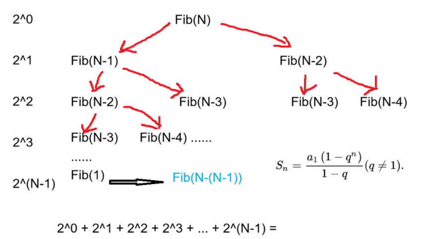

算法效率分析分为两种：第一种是**时间效率**，第二种是**空间效率**。时间效率被称为时间复杂度，而空间效率被称为空间复杂度，时间复杂度主要衡量的是一个算法的运行速度，而空间复杂度主要衡量一个算法所需要的额外空间。

## 1.时间复杂度
### 1.1 什么是时间复杂度
算法的时间复杂度是**算法执行步骤数量随输入规模 n 增长的趋势**，在程序中常用**大 O 渐进表示法**来表示。

而之所以用大 O 表示法的原因是：

> 当 n 足够大时
>
> 低阶项和常数项影响可以忽略
>
> 决定性能的是“最高阶项”
>

### 1.2 常见特殊的时间复杂度计算举例
**【示例 1】**

```java
//计算binarySearch二分查找法的时间复杂度？
int binarySearch(int[] array, int value) {
    int begin = 0;
    int end = array.length - 1;
    while (begin <= end) {
        int mid = begin + ((end-begin) / 2);
        if (array[mid] < value)
            begin = mid + 1;
        else if (array[mid] > value)
            end = mid - 1;
        else
            return mid;
    }
    return -1;
}
```

最坏情况是：一条直线，一直被不断的分为 1/2，最终分成只剩一个，其推导过程如下

> 第一次：n/2^1
>
> 第二次：n/2^2
>
> 第三次：n/2^3...
>
> 第x 次：n/2^x    ->  n/2^x = 1   -> x = log<sub>2</sub>N，最终时间复杂度为 O(log<sub>2</sub>N)
>

**【示例 2】**

```java
//计算阶乘递归factoria的时间复杂度？
long factorial(int N){
    return N<2 ? N:factorial(N-1)*N;
}
```

计算公式：**递归的时间复杂度 = 递归的次数 * 每次递归执行的次数**

该样例计算即：

> 当 N = 1,时则不再递归，因此递归次数即为 N - 1，
>
> 而每次递归执行的语句为三目运算符语句，其执行次数可视为 1，因此为 O(N)
>

**【示例 3】**

```java
//计算斐波那契递归fibnacci的时间复杂度？
int fibnacci(int N){
    return N<2 ? fibnacci(N-1)+fibnacci(N-2);
}
```




以上为粗略计算过程，因此其递归次数就为等比数列求和即可，最终为 **O(2^n)**


### 1.3 计算时间复杂度的平均情况
时间复杂度平均情况是：在所有可能输入中，按每种输入出现的概率加权后，算法执行时间的数学期望。

其公式表达情况为：


> + T<sub>i</sub>(n)：第 i 种情况的执行步数
> + P<sub>i</sub>：该情况发生的概率
> + ∑ P<sub>i</sub>=1
>

我们举一个范例，比如线性查找 target：

```java
for (int i = 0; i < n; i++) {
    if (arr[i] == target) return i;
}
return -1;
```

| 情况 | target 位置 | 比较次数 |
| --- | --- | --- |
| 第 1 个 | 0 | 1 |
| 第 2 个 | 1 | 2 |
| ... | ... | ... |
| 第 n 个 | n-1 | n |
| 不存在 | — | n |


**常见合理假设：**

> target 在数组中等概率出现
>
> 每个位置概率为 1/n1/n1/n
>
> 或包含“不存在”的情况
>

**计算数学期望：**


利用等差数列公式：


最终时间复杂度为 O(n)

## 2.空间复杂度
### 2.1 什么是空间复杂度
> 空间复杂度是：算法在执行过程中，**额外**占用的内存空间随输入规模 n **增长的趋势**
>

因为在比较算法的时候，面对的是同一份输入，因此不关心算法本身的空间，而只为分析**算法为了运行“多申请了多少空间”**

以后常遇到的复杂度有：O(1) < O(log<sub>2</sub>N) < O(N) < O(N*log<sub>2</sub>N) < O(N<sup>2</sup>)

其判断复杂度方法与时间复杂度类似，参考时间复杂度即可

