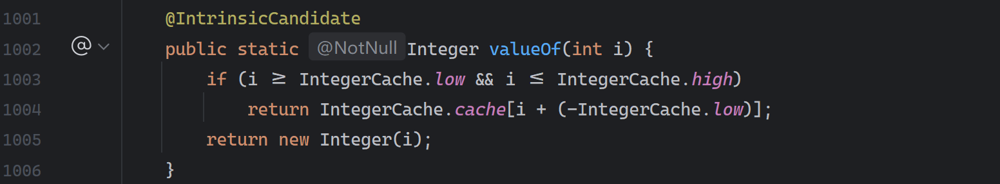
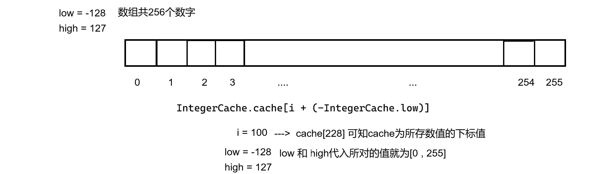

## 1. 包装类

### 1.1 基本数据类型和其对应的包装类
Java 为了把**基本数据类型**当作“对象”来使用，专门提供的一组**类**。

| **基本类型** | **包装类** |
| :---: | :---: |
| byte | Byte |
| short | Short |
| int | Integer |
| long | Long |
| float | Float |
| double | Double |
| char | Character |
| boolean | Boolean |


### 1.2 装箱与拆箱
**装箱（装包）**：把基本数据类型变成包装类类型的过程叫做装箱（装包）。

装箱又分为自动装箱和手动装箱

实际自动装箱底层逻辑还是手动装箱

```java
public class Demo{
    public static void main(String[] args) {
        int a = 100;
        //手动装箱
        Integer ia = Integer.valueOf(a);
        Double da = Double.valueOf(a);
        System.out.println(ia);
        System.out.println(da);

        //自动装箱
        Integer iia = a;
        Double dda = (double) a;
        System.out.println(iia);
        System.out.println(dda);
    }
}
```

**拆箱（拆包）**：把包装类类型变成基本数据类型的过程就叫做拆箱（拆包）。

拆箱也分为自动拆箱和手动拆箱

实际自动拆箱底层逻辑还是手动拆箱

```java
public class Demo{
    public static void main(String[] args) {
        Integer ia = 100;
        //手动拆箱
        int a = ia.intValue();
        double d = ia.doubleValue();
        System.out.println(a);
        System.out.println(d);

        //自动拆箱
        int iia = ia;
        double da = ia.doubleValue();
        System.out.println(iia);
        System.out.println(da);
    }
}
```

### 1.3 Integer 缓存机制
```java
public class Demo {
    public static void main(String[] args) {
        Integer a = 100;
        Integer b = 100;
        System.out.println(a == b);//true
        Integer c = 200;
        Integer d = 200;
        System.out.println(c == d);//false
    }
}
```

以上代码中涉及的是自动装包，结果的原因：

> `Integer.valueOf()`会缓存 [-128,127]
>
> 在这个范围内：返回同一个对象
>
> 超出范围：新对象
>

我们可以查看 Integer 源码中的`valueOf()`方法


我们可以看出自动装包输入的 i 在其中是个数组的范围，我们可以查看到 IntegerCache 这样一个类中设定了 `low = -128`,而`high`最终被`h = 127`所赋予，因此得到该缓存数组范围 `[-128,127]`

我们再思考返回的数组内容，`IntegerCache.cache[i + (-IntegerCache.low)]`，我们就拿 `i = 100`代入


而我们通常比较“值”的方法是使用`a.equals(b)`

## 2.泛型
泛型就是**把“类型”当作参数，在编译期确定下来的一种机制**。

其作用是 1、**解决“类型不安全”问题**，2、**消除强制类型转换（向下转型）**，3、**提高代码复用能力**

### 2.1 使用语法
**泛型类**

列举样例：

```java
class 泛型类名称<>{
//可使用类型参数
}

class ClassName<T1,T2,...,Tn>{
}

class 泛型类名称<类型形参列表>extends 继承类/*此处可使用类型参数*/{
}

class ClassName<T1,T2,...,Tn> extends ParentClass <T1>{
}
```

举例：

```java
class Box<T> {
    private T value;

    public void set(T value) {
        this.value = value;
    }

    public T get() {
        return value;
    }
}

```

使用如下：

```java
Box<String> box = new Box<>();
box.set("hello");
String s = box.get();
```

说明：`T`在定义类时只是占位；在创建对象时才是真正确定类型


**泛型方法**

```java
方法限定符 <类型形参列表> 返回值类型 方法名称(形参列表) { ... }
```

```java
public static <T> T getFirst(T[] arr) {
    return arr[0];
}
```

解释：

> `<T>`：位于返回值之前，表示该方法定义了一个泛型类型参数 `T`
>
> `T`：表示这个方法返回值的类型是`T`
>

使用如下：

```java
Integer i = getFirst(new Integer[]{1, 2});
String s = getFirst(new String[]{"a", "b"});
```


**泛型接口**

```java
interface Mapper<T> {
    T map(T input);
}
```

实现方式一（实现时确定类型）：

```java
class StringMapper implements Mapper<String> {
    public String map(String input) {
        return input.toUpperCase();
    }
}
```

实现方式二（实现时仍保留泛型）：

```java
class DefaultMapper<T> implements Mapper<T> {
    public T map(T input) {
        return input;
    }
}
```

### 2.2 泛型的”本质机制“
#### 2.2.1 泛型只存在编译期
Java 的泛型是”伪泛型“

比如：

```java
ArrayList<String>
ArrayList<Integer>
```

 在 JVM 看来都是：

```java
ArrayList
```

#### 2.2.2 类型擦除
编译过程中，将所有的 T 替换为 Object 这种机制称为：**擦除机制**

java 的泛型机制是在编译级别实现的。编译器生成的字节码在运行期间并不包含泛型的类型信息。

```java
ArrayList<String> list = new ArrayList<>();
```

编译后等价于：

```java
ArrayList list = new ArrayList();
```

只是**编译器偷偷加了强制类型检查和转换**。

因此对于两个问题：

> <font style="color:rgb(51,51,51);">1、那为什么，</font>`<font style="color:rgb(51,51,51);">T[] ts = new T[5];</font>`<font style="color:rgb(51,51,51);"> 是不对的，编译的时候，替换为Object，不是相当于：</font>`<font style="color:rgb(51,51,51);">Object[] ts = new Object[5]</font>`<font style="color:rgb(51,51,51);">吗？ </font>
>
> <font style="color:rgb(51,51,51);">2、类型擦除，一定是把T变成Object吗？</font>
>

<font style="color:rgb(51,51,51);">问题 一：</font>

> 首先 java 编译器不允许这样写，原因不是语法，而是在于类型安全。
>
> 因为数组是**运行期类型检查**的，数组在运行期知道自己真实的元素类型。
>
> 另外，泛型是**编译期类型检查**的，在运行期就已经被删除了，所以 JVM 运行期并不知道元素类型
>

举例：

假如`<font style="color:rgb(51,51,51);">T[] ts = new T[5];</font>`<font style="color:rgb(51,51,51);">允许</font>

```java
class Box<T> {
    T[] ts = new T[5]; // 假设合法
}

Box<String> box = new Box<>();
Object[] arr = box.ts; // 数组协变，合法
arr[0] = 100;          // 编译通过
```

首先 `arr`是`Object[]`，放`Integer`是合理的

但`box.ts`逻辑上应该是`String[]`，而且编译器也完全无法阻止这个错误

对于问题二：

> 不一定。无边界泛型 -> 擦除成 Object，因为没有任何约束，最安全的上界就是`Object`
>
> 如果有上界泛型 -> 擦除成”上界类型“，方法级的泛型同理
>

举例如下：

```java
public <T extends Comparable<T>> T max(T a, T b) {
    return a.compareTo(b) > 0 ? a : b;
}
```

擦除后：

```java
public Comparable max(Comparable a, Comparable b) {
    return a.compareTo(b) > 0 ? a : b;
}
```

另外，对于类型擦除还有许多可以了解的地方

1.**泛型信息不会进入 JVM 的方法签名中，也就是说不存在重载**

2.**数组协变+泛型不变**

### 2.3 泛型的上界 
**泛型上界：**

限制泛型参数”最多能是什么类型“，并向编译器承诺：他至少具备某个父类或接口的能力。

**使用语法**：

```java
class 泛型类名称<类型参数 extends 类型边界> {
}
```

这里的`extends`既**表示继承，也表示实现接口**。

举个例子：

```java
class Box<T extends Number> {
    T value;

    void print() {
        value.intValue();
    }
}
```

如果没有`extends Number`，那么编译器只知道`T`是`Object`，`Object`没有`intValue()`.

但是加上之后，就相当于上界告诉了编译器：`T`至少是`Number`，`Number`定义了`intValue()`

