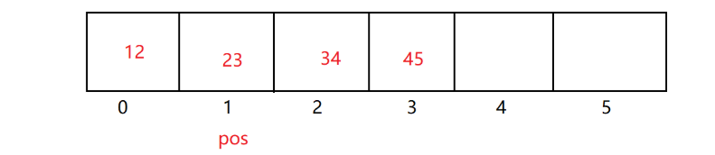
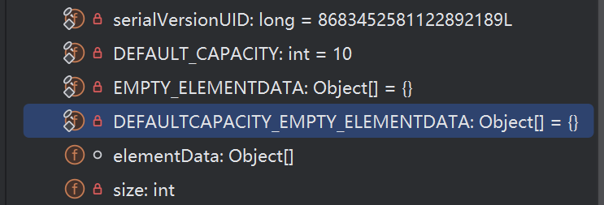
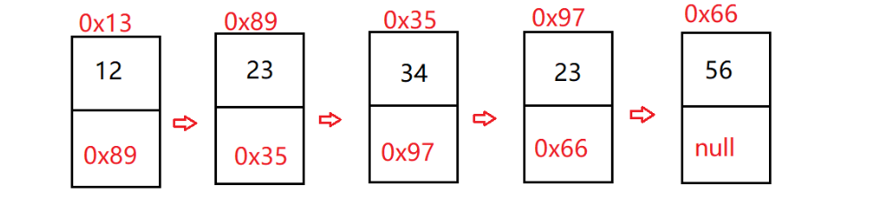
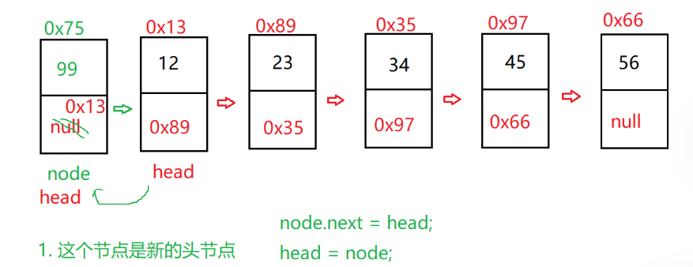
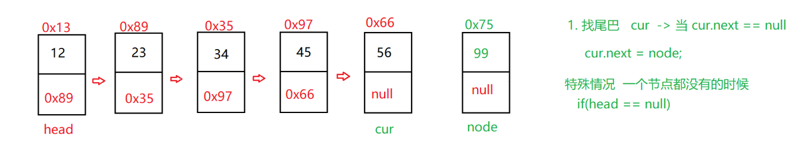
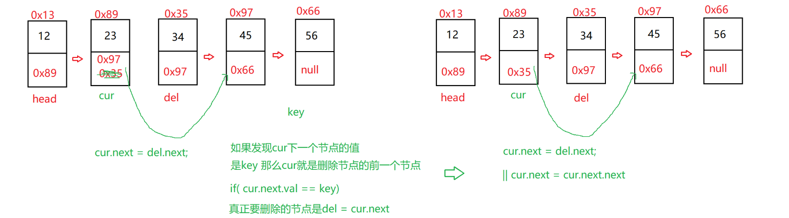
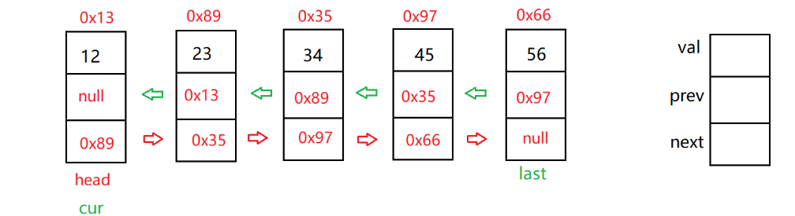
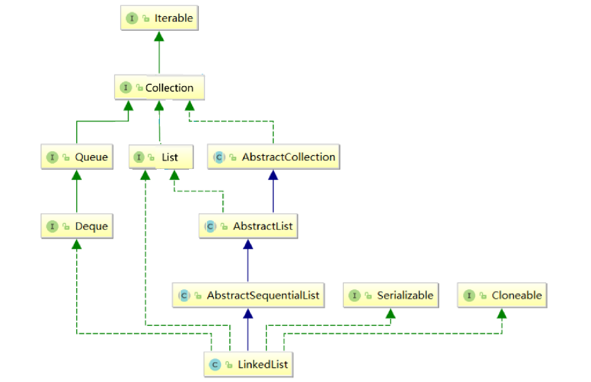

图片来自于[菜鸟教程](https://www.runoob.com/java/java-collections.html)

## 1.List 引入

### 1.什么是 List

在了解 `ArrayList`即顺序表 (`Sequential List`) 与 `LinkedList`即 双向链表 (`Doubly Linked List`) 之前，有必要先明 `List`是什么。

`List` 是一个接口，其继承自 `Collection`，类似可以理解为“合同”。它规定了所有子类需要具备的功能：索引访问 `get(i)`、插入元素 `add`、删除元素 `remove` 等功能。


**List 与 ArrayList、LinkedList 的关系**

List 首先是一个接口（可理解为合同），而 `ArrayList`、`LinkedList` 则是它的实现类（可理解为员工在合同下工作）。也就是说，`ArrayList`、`LinkedList` 两个类都需要重写 `List` 中的方法。

## 2.ArrayList 的理解
### 2.1 什么是 ArrayList
先从图片上引入对 `ArrayList` 的概念，其实就是数组


`ArrayList` 中文称为顺序表，

从物理意义上：它是用一段**连续的物理内存**（数组）来表达线性关系的。


从源码上看主要是这几个常量，包括容量，数组，实际大小`usedSize`...

### 2.2 ArrayList 的模拟实现
#### 2.2.1 实现 MyArrayList 类
我们尝试模拟实现一下 `ArrayList` 的主要功能，定义一个 `MyArrayList` 类

具体代码可访问[GitHub远程仓库](https://github.com/Sirens007/MyStorage/blob/main/JavaCode/2026_01_11_java/src/arrayList/MyArrayList.java)

首先创建一个模拟 `IList` 接口，根据接口定义的方法以及 `ArrayList` 的源码去模拟实现`MyArrayList` 类

```java
public interface IList {
    // 新增元素,默认在数组最后新增
    public void add(int data);
    // 在 pos 位置新增元素
    public void add(int pos, int data);
    // 判断数组是否已满
    public boolean isFull();
    // 判定是否包含某个元素
    public boolean contains(int toFind);
    // 查找某个元素对应的位置
    public int indexOf(int toFind);
    // 获取 pos 位置的元素
    public int get(int pos);
    // 给 pos 位置的元素设为 value
    public void set(int pos, int value);
    //删除第一次出现的关键字key
    public void remove(int toRemove);
    // 获取顺序表长度
    public int size() ;
    // 清空顺序表
    public void clear();
    // 打印顺序表，注意：该方法并不是顺序表中的方法，为了方便看测试结果给出的
    public void display() ;
}
```

`MyArrayList` 类有以下变量及构造方法

```java
public class MyArrayList implements IList{
    public int[] array;
    public int usedSize;
    public static final int DEFAULT_CAPACITY = 10;

    public MyArrayList(){
        array = new int[DEFAULT_CAPACITY];
    }
}
```

由于 `ArrayList` 官方源码是适配多种类型而使用泛型，我们为方便理解就从整型去创建。

其涉及的相关题目可以有 杨辉三角的实现，简单的洗牌算法[参考源码](https://github.com/Sirens007/MyStorage/blob/main/JavaCode/2026_01_11_java/src/PlayingCards.java)，了解完之后就对 `ArrayList` 有初步理解了

### 2.3ArrayList 的局限性
由于 `ArrayList` 底层代码是一段连续空间，当在 `ArrayList` 任意位置插入或者删除元素时，就需要将后续元素整体往前或者往后搬移，时间复杂度为 `O(n)`，效率较低。


## 3.链表 与 LinkedList
### 3.1 链表的概念
链表是物理存储结构上非连存储结构，数据元素的逻辑顺序是通过链表中的引用链接次序实现的。每个节点存储了当前节点的 `value` 以及对下一个节点的索引

其结构类似图中内容


实际中链表结构又是多样的：

1. 单项或者双向
2. 带头或者不带头
3. 循环或者非循环

**无头单向非循环链表：**结构简单，一般不会单独用来存数据。实际中更多是作为其他数据结构的子结构，如哈希桶、图的邻接表等等。另外这种结构在笔试面试中出现很多。

因此我们以单向无头非循环链表举例。

### 3.2 链表的模拟实现
#### 3.2.1 自创 MySingleList 类
实现的代码可访问该链接 -> [参考源码](https://github.com/Sirens007/MyStorage/blob/main/JavaCode/2026_03_04_java/src/mySingleList/MySingleList.java)

我们同样可以实现上面的 IList 接口，其变量、内部类以及构造方法有以下

```java
public class MySingleList implements IList{
    // 创建整个链表中的各个节点（车厢）
    static class ListNode {
        public int val;
        public ListNode next;	// 对下一个节点的索引
        // 初始化各个节点
        public ListNode(int val) {
            this.val = val;
        }
    }
    // 存储头节点引用（火车头）
    public ListNode head;
}
```

主要方法有头插法 `addFirst()`、尾插法 `addLast()`、任意位置插入 `addIndex()`、是否包含 `contains()`、删除节点 `remove()`等等

我们选部分了解：

头插法：


```java
public void addFirst(int data) {
    ListNode node = new ListNode(data);
    node.next = this.head;
    this.head = node;    
}
```

即在头节点前插入，时间复杂度为 `O(1)`，而 ArrayList 中为 `O(n)`

---

尾插法：


```java
public void addLast(int data) {
    ListNode node = new ListNode(data);
    if(this.head == null){
        this.head = node;
        return;
    }
    ListNode cur = this.head;
    // cur.next != null可以走到倒数第二个节点
    // 但最后一个节点地址可获取
    while(cur.next != null){
        cur = cur.next;
    }
    cur.next = node;
}
```

即在最后节点插入，注意最后节点的 `next` 必须置空

另外补充，官方在链表中增加新节点是默认使用尾插

---

删除节点：


```java
    @Override
    public void remove(int key) {
        if(this.head == null){
            return;
        }
        if(this.head.val == key){
            this.head = this.head.next;
            return;
        }
        // 创建当前节点cur
        ListNode cur = FindNodeBeforeKey(key);
        cur.next = cur.next.next;
    }

    // 查找到删除节点前的一个节点
    private ListNode FindNodeBeforeKey(int key){
        // 创建当前节点
        ListNode cur = this.head;
        // cur要每一个都走一遍
        while(cur.next != null){
            if(cur.next.val == key){
                return cur;
            }
            cur = cur.next;
        }
        return null;
    }
```

利用删除节点的前一节点访问到删除节点的 `val` 值去匹配 `key`，以及当前节点 `cur` 的 `next` 索引的修改

### 3.3 单链表相关的 OJ 面试题
1. 删除链表中等于给定值 val 的所有节点。[Leecode 移除链表元素](https://leetcode.cn/problems/remove-linked-list-elements/)

2. 反转一个单链表。[Leecode 反转一个单链表](https://leetcode.cn/problems/reverse-linked-list/description/)

3. 给定一个带有头结点 head 的非空单链表，返回链表的中间结点。如果有两个中间结点，则返回第二个中间结点。[Leecode 链表的中间节点](https://leetcode-cn.com/problems/middle-of-the-linked-list/description/)

4. 输入一个链表，输出该链表中倒数第k个结点。 [Leecode 返回倒数第k个节点](https://leetcode.cn/problems/kth-node-from-end-of-list-lcci/)

5. 将两个有序链表合并为一个新的有序链表并返回。新链表是通过拼接给定的两个链表的所有节点组成的。[Leecode 合并两个有序链表](https://leetcode.cn/problems/merge-two-sorted-lists/description/)

6. 编写代码，以给定值x为基准将链表分割成两部分，所有小于x的结点排在大于或等于x的结点之前 。[Leecode 分割链表](https://leetcode.cn/problems/partition-list-lcci/)

7. 链表的回文结构。[Leecode 回文链表](https://leetcode.cn/problems/palindrome-linked-list/)

8. 输入两个链表，找出它们的第一个公共结点。[Leecode 相交链表](https://leetcode.cn/problems/intersection-of-two-linked-lists/)

9.给定一个链表，判断链表中是否有环。[Leecode 环形链表](https://leetcode.cn/problems/linked-list-cycle/)

尝试上面的 Oj 题后，相信你对链表有自己的见解了，以上 Oj 题我会同步发出题解文章

### 3.4 LinkedList 的结构
`LinkedList` 的底层是双向链表结构，由于链表没有将元素存储在连续的空间中，元素存储在单独的节点中，然后通过引用将节点连接起来了，因此在任意位置插入或者删除元素时，不需要搬移元素，效率比较高。

以下图片即为双向链表结构，包含了 `val`、`prev` 前驱、`next` 后驱以及 `head` 头指针和尾指针


通过以下集合框架可以发现，`LinkedList` 也同样实现了 List 接口：


说明：

> 1.LinkedList 实现了 List 接口
>
> 2.LinkedList 的底层使用了双向链表
>
> 3.LinkedList 没有实现 RandomAccess 接口，因此 LinkedList 不支持随机访问
>
> 4.LinkedList 的任意位置插入和删除时效率比较高，时间复杂度为 O(1)
>
> 5.LinkedList 比较适合任意位置插入的场景
>

### 3.5 LinkedList 的模拟实现
#### 3.5.1 实现 MyLinkedList 类
和 `ArrayList`、单向链表一样，同样实现 `List` 接口，在此我们就模拟实现 `IList` 接口

```java
public class MyLinkedList implements IList {
    // 内部类-各个节点
    class ListNode{
        public int val;
        public ListNode prev;	// 前驱
        public ListNode next;	// 后驱

        public ListNode(int val) {
            this.val = val;
        }
    }
    public ListNode head;
    public ListNode last;
}
```

与链表类似，但删除时不再需要提前一个节点，我们可直接到要删除的节点位置

`remove()` - 删除方法：

```java
@Override
public void remove(int key) {
    ListNode cur = head;
    while(cur != null){
        if(cur.val == key){
            //删除在开头
            if(cur == head){
                head = head.next;
                if (head != null) {
                    // 情况 A: 至少还有两个节点，现在的 head 指向原第二个节点
                    head.prev = null;
                } else {
                    // 情况 B: 原本只有一个节点，删完后 head 为 null
                    // 必须同步清理 last
                    last = null;
                }
            } else{
                //删除在其他（中间、结尾）
                cur.prev.next = cur.next;
                if(cur.next == null){
                    last = last.prev;  // 该情况为删除在结尾
                } else{
                    cur.next.prev = cur.prev;
                }
            }
             return;
        }
        cur = cur.next;
    }
}
```

如代码中注释，删除位置首先分为两处--

1. 开头、2. 中间和结尾

随后依次在分类讨论情况，其常用方法与 `ArrayList` 类似

### 3.6ArrayList、链表、LinkedList 关系
**线性表 (Linear List)** —— _“我们要排成一队”_ (逻辑协议)    

├── **顺序表 (Sequential List)** —— _“大家必须坐连排座”_ (底层是数组)    

└── **链表 (Linked List)** —— _“大家随便坐，手拉手就行”_ (底层是节点)          

  ├── **单向链表** —— _“只知道后面是谁”_          

  └── **双向链表** —— _“既知道前面，也知道后面”_

| **<font style="color:rgb(31, 31, 31);">概念名称</font>** | **<font style="color:rgb(31, 31, 31);">属于什么</font>** | **<font style="color:rgb(31, 31, 31);">物理结构</font>** | **<font style="color:rgb(31, 31, 31);">在 Java 中的“肉身”</font>** |
| --- | --- | --- | --- |
| **<font style="color:rgb(31, 31, 31);">顺序表</font>** | <font style="color:rgb(31, 31, 31);">线性表的一种实现</font> | <font style="color:rgb(31, 31, 31);">连续</font>**<font style="color:rgb(31, 31, 31);">数组</font>** | `<font style="color:rgb(68, 71, 70);">ArrayList</font>` |
| **<font style="color:rgb(31, 31, 31);">链表</font>** | <font style="color:rgb(31, 31, 31);">线性表的一种实现</font> | <font style="color:rgb(31, 31, 31);">分散</font>**<font style="color:rgb(31, 31, 31);">节点</font>**<font style="color:rgb(31, 31, 31);"> + </font>**<font style="color:rgb(31, 31, 31);">指针</font>** | `<font style="color:rgb(68, 71, 70);">LinkedList</font>` |
| **<font style="color:rgb(31, 31, 31);">链表节点</font>** | <font style="color:rgb(31, 31, 31);">链表的组成零件</font> | <font style="color:rgb(31, 31, 31);">包含数据和指针的对象</font> | `<font style="color:rgb(68, 71, 70);">ListNode</font>`<font style="color:rgb(31, 31, 31);">类</font> |

以上是我关于Java的笔记分享

<font style="color:rgb(77, 77, 77);">感谢你读到这里，这也是我学习路上的一个小小记录。希望以后回头看时，能看到自己的成长~</font>

