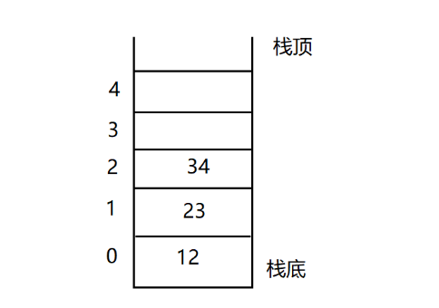
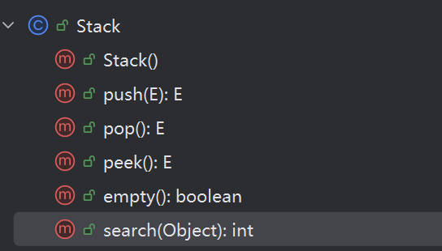
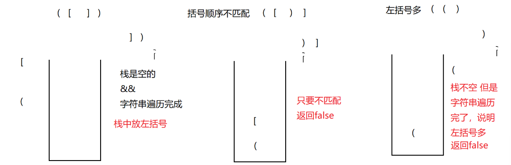
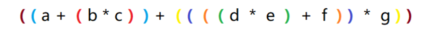
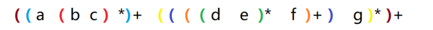
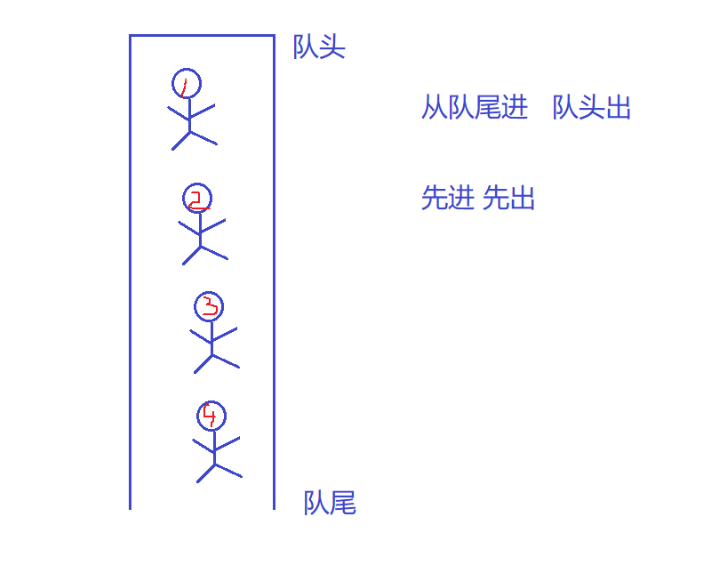
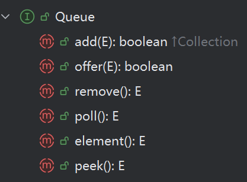
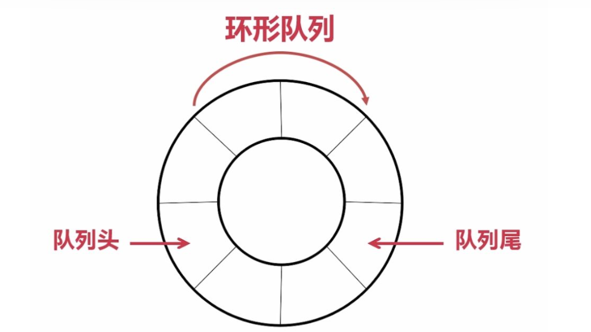

## 1.栈 Stack

### 1.1 栈？
栈：是一种特殊的线性表，他**只允许在固定的一端进行插入和删除元素操作**。进行数据插入和删除操作的一端称为**栈顶**，另一端称为**栈底**。栈中的元素遵循**先进后出的原则**。

压栈：数据进入栈中称为进栈/压栈/入栈

出栈：栈的删除操作叫做出栈

其概念图如下：


### 1.2 队列的三种实现
栈的方法不多，我们可以查看查看 Stack 源码中的方法


其方法说明如下

| **方法** | **返回类型** | **功能** |
| --- | --- | --- |
| **push(E e)** | E | 将 e 入栈，并返回 e |
| **pop()** | E | 将栈顶元素出栈并返回 |
| **peek()** | E | 获取栈顶元素 |
| **size()** | int | 获取栈中有效元素个数 |
| **empty()** | boolean | 检测栈是否为空 |


Java 中**栈的常见实现**有三种：

| **实现方式** | **备注** |
| :---: | --- |
| **Stack** | 老旧，但线程安全（带锁），性能相对较低 |
| **ArrayDeque** | 非线程安全，性能极高 |
| **LinkedList** | 可当作栈使用，但作为栈使用时，性能通常略逊于ArrayDeque |


要想了解栈，模拟栈的实现是很有必要的

```java
package myStack;
import exception.EmptyStackException;
import java.util.Arrays;

public class MyStack {
    public int[] elem;
    public int usedSize;

    public MyStack() {
        this.elem = new int[10];
    }

    public void push(int val){
        if(isFull()){
            this.elem = Arrays.copyOf(elem,2*elem.length);
        }
        elem[usedSize++] = val;
    }

    public boolean isFull(){
        return usedSize == elem.length;
    }

    public int pop(){
        if(isEmpty()){
            throw new EmptyStackException("栈中元素为空");
        }
        int val = elem[usedSize - 1];   //取得栈中的最后值
        usedSize--;    //取消对最后值的索引
        return val;
    }

    public int peek(){
        if(isEmpty()){
            throw new EmptyStackException("栈中元素为空");
        }
        return elem[usedSize - 1];
    }

    public boolean isEmpty(){
        return usedSize == 0;
    }

    public int search(int val){
        for (int i = usedSize - 1;i >= 0;i--) {
            if(elem[i] == val){
                // 返回距离栈顶的距离。栈顶本身返回 1，其下方返回 2，以此类推
                return usedSize - i;
            }
        }
        return -1;
    }
}
```

代码可详见于[远程仓库](https://github.com/Sirens007/MyStorage/tree/main/JavaCode/2026_03_04_java/src/myStack)

### 1.3 Stack 典型 Oj 题
[20. 有效的括号 - 力扣（LeetCode）](https://leetcode-cn.com/problems/valid-parentheses/)

[150. 逆波兰表达式求值 - 力扣（LeetCode）](https://leetcode-cn.com/problems/evaluate-reverse-polish-notation/)

[Leecode 最小栈](https://leetcode-cn.com/problems/min-stack/)

[Leecode 用队列实现栈](https://leetcode.cn/problems/implement-stack-using-queues/)

[Leecode 用栈实现队列](https://leetcode.cn/problems/implement-queue-using-stacks/)

#### 有效的括号
对于此题，我们可以先创建几个例子，如`([])`、`([)]`、`(()`据此可以构建该模型。

> 既然是要左括号匹配右括号，我们可以思考，假设先遇到左括号正常返回 true 的例子，并能够以**最近遇到的左括号**去匹配**右括号**，只能是通过**栈（Stack）**这个数据结构来完成了
> 

（从左至右）如图 1

> 遍历字符串，if {先遇到左括号，push 压栈；}
>
> else {遇到右括号，
>
> if{ stack 为空，返回 false 结束} 
>
> else {栈不为空,peek()匹配，如匹配则 pop()弹出，否则 false}
>
> }
>

注：以上为此题抽象思路,但稍有不足，假设左括号过多（如图三），我们还需最后检查栈是否为空

```java
// 有效的括号
    public boolean isValid(String s) {
        Stack<Character> stack = new Stack<>();
        for (int i = 0; i < s.length(); i++) {
            char ch = s.charAt(i);
            if(ch == '(' || ch == '[' || ch == '{') {
                // 如果匹配，进行压栈
                stack.push(ch);
            } else{
                if(stack.empty()) {
                    return false;
                }
                // 若不为空，继续判断是否匹配
                char ch2 = stack.peek();
                // 从栈中取出元素,即不走上面的if了，为右括号
                if(ch == ')' && ch2 == '('
                        || ch == '}' && ch2 == '{'
                        || ch == ']' && ch2 =='['){
                    stack.pop();
                }else {
                    // 若不匹配上述
                    return false;
                }
            }
        }
        //处理匹配完右括号后，左括号是否多出来
        if(!stack.empty()){
            return false;
        }
        return true;
    }
```

#### 逆波兰表达式求值
我们先简单了解以下波兰表达式概念，如下

给出一个中缀表达式：`a + b * c + (d * e + f) * g`,

转换为后缀表达式：`a b c * + d e * f + g * +`.

其转换过程如下：将以下每个运算符号都放在括号中，


随后将每个运算符号移除当前所处的括号外，得到


将括号去掉便得到我们的后缀表达式了，而如何按照原先规则运算就是我们这次讲的题了

> **输入：**tokens = ["2","1","+","3","*"]
>
> **输出：**9
>
> **解释：**该算式转化为常见的中缀算术表达式为：((2 + 1) * 3) = 9
>

题目给出这样一个示例，可以想到每遍历到**操作数**就提取两个数字

> 根据上述思路，我们可以想到用栈来存储每次遍历时遇到的数字，当遇到运算符时，就弹出栈顶的两个元素进行该运算符的计算
>

注：注意两个数字的位置不要搞错！第一个数字是右操作数，第二个数字是左操作数

由上述思路得出

```java
    // 逆波兰表达式求值
    public int evalRPN(String[] tokens) {
        Stack<Integer> stack = new Stack<>();
        // 遍历字符串
        for(String x : tokens){
            // 匹配是否是操作符号
            if(!isOperator(x)){
                // 如果是数字就压栈
                int num = Integer.parseInt(x);
                stack.push(num);
            } else{
                // 不是数字就运算
                int val2 = stack.pop();
                int val1 = stack.pop();
                switch(x){
                    case"+":
                        stack.push(val1+val2);
                        break;
                    case"-":
                        stack.push(val1-val2);
                        break;
                    case"*":
                        stack.push(val1*val2);
                        break;
                    case"/":
                        stack.push(val1/val2);
                        break;
                }
            }
        }
        return stack.pop();
    }

    private boolean isOperator(String ch){
        if(ch.equals("+") || ch.equals("-")
                || ch.equals("*") || ch.equals("/")){
            return true;
        }
        return false;
    }
```

### 1.4 栈、虚拟机栈、栈帧的区分
**栈**

> 由本节知道，栈是一种数据结构，遵循先进后出的原则
>

**虚拟机栈**

> 1. 虚拟机栈是 JVM 的一块运行时内存区域
> 2. 其中，虚拟机栈 = 每个线程私有的调用栈
> 3. **虚拟机栈**主要存的就是我们要说的**栈帧**
>

**栈帧**

> 栈帧是**方法运行时的数据结构**，即**每次方法调用产生的数据单元**
>
> 也就是说：每调用一个方法 -> 创建一个栈帧
>
> 一个栈帧里通常包含：局部变量表、操作数栈、动态链表、方法返回地址
>

## 2.队列 Queue
### 2.1 什么叫队列
队列：只允许在**队尾**进行**元素插入**，在**队头**进行**元素删除**的一种特殊线性表，队列遵循**先进先出的原则**。

对于队列的概念我们可以抽象理解为如下图，类似倒置的栈，但与栈不同


### 2.2 如何使用队列
java 中，队列与栈不同的是，**栈是一个类**，而**队列是一个接口**。

因此我们实现队列的时候就不能像栈一样 new 一个它本身，而是要通过常用的** LinkedList**(双向链表)、**ArrayDeque**(动态数组)、**PriorityQueue**(堆)...实现类来实现。

```java
Queue<Integer> q = new LinkedList<>();
Queue<Integer> q = new ArrayDeque<>();
Queue<Integer> q = new PriorityQueue<>();
...
```

队列 Queue 的**结构**如下


**队列的基本操作方法：**

| **方法** | **功能** |
| --- | --- |
| boolean offer(E e)/add(E e) | 入队 enqueue |
| poll()/remove(): E | 出队 dequeue |
| peek()/element(): E | 查看队头 |
| boolean isEmpty() | 检查队列是否为空 |
| int size() | 获取队列中的有效元素个数 |


其中，`isEmpty()` `size()`这两个方法是定义在父类 Collection 中。

另外上面存在两种一样功能的方法区别差异不大

### 2.3 模拟实现队列 Queue
在了解完队列的方法后，进一步学习其方法，加深对队列的理解

补充：

**顺序结构**

> 数据在内存中连续存储
>

**链式结构**

> 数据在内存中不需要连续，每个元素通过指针（应用连接起来）
>

在前面学习完的顺序结构（数组、ArrayList...）和 链式结构（LinkedList、单链表...）之后，对于队列的实现，我们在后面会说明使用哪个实现会更好

队列的方法十分简单，代码如下，没有很复杂的逻辑。

```java
public class MyQueue {

    static class ListNode {
        public int val;
        public ListNode prev;
        public ListNode next;

        public ListNode(int val) {
            this.val = val;
        }
    }
    public ListNode first = null;
    public ListNode last = null;
    public int usedSize = 0;

    // 入队列（尾入）
    public void offer(int val) {
        ListNode node = new ListNode(val);
        if(isEmpty()) {
            first = last = node;
        } else {
            last.next = node;
            node.prev = last;
            last = last.next;
        }
        usedSize++;
    }

    // 出队列（头出）
    public int poll() {
        if(isEmpty()) {
            return -1;
        }
        int val = first.val;
        first = first.next;
        if(first != null) {
            // 将first的前驱置空
            first.prev = null;
        }
        usedSize--;
        return val;
    }

    // 获取队头元素
    public int peek() {
        if(isEmpty()) {
            return -1;
        }
        return first.val;
    }

    public boolean isEmpty() {
        return usedSize == 0;
    }
```

从逻辑上，顺序结构（数组）、链式结构（单、双链表）都可以实现队列 Queue。

我们可以对比一下

#### 1.数组实现
> 1. 队头需要 front 标记，队尾需要 rear 标记
> 2. 必须使用循环数组才能充分利用空间
>

时间复杂度

入队：	 O(1)

出队：	 O(1)

随机访问：O(1)

可以发现其优/缺点：

> 优：内存连续，空间占用少、随机访问快
>
> 缺：必须事先指定数组容量或动态扩容
>

#### 2.单链表实现
> 队头 head 指向队头节点，last 指向队尾节点
>
> 入队采用尾插法
>
> 出队可删除头节点
>

注：就算有尾节点的标记，也不能从头节点入队，因为删除还是需要找对后一个节点的前一个节点

时间复杂度

入队：	 O(1)

出队：	 O(1)

随机访问：O(n)

#### 3.双链表实现
与单链表相同

> 队头 head 指向队头节点，last 指向队尾节点
>
> 入队采用尾插法
>
> 出队可删除头节点
>

时间复杂度

入队：	 O(1)

出队：	 O(1)

随机访问：O(n)

但是双链表可以双向遍历，支持在两端操作

| **特性** | **数组** | **单链表** | **双链表** |
| --- | --- | --- | --- |
| 存储 | 连续 | 不连续 | 不连续 |
| 内存占用 | 少 | 中 | 多 |
| 入队/出队 | O(1) | O(1) | O(1) |
| 随机访问 | O(1) | O(n) | O(n) |
| 是否需要扩容 | 是（或固定容量） | 否 | 否 |
| CPU缓存友好 | 高 | 低 | 低 |
| 适用场景 | 高性能、容量固定或可扩容 | 容量不确定、出入队灵活 | 双端操作、容量不确定 |


### 2.4 循环队列

循环队列：是顺序队列的一种优化，它解决了顺序队列出对后空间浪费的问题。

> 1. 普通顺序队列：出队后，队头向后移动，数组前面出现空闲空间，但无法复用
> 2. 循环队列：把数组看作 **环形**，当 `rear` 到达数组末尾时，如果前面有空余位置，就可以回到数组开头继续存放元素
>

对于循环队列，我们给出以下定义

> 队列用数组存储  
front 指向队头  
rear 指向队尾的下一个位置
>

由此，我们可以得到**循环公式**

> 入队时：`rear = (rear + 1) % capacity`
>
> 出队时：`front = (front + 1) % capacity`
>
> 队列满条件：`(rear + 1) % capacity == front`
>
> 队列空条件：`rear == front`
>

对于循环数组判断是否已满有三种方法

> 1. 通过添加 usedSize 属性记录
> 2. 保留一个位置
> 3. 使用标记，定义 boolean 类型元素
>

我们拿第三个标记法举例

```java
// 使用不浪费空间方法
class MyCircularQueue{
    public int front;
    public int rear;
    public int[] elem;
    private boolean isFullFlg;
    public MyCircularQueue(int k) {
        elem = new int[k];
        front = 0;
        rear = 0;
        isFullFlg = false;
    }
    // 入队
    public boolean enQueue(int value) {
        if(isFull()) {
            return false;
        }
        elem[rear] = value;
        rear = (rear + 1) % elem.length;    // rear往后移一位
        if(rear == front) {
            isFullFlg = true;
        }
        return true;
    }
    // 出队
    public boolean deQueue() {
        if(isEmpty()) {
            return false;
        }
        front = (front + 1) % elem.length;  // front往后移一位
        isFullFlg = false;  // 只要成功出队，则队列不可能满
        return true;
    }

    // 返回front指向的元素
    public int Front() {
        if(isEmpty()) return -1;
        return elem[front];
    }

    // 返回rear指向的元素
    public int Rear() {
        if(isEmpty()) return -1;
        int index = (rear == 0) ? elem.length - 1 : rear - 1;
        return elem[index];
    }

    public boolean isEmpty() {
        return (rear == front) && !isFullFlg;
    }

    public boolean isFull() {
        return isFullFlg;
    }
}
```

[622. 设计循环队列 - 力扣（LeetCode）](https://leetcode.cn/problems/design-circular-queue/)

### 2.5 双端队列 Deque
**Deque** = **D**ouble **E**nded **Que**ue

双端队列是指允许两端都可以进行入队和出队操作的队列。即说明元素可从队头出入队，也可以从队尾出入队。

 双端队列可以用 **顺序结构** 或 **链式结构** 实现 

```java
Deque<Integer> stack = new ArrayDeque<>();//双端队列的线性实现
Deque<Integer> queue = new LinkedList<>();//双端队列的链式实现
```

以上是我关于Java的笔记分享

<font style="color:rgb(77, 77, 77);">感谢你读到这里，这也是我学习路上的一个小小记录。希望以后回头看时，能看到自己的成长~</font>

