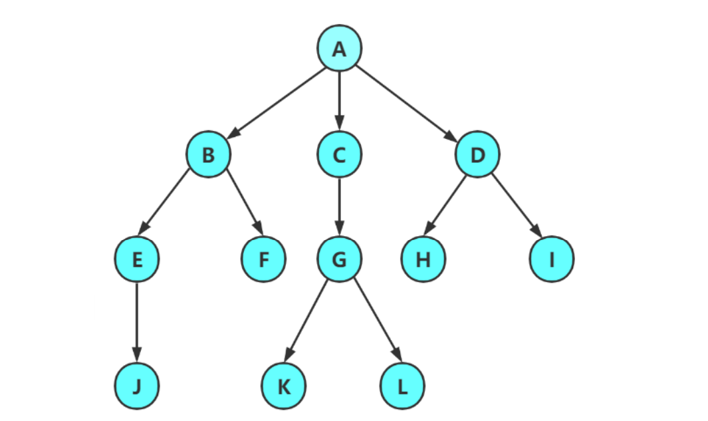
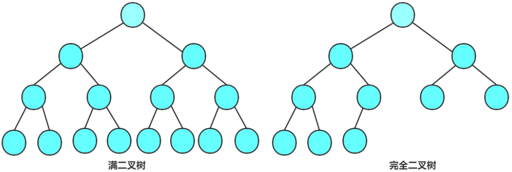
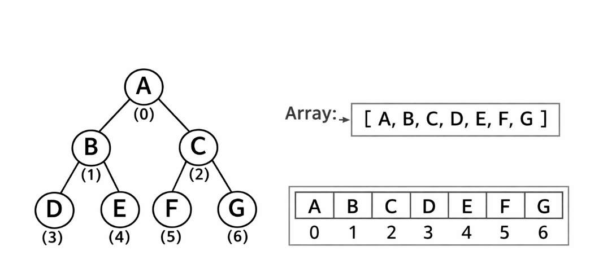
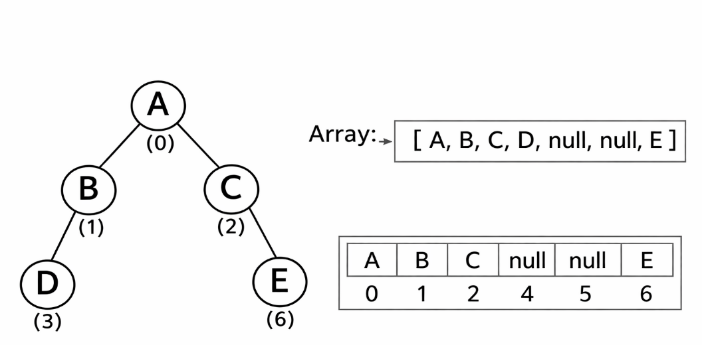
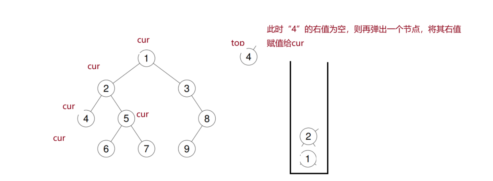
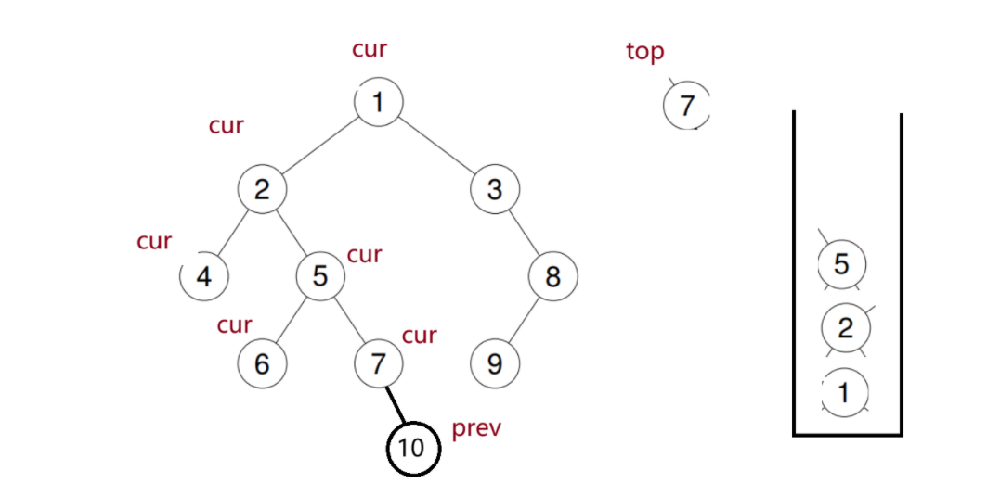

## 1. 树型结构

### 1.1 了解树



形如图中的结构，称之为树型结构。实际上，`数据结构的树 = 图论中的树 + 根节点 + 父子关系`

对于数据结构中树的定义

> 树是由 n（n >= 0）个节点但组成的有限集合。
>

其中，树的一些基本概念有以下：

> **节点的度：**一个节点含有子树的个数称为该节点的度；
>
> **树的度：**一棵树中，所有节点度的最大值称为树的度；上图树的度为 3
>
> **叶子节点或终端节点：**度为 0 的节点称为叶子节点；
>
> **双亲节点或父节点：**若一个节点含有子节点，则这个节点称为其子节点的父节点；
>
> **根节点：**一棵树中，没有双亲节点的节点；
>
> **树的高度或深度：**树中节点的最大层次；上图树的高度为 4
>
> **非终端节点或分支节点：**度不为 0 的节点；
>

## 2.二叉树
### 2.1 二叉树的概念
二叉树是一个有限节点集合，满足：

> 1. 可以是空集（空二叉树）
> 2. 如果不为空，则由三部分组成：根节点（Root）、左子树（Left Subtree）、右子树（Right Subtree)
>

并且：左子树和右子树本身也是二叉树

#### 2.1.1 特殊的两种二叉树
1. **满二叉树：**一棵二叉树，若每层的节点树都达到最大值，则这棵二叉树就是满二叉树。从数学关系上看，一颗二叉树的层数为 K，则节点总数为 2<sup>k</sup>- 1，则它就是满二叉树。
2. **完全二叉树：**除了最后一层外，其余各层都被完全填满，并且最后一层的节点从左至右连续排列，中间不能空缺

图像概念如下：


### 2.2 二叉树的性质
1. 若规定**根结点的层数为1**，则一棵**非空二叉树的第i层上最多有** 2<sup>i-1</sup>**(i>0)个结点**
2. 若规定只有**根结点的二叉树的深度为1**，则**深度为K**的二叉树的最大结点数是 2<sup>k</sup> - 1(k>=0)
3. 对任何一棵二叉树, 如果其**叶结点个数为** n<sub>0</sub>, **度为2**的**非叶结点个数为** n<sub>2</sub>,则**有n**<sub>**0**</sub>**＝n**<sub>**2**</sub>**＋1**
4. 具**有n个结点**的**完全二叉树**的**深度k**为 log<sub>2</sub>(**n+1**) **上取整**
5. 对于具有**n个结点的完全二叉树**，如果按照**从上至下从左至右**的顺序对所有节点从0开始编号，则对于序号为 i 的节点有：
    - 若 i > 0,双亲序号：(i - 1)/2; i = 0,**i 为根节点编号**，无双亲节点
    - **若2i+1<n，左孩子序号：2i+1，否则无左孩子**
    - **若2i+2<n，右孩子序号：2i+2，否则无右孩子**

---

**例题**：

**已知**：总共节点个数为 n 的完全二叉树，求叶子节点个数？

**前提说明**：**公式**`n₀ = n₂ + 1`、`n₀ + n₁ + n₂ = n`

我们做**分类讨论**

**情况一： n 为偶数**

 完全二叉树中必有且仅有一个度为 1 的节点，即：  `n₁ = 1`

代入性质，即`n₀ + 1 + n₂ = n`

 结合`n₀ = n₂ + 1`：  可得`n₂ = (n - 2) / 2`

综上， `n₀ = n₂ + 1 = n / 2` 

---

**情况二：n 为奇数**

 完全二叉树中不存在度为 1 的节点，即：  `n₁ = 0`

代入性质，即`n₀ + n₂ = n`

 结合`n₀ = n₂ + 1`：  可得`n₂ = (n - 1) / 2`

综上，`n₀ = n₂ + 1 = (n + 1) / 2`

---

**总结该过程就是以下公式：**`n₀ = ⌈n / 2⌉`**注意是向上取整**

#### 2.2.1 性质推导
对于性质 3，我们给出以下推导

> 已知：一棵 N 个节点的树有 N-1 条边，下标 1、2 分别代表度为 1，2 的节点能产生的边数：
>
> n<sub>1</sub>:产生 n<sub>1</sub>-1 条边
>
> n<sub>2</sub>:产生 2*n<sub>2</sub> 条边
>
> n<sub>1</sub>+ 2*n<sub>2</sub> = N - 1	方程式 1
>
> n<sub>0</sub> + n<sub>1</sub>+ n<sub>2</sub> = N	方程式 2
>
> 联立解得：**n<sub>2</sub> + 1 = n<sub>0</sub>**
>

### 2.3 二叉树的存储
**二叉树的存储结构**分为：**顺序存储**和**链式存储**；

#### 2.3.1 二叉树的链式存储
二叉树的链式存储是**通过一个个的节点**引用起来的，常见的表示方式有**二叉链表、三叉链表、线索二叉树**表示方法；

链式存储使用情况：

1. 形状不规则的普通二叉树
2. 动态变化的二叉树
3. 需要实现复杂逻辑的树

```java
//二叉链表
class Node {
int val; // 数据域
Node left; // 左孩子的引用，常常代表左孩子为根的整棵左子树
Node right; // 右孩子的引用，常常代表右孩子为根的整棵右子树
}
// 三叉链表
class Node {
int val; // 数据域
Node left; // 左孩子的引用，常常代表左孩子为根的整棵左子树
Node right; // 右孩子的引用，常常代表右孩子为根的整棵右子树
Node parent; // 当前节点的根节点
}
// 线索二叉树
class Node {
    int val;
    ThreadedNode left;
    ThreadedNode right;
    
    // 标志位：0代表孩子，1代表线索（指向前驱/后继）
    int lTag; 
    int rTag; 
}
```

**线索二叉树**：

在普通的二叉链表中，一个拥有 n 个结点的二叉树会有 n+1 个空指针域。**线索二叉树**的核心思想就是利用这些空指针来存放结点在某种遍历序列中的“前驱”和“后继”信息，从而加快遍历速度.

实质就是：线索二叉树 = 用空指针存遍历顺序

线索树中的 right 可以类似理解为**链表中的 next **可以**向上走**，也可以像普通二叉树一样**往下找右子树走**

```java
ltag = 0 → 左孩子
ltag = 1 → 前驱（线索）

rtag = 0 → 右孩子
rtag = 1 → 后继（线索）
```

如中序遍历不用递归（线索树）

```java
public void inorderTraverse(ThreadNode root) {
    ThreadNode cur = root;

    // 找到最左节点
    while (cur.ltag == 0) {
        cur = cur.left;
    }

    while (cur != null) {
        System.out.print(cur.val + " ");

        // 如果是线索 → 直接走后继
        if (cur.rtag == 1) {
            cur = cur.right;
        } else {
            // 否则去右子树找最左
            cur = cur.right;
            while (cur != null && cur.ltag == 0) {
                cur = cur.left;
            }
        }
    }
}
```

而将二叉树转为线索树需要用线索化方法将其转换，如下

```java
public class ThreadedBinaryTreeDemo {

    // 节点定义
    static class ThreadNode {
        char val;
        ThreadNode left;
        ThreadNode right;

        int ltag; // 0 = 左孩子，1 = 前驱
        int rtag; // 0 = 右孩子，1 = 后继

        public ThreadNode(char val) {
            this.val = val;
        }
    }

    // 全局前驱指针
    static ThreadNode pre = null;
    // 递归过程中需要共享“上一个访问的节点”

    // 中序线索化
    public static void inorderThread(ThreadNode node) {
        if (node == null) return;

        // 1. 处理左子树（保证顺序：左→根→右）
        inorderThread(node.left);

        // 2. 处理当前节点

        // (1) 建立前驱线索
        if (node.left == null) {
            node.left = pre;
            node.ltag = 1;
        }

        // (2) 建立后继线索
        if (pre != null && pre.right == null) {
            pre.right = node;
            pre.rtag = 1;
        }

        // (3) 更新 pre（当前节点成为下一个节点的前驱）
        pre = node;

        // 3. 处理右子树
        inorderThread(node.right);
    }
```

#### 2.3.2 二叉树的顺序存储
顺序存储适合情况：

1. 完全二叉树
2. 满二叉树

顺序存储的核心是：**使用数组来模拟二叉树的结构**

就如前面性质所提到的：

**左孩子：2 * i + 1**

**右孩子：2 * i + 2**


 顺序存储（数组下标） = 二叉树的层序遍历顺序  

>  注：当且仅当是完全二叉树时  
>

当不是完全二叉树时，其存储情况如此图


### 2.4 二叉树的基本操作
#### 2.4.1 二叉树的三种遍历
##### 1.前序遍历
```java
    // 前序遍历
    public void preorderTree(TreeNode root) {
        if(root == null) return;
        System.out.print(root.val+" ");
        preorderTree(root.left);
        preorderTree(root.right);
    }
```

**非递归方法如下**：


**思路**

> 通过栈来存储当前节点的上一位
>

**解题过程 **

> 1. 将 root 赋给 cur，进入循环
> 2. 循环中 cur 拿到节点就进行压栈并打印，随后向左移动
> 3. 向左时一路压栈一路打印，直至 cur == null 时，再弹出前一个节点，将其**右索引**赋值给 cur 并将其进行循环（将 cur 视为另一子树的根节点即可理解）
>

```java
    // 前序遍历非递归
    public void preorderNor(TreeNode root) {
        if(root == null) return;
        Stack<TreeNode> stack = new Stack<>();
        TreeNode cur = root;

        // 循环判断cur的右侧是否有元素
        while(cur != null || !stack.isEmpty()) {
            // 循环往下遍历左侧元素
            while(cur != null) {
                stack.push(cur);
                System.out.print(cur.val + " ");
                cur = cur.left;
            }
            // cur为空，需要提出栈中一个元素
            TreeNode top = stack.pop();
            cur = top.right;
        }
    }
```

**注意：**中序遍历（非递归）与此一样，只是打印位置不同

**复杂度 **

> 时间复杂度：O(N)
>
> 空间复杂度：**<font style="color:rgb(15, 17, 21);">O(N)</font>**<font style="color:rgb(15, 17, 21);">（最坏）/ </font>**<font style="color:rgb(15, 17, 21);">O(log N)</font>**<font style="color:rgb(15, 17, 21);">（平均）/ </font>**<font style="color:rgb(15, 17, 21);">O(1)</font>**<font style="color:rgb(15, 17, 21);">（右单支树）</font>
>

##### 2.中序遍历
```java
// 中序遍历
    public void inorderTree(TreeNode root) {
        if(root == null) return;
        inorderTree(root.left);
        System.out.print(root.val+" ");
        inorderTree(root.right);
    }
```

**中序遍历非递归方法与前序遍历非递归类似，仅仅调换打印位置**

```java
    // 中序遍历非递归
    public void inorderNor(TreeNode root) {
        if(root == null) return;
        Stack<TreeNode> stack = new Stack<>();
        TreeNode cur = root;

        // 循环判断cur的右侧是否有元素
        while(cur != null || !stack.isEmpty()) {
            // 循环往下遍历左侧元素
            while(cur != null) {
                stack.push(cur);
                cur = cur.left;
            }
            // cur为空，需要提出栈中一个元素
            TreeNode top = stack.pop();
            System.out.print(top.val + " ");
            cur = top.right;
        }
    }
```

##### 3.后序遍历
```java
    // 后序遍历
    public void postorderTree(TreeNode root) {
        if(root == null) return;
        postorderTree(root.left);
        postorderTree(root.right);
        System.out.print(root.val+" ");
    }
```

**下面为非递归方法：**


**注意：**

如上图，当 cur 走到 7 时，假设还存在右值“10”，直至走完 “10”，随后弹出 7，又会再次走到判断 7 是否存在右值，因此进入死循环。

为此，我们在**循环外**定义一个节点`prev`，以此来标记我们打印过的节点以**避免死循环**。加上`if(top.right != null && top.right != prev)`这条判断语句即可

**思路**

> 通过栈来存储当前节点的上一位
>

**解题过程 **

> 1. 思路延续前面的前序以及中序遍历的思想，仅在处理打印顺序时候需调整
>

```java
    // 后序遍历非递归
    public void postorderNor(TreeNode root) {
        if(root == null) return;

        Stack<TreeNode> stack = new Stack<>();
        TreeNode cur = root;
        TreeNode prev = null;
        while(cur != null || !stack.isEmpty()) {
            while(cur != null) {
                stack.push(cur);
                cur = cur.left;
            }
            TreeNode top = stack.peek();
            // 注意此处prev用来标记前一个元素是否有被打印
            if(top.right != null && top.right != prev) {
                cur = top.right;
            } else {
                System.out.print(top.val + " ");
                stack.pop();
                prev = top;
            }
        }
    }
```

**复杂度 **

> **时间复杂度：O(N)**
>
> **<font style="color:rgb(15, 17, 21);">空间复杂度： O(N)</font>**<font style="color:rgb(15, 17, 21);">（最坏） / </font>**<font style="color:rgb(15, 17, 21);">O(log N)</font>**<font style="color:rgb(15, 17, 21);">（最好）</font>
>

#### 2.4.2 二叉树的其他操作
##### 1. 获取树中节点个数
```java
    // 左子树叶子个数 + 右子树叶子个数（子问题法）
    public int getLeafNodeCount(TreeNode root){
        if(root == null) return 0;
        if(root.left == null && root.right == null) return 1;
        return getLeafNodeCount(root.left) + getLeafNodeCount(root.right);
    }
```

##### 2. 获取叶子节点个数
```java
    // 获取叶子个数（遍历法）
    public static int count = 0;
    public void getLeafNodeCount(TreeNode root) {
        if(root == null) return;
        if(root.left == null && root.right == null) {
            count++;
        }
        getLeafNodeCount(root.left);
        getLeafNodeCount(root.right);
    }
```

##### 3. 获取二叉树的高度
```java
    public int getHeight(TreeNode root) {
        if(root == null) return 0;
        return Math.max(getHeight(root.right)
                , getHeight(root.left)) + 1;
    }
```

##### 4. 层序遍历
```java
public void levelOrder(TreeNode root) {
    if (root == null) return;
    Queue<TreeNode> queue = new LinkedList<>();
    queue.offer(root);
    
    while (!queue.isEmpty()) {
        TreeNode cur = queue.poll();
        System.out.print(cur.val + " ");
        
        if (cur.left != null) queue.offer(cur.left);
        if (cur.right != null) queue.offer(cur.right);
    }
}
```

### 二叉树 Oj 练习
此题是转换为循环链表

[LCR 155. 将二叉搜索树转化为排序的双向链表 - 力扣（LeetCode）](https://leetcode.cn/problems/er-cha-sou-suo-shu-yu-shuang-xiang-lian-biao-lcof/)

[144. 二叉树的前序遍历 - 力扣（LeetCode）](https://leetcode.cn/problems/binary-tree-preorder-traversal/description/)

[二叉搜索树与双向链表_牛客题霸_牛客网](https://www.nowcoder.com/practice/947f6eb80d944a84850b0538bf0ec3a5?tpId=13&tqId=11179&ru=/exam/oj)

[102. 二叉树的层序遍历 - 力扣（LeetCode）](https://leetcode.cn/problems/binary-tree-level-order-traversal/description/)

[236. 二叉树的最近公共祖先 - 力扣（LeetCode）](https://leetcode.cn/problems/lowest-common-ancestor-of-a-binary-tree/)

以上题解可参考另一篇文章~

