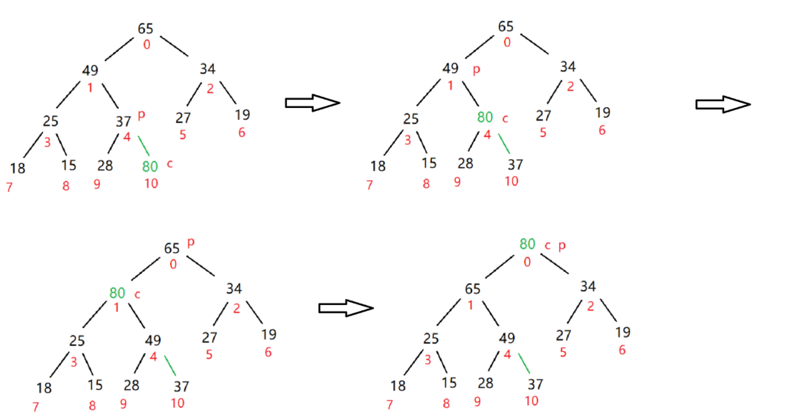
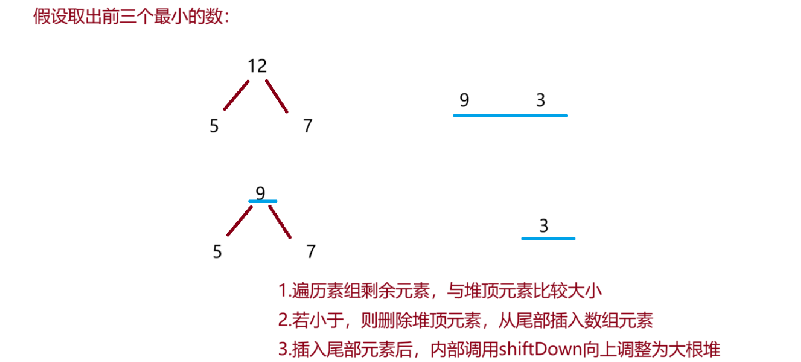

## 1.堆的概念

如果有一个**关键码的集合K = {k0，k1， k2，…，kn-1}**，把它的所有元素**按完全二叉树的顺序**存储方式存储**在一个一维数组**中，并满足：**K<sub>i</sub> <= K<sub>2i+1</sub> 且 K<sub>i</sub><= K<sub>2i+2</sub>** (K<sub>i</sub> >= K<sub>2i+1</sub> 且 K<sub>i</sub> >= K<sub>2i+2</sub>) i = 0，1，2…，则**称为 小堆**(或大堆)。将根节点最大的堆叫做**最大堆**或**大根堆**，根节点最小的堆叫做**最小堆**或**小根堆**。

**堆**的性质:

1. 堆中某个节点的值总是不大于或不小于其父节点的值;
2. 堆总是一棵完全二叉树;

## 2. 堆的存储方式
根据堆的概念可知,堆是一棵完全二叉树,<font style="color:rgb(15, 17, 21);">因此</font>**<font style="color:rgb(15, 17, 21);">可以按照层序规则采用顺序存储结构（数组）来高效存储</font>**<font style="color:rgb(15, 17, 21);">。如上图上面部分的数组;</font>

**<font style="color:rgb(15, 17, 21);">注意</font>**<font style="color:rgb(15, 17, 21);">: 对于</font>**<font style="color:rgb(15, 17, 21);">非完全二叉树</font>**<font style="color:rgb(15, 17, 21);">,则</font>**<font style="color:rgb(15, 17, 21);">不适用顺序方式</font>**<font style="color:rgb(15, 17, 21);">进行存储因为为了能够还原二叉树,空间中就必要存储空节点,因此导致空间利用率底.</font>

<font style="color:rgb(15, 17, 21);">给部分内容设计二叉树部分性质,如下:</font>

> <font style="color:rgb(15, 17, 21);">如果i为0，则i表示的节点为根节点，否则i节点的双亲节点为 (i - 1)/2</font>
>
> <font style="color:rgb(15, 17, 21);">如果2 * i + 1 小于节点个数，则节点i的左孩子下标为2 * i + 1，否则没有左孩子</font>
>
> <font style="color:rgb(15, 17, 21);">如果2 * i + 2 小于节点个数，则节点i的右孩子下标为2 * i + 2，否则没有右孩子</font>
>

## <font style="color:rgb(15, 17, 21);">3. 堆的创建</font>
### 3.1 堆的向下调整(大根堆/小根堆)
向下调整适用于 **1. 建堆**、**2.删除堆顶元素**、**3.修改某个节点的值（变小时**）

例:集合{ 27,15,19,18,28,34,65,49,25,37 }**调整为大根堆**

过程如下:


我们要从**最后一个非叶子节点**下手,因此我们选定 4 下标与其子树进行比较,因此 4 下标为 parent 索引,9 下标则为 child 索引

> 1. child > parent 则交换,child = parent 赋值,parent = (parent -1)/2 向上走
> 2. 此刻 child > parent,重复步骤一随后得到 parent 为 0 索引
>

以上**为一轮 for 循环**,因此我们只需要**对非叶子节点从后往前**一步步循环换上去即可

代码实现如下:

```java
   /**
     * parent:usedSize-1为最后一位元素
     * (usedSize-2)/2 为求父节点公式
     */
    // O(n)
    public void createHeap() {
        for (int parent = (this.usedSize-2)/2; parent >= 0; parent--) {
            siftDown(parent,this.usedSize);    // parent逐步-1 根节点往上走
        }
    }
    /**
     * @param parent 每棵子树调整的时候 的 起始位置
     * @param usedSize 判断 每棵子树什么时候 调整 结束
     */
    // 大根堆 -- 每棵树的根节点向下调
    private void siftDown(int parent,int usedSize) {
        int child = 2 * parent + 1; // 求得左子节点所在位
        while(child < usedSize) {   //
            if(child + 1 < usedSize && elem[child] < elem[child + 1]) {
                child++;    // 若右子树存在且小于左子树，则找到右子树
            }
            if(elem[child] > elem[parent]) {    // 如果于它的根，则换
                swap(elem,child, parent);
                parent = child;     // 根节点向下移动，循环将下面的排好
                child = 2 * parent + 1; // 找根节点下面的左子树
            } else {
                break;  // 跳出循环
            }
        }
    }
    private void swap(int[] elem,int i, int j) {
        int tmp = elem[i];
        elem[i] = elem[j];
        elem[j] = tmp;
    }
```

如若想改为调整为小根堆,只需要将代码中的**"<"和">"互换一下**即可,以上方法称为向下调整法

### 3.2 堆的向上调整(小根堆/大根堆)
向上调整常用于 **1.插入新元素(放在数组末尾)**、**2.减小某个节点的值**、**3.删除节点后的调整**

以插入新元素为例：


过程如下：

> 1. child 为插入元素索引，利用公式求得 parent 位置进行比较，若 child > parent；反之
> 2. child 与 parent 交替向上走
>

```java
// 传入元素
    public void offer(int val) {
        if(isFull()) {
            elem = Arrays.copyOf(elem, 2*elem.length);
        }
        elem[usedSize] = val;
        siftUp(usedSize);
        usedSize++;
    }
    private boolean isFull() {
        return elem.length == usedSize;
    }
    public void siftUp(int child) {
        int parent = (child - 1)/2;
        while(child > 0) {  // 当 child 不是根节点时继续
            if(elem[child] > elem[parent]) {
                swap(elem,child,parent);
                child = parent;
                parent = (parent-1)/2;
            } else {
                break;
            }
        }
    }
```

## topK 问题
topK 问题：有 N 个元素，找出前 K 个最小元素

做法：

> 1. 方法一：整体排序
> 2. 方法二：整体建立一个大小为 N 的小根堆
> 3. 方法三：把前 K 个元素创建为大根堆，遍历剩下的 N-K 个元素，和堆顶元素比较，如果比堆顶元素小，则堆顶元素删除，当前元素入堆
>

在此，我们以最优最常用的方法三来分析：


思路如图中所述，因为只要**数组元素小于前 k 个的最大值**，一次次**将每一次的最大值挤出**该而队列中，去**插入更小的元素，**此处我们调用比较器去重写 compare 方法

**注意**：

> 优先级队列背后的 compare 默认是调整为小根堆，因此我们需要将其重写，调整为大根堆
>

```java
// 创建比较器
class IntCmp implements Comparator<Integer> {
    @Override
    public int compare(Integer o1, Integer o2) {
        // 当 o2 < o1 时，o1 会被放在堆顶方向
        // 修改默认小根堆改为大根堆
        return o2.compareTo(o1);
    }
}

// 与大根堆比较
    public static int[] smallestK(int[] arr,int k) {
        // 创建返回数组
        int[] ret = new int[k];
        if(arr == null || k == 0) return ret;
        PriorityQueue<Integer> priorityQueue = new PriorityQueue<>(k,new IntCmp());
        // 取出k个元素建立二叉树
        for (int i = 0; i < k; i++) {
            priorityQueue.offer(arr[i]);
        }
        // 遍历N - K个元素比较
        for (int i = k; i < arr.length; i++) {
            // 如果小于堆顶元素，则放入元素，删除堆顶元素
            int peekValue = priorityQueue.peek();
            if(arr[i] < peekValue) {
                priorityQueue.poll();
                priorityQueue.offer(arr[i]);
            }
        }
        // 取出前K个元素
        for (int i = 0; i < k; i++) {
            ret[i] = priorityQueue.poll();
        }
        return ret;
    }
```

