## 1. 插入排序

**插入排序过程：**

1. 定义 tmp 变量存储`array[i]`当前数值，定义`j = i - 1`变量
2. 利用循环将当前`array[i]`去遍历数组前`[0,j]`元素比较大小。若`tmp`有比前`[0,j]`元素要小，则`array[j]`赋值给`array[j+1]`；若`tmp`大于`[0,j]`中某元素，则`array[j+1] = tmp`
3. 随后 j- -，完成循环

### 1.1 插入排序实例
**举例排序过程如下：**
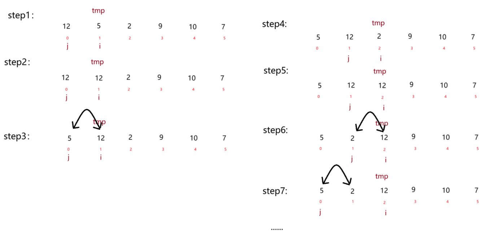

**具体动图如下**：


实现代码如下：

```java
/**
* 直接插入排序
* 时间复杂度：O(n^2)
* 空间复杂度：O(1)
*/ 
    public static void insertSort(int[] array) {
        for (int i = 1; i < array.length; i++) {
            // 定义临时变量进行存储、为下方提供比较对象
            int tmp = array[i];
            int j = i - 1;
            // 边找位置边移动
            while (j >= 0 && array[j] > tmp) {
                // 将当前值后移
                array[j + 1] = array[j];
                j--;
            }
            // 插入到正确位置
            array[j + 1] = tmp;
        }
    }
```

### 1.2 复杂度：
无论其是否有序、无序，其**时间复杂度**都为 **O(N^2)**。

稳定性：稳定

因为其首先**利用 i 遍历数组上每一个元素**(不钻牛角尖第一个)，**随后的 j 还要遍历一段去比较 tmp**，属于**嵌套循环**，因此无论在逻辑上还是代码上都是 **O(N^2)**，而空间复杂度则为 O(1)，所创建的变量是有限个的

## 2. 希尔排序
<font style="color:rgb(15, 17, 21);">1959年，</font>**<font style="color:rgb(15, 17, 21);">唐纳德·希尔（Donald Shell）</font>**<font style="color:rgb(15, 17, 21);"> 提出了一个改进思路：</font>

<font style="color:rgb(15, 17, 21);">先让数组</font>**<font style="color:rgb(15, 17, 21);">基本有序</font>**<font style="color:rgb(15, 17, 21);">，再用插入排序完成最终排序。</font>

希尔排序即，缩小增量排序，其**具体思想**为：

1. <font style="color:rgb(15, 17, 21);">先选定一个整数 </font>**<font style="color:rgb(15, 17, 21);">gap</font>**<font style="color:rgb(15, 17, 21);">（称为增量），把待排序文件中的所有记录分成 </font>**<font style="color:rgb(15, 17, 21);">gap 组</font>**<font style="color:rgb(15, 17, 21);">，所有距离为 </font>**<font style="color:rgb(15, 17, 21);">gap</font>**<font style="color:rgb(15, 17, 21);"> 的记录分在同一组内；</font>
2. <font style="color:rgb(15, 17, 21);">对</font>**<font style="color:rgb(15, 17, 21);">每一组内的记录进行直接插入排序</font>**<font style="color:rgb(15, 17, 21);">；</font>
3. <font style="color:rgb(15, 17, 21);">然后</font>**<font style="color:rgb(15, 17, 21);">缩小增量</font>**<font style="color:rgb(15, 17, 21);">（如 </font>`gap = gap / 2），重复上述分组和排序的工作；</font>
4. <font style="color:rgb(15, 17, 21);">当 </font>**<font style="color:rgb(15, 17, 21);">gap = 1</font>**<font style="color:rgb(15, 17, 21);"> 时，所有记录在同一组内，此时再执行一次直接插入排序，整个序列就排好序了。</font>

### 2.1 希尔排序实例
举例排序过程如下：

初始 gap = 5；缩小量为 gap = gap/2

数据如下
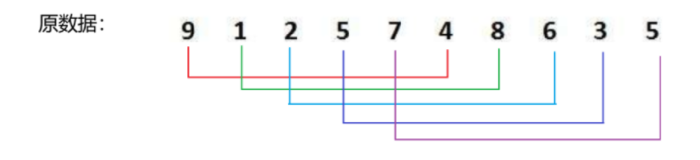

排序元素为**对应颜色指向的元素下**进行排序，得到如下数组
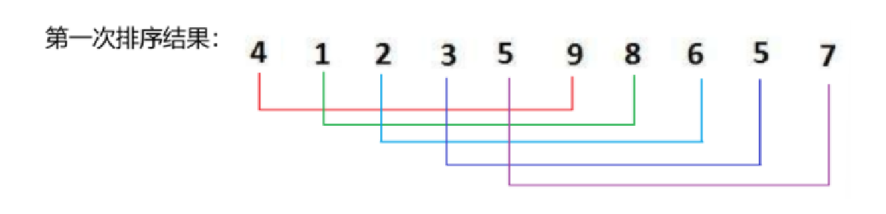

随后 gap = 2；此时每隔两个空间设为一个组类
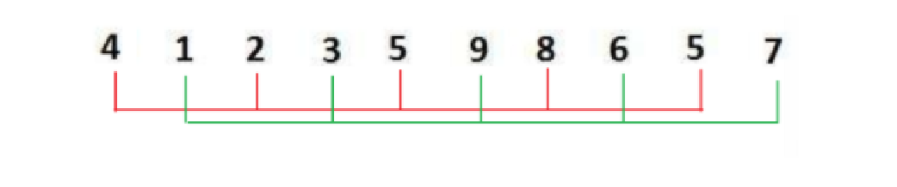

排序后的数组为：
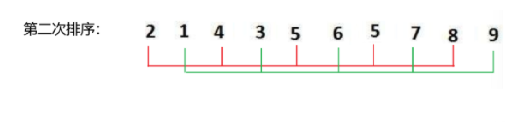

此后 gap  = 1；此时数组统一进行一次大排序，将进行直接插入操作，因此得到
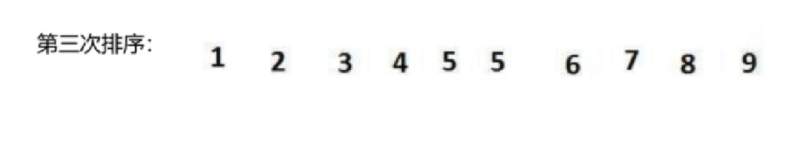

**<font style="color:rgb(15, 17, 21);">具体动图过程如下</font>**<font style="color:rgb(15, 17, 21);">：</font>
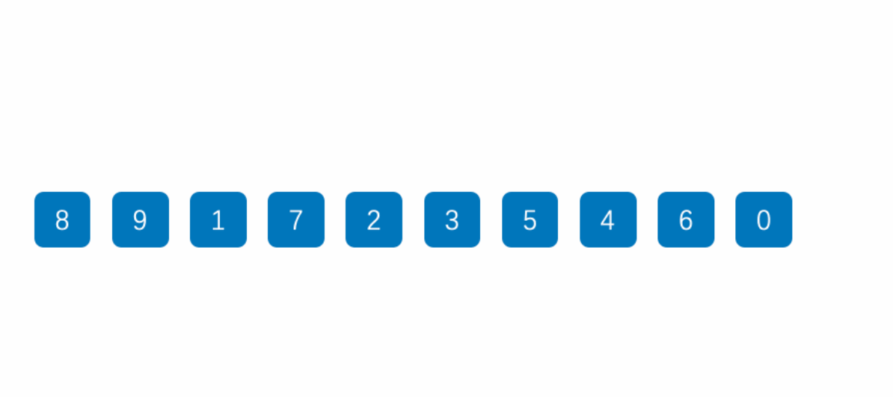

上 gif 动图中 gap = 2 时直接跳过变换过程，


实现代码如下：

```java
// 希尔排序
    public static void shellSort(int[] array) {
        int gap = array.length;
        while(gap > 1) {
            gap = gap/2;
            shell(array,gap);
        }
    }
    private static void shell(int[] array,int gap) {
        for (int i = gap; i < array.length; i++) {
            int tmp = array[i];
            int j = i - gap;
            // 以下部分与插入排序相同，仅将1改为gap
            while(j >= 0 && array[j] > tmp) {
                array[j + gap] = array[j];
                j -= gap;
            }
            array[j + gap] = tmp;
        }
    }
```

### 2.2 复杂度：
在学术方面，对于希尔排序的时间复杂度一直有多种说法，也一直尚未有准确的时间复杂度。比如：
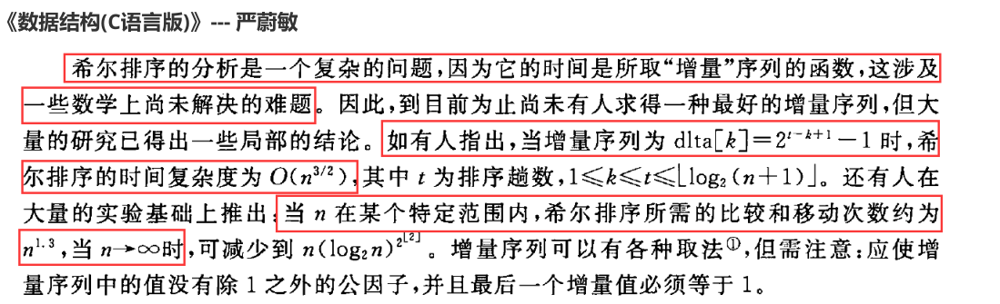

以及
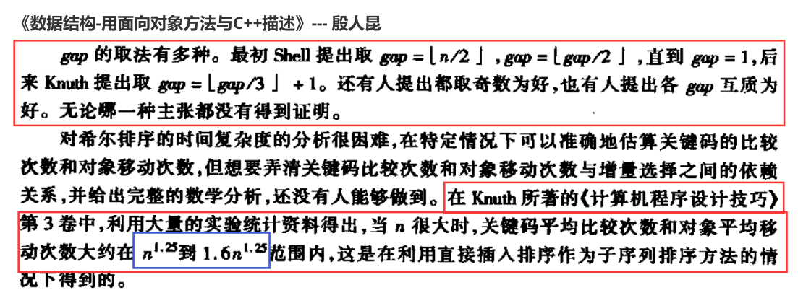

根据对书籍总结，我们可以将其时间复杂度视为 **O(N^1.25)**到 **O(1.6*N^1.25)**来算

## 3. 选择排序
**选择排序过程：**

1. 先假设第一个元素为最小元素，暂存其下标
2. 遍历剩余元素是否有比最小元素还小的元素
3. 如有，则在遍历完一轮后交换；若无，则第一层的下标后移一位，假设第二个元素为最小元素，暂存其下标...以此重复

### 3.1 选择排序实例
**举例排序过程如下：**
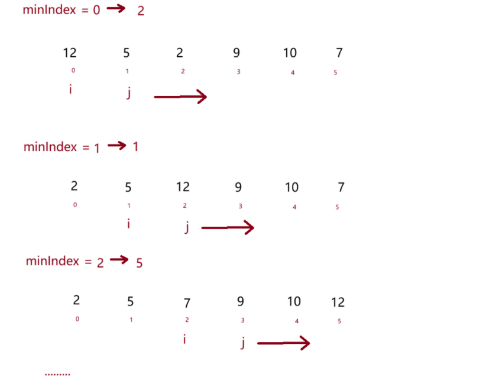

由第一层的 i 暂定最小值，第二层的 j 遍历寻找是否有更小的元素

**具体动图如下**：
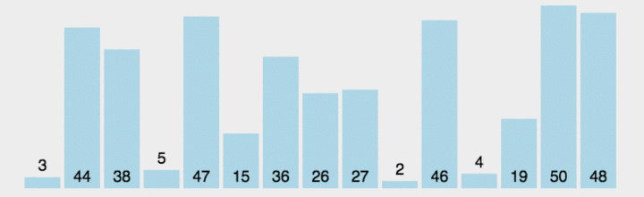

实现代码如下：

```java
    /**
     * 选择排序
     * 时间复杂度：
     * 空间复杂度：
     * 稳定性：
     * @param array
     */
    public static void selectSort(int[] array) {
        for (int i = 0; i < array.length; i++) {
            // 定义最小元素下标
            int minIndex = i;
            // 向后遍历数组，寻找小于最小元素的元素
            for (int j = i + 1; j < array.length; j++) {
                if (array[j] < array[minIndex])
                    minIndex = j;
            }
            swap(array,minIndex,i);
        }
    }

    /**
     * @param array 数组
     * @param i 下标
     * @param j 要换的元素的下标
     */
    public static void swap(int[] array,int i,int j) {
        int tmp = array[j];
        array[j] = array[i];
        array[i] = tmp;
    }
```

但上述代码存在优化，优化内容为：

1. 最大最小值可同时找，可减少第二层遍历次数

优化后的过程如下图所述：

定义 left 与 right 为数组两端，i 为中间元素下标在 for 循环中游走，同时比较最大最小值
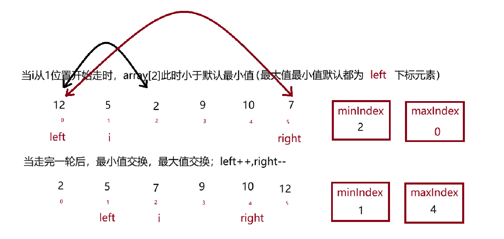

**注意**：当**默认最小值为实际最大值**的时候，在**交换最小值过程**中**实际最大值**已被换走，而当**最大值交换过程**中**实际最大值**已被换为**实际最小值**，如图中所举案例 minIndex 要与 left 换，但 left（maxIndex）同时还要与 right 换，因此我们需要在此判断一下，`if (maxIndex == left) maxIndex = minIndex;`

完整代码如下：

```java
    public static void selectSortPlus(int[] array) {
        int left = 0;
        int right = array.length - 1;
        while (left < right) {
            int minIndex = left;
            int maxIndex = left;
            // 遍历中间元素，同时找最大最小值
            for (int i = left + 1; i <= right; i++) {
                if (array[i] < array[minIndex])
                    minIndex = i;
                if (array[i] > array[maxIndex])
                    maxIndex = i;
            }
            swap(array,left,minIndex);
            // 最大值正好是 left下标，此时已经被上一步换到minIndex了
            if (maxIndex == left) maxIndex = minIndex;
            swap(array,right,maxIndex);
            left++;
            right--;
        }
    }

    /**
     * @param array 数组
     * @param i 下标
     * @param j 要换的元素的下标
     */
    public static void swap(int[] array,int i,int j) {
        int tmp = array[j];
        array[j] = array[i];
        array[i] = tmp;
    }
```

### 3.2 复杂度：
对于未优化的版本：

**外层循环**需要执行 n - 1 次（i 从 0 到 n - 2）；

**内层循环**比较次数从**第一轮**到**第 n - 1 轮**：n - 1 次、n - 2 次、n - 3 次......1 次

由等差数列求和可约等于` n^2/2`，即时间复杂度为 O(N^2)、空间复杂度显然为 O(1)


对于优化版本的：

**外层循环**需执行的次数：n/2 轮

每层**内循环**需要遍历`right - left`个元素，我们用归纳法

第 1 轮：n - 1 次；第二轮：n - 3 次；第三轮：n - 5 次......最后一轮：1 次；

综上为公差为 2 的等差数列，最总计算约为 n^2/4；时间复杂度同样为 O(N^2)、空间复杂度同样显然为 O(1)

## 4. 堆排序
将数组视为二叉树

**堆排序过程：**

1. <font style="color:rgb(15, 17, 21);">建大根堆</font>
2. <font style="color:rgb(15, 17, 21);">反复将堆顶（最大值）放到末尾</font>
3. <font style="color:rgb(15, 17, 21);">剩余部分重新调整为大根堆</font>
4. <font style="color:rgb(15, 17, 21);">重复直到全部有序</font>

<font style="color:rgb(15, 17, 21);">最终结果：升序数组，天然满足小根堆性质</font>

### <font style="color:rgb(15, 17, 21);">4.1 堆排序实例</font>
**举例排序过程如下：**

例:集合{ 27,15,19,18,28,34,65,49,25,37 }

`createHeap` 调用 `siftDown` 调整为大根堆过程如下:
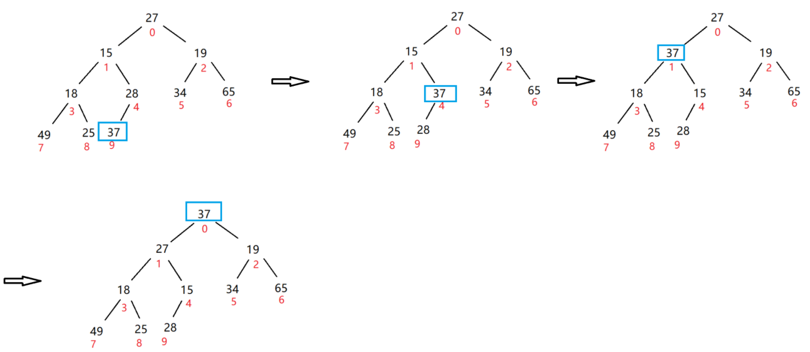

我们要从**最后一个非叶子节点**下手,因此我们选定 4 下标与其子树进行比较,因此 4 下标为 parent 索引,9 下标则为 child 索引

1. child > parent 则交换,child = parent 赋值,parent = (parent -1)/2 向上走
2. 此刻 child > parent,重复步骤一随后得到 parent 为 0 索引

以上**为一轮 for 循环**,因此我们只需要**对非叶子节点从后往前**一步步循环换上去即可

**具体上述过程可看前篇大根堆小根堆篇**


`heapSort` 过程如下：
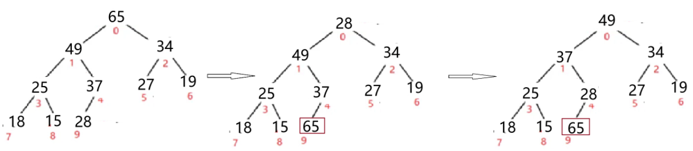

<font style="color:rgb(15, 17, 21);">将堆顶（最大值）放到末尾，剩余部分重新调整为大根堆，依次进行最终调整为升序数组</font>

**<font style="color:rgb(15, 17, 21);">具体动图如下：</font>**
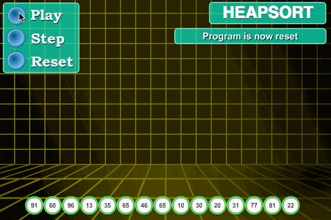

**实现代码如下：**

```java
    /**
     * 堆排序
     * 时间复杂度：O(NlogN)
     * 空间复杂度：O(1)
     * 稳定性：不稳定
     * @param array
     */
    public static void heapSort(int[] array) {
        createHeap(array);
        int end = array.length - 1;
        while (end > 0) {
            // 反复将堆顶（最大值）放到末尾
            swap(array,0,end);
            // 剩余部分重新调整为大根堆
            siftDown(array,0,end);
            end--;
        }
    }
    // 创建大根堆
    private static void createHeap(int[] array) {
        for (int parent = (array.length-2)/2; parent >= 0; parent--) {
            siftDown(array,parent,array.length);    // parent逐步-1 根节点往上走
        }
    }
    /**
     * @param parent 每棵子树调整的时候 的 起始位置
     * @param length 判断 每棵子树什么时候 调整 结束
     */
    // 大根堆 -- 每棵树的根节点向下调
    private static void siftDown(int[] array,int parent,int length) {
        int child = 2 * parent + 1; // 求得左子节点所在位
        while(child < length) {   //
            if(child + 1 < length && array[child] < array[child + 1]) {
                child++;    // 若右子树存在且小于左子树，则找到右子树
            }
            if(array[child] > array[parent]) {    // 如果于它的根，则换
                swap(array,child, parent);
                parent = child;     // 根节点向下移动，循环将下面的排好
                child = 2 * parent + 1; // 找根节点下面的左子树
            } else {
                break;  // 跳出循环
            }
        }
    }

    public static void swap(int[] array,int i,int j) {
        int tmp = array[j];
        array[j] = array[i];
        array[i] = tmp;
    }
```

### 4.2 复杂度：
建堆`createHeap()`时间复杂度：
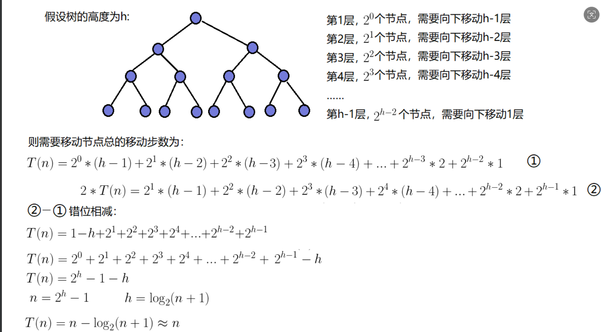

排序阶段`heapSort()`：

```java
while (end > 0) {
    swap(array, 0, end);        // O(1)
    siftDown(array, 0, end);    // O(log n)
    end--;
}
```

循环次数为 n-1 次；每次 siftDown 的时间复杂度为**<font style="color:rgb(15, 17, 21);">O(log n)</font>**<font style="color:rgb(15, 17, 21);">（堆的高度），则总时间复杂度 = </font>**<font style="color:rgb(15, 17, 21);">O(n log n)</font>**<font style="color:rgb(15, 17, 21);">。</font>

<font style="color:rgb(15, 17, 21);">两部分的</font>**<font style="color:rgb(15, 17, 21);">总时间复杂度则为：O(N logN)</font>**  
**空间复杂度为 O(1)**

## 5. 冒泡排序
冒泡排序过程：

1. <font style="color:rgb(15, 17, 21);">相邻元素两两比较，如果前面比后面大，就交换</font>
2. <font style="color:rgb(15, 17, 21);">每一轮结束后，当前未排序部分的最大值会“沉”到末尾</font>
3. <font style="color:rgb(15, 17, 21);">重复直到全部有序</font>

### <font style="color:rgb(15, 17, 21);">5.1 冒泡排序实例</font>
**<font style="color:rgb(15, 17, 21);">具体动图如下：</font>**
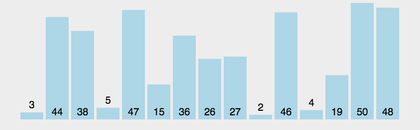

该图为最终优化版代码：

```java
    /**
     * 冒泡排序：
     * 时间复杂度：O(N^2)
     * 空间复杂度：O(1)
     * 稳定性：稳定
     * @param array
     */
    public static void bubbleSort(int[] array) {
        for (int i = 0; i < array.length - 1; i++) {
            boolean flg = false;
            for (int j = 0; j < array.length - 1 - i; j++) {
                if(array[j] > array[j + 1]) {
                    swap(array,j,j + 1);
                    flg = true;
                }
            }
            if (!flg) break;
        }
    }
```

具体优化处：

1. 增加 flg 判断是否已有序，从而提前退出循环
2. `j < array.length - 1 - i;`减少对比次数，无需多余对比已排好元素

### 5.2 复杂度：
时间复杂度：

**最好情况**：当数组有序时，时间复杂度为 O(N)

**最坏情况**：当数组逆序时，时间复杂度为 O(N^2)

**平均情况**：O(N^2)

空间复杂度为 O(1)

稳定性：稳定

## 6. 快速排序
   快速排序是 Hoare 于 1960 年提出的一种二叉树结构的交换排序方法，其基本思想为：**任取待排序元素序列中的某元素作为基准值，按照该排序码将待排序集合分割成两子序列，左子序列中所有元素均小于基准值，右子序列中所有元素均大于基准值，然后最左右子序列重复该过程，直到所有元素都排列在相应位置上为止。**

****

**快排的总体思路：**

1. 选一个基准值
2. 将数组分成两部分：左边都 ≤ 基准，右边都 ≥ 基准
3. 对左右两部分重复上述过程

### 6.1 快排方法
#### 6.1.1 递归框架
根据上述排序说明，可以列出以下**递归框架**：

该递归框架可用于**Hoare**、**挖坑**、**双指针法**

```java
public static void quickSort(int[] array) {
    quick(array,0,array.length - 1);
}

void quick(int[] array, int left, int right) {
    // 递归终止条件：区间内没有元素或只有一个元素
    if (left >= right) {
        return;
    }
    // 分区操作：将数组分成两部分，并返回基准元素的最终位置
    int pivot = partition(array, left, right);
    // 递归排序左半部分：[left, pivot]
    quick(array, left, pivot);

    // 递归排序右半部分：[pivot+1, right]
    quick(array, pivot + 1, right);
}
```

---

递归框架下的**复杂度**说明：

​        当数组为有序(1，2，3，4，5...)或逆序(5，4，3，2，1...)时候，**时间复杂度**达到了**O(N^2)**；最好情况是数组拆分时**满足满二叉树**时候，**时间复杂度**达到 **O(N logN)**，具体计算是由于拆分后每层相加**总个数都为 N**，二叉树**高度为 log N**。

​        而**空间复杂度**最坏可达到 **O(N)**因为**递归需要开辟内存**，并且为逆序是二叉树为**单枝二叉树**，节点为 N 个则需要递归 N 次；最好情况还是**满二叉树时候复杂度达到 O(logN)**，因为树的高度为 logN，当递归完左侧之后再递归右侧时，**左侧的空间就会释放掉**。


**注意：以下方法在介绍时不区分递归与否，递归与否与下方分区方法无关**

#### 6.1.2 Hoare 分区法
递归下的 **Hoare** 方法：

排序说明：

1. 基准值一般会选左端或右端值作为基准值，此处我们以左端为基准值
2. 从后边开始找比基准值小的值停下来，与左侧所停值交换；
3. 从前边开始找比基准值大的值停下来，与右侧所停值交换；
4. 最终会停在中间某一处(将该处设为 `pivot`)，此处将数组分为左侧与右侧，采取分而治之的思想递归


**不论好坏情况，一般声明时间复杂度 O(N logN)、空间复杂度 O(log N)**
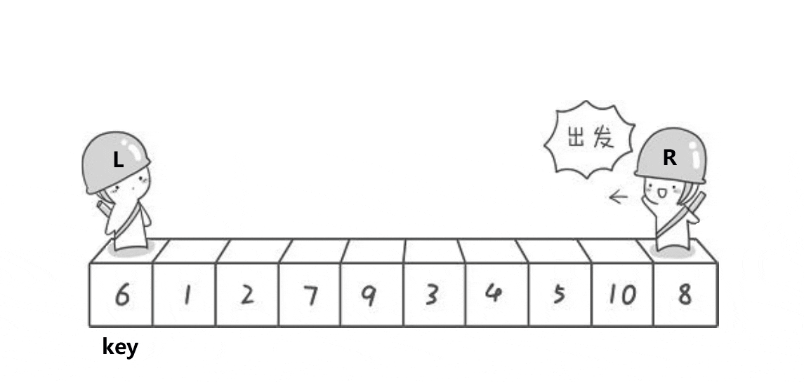

注意以下顺序：

> 1. 双指针从两端向中间移动
> 2. 先移动右指针，再移动左指针
> 3. 交换不满足条件的元素
> 4. 最后基准归位
>

图中原数组顺序为：

**{6，1，2，7，9，3，4，5，10，8}**

**注意**：<font style="color:rgb(15, 17, 21);">由于基准值选在左端，必须</font>**<font style="color:rgb(15, 17, 21);">先从右向左找小</font>**<font style="color:rgb(15, 17, 21);">，再从左向右找大。</font>如果左侧先移动，图中数组最终会在 9 位置停下，此时 9 不能与 6 交换；当左侧先走时**能保证 left 会停在一个比 6 小的位置**
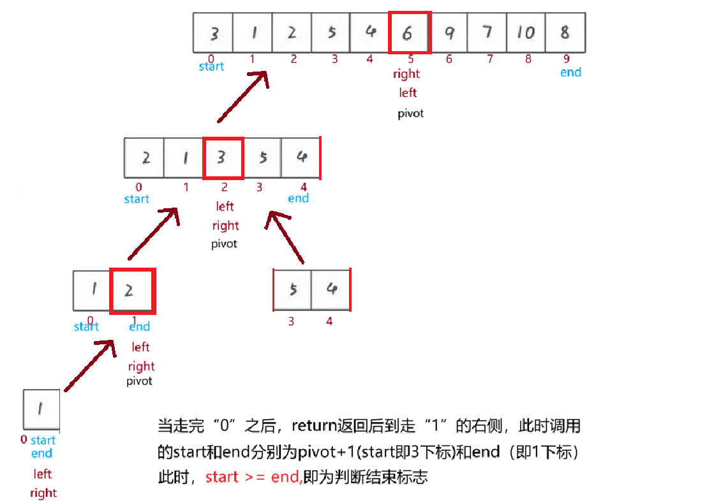

左右相同的程序进行排序，类似二叉树;

**注意**内容已在图中说明，即**循环结束判断标志**如上。对照上面所描述步骤可以实现下面代码

```java
    private static int partition (int[] array, int left, int right) {
        int tmp = array[left];
        int tmpLeft = left;
        // 双指针在数组中移动判断
        while (right > left) {
            while (right > left && array[right] >= tmp)
                right--;
            while (left < right && array[left] <= tmp)
                left++;
            swap(array,right,left);
        }
        // 走完循环后，基准值还需与中间值交换
        swap(array,left,tmpLeft);
        return left;
    }
```


#### 6.1.3 挖坑法（重点）

#### 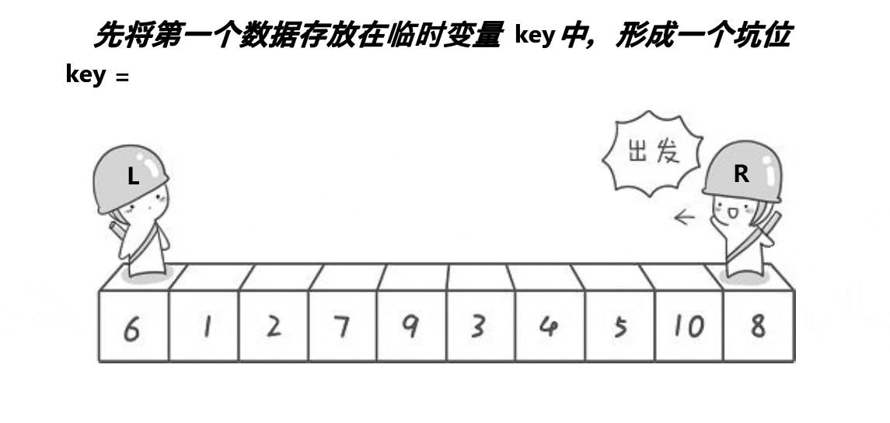


**挖坑法**描述：

1. tmp 暂存左端值，方便后序放回数组
2. right 找比 tmp 小的值，若找到，则"填坑"到 left 位置，等待 right 交换完再移动；
3. left 找比 tmp 大的值，若找到，则"填坑"到 right 位置，然后等待 right 交换完再移动；
4. 重复直到 left == right
5. 最后将基准值填入相遇位置


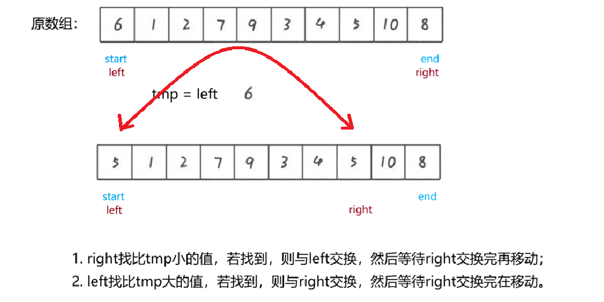

最终找到 pivot 中间值，该段方法仅需做到这点即可，剩余的是调用方法考虑的

```java
    private static int hole_Partition (int[] array, int left, int right) {
        int tmp = array[left];
        // 循环条件
        while (left < right) {
            while (left < right && array[right] >= tmp)
                right--;
            // 若右指针跳出循环停下，则右侧赋给左侧
            array[left] = array[right];

            while(left < right && array[left] <= tmp)
                left++;
            // 若左指针跳出循环停下，则左侧赋给右侧
            array[right] = array[left];
        }
        // 最终相遇，将tmp拿回放中间
        array[left] = tmp;
        return left;
    }
```

#### 6.1.4 双指针法
**双指针法**一般使用情况少，多数为**挖坑法**

**双指针法**描述：

1. **tmp 暂存左端值**，作为基准值，方便后续归位
2. **prev 指针初始指向 left**，标记小于基准值的区域边界
3. **cur 指针从 left+1 开始向右遍历**，寻找比基准值小的元素：
    1. <font style="color:rgb(15, 17, 21);">若 </font>`array[cur] < array[left]`<font style="color:rgb(15, 17, 21);">，说明找到比基准小的值</font>
    2. <font style="color:rgb(15, 17, 21);">先将 </font>`prev++`<font style="color:rgb(15, 17, 21);">，扩大至小于基准的区域</font>
    3. 若`array[prev] != array[cur]`，<font style="color:rgb(15, 17, 21);">则交换 </font>`array[prev]`<font style="color:rgb(15, 17, 21);"> 与 </font>`array[cur]`<font style="color:rgb(15, 17, 21);">，将小值移到左边</font>
4. **重复步骤 3**，知道 cur 指针遍历完整个区间
5. **最后将基准值填入 prev 位置**，<font style="color:rgb(15, 17, 21);">交换 </font>`array[prev]`<font style="color:rgb(15, 17, 21);"> 与 </font>`array[left]`<font style="color:rgb(15, 17, 21);">，返回 prev 作为基准最终位置</font>

**<font style="color:rgb(15, 17, 21);">以下动图即为双指针法排序过程：</font>**


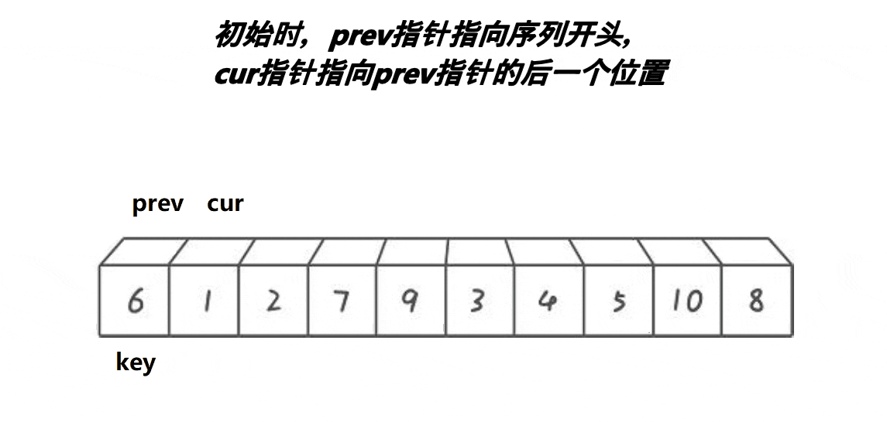

代码实现如下：

```java
    // 双指针法
    private static int twop_Partition (int[] array, int left, int right) {
        // 暂存基准值
        int tmp = array[left];
        int prev = left;
        int cur = prev + 1;

        while (cur <= right) {
            // a. 若 array[cur] < tmp，说明找到比基准小的值
            if (array[cur] < tmp) {
                // b. prev++，扩大小于基准的区域
                prev++;
                // c. 若 array[prev] != array[cur]，则交换
                if (array[prev] != array[cur])
                    swap(array,prev,cur);
            }
            cur++;
        }
        // 最后将基准值填入 prev 位置
        swap(array,left,prev);
        return prev;
    }
```


### 6.2 快速排序优化
#### <font style="color:rgb(51, 51, 51);">6.2.1 三数取中优化</font>
三数取中的必要性

1. <font style="color:rgb(51, 51, 51);">三数取中是为了</font>**<font style="color:rgb(51, 51, 51);">选择一个更好的基准值</font>**<font style="color:rgb(51, 51, 51);">，以提高快速排序的效率。在快速排序中，选择一个合适的基准值是非常重要的，它决定了每次分割的平衡性。</font>
2. <font style="color:rgb(51, 51, 51);">如果每次选择的基准值都是最左边或最右边的元素，那么在某些情况下，快速排序的效率可能会降低。例如，</font>**<font style="color:rgb(51, 51, 51);">当待排序序列已经有序时，如果每次选择的基准值都是最左边或最右边的元素，那么每次分割得到的两个子序列的长度差可能会非常大</font>**<font style="color:rgb(51, 51, 51);">，导致递归深度增加，快速排序的效率降低。</font>
3. <font style="color:rgb(51, 51, 51);">而通过三数取中的优化，可以选择一个更好的基准值，使得每次分割得到的两个子序列的长度差更小，从而提高快速排序的效率；也就是</font>**<font style="color:rgb(51, 51, 51);">尽量满足之前所说的全满二叉树</font>**<font style="color:rgb(51, 51, 51);">，而不是单支二叉树</font>

使用三数取中法位置在调用子问题排序之前：

```java
void quickSort(int[] array, int left, int right) {
    // 递归终止条件：区间内没有元素或只有一个元素
    if (left >= right) {
        return;
    }
    // 三数取中法调用出
    getMiddle(array,)
    
    // 分区操作：将数组分成两部分，并返回基准元素的最终位置
    int pivot = partition(array, left, right);
    // 递归排序左半部分：[left, pivot]
    quickSort(array, left, pivot);

    // 递归排序右半部分：[pivot+1, right]
    quickSort(array, pivot + 1, right);
}
```


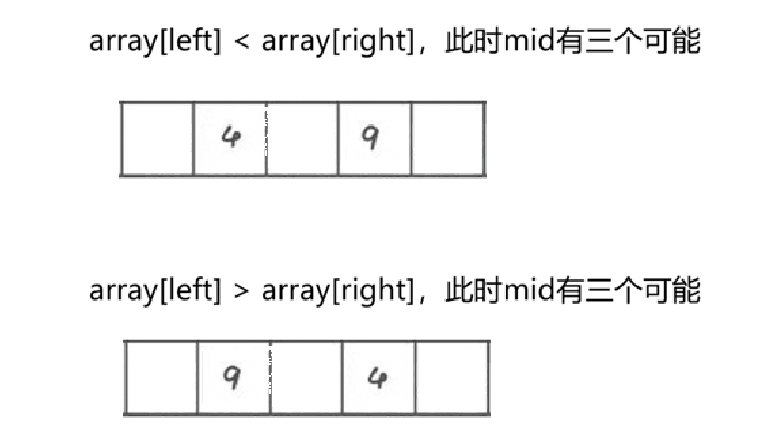

根据上图思考以下比较代码：

```java
private static int getMiddle (int[] array, int left, int right) {
    // 找到中位置
    int mid = (left + right) / 2;
        
    if (array[left] < array[right]) {
        if (array[mid] < array[left])
            return left;
        else if (array[mid] > array[right])
            return right;
        else
            return mid;
    } else {
        if (array[mid] < array[right])
            return right;
        else if(array[mid] > array[left])
            return left;
        else
            return mid;
    }
}
```

#### 6.2.2 小区间优化
<font style="color:rgb(51, 51, 51);">小区间优化是指在快速排序中，当待排序的子序列的长度小于一定阈值时，不再继续使用快速排序，而是转而使用直接插入排序。</font>

<font style="color:rgb(51, 51, 51);">代码实现：（以子序列元素个数为 10 举例）</font>

<font style="color:rgb(51, 51, 51);">仅修改在上面所述的递归框架的 quick 方法修改即可</font>

```java
private static void quick(int[] array,int start,int end) {
    if (start >= end) return;

    if(end - start + 1 <= 10) {
        insertSortRange(array,start, end);
        return;
    }
    // 三数取中法调用出
    int midNum = getMiddle(array,start,end);
    // 更换基准值
    swap(array,start,midNum);

    int privot = twop_Partition(array,start,end);
    quick(array,start,privot - 1);
    quick(array,privot + 1,end);
}
private static void insertSortRange(int[] array,int start,int end) {
    for (int i = start + 1; i <= end; i++) {
        // 定义临时变量进行存储、为下方提供比较对象
        int tmp = array[i];
        int j = i - 1;
        // 边找位置边移动
        while (j >= start && array[j] > tmp) {
            // 将当前值后移
            array[j + 1] = array[j];
            j--;
        }
        // 插入到正确位置
        array[j + 1] = tmp;
    }
}
```

**要注意取值边界**

使用**直接插入排序**的原因：

1. <font style="color:rgb(51, 51, 51);">减少递归深度：使用插入排序来处理较小的子序列，可以减少递归的深度，从而减少了函数调用的开销。</font>
2. 直接插入排序对于本就较有序的数列排序更快，且一次走完数组就能够排序完成。

### 6.3 非递归快排
非递归快排**思路**：

1. 创建栈，用来存储区间的**左边界**和**右边界**；将整个数组的左右边界压入栈
2. 从栈中弹出一个区间的**左右边界**，堆该区间进行分区操作
3. 选择**基准值**，将数组分为左右两部分，基准值归位，返回基准的最终值
4. 将左子区间的左右边界压入栈，将右子区间的左右边界压入栈（重复步骤 2，知道栈空）


以下为思路的实例举例：


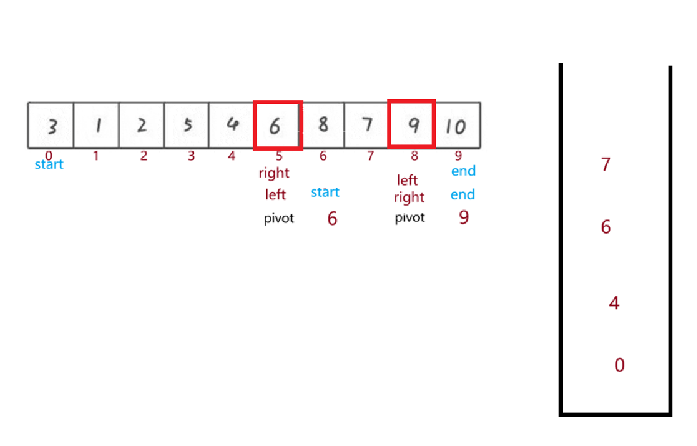


代码实现如下：

```java
public static void quickNor(int[] array, int start, int end) {
    // 1. 创建栈，存储区间边界值
    Deque<Integer> stack = new ArrayDeque<>();
    
    // 2. 将初始区间边界压栈
    stack.push(start);  // 左边界
    stack.push(end);    // 右边界
    
    // 3. 循环处理，直到栈为空
    while (!stack.isEmpty()) {
        // 4. 弹出区间的边界值
        int right = stack.pop();  // 注意：先弹出右边界
        int left = stack.pop();   // 再弹出左边界
        
        // 5. 区间有效性检查
        if (left >= right) {
            continue;
        }
        
        // 6. 分区操作，返回基准位置
        int pivot = partition(array, left, right);
        
        // 7. 将左子区间的边界值压栈
        if (left < pivot - 1) {
            stack.push(left);      // 左边界
            stack.push(pivot - 1); // 右边界
        }
        
        // 8. 将右子区间的边界值压栈
        if (pivot + 1 < right) {
            stack.push(pivot + 1); // 左边界
            stack.push(right);     // 右边界
        }
    }
}
```

**注意**：pivot 的左右侧为 1 个元素时，不进行压栈

## 7. 归并排序
**归并排序**（Merge Sort）采用**分治思想**。其核心思路是：先把数组不断分成两半，

直到每部分只有一个元素，然后再将有序的两部分合并成更大的有序部分，最终整个数组有序；


归并排序的过程：

1. 先判断**当前数组长度**是否<font style="color:rgb(15, 17, 21);">≤1，如果是则直接返回（递归出口）；</font>
2. <font style="color:rgb(15, 17, 21);">若长度大于 1，则找到数组中间位置，将数组分成</font>**<font style="color:rgb(15, 17, 21);">左半部分</font>**<font style="color:rgb(15, 17, 21);">和</font>**<font style="color:rgb(15, 17, 21);">右半部分</font>**<font style="color:rgb(15, 17, 21);">；</font>
3. <font style="color:rgb(15, 17, 21);">对左半部分</font>**<font style="color:rgb(15, 17, 21);">递归调用并排序</font>**<font style="color:rgb(15, 17, 21);">（重复 1~3 步，直到左半部分为单独个体）</font>
4. <font style="color:rgb(15, 17, 21);">对右半部分</font>**<font style="color:rgb(15, 17, 21);">递归调用并排序</font>**<font style="color:rgb(15, 17, 21);">（重复 1~3 步，直到右半部分为单独个体）</font>
5. <font style="color:rgb(15, 17, 21);">左右两部分都已有序后，</font>**<font style="color:rgb(15, 17, 21);">新建一个临时数组</font>**<font style="color:rgb(15, 17, 21);">；</font>
6. **<font style="color:rgb(15, 17, 21);">同时遍历左右两部分</font>**<font style="color:rgb(15, 17, 21);">：比较两个部分的当前元素，将较小的那个放入临时数组，并移动对应部分的指针；</font>
7. <font style="color:rgb(15, 17, 21);">重复第 6 步，直到某一部分的所有元素都已被放入临时数组；</font>
8. <font style="color:rgb(15, 17, 21);">将另一部分剩余的所有元素依次放入临时数组；</font>
9. <font style="color:rgb(15, 17, 21);">将临时数组中的元素复制回原数组对应的位置；</font>
10. <font style="color:rgb(15, 17, 21);">返回上一层的递归，继续合并更大的有序片段，直到整个数组完全有序；</font>

**<font style="color:rgb(15, 17, 21);">图形化表示</font>**<font style="color:rgb(15, 17, 21);">如下：</font>


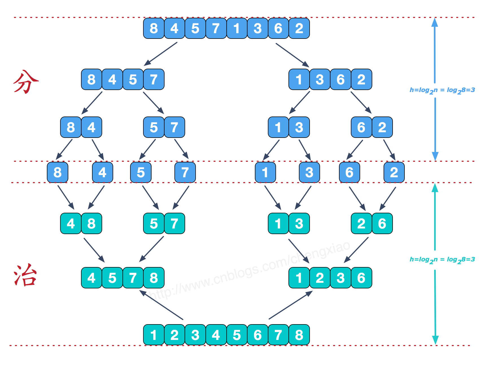

### <font style="color:rgb(15, 17, 21);">7.1 归并排序实例</font>
**具体动图如下**：

在实际图像表示中，是像动图中，整体划分好两大部分，每部分中两个为一组；

两个为一组排好两组后，以四个为一组再调整；

四个为一组排好两组后，以八个为一组再调整...

最终两大组再合并一起；


**实例参考**：

原始数组为 **[10, 6, 7, 1, 3, 9, 4, 2]** 

1. **递归拆分**

第一层：[0,7] → [0,3] + [4,7]

第二层： [0,3] → [0,1] + [2,3]  
	       [4,7] → [4,5] + [6,7]

第三层：（拆到为单项）

[0,1] → [0] [1]

[2,3] → [2] [3]

[4,5] → [4] [5]

[6,7] → [6] [7]

此时数组被划分为：**[10] [6] [7] [1] [3] [9] [4] [2] **

2. **从下往上合并**

`merge(array, 0, 0, 1)`，合并 [0,1] → 【10 和 6】   

`merge(array, 2, 2, 3)`，合并 [2,3] → 【7 和 1】  

`merge(array, 4, 4, 5)`， 合并 [4,5] → 【3 和 9】  

`merge(array, 6, 6, 7)`， 合并 [6,7] → 【4 和 2】  

3. **继续往上合并**

第二轮合并：[6,10] + [1,7] → [1,6,7,10]

[3,9] + [2,4] → [2,3,4,9]

第三轮合并：[1,6,7,10] + [2,3,4,9] → [1,2,3,4,6,7,9,10]

---

#### 7.2 递归实现
**具体代码实现**：

```java
    public static void mergeSort(int[] array) {
        mergeSortTmp(array,0,array.length - 1);
    }

    private static void mergeSortTmp(int[] array,int left,int right) {
        if (left >= right) return;

        // 1.递归分组
        int mid = (left + right) / 2;
        mergeSortTmp(array, left, mid);
        mergeSortTmp(array, mid + 1, right);

        // 2.合并
        merge(array,left,mid,right);
    }

    private static void merge(int[] array,int left,
                              int mid,int right) {
        // 1.创建临时数组
        int[] tmp = new int[right - left + 1];
        int k = 0;  // 记录临时数组索引
        int s1 = left;      // 左侧小组起始位
        int s2 = mid + 1;   // 右侧小组起始位

        // 2.循环比较放入
        while (s1 <= mid && s2 <= right) {
            if (array[s1] <= array[s2])
                tmp[k++] = array[s1++];
            else
                tmp[k++] = array[s2++];
        }
        // 3.将s1或s2剩下的填入
        while (s1 <= mid)
            tmp[k++] = array[s1++];
        while (s2 <= right)
            tmp[k++] = array[s2++];

        // 4.将临时数组拷贝入原始数组中
        for (int i = 0; i < k; i++) {
            array[i + left] = tmp[i];
        }
    }
```

#### 7.3 非递归实现
**实例参考**：


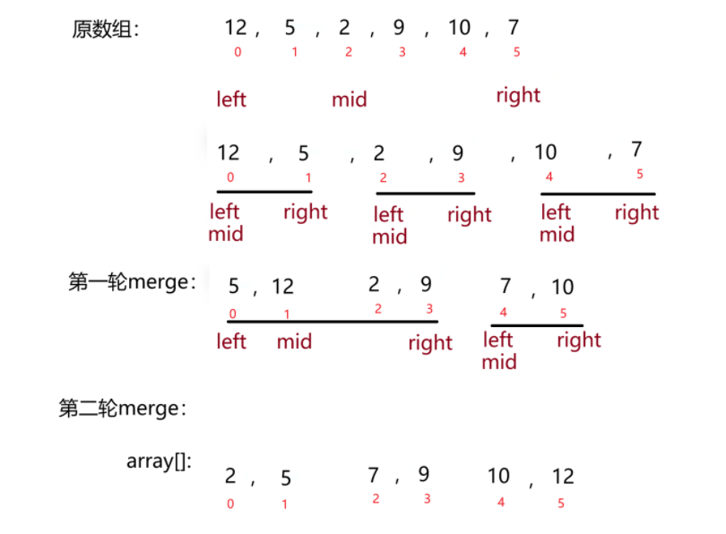

```java
    // 归并排序 非递归实现
public static void mergeSortNor (int[] array) {
    int gap = 1;    // 小组之间的间隔

    while (gap < array.length) {
        for (int i = 0; i < array.length; i = i + 2 * gap) {
            int left = i;   // 记录第一个小组左值下标
            int mid = left + gap - 1;   // 记录第一个小组右值下标
            // 防止mid数组越界
            if (mid >= array.length)
                mid = array.length - 1;

            int right = mid + gap;  // 记录第二个小组右值下标
            // 防止right数组越界
            if(right >= array.length)
                right = array.length - 1;
            merge(array,left,mid,right);
        }
        gap *= 2;
    }
}

private static void merge (int[] array,int left,
                              int mid,int right) {
    // 1.创建临时数组
    int[] tmp = new int[right - left + 1];
    int k = 0;  // 记录临时数组索引
    int s1 = left;      // 左侧小组起始位
    int s2 = mid + 1;   // 右侧小组起始位

    // 2.循环比较放入
    while (s1 <= mid && s2 <= right) {
        if (array[s1] <= array[s2])
            tmp[k++] = array[s1++];
        else
            tmp[k++] = array[s2++];
    }
    // 3.将s1或s2剩下的填入
    while (s1 <= mid)
        tmp[k++] = array[s1++];
    while (s2 <= right)
        tmp[k++] = array[s2++];

    // 4.将临时数组拷贝入原始数组中
    for (int i = 0; i < k; i++) {
        array[i + left] = tmp[i];
    }
}
```


