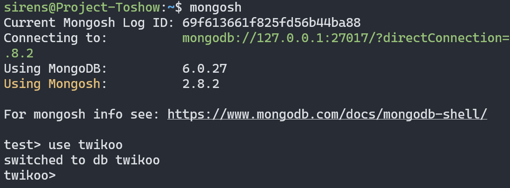
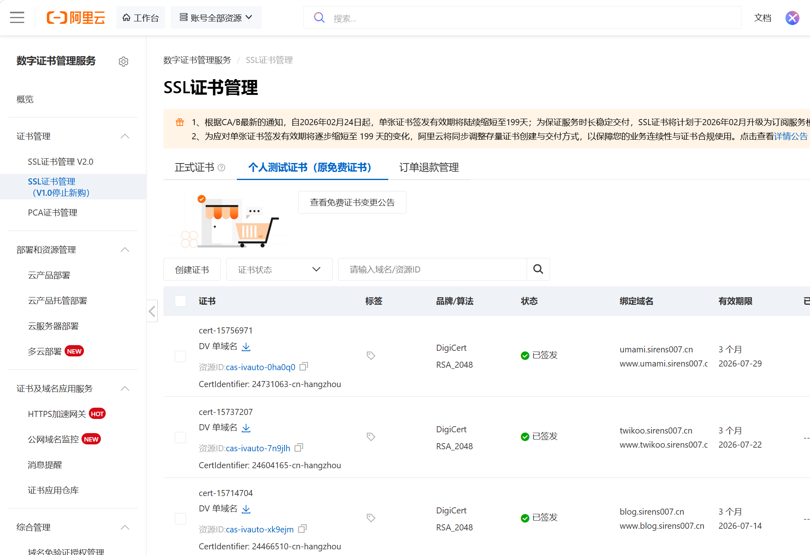
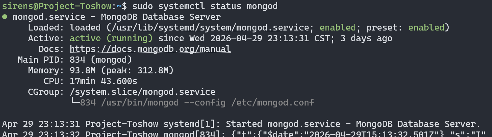
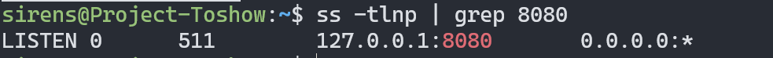
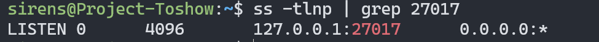
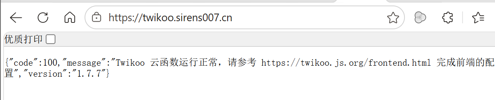

## 一.必备环境下载
### 1.安装 Node.js 环境
1. 更新系统包索引

```bash
sudo apt update
```

2.添加 NodeSource 仓库

```bash
curl -fsSL https://deb.nodesource.com/setup_20.x | sudo -E bash -
```

+  Ubuntu 默认源没有新版本 Node  
+  NodeSource 提供官方维护的高版本 Node  

3.安装 Node.js

```bash
sudo apt install -y nodejs
```

4.验证安装

```bash
node -v
npm -v
```

回显版本号即成功安装

### 2.npm 配置
设置国内镜像，因为默认 npm 源在国外  

```bash
npm config set registry https://registry.npmmirror.com
```

### 3.MongoDB 数据库安装
1. 安装 MongoDB

```bash
sudo apt update
sudo apt install -y mongodb-org
```

2.启动 MongDB

```bash
sudo systemctl start mongod
sudo systemctl enable mongod
```

3.进入 MongoDB Shell

```bash
mongosh
```

4. 创建数据库和用户

```sql
use twikoo

db.createUser({
  user: "twikoo",
  pwd: "你的密码",
  roles: [
    { role: "readWrite", db: "twikoo" }
  ]
})
```




5.验证登录

```bash
mongosh -u twikoo -p --authenticationDatabase twikoo
```

根据提示内容输入密码即可

## 二、部署 tkserver（Twikoo 后端）
1.全局安装 tkserver（此处需要前面的 Node.js）

```bash
sudo npm install -g tkserver
```

2.启动 tkserver

```bash
MONGODB_URI="mongodb://twikoo:密码@127.0.0.1:27017/twikoo" HOST=127.0.0.1 PORT=8080 tkserver
```

+ `MONGODB_URI`：数据库连接字符串 
+ `HOST=127.0.0.1`：只允许本机访问（安全） 
+ `PORT=8080`：服务端口

| **名称** | **描述** | **默认值** |
| --- | --- | --- |
| `MONGODB_URI` | MongoDB 数据库连接字符串，不传则使用 lokijs | `null` |
| `MONGO_URL` | MongoDB 数据库连接字符串，不传则使用 lokijs | `null` |
| `TWIKOO_DATA` | lokijs 数据库存储路径 | `./data` |
| `TWIKOO_PORT` | 端口号 | `8080` |
| `TWIKOO_THROTTLE` | IP 请求限流，当同一 IP 短时间内请求次数超过阈值将对该 IP 返回错误 | `250` |
| `TWIKOO_LOCALHOST_ONLY` | 为`true`时只监听本地请求，使得 nginx 等服务器反代之后不暴露原始端口 | `null` |
| `TWIKOO_LOG_LEVEL` | 日志级别，支持 `verbose`/ `info`/ `warn`/ `error` | `info` |
| `TWIKOO_IP_HEADERS` | 在一些特殊情况下使用，如使用了 `CloudFlare CDN`它会将请求 IP 写到请求头的 `cf-connecting-ip`字段上，为了能够正确的获取请求 IP 你可以写成 `["headers.cf-connecting-ip"]` | `[]` |


3.后台运行（即24 小时不间断运行）

方法一：nohup（官方推荐）

```bash
nohup env MONGODB_URI="mongodb://twikoo:密码@127.0.0.1:27017/twikoo" HOST=127.0.0.1 PORT=8080 tkserver > /var/log/tkserver.log 2>&1 &
```

方法二：systemctl（规范）

创建服务

```bash
sudo nano /etc/systemd/system/tkserver.service
```

内容：

```bash
[Unit]
Description=Twikoo Service
After=network.target

[Service]
Type=simple
Environment="MONGODB_URI=mongodb://twikoo:密码@127.0.0.1:27017/twikoo"
Environment="HOST=127.0.0.1"
Environment="PORT=8080"
ExecStart=/usr/bin/node /usr/lib/node_modules/tkserver/server.js
Restart=always
User=root

[Install]
WantedBy=multi-user.target
```

启动：

```bash
sudo systemctl daemon-reexec
sudo systemctl daemon-reload
sudo systemctl start tkserver
sudo systemctl enable tkserver
```

## 三、安装 Nginx
1. 如果没有配置 Nginx，那么：

```bash
sudo apt install -y nginx
```

2.配置站点

```bash
sudo nano /etc/nginx/sites-available/twikoo
```

3. 配置（以我的站点为例）：

注意：要将子域名申请 ssl 证书，如果你是阿里云用户可以申请个人测试证书，这样才能通过 https 访问，避免中间人攻击

如图：




```bash
# HTTP 强制跳 HTTPS
server {
    listen 80;
    server_name twikoo.sirens007.cn;
    return 301 https://$host$request_uri;
}

server {
    listen 443 ssl http2;
    server_name twikoo.sirens007.cn;

    ssl_certificate /粘贴你的证书路径.crt;
    ssl_certificate_key /粘贴你的私钥路径.key;

    # TLS 安全增强
    ssl_protocols TLSv1.2 TLSv1.3;
    ssl_ciphers HIGH:!aNULL:!MD5;
    ssl_prefer_server_ciphers on;

    # 关键：允许评论内容上传
    client_max_body_size 10m;

    location / {
        proxy_pass http://127.0.0.1:8080;

# 基础代理头
        proxy_set_header Host $host;
        proxy_set_header X-Real-IP $remote_addr;
        proxy_set_header X-Forwarded-For $proxy_add_x_forwarded_for;
        proxy_set_header X-Forwarded-Proto $scheme;

        # WebSocket 支持（Twikoo兼容）
        proxy_http_version 1.1;
        proxy_set_header Upgrade $http_upgrade;
        proxy_set_header Connection "upgrade";

        # 超时优化
        proxy_connect_timeout 60s;
        proxy_send_timeout 60s;
        proxy_read_timeout 60s;
    }
}
```

4.启用配置：

```bash
sudo ln -s /etc/nginx/sites-available/twikoo /etc/nginx/sites-enabled/
sudo nginx -t
sudo systemctl restart nginx
```

反向代理的目的是为了避免直接暴露 8080，并且浏览器会拦截

## 检验部署成功与否
如果运行出现什么问题，随时查看

1.检查 MongoDB

```bash
systemctl status mongod
```




2.检查 tkserver 是否运行

```bash
sudo systemctl status tkserver
```

4.检查 tkserver 是否监听 8080 端口

```bash
ss -tlnp | grep 8080
```

正常应该得到




5.检查 MongDB 是否监听端口

```bash
ss -tlnp | grep 27017
```




6.测试接口

浏览器访问：

```bash
https://你的站点
```




得到如图所示即表示 tkserver 没有问题，以上配置完后即可正常在博客主题中加入对应接口，类似以下：

```bash
twikoo: {
		envId: "https://twikoo.sirens007.cn",
		lang: SITE_LANG,
	},
```

至此，以上配置完后相应的评论数据可以通过各种可视化数据库查看，相应访问速度也会更快！


参考文章：

[私有部署 - Twikoo 官方文档](https://twikoo.js.org/backend.html#%E7%A7%81%E6%9C%89%E9%83%A8%E7%BD%B2)

